# 使用 vbox 新建 WinXP 来打开辣个 CPU 模拟页面

前言：
> 这次的软导作业是真的麻烦啊，不仅汇编语言要自己一条一条地学，而且还要要自己配置环境；这环境配置也是麻烦，老师只是提了句“可能需要安装虚拟机”，而具体操作起来又是一头雾水
>
>在XX的提示和帮助下，我成功通过安装 **WinXP 的虚拟机**和 **JRE1.6** 成功地打开并且运行了辣个页面，将这个经验分享出来，希望能够帮到大家。

> Warning: <a href="https://ks0508.github.io/SE-project/QA1/QA1" target="_blank">学委的 Q & A </a>中有了更加简单的解决方案，但是这个解决方案是需要`先卸载自己的 Java `，`再安装 Jre1.6 `，否则会**报错**（****说的）。

## 目录

1. <a href="#1">下载并安装vbox</a>

2. <a href="#2">新建 WinXP 虚拟机</a>

3. <a href="#3">下载Windows XP的光盘镜像与JRE 1.6</a>

4. <a href="#4">安装 Windows XP</a>

5. <a href="#5">安装 vbox 的增强功能</a>

6. <a href="#6">安装 jre1.6</a>

7. <a href="#7">打开网页</a>

## 1. <a name="1">下载并安装 vbox</a>

* 好的习惯：百度/谷歌 *Oracle VM VirtualBox*
* 坏的习惯：<a href="https://www.virtualbox.org/wiki/Downloads" target="_blank">点我</a>跳转到下载页面

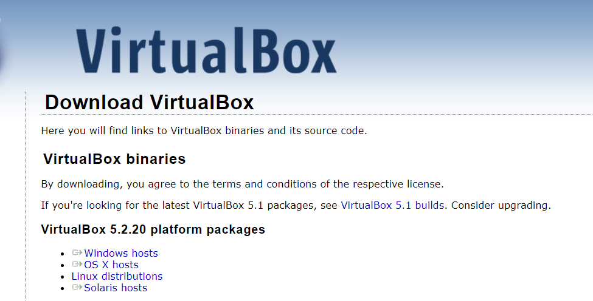

选择好自己想要安装的文件夹，后不断下一步就行。下面那个不用担心，选择`是`就行。

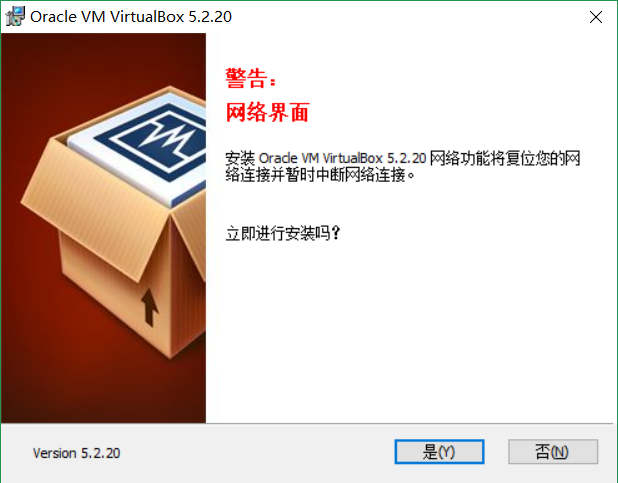

当你能够打开 vbox 并看到如下界面的时候，你就已经成功安装了vbox啦。

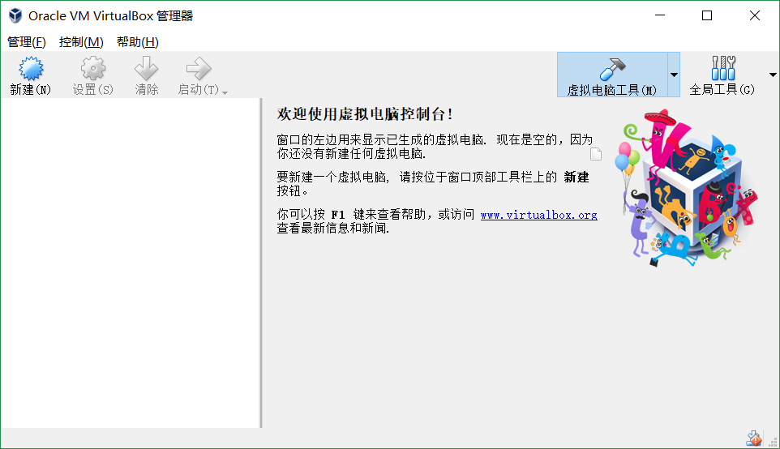

> 关于虚拟化技术（也可能叫其他名字）：  
> 1. 这个需要进入 **Bios** 界面（就是那个蓝底白字的复古界面），进入该界面的的方法为：`开机`-->`按某个按键`（这个取决于你是什么电脑，像*惠普的暗影精灵4*就是按 `F10`，详情百度）。  
> PS：实测*小米游戏本*是没有**虚拟化技术**这个选项的。  
> 2. 在 Bios 界面找到虚拟化技术一栏并选择开启（原谅我**没图**）。

## 2. <a name="2">新建WinXP虚拟机</a>

1. 打开 vbox，点击左上角的新建，填好**名称**（你想怎么填就怎么填），调好**类型**（`Microsoft Windows`）和**版本**（`Windows XP(32-bit)`）  
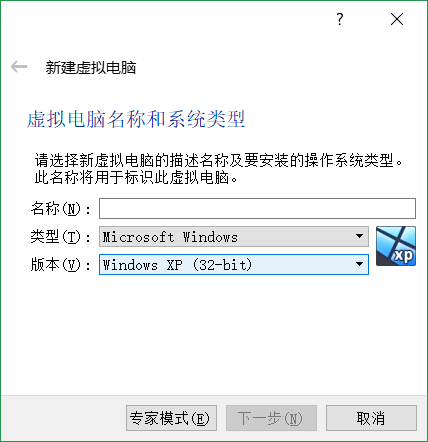

2. 分配内存（随便分啦，不过需要注意的是，分的**太多**会可能会导致你的**外部程序变慢**；分的**太少**可能会导致你的**虚拟机运行缓慢**）  
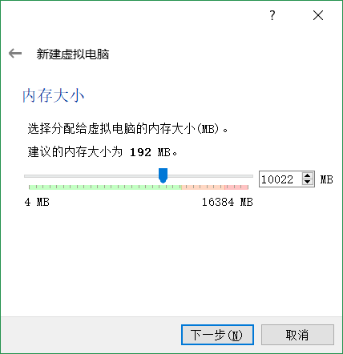

3. 创建虚拟硬盘。从这之后基本都是用默认的就行：  
>`现在创建虚拟硬盘` -->`VDI (Virtual Box 磁盘映像)`-->`动态分配`-->`10G`（对于一个只用来开网页的XP来说够用了）

4. 完成创建  
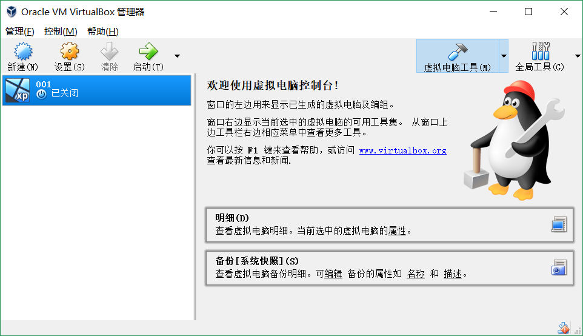

## 3. <a name="3">下载Windows XP的光盘镜像与JRE 1.6</a>

> 我的文件全是从****那里弄过来的：光盘镜像我不知道怎么弄；jre1.6 的话我从甲骨文（Oracle）那里下载似乎是要账号，但是我没有账号。。。所以。。。

我嫌度盘太慢，就把文件放到了  
1. 使用http服务器下载：<a href="http://172.18.40.173/" target="_blank">点我</a>打开下载页面，`lab07`文件夹中的两个文件就是，点击下载即可。  
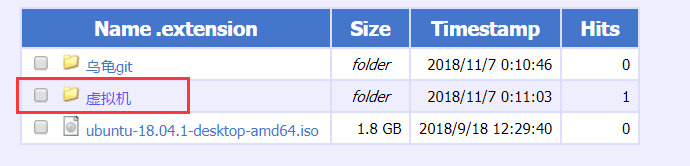  
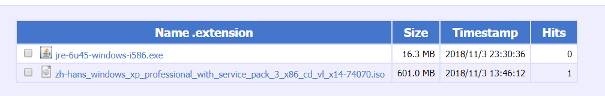

> PS：这个网站是把我的电脑当作服务器的，只有**校内网**能用，而且我电脑关机的时候是没法用的，但是速度非常快。

3. 使用 onedrive教育版 链接下载：<a href="https://mail2sysueducn-my.sharepoint.com/:f:/g/personal/mijlong_mail2_sysu_edu_cn/Ekqt-zs2T99GtVXF2rcZq20B-9qvidtDWFhu9DlrV9M84g?e=mx6QaV" target="_blank">点我</a>跳转下载页面  

3. 在班群的群文件中下载  
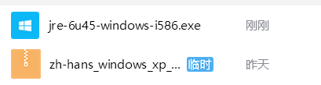

4. 谷歌云盘（其实也很慢：<a href="https://drive.google.com/open?id=1FvoWeTK_Y4owMS4pzZBxLwpsxJoU0wG7" target="_blank">点我</a>跳转到下载页面  
图中第一个是 jre1.6 ，第二个是光盘镜像  
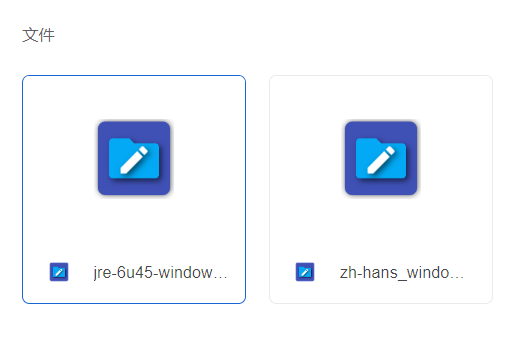

> 关于部分报错  
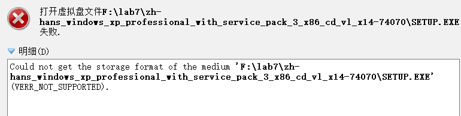
>
> 按照学委的说法：是因为用 winrar 软件把 iso 文件解压了，所以下载下来的光盘镜像**请不要解压**  
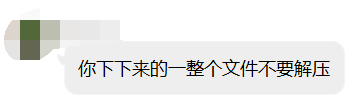  

## 4. <a name="4">安装 Windows XP 操作系统</a>

1. 载入光盘：启动刚刚创建的虚拟机，弹出如下界面，点击左边`文件夹按钮`，选择你刚刚下载的**光盘镜像**，点击`启动`。  
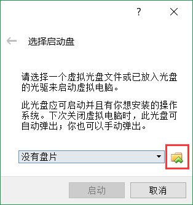

2. 正式开始安装：当你看到下图的复古的蓝底白字界面时，便正式开始安装了,一路确认下去，直到**磁盘格式化**  
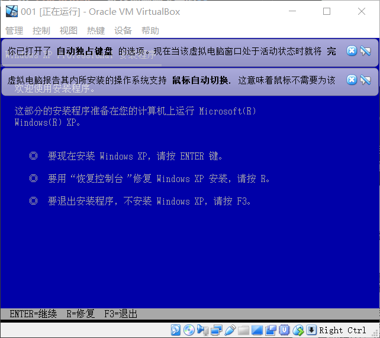  
> 关于按`F8`等`FX`按键无效的问题：请试着按住 `Fn` 键再按 `F8` ，要想永久解决这个问题，请关闭 **Fn 锁**，详情请百度/google。

3. **格式化方式**的选择：一般来说，推荐是选择**NTFS文件系统**和**快**即可。  
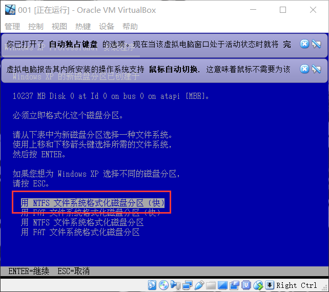

4. 产品密钥：**MRX3F-47B9T-2487J-KWKMF-RPWBY**  
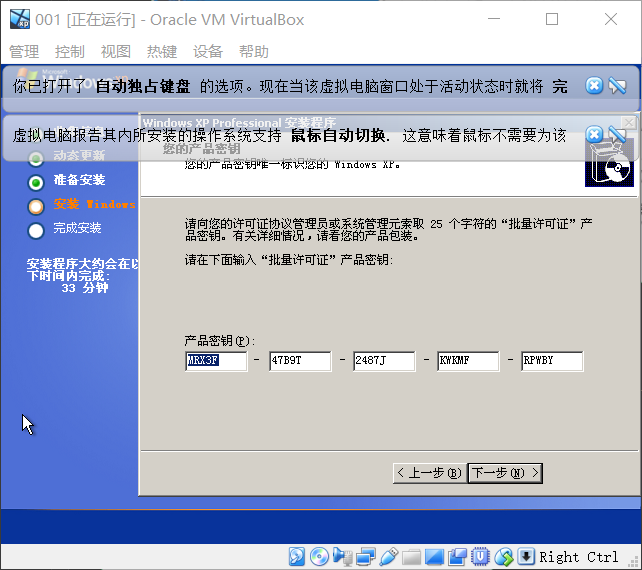

然后疯狂下一步就行
> 1. 记得自动更新选择**不启用**  
> 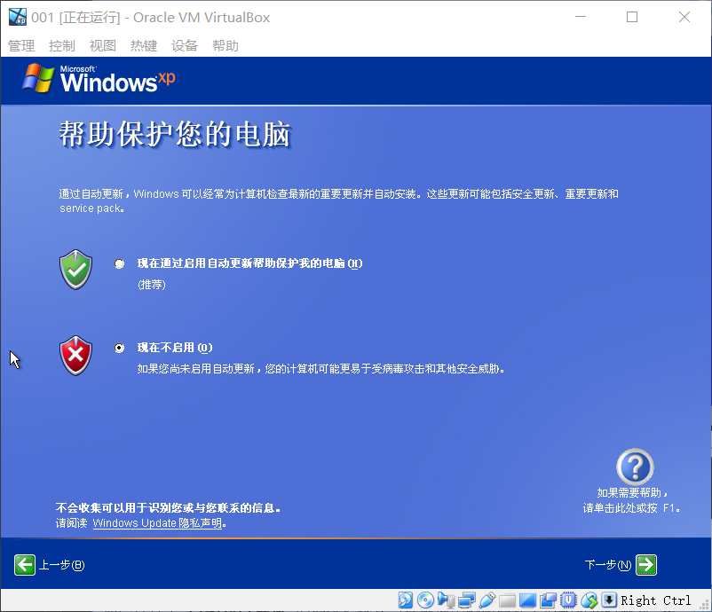
>
> 2. 联机注册选择**不注册**  
> 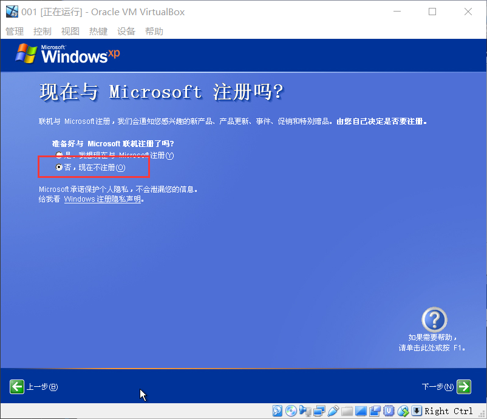

{:start="5"}
5. 安装完成，并确定能够上网  
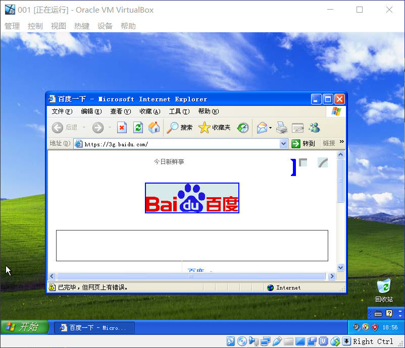

## 5. <a name="5">安装 vbox 增强功能</a>

1. 为了实现**文件共享**（其实就是把 Jre1.6 的安装包拖进去），操作其实很简单。。。。  
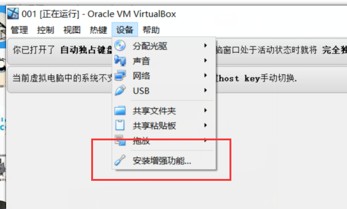

2. 点击后不断`下一步`就可以了，遇到下图界面直接点`仍然继续`就好。  
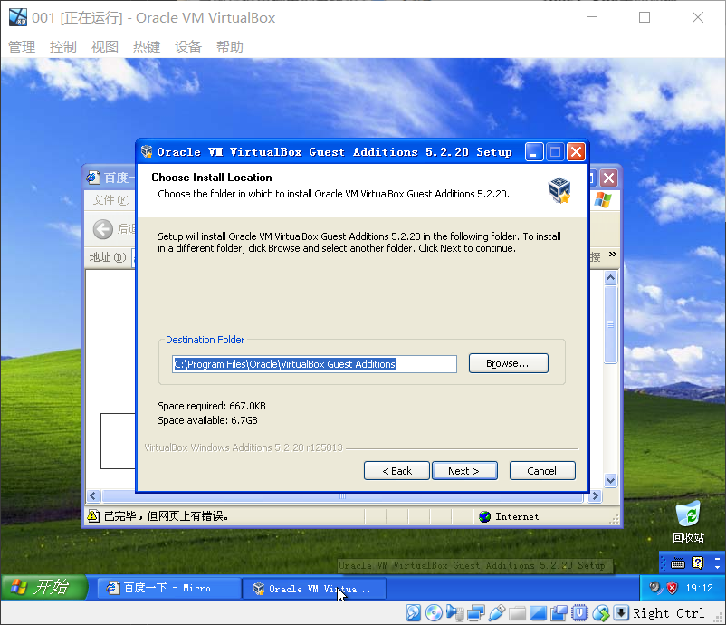

3. （自动）重启电脑。

4. 开启拖放：点击左上角的`设备`，在`拖放栏`中选择`从主机到虚拟机`或者`双向`。  
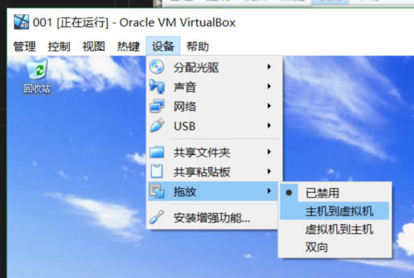

5. 开启共享剪切板：依然时左上角的`设备`，在`共享剪切板`中选择`从主机到虚拟机`或者`双向`。

> 安装完增强功能之后，可以使用**无缝模式**，无缝模式可以按`右ctrl`+`c`切换到**全屏模式**，再次上述操作可以恢复**有左上工作栏的窗口模式**  
> 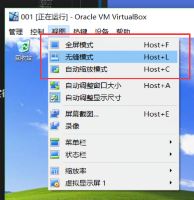

## 6. <a name="6">安装 Jre1.6</a>

1. 拖放文件：将你下载的 **Jre1.6** 从你的文件夹拖进虚拟机的桌面。  
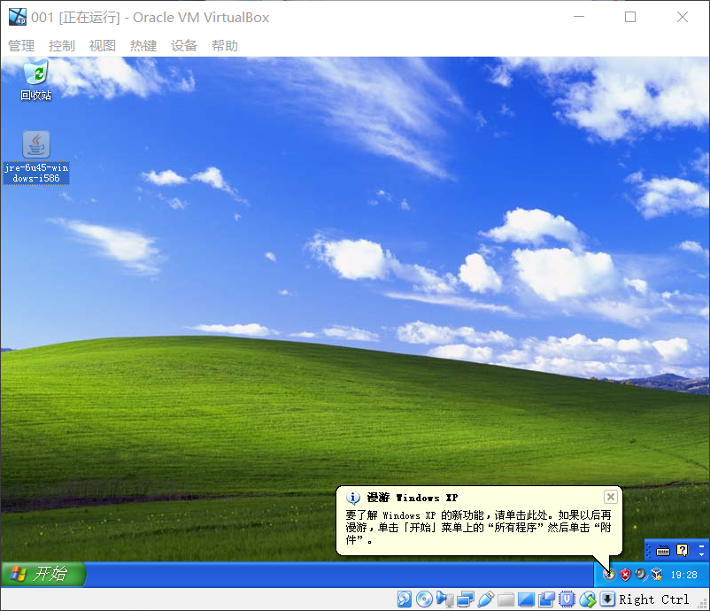

2. 正式安装：双击 .exe 文件，等待安装结束就好。

> 关于出现安装错误的问题：  
> 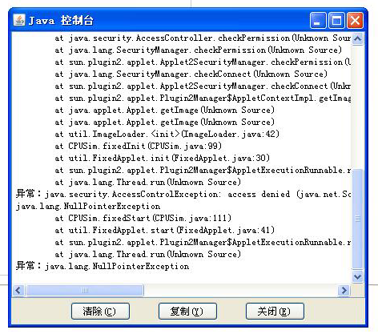  
>
> 1. 删除原本的 jre1.6 ：`开始`菜单栏-->`控制面板`-->`添加/删除程序`-->`删除`java  
> 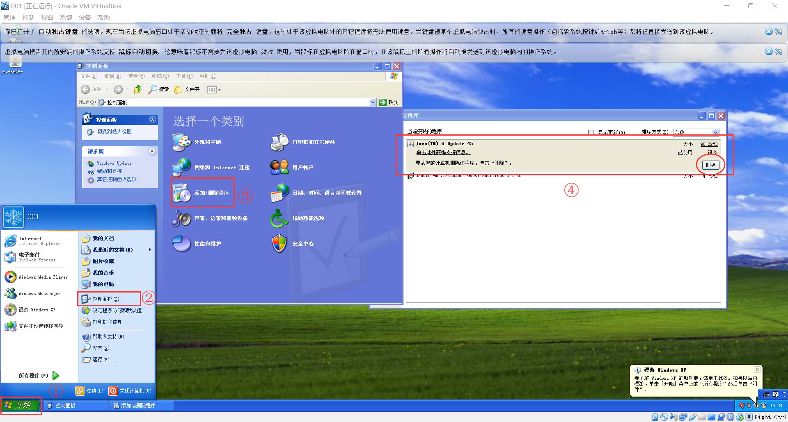
>
> 2. 下载 `jre-6u6-windows-i586-p.exe` ，下载链接：  
> * <a href="http://172.18.40.173/" target="_blank">http://172.18.40.173/</a>  
> * <a href="https://mail2sysueducn-my.sharepoint.com/:u:/g/personal/mijlong_mail2_sysu_edu_cn/Ect9c32kVdxNtCtubuorPmoB3oEB_J0ZRpj2oEBa1BZf7A?e=k5GBtb" target="_blank">Onedrive下载  </a>
> * 群文件下载
> * <a href="https://drive.google.com/open?id=1TjSKwVxW4ad7ZSL2RjdV0GvFbrzGJZBU" target="_blank">谷歌云盘</a>

## 7. <a name="7">进入网页</a>

1. 从`开始`菜单栏打开**IE浏览器**，复制网址**<a href="http://www.science.smith.edu/~jcardell/Courses/CSC103/CPUsim/cpusim.html" style="word-break: break-word">http://www.science.smith.edu/~jcardell/Courses/CSC103/CPUsim/cpusim.html</a>** 到IE浏览器中并`回车`

2. 对于提醒，全部选择`确定`。  
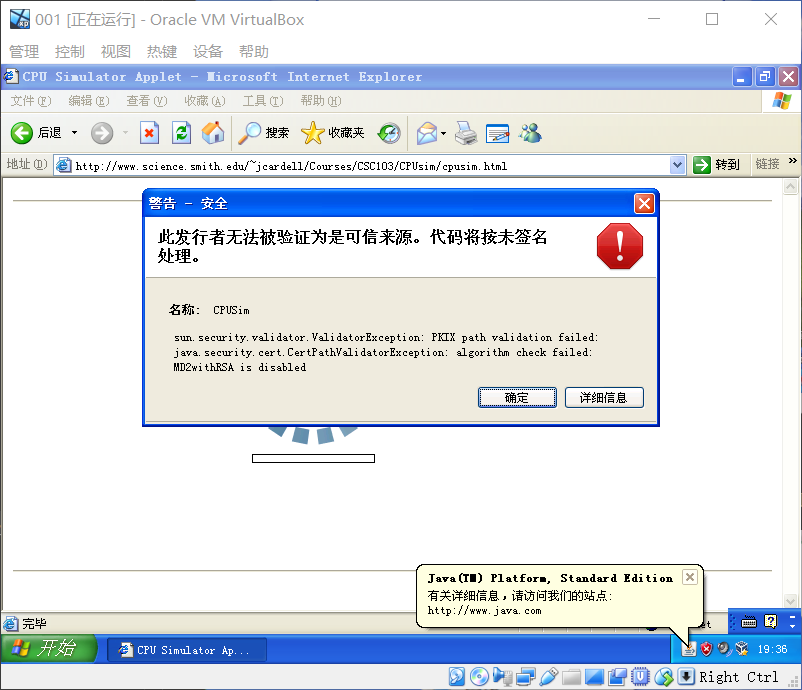

3. 噔噔噔！  
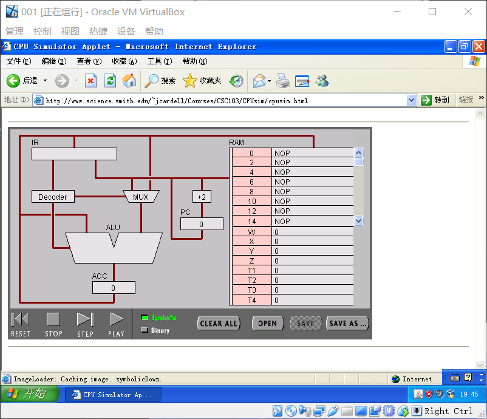

> 结语：相比于学委的直接使用自己的 IE11 来上辣个网站，这种方法要麻烦得多，不过如果你不知道也不想去卸载你的 Java ，那么这是一个不错的选择，毕竟虚拟机删除也不麻烦。
