# Python 实验报告捷径（部分内容十分硬核）

> 前言：关于这次作业，**负责任的神仙老学委**已经在他的<a href="https://ks0508.github.io/SE-project/QA2/QA2" target="_blank">学委的（关于 Python的）Q & A</a>中写的很明白了，但是这次接触到的 Python 的所谓的**交互式编程**已经令人头晕了，更别说还有**辣么多**的函数文档要阅读了（当初按下 help(numpy) 的我追悔莫及），所以我试着写个捷径来帮助大家。

## 目录

1. <a href="#inst">安装 Python 及相关的库</a>

    * <a href="#ipy">安装 Python </a>

    * <a href="#im">安装相关库</a>

{:start="2"}
2. <a href="#sympy">我们常用的 sympy 中的函数</a>

3. <a href="#numpy">常用的 numpy 中的函数</a>

## 1. <a name="inst">安装 Python 及相关的库</a>

Q：既然学委的 Q & A 中都已经给了 WinPython，而其中的大量关于科学计算的库可以让你成为“scientist 中的 scientist”（学委原话），那么我为什么还要去搞其他呢？  
> A：学委给的 WinPython 固然适合**无脑操作**，集成了大量的科学计算库，并且还能够免去你以后走入 Python 开发这条路子后还要**安装其他库**的麻烦事儿；但是，这个 WinPython 安装之后可是要占 **2G** 的空间，对于我对这个 128G SSD 系统盘，安完 WinPython 之后 C 盘只剩下 **10G** 的人很不友好啊！！！！（所以你为什么不安到 D 盘去呢？）  

### 1. <a name="ipy">安装 Python</a>

1. 官网：  
前往 <a href="https://www.python.org/" target="_blank">Python 官网</a>下载 Python（当然最好还是<a href="https://www.baidu.com" target="_blank">百度</a>/<a href="https://www.google.com" target="_blank">谷歌</a>搜索 Python 啦）  
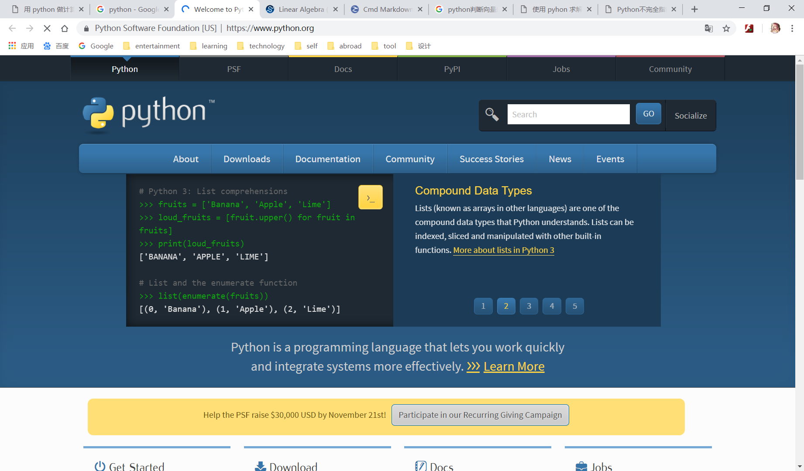

2. 下载：  
根据你的电脑**操作系统**选择下载 **execuatable installer** （3.6.7还是3.7.1你们随意，我这里拿3.6.7做示例）  

3. 安装：双击你下载的 installer   
* 如果你是第一次安装，那么全部默认就行，记得勾选最下面的 `add python 3.7 to path` 就行  

* 如果是已经有一个python（我就是）,，选择 `Upgrade Now`   
  

4. 添加环境变量（第一次安装 Python/电脑原本没有 Python 的不用看）：  
> 在我看来，这是最难的一步，我也不知道我为什么会在安装的时候没有默认把**启动路径添加path**，所以只能手动添加了，不过如果你们在安装的时候，看到安装界面有个 `add path` 请务必勾选上它  
* 在`控制面板`中打开`系统`  
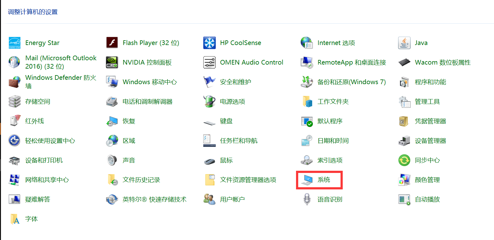  
* 打开`高级系统设置`
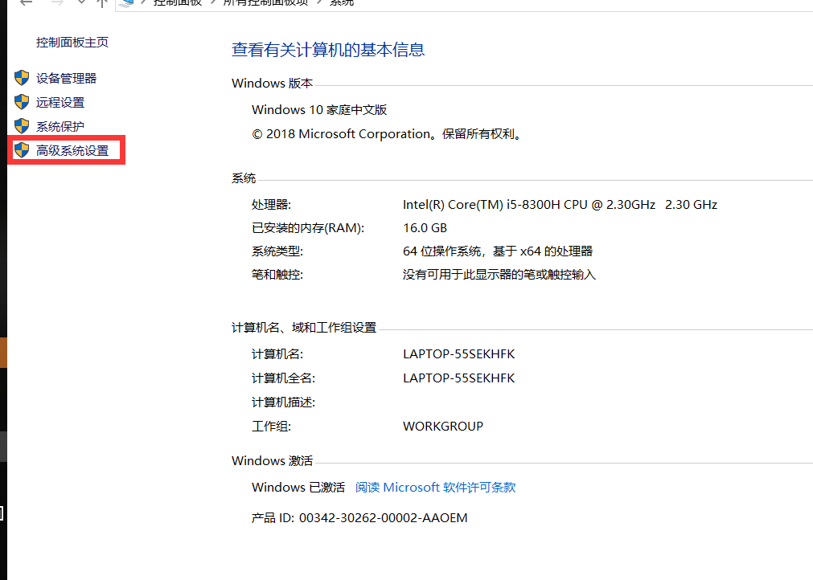  
* 打开`环境变量`  
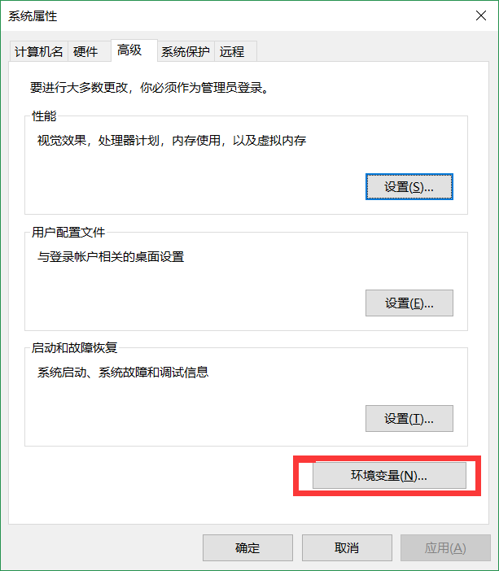  
* 点击 `path` 后点击`编辑`  
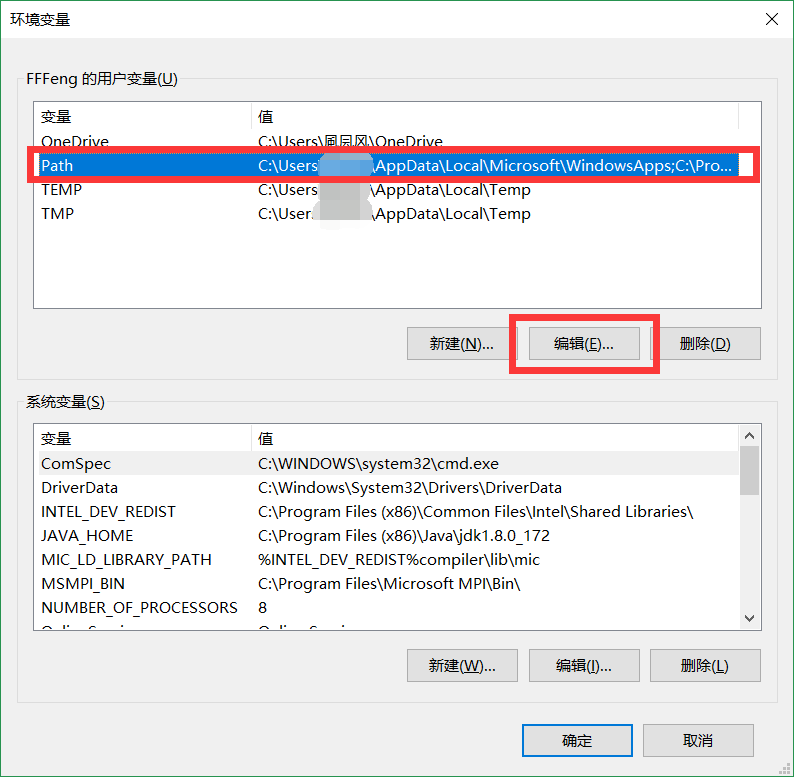  
* 点击`新建`，将` C:\Users\你的用户\AppData\Local\Programs\Python\Python36`输入  
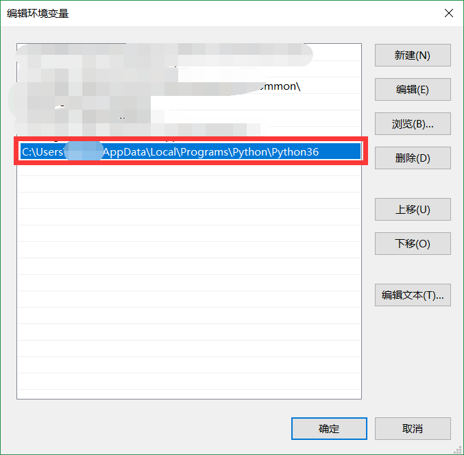  
> 这样，你就能够在你的 cmd（命令行）/powershell 中通过输入 python 进入交互界面了，效果如下图（进入交互界面后输入 `quit()` 或者`exit()` 可以退出交互界面）。  
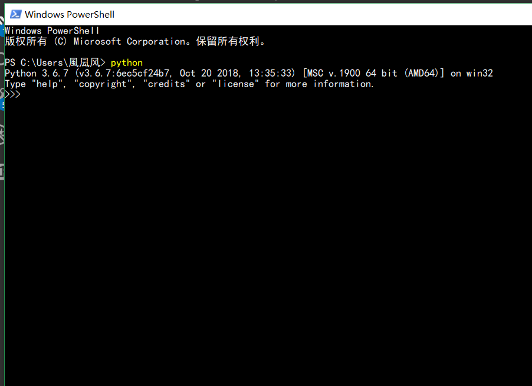
* 继续`新建`，将`C:\Users\你的用户名\AppData\Local\Programs\Python\Python36\Scripts`输入，这是在为使用 pip 命令安装库做准备

{:start="5"}
### 2. <a name="im">安装相关库</a>

1. 安装 sympy ：  
在 cmd/powershell 输入：  
<pre>
python -m pip install --upgrade pip
</pre>  
来更新 pip （原本的pip **太老了**）  
否则当你输入
<pre>
pip install sympy
</pre>  
就会出现如下提示：  
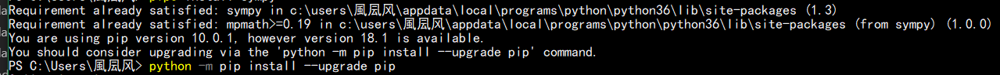  
输入上述 pip install 命令，开始下载和安装sympy  
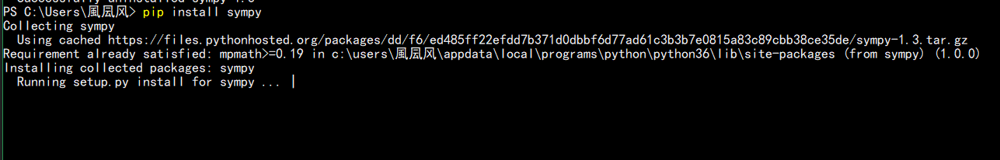

2. 安装numpy:  
新开一个（你也可以等这个安装完） cmd/powershell ，输入命令：  
<pre>
pip install numpy
</pre>  
开始下载安装 numpy 库  
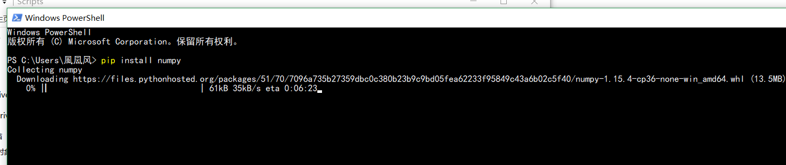  
> 安装时该窗口不要做任何操作，直到安装完成  
> 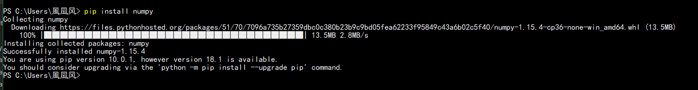

3. 安装 scipy （非必要）:  
<pre>
pip install scipy
</pre>  
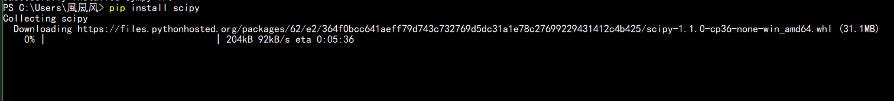

4. 安装 matplotlib （非必要）：  
<pre>
pip install matplotlib
</pre>

## 2. <a name="sympy">我们常用的 sympy 中的函数</a>

### 目录

1. <a href="#defx">定义变量</a>

2. <a href="#tri">三角函数</a>

3. <a href="#ra">分数</a>

4. <a href="#diff">求导</a>

5. <a href="#inte">积分</a>

6. <a href="#limit">极限</a>

### 1. <a name="defx">定义 x 等变量</a>：  
<pre>
# 使用方法一：只加载库
>>> import sympy # 加载库，但使用必须加前缀，对命名空间无影响
>>> x = sympy.symbols('x')

>>> x
x
>>> x**3
x**3

# 使用方法二：加载库中的全部函数
>>> from sympy import * #将库中所有函数全部加载出来，使用时不需要后缀，但是会污染原命名空间的其他函数（比如说 cos() ）
>>> x = symbols('x')

>>> x
x
</pre>

### 2. <a name="tri">三角函数（反三角函数我没找到</a>：  
<pre>
# 方法一：只加载库
>>> import sympy
>>> x = sympy.symbols('x') # 定义变量

>>> sympy.sin(x) # sin()
sin(x)
>>> sympy.cos(x) # cos()
cos(x)
>>> sympy.tan(x) # tan()
tan(x)

# 方法二：加载库中的全部函数，会和 math 库中的三角函数冲突（目前已知是覆盖 math 的）
>>> from sympy import *
>>> x = symbols('x')

>>> sin(x) # sin()
sin(x)
>>> cos(x) # cos()
cos(x)
>>> tan(x) # tan()
tan(x)
</pre>

### 3. <a name="ra">分数</a>：  
<pre>
# 方法一：只加载库
>>> import sympy
>>> x = sympy.symbols('x') # 定义变量

>>> sympy.Rational(3/2)
3/2

>>> sympy.Rational(sympy.cos(x)/2) # 报错，我暂时不知道为什么
>>> sympy.Rational(3/2) * sympy.sin(x) 
3*sin(x)/2

# 方法二：加载库中的全部函数，会和 math 库中的三角函数冲突（目前已知是各司其职，即参数是数据就是 math. ,如果是 symbol 类型就变成 sympy.）
>>> from sympy import *
>>> x = symbols('x')

>>> Rational(3/2)
3/2

>>> Rational(cos(x)/2) # 报错，我暂时不知道为什么
>>> Rational(3/2) * sin(x) 
3*sin(x)/2
</pre>

### 4. <a name="diff">求导</a>：  
<pre>
# 方法一：只加载库
>>> import sympy
>>> x = sympy.symbols('x') # 定义变量

>>> sympy.diff (x) # 求导
1

>>> sympy.diff(sympy.cos(x))
-sin(x)

# 方法二：加载库中的全部函数
>>> from sympy import *
>>> x = symbols('x')

>>> diff (x) # 求导
1

>>> diff(cos(x))
-sin(x)
</pre>

### 5. <a name="inte">积分</a>  
<pre>
# 两种方法都可以使用，篇幅限制只使用加载库
>>> import sympy
>>> x = sympy.symbols('x') # 定义变量

# 不定积分，没有加 C：sympy.integrate(表达式)
>>> sympy.integrate (x) 
x**2/2

>>> sympy.integrate(sympy.cos(x))
sin(x)

>>> sympy.integrate(x**8+sympy.sqrt(x))
2*x**(3/2)/3 + x**9/9

# 定积分：sympy.integrate(表达式,(变量,下限,上限))；表达式可以用变量替代
>>> sympy.integrate (x,(x,0,2))  
2

>>> expr = sympy.cox(x)
>>> expr
cos(x)
>>> sympy.integrate(expr,(x,0,1))
sin(1)

>>> expr2 = sympy.tan(x)
>>> expr2
tan(x)
>>> sympy.integrate(expr2,(x,0,1))
-log(cos(1))
</pre>

### 6. <a name="limit">极限</a>：  
<pre>
# 两种方法都可以，篇幅限制只使用函数全部加载
# limit(表达式,变量,极限点)
>>> from sympy import *
>>> x=symbols('x') # 定义变量

>>> limt(ln(x),x,0) # 此处的 ln() 是 sympy.ln()
-oo # 即负无穷

>>> limit(tan(x),x,math.pi/2) # math.pi 需要 import math
1.63312393531954e+16

>>> limit(tan(x),x,+oo)
AccumBounds(-oo, oo)
</pre>

## 3. <a name="numpy">我们常用的 numpy 中的函数</a>

> 同 sympy 一样，都能够加载库或者加载全部函数，为了省略篇幅，只用加载全部函数方法

### 目录

1. <a href="#crtmtrx">建立矩阵</a>

2. <a href="#shape">求矩阵大小</a>

3. <a href="#tp">求矩阵转置</a>

4. <a href="#I">求矩阵的逆</a>

5. <a href="#mult">求矩阵相乘的积</a>

### 1. <a name="crtmtrx">建立矩阵</a>：  
<pre>
>>>from numpy import * # 加载全部函数
>>> A = matrix([[1,2,3], # 其他方法我我没了解
... [5,7,8],
... [3,5,6]])
>>> A
matrix([[1, 2, 3],
        [5, 7, 8],
        [3, 5, 6]])
</pre>

### 2. <a name="shape">求矩阵大小</a>：  
<pre>
>>> A # 用上面的 A
matrix([[1, 2, 3],
        [5, 7, 8],
        [3, 5, 6]])

# 方法一
>>> A.shape()
(3, 3)
# 方法二
>>> shape(A)
(3, 3)
</pre>

### 3. <a name="tp">求矩阵的转置</a>：  
<pre>
>>> A # 用上面的 A
matrix([[1, 2, 3],
        [5, 7, 8],
        [3, 5, 6]])

# 方法一
>>> A.T
matrix([[1, 5, 3],
        [2, 7, 5],
        [3, 8, 6]])
# 方法二
>>> A.transpose()
matrix([[1, 5, 3],
        [2, 7, 5],
        [3, 8, 6]])
# 方法三
>>> transpose(A)
matrix([[1, 5, 3],
        [2, 7, 5],
        [3, 8, 6]])
</pre>

### 4. <a name="I">求矩阵的逆</a>：  
<pre>
>>> A # 用上面的 A
matrix([[1, 2, 3],
        [5, 7, 8],
        [3, 5, 6]])

# 方法一
>>> A.I
matrix([[ 1. ,  1.5, -2.5],
        [-3. , -1.5,  3.5],
        [ 2. ,  0.5, -1.5]])
# 方法二
>>> A**-1
matrix([[ 1. ,  1.5, -2.5],
        [-3. , -1.5,  3.5],
        [ 2. ,  0.5, -1.5]])
</pre>

### 5. <a name="mult">求矩阵相乘的积</a>：  
<pre>
>>> A # 用上面的 A
matrix([[1, 2, 3],
        [5, 7, 8],
        [3, 5, 6]])

# 方法一
>>> A.dot(A) # 括号中是另一个矩阵
matrix([[ 20,  31,  37],
        [ 64,  99, 119],
        [ 46,  71,  85]])
# 方法二
>>> dot(A,A) # 括号里面是两个矩阵
matrix([[ 20,  31,  37],
        [ 64,  99, 119],
        [ 46,  71,  85]])
# 方法三
>>> A*A # 最粗暴的方法
matrix([[ 20,  31,  37],
        [ 64,  99, 119],
        [ 46,  71,  85]])
</pre>

