# Ubuntu 18.04 安装指南

## 目录

1. <a href="#dw">下载</a>

2. <a href="#creat">创建虚拟机</a>

3. <a href="#inst">安装系统</a>

4. <a href="#config">配置（软件源）</a>

## 1. 下载

#### 1. 清华大学开源镜像站（速度其实挺快）

1. <a href="https://mirrors.tuna.tsinghua.edu.cn/" target="_blank">点我跳转页面</a>   
  
2. 点击`获取下载链接`（即**图中位置**）  

> 您要**懒癌发作**，请直接点击<a href="https://mirrors.tuna.tsinghua.edu.cn/ubuntu-releases/bionic/ubuntu-18.04.1-desktop-amd64.iso">这个链接</a>进行下载

#### 2. 校园网（各种意义上容易爆炸）

点击下载链接直接下载（四个中至**少有一个**、**最多有两个**是能用的）：  
* <a href="http://172.18.40.92/ubuntu-18.04.1-desktop-amd64.iso">下载链接1：nginx</a >
* <a href="http://172.18.40.92:8080/ubuntu-18.04.1-desktop-amd64.iso">下载链接 2</a>
* 下载链接 3
* 下载链接 4

## 2. 创建虚拟机

1. 下载并安装 VBox ：具体操作可参考<a href="https://fffengmjl.github.io/blog/002(forlab07#1" target="_blank">我上上一篇博客中的“创建虚拟机”</a>部分

2. 创建：打开 VBox 后，点击`新建`，输入**名称**，类型选择 `Linux` ，版本选择 `Ubuntu (64-bit)`  

3. 分配内存：随便分啦（依然是那句话，**分的越少虚拟机越卡，分的越多你的电脑可能越卡**）  

4. **创建虚拟硬盘**：如图  

5. 选择**磁盘类型**：如图  

5. 确定**分配方式**：如图  

6. 确定**文件位置和大小**：默认就好，如果你觉得大小不够用，就多加一点，**别超了你自己的上限**就好  

7. 完事儿  

## 3. 安装 Ubuntu 18.04

1. 启动：选中**新建的 Ubuntu 虚拟机**，点击启动  
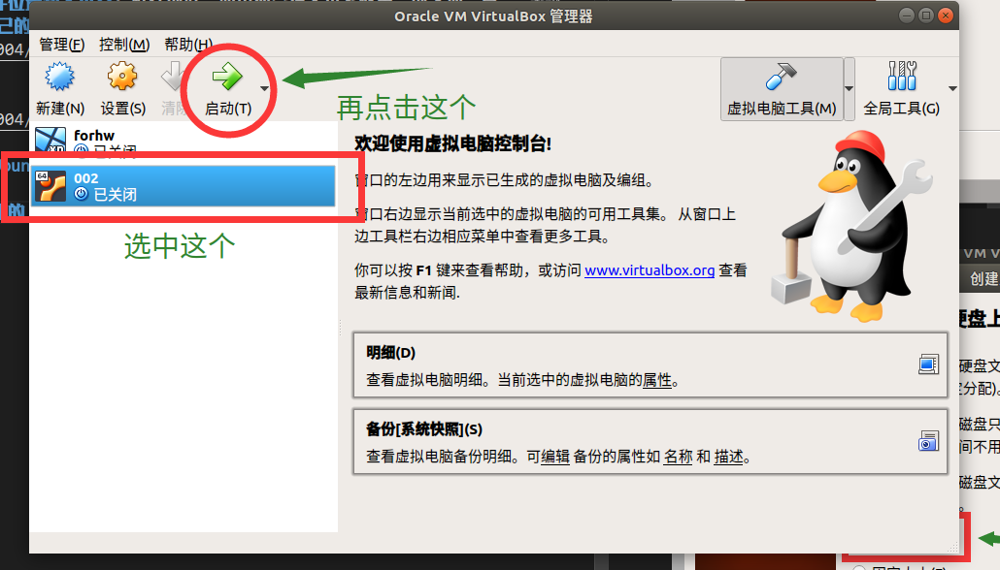

2. 添加 iso 文件：**导入**你下载的 iso 文件，点击下一步，等待加载完成  
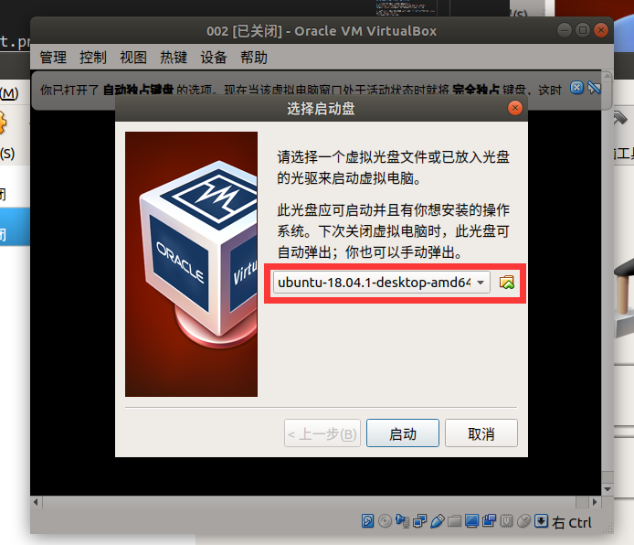

3. 正式开始安装：选择语言（**简中在倒数第三，繁中在倒数第二**，不过你想硬核选择其他语言我也没办法）  
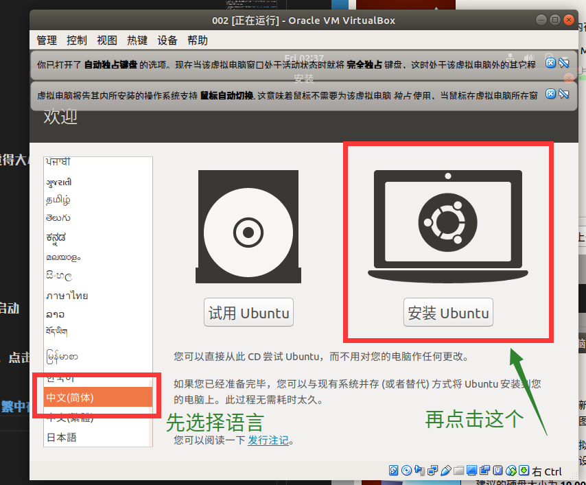

4. 键盘布局：我自己是默认的`汉语`-`汉语`，然后点击`继续`  
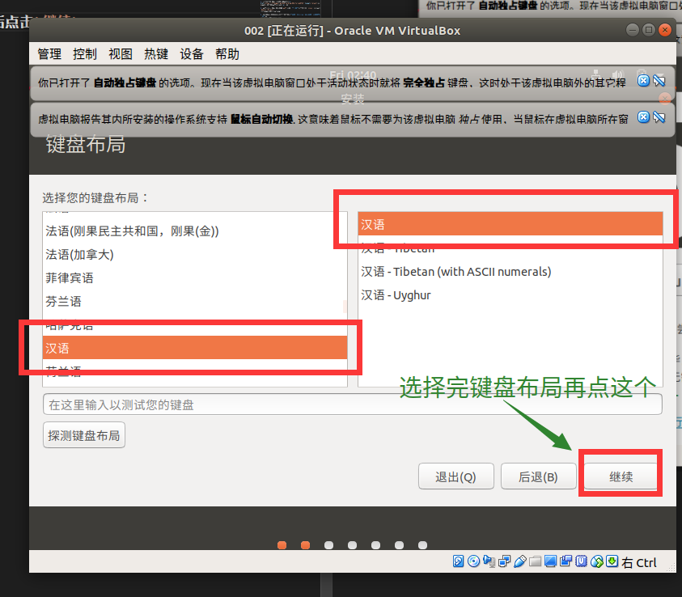

5. 软件更新：**默认**就好  
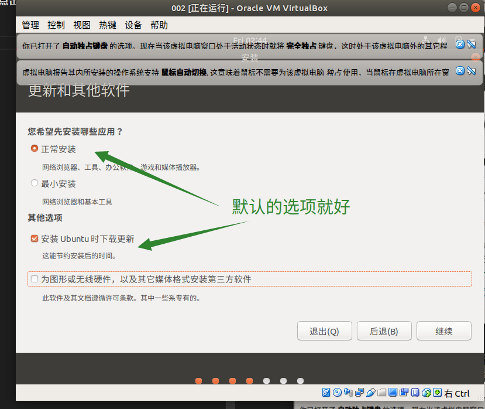

6. 清空磁盘选择：依然是**默认**就好，遇到提示选择`继续`  
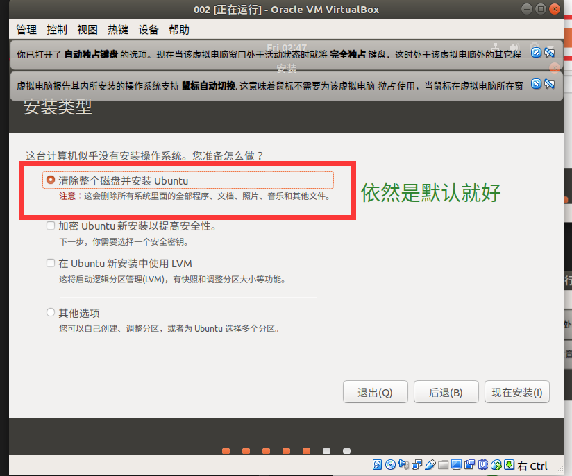  
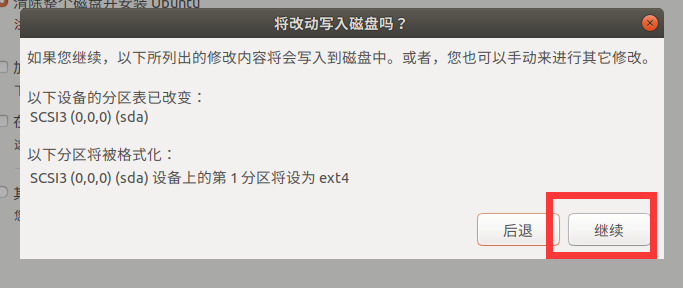

7. 地区选择：这个好像与**时间/时区**有关，所以嘛。。。。  

8. 您是谁：喜闻乐见**取名**桥段  
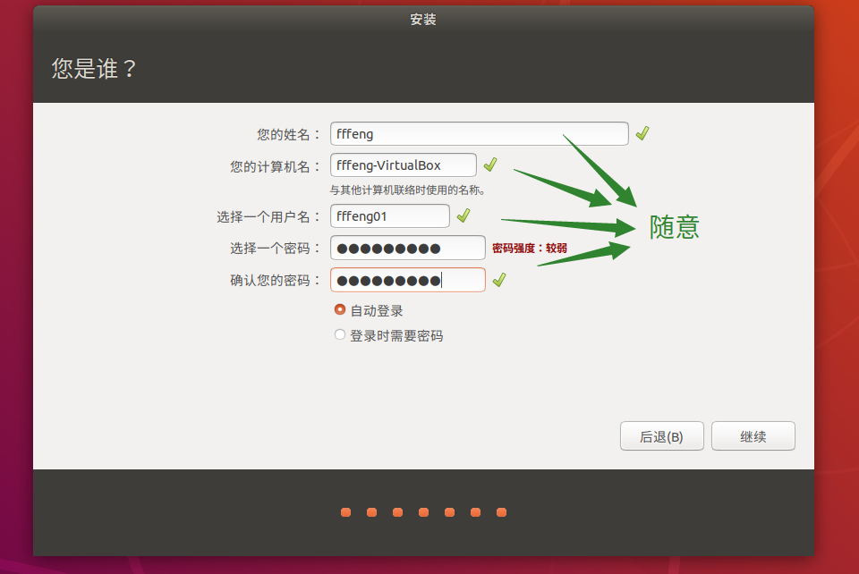

9. 等待  
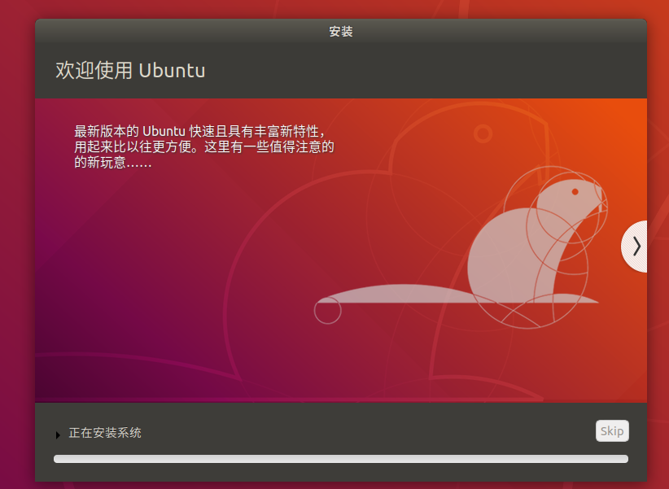

10. 点击`现在重启`

11. 完成系统的安装（**新特性**这些全部点击`前进`跳过就好）  
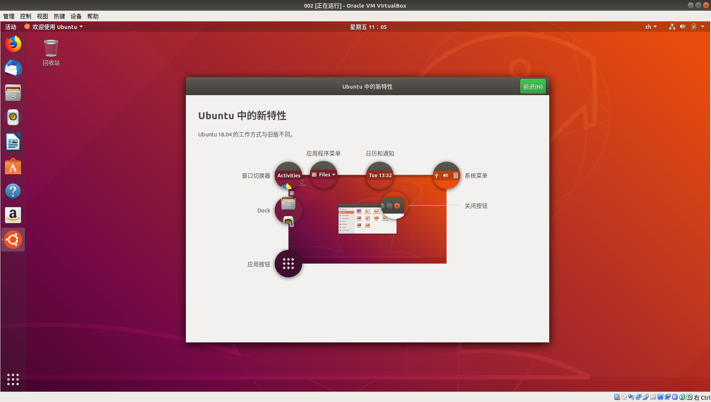

> 1. 更新：跳过新特性之后，你发现桌面有一个提示，提示你更新软件，由于**软件源在墙外**，多半会更新失败，所以可以选择**不更新**  
> 2. 验证上网：左上角就是大名鼎鼎的 **Firefox （火狐）浏览器**，打开它，输入百度/谷歌（或者其他网站）的网址，验证能否上网（一般来说是可以直接上的

## 4. 配置相关文件

#### 1. 安装增强功能

1. 具体可以参考<a href="https://fffengmjl.github.io/blog/002(forlab07#5" target="_blank">我上上一篇博客中的“安装 vbox 的增强功能”</a>部分

2. 弹出来的窗口，选择`运行`  
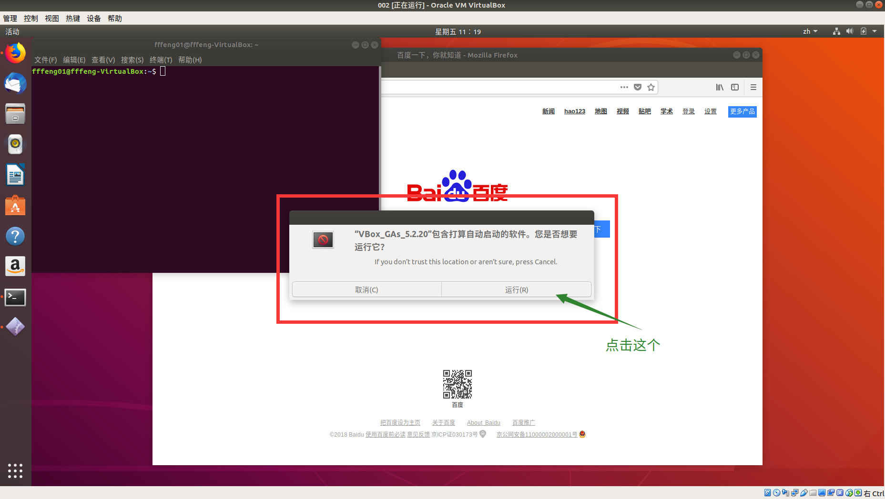

3. 弹出一个终端，展示安装过程  
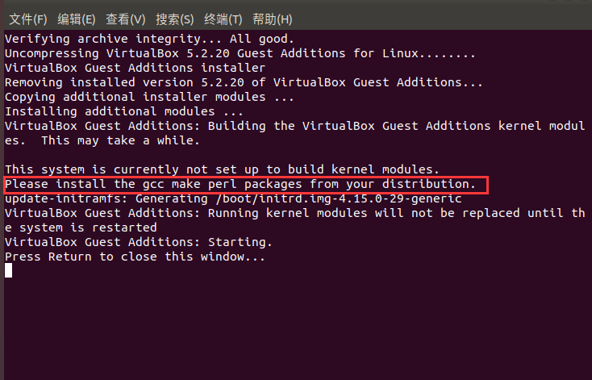
> 按照终端的信息来看，似乎是没有安装 **gcc** ，不过看样子<del>它会自动帮我们安装</del>，实锤了，并没有  

4. 安装 gcc ：打开**终端** --> 输入如下命令 --> 按下`Y`  
<code>
sudo apt install gcc
</code>
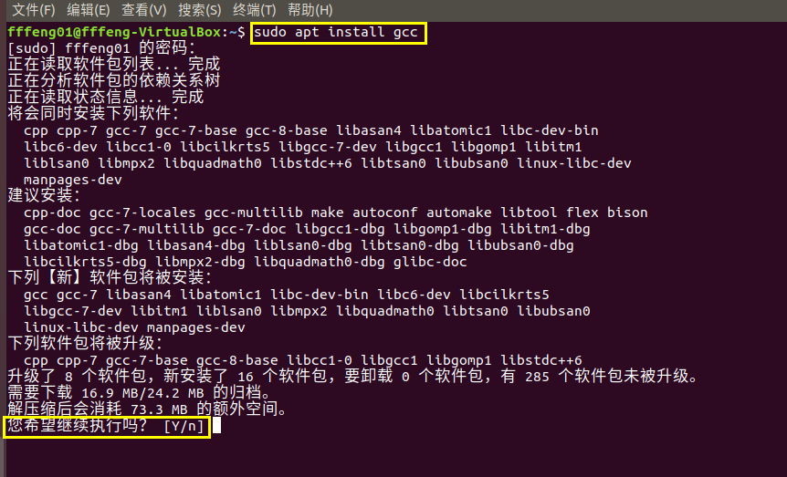  
等待安装完成  
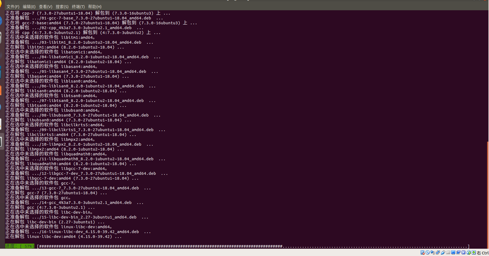  

5. 点开桌面上的**VBox Gas**，点击右上角的运行  
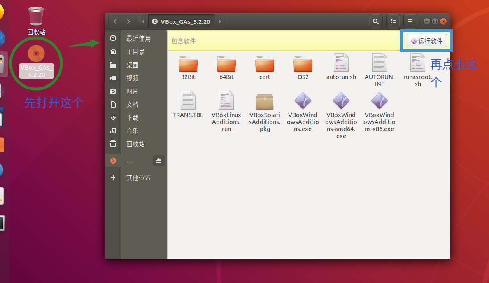