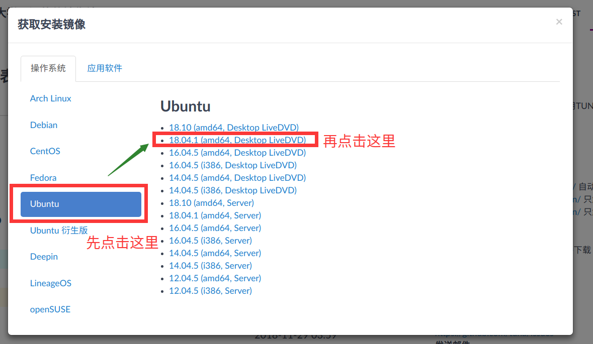
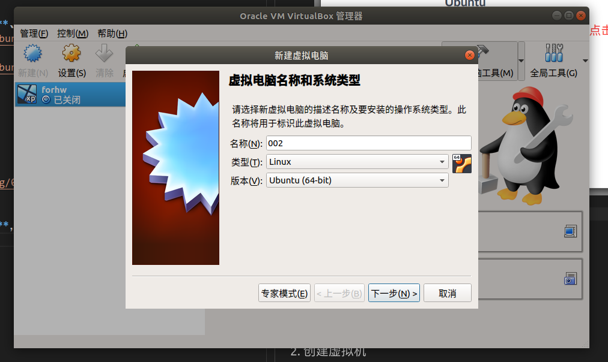
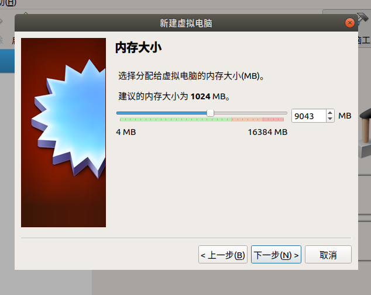
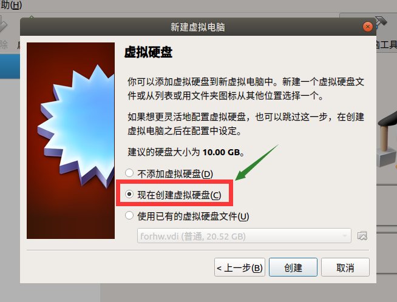
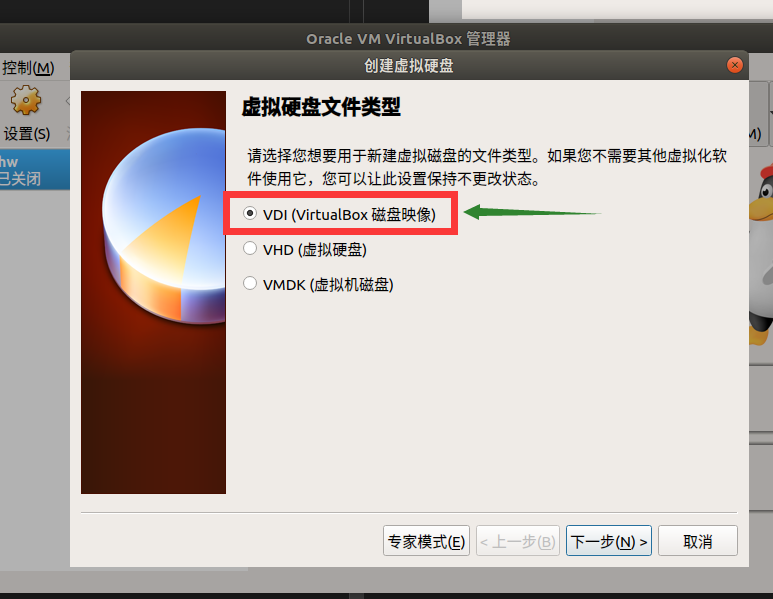
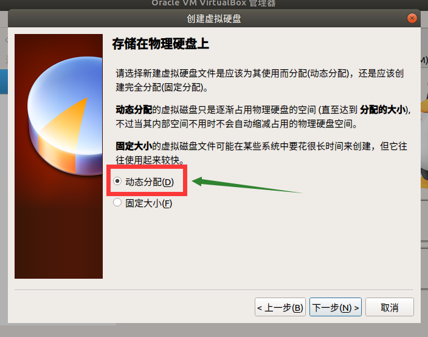
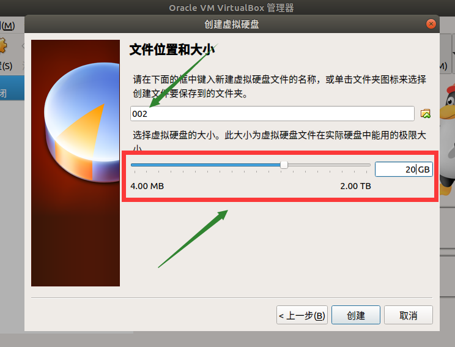
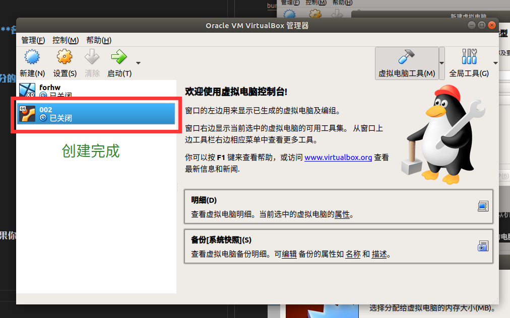

# Ubuntu 18.04 安装指南

## 目录

1. <a href="#dw">下载</a>

2. <a href="#creat">创建虚拟机</a>

3. 安装系统

4. 配置（软件源）

## 1. 下载

#### 1. 清华大学开源镜像站（速度其实挺快）

1. <a href="https://mirrors.tuna.tsinghua.edu.cn" target="_blank">点我跳转页面</a>   
  
2. 点击`获取下载链接`（即**图中位置**）  

> 您要**懒癌发作**，请直接点击<a href="https://mirrors.tuna.tsinghua.edu.cn/ubuntu-releases/bionic/ubuntu-18.04.1-desktop-amd64.iso">这个链接</a>进行下载

#### 2. 校园网（各种意义上容易爆炸）

点击下载链接直接下载（四个中至**少有一个**、**最多有两个**是能用的）：  
* <a href="http://172.18.40.92/ubuntu-18.04.1-desktop-amd64.iso">下载链接 1</a >
* <a href="http://172.18.40.92:8080/ubuntu-18.04.1-desktop-amd64.iso">下载链接 2</a>
* 下载链接 3
* 下载链接 4

## 2. 创建虚拟机

1. 下载并安装 VBox ：具体操作可参考<a href="https://fffengmjl.github.io/blog/002(forlab07#1">我上一篇博客中的“创建虚拟机”</a>部分

2. 创建：打开 VBox 后，点击`新建`，输入**名称**，类型选择 `Linux` ，版本选择 `Ubuntu (64-bit)`  

3. 分配内存：随便分啦（依然是那句话，**分的越少虚拟机越卡，分的越多你的电脑可能越卡**）  

4. **创建虚拟硬盘**：如图  

5. 选择**磁盘类型**：如图  

5. 确定**分配方式**：如图  

6. 确定**文件位置和大小**：默认就好，如果你觉得大小不够用，就多加一点，**别超了你自己的上限**就好  

7. 完事儿  

## 3. 安装 Ubuntu 18.04