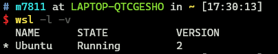
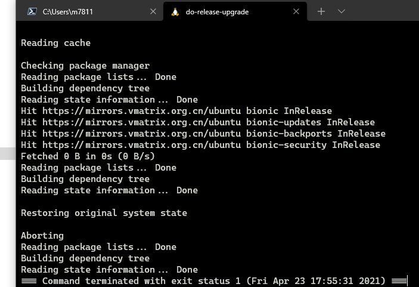
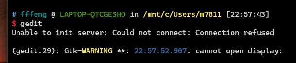
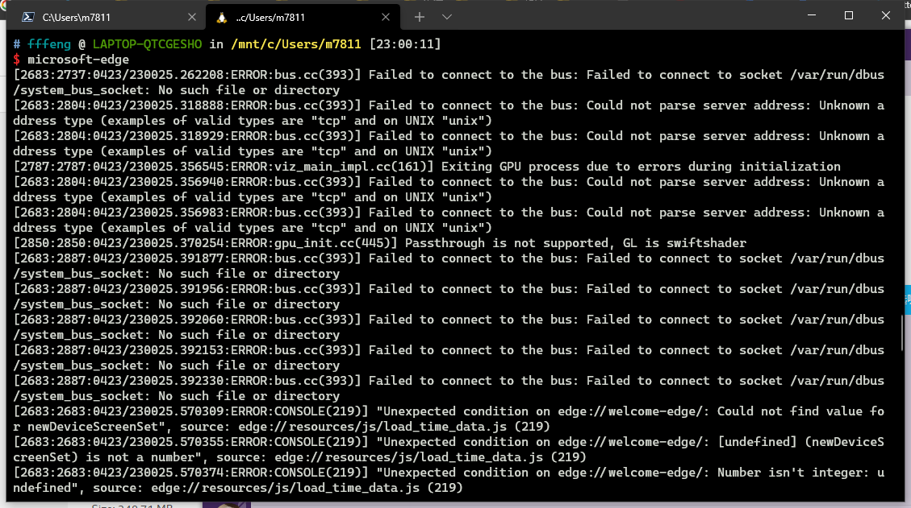
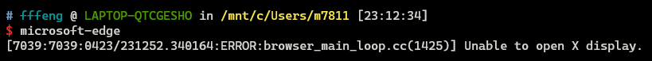
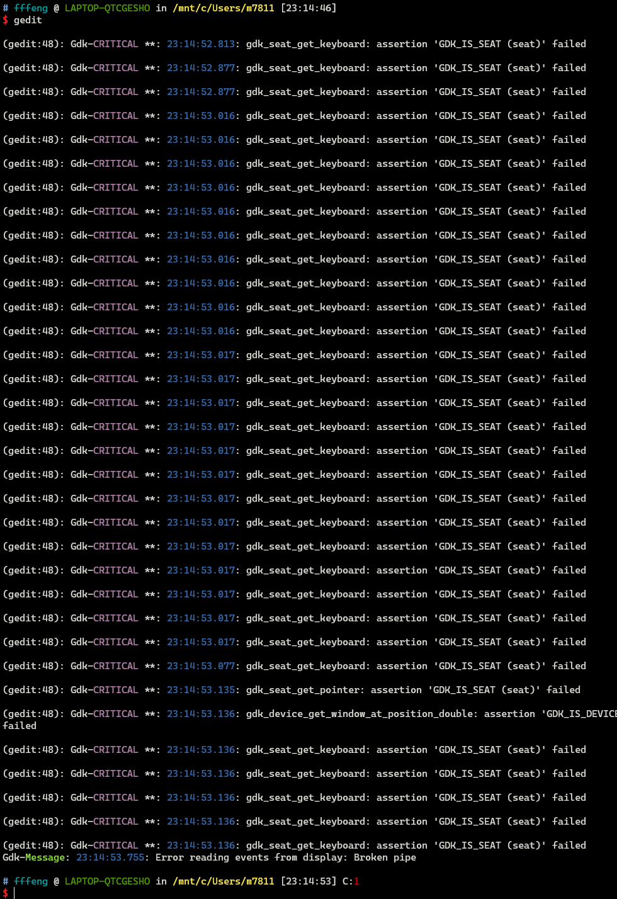
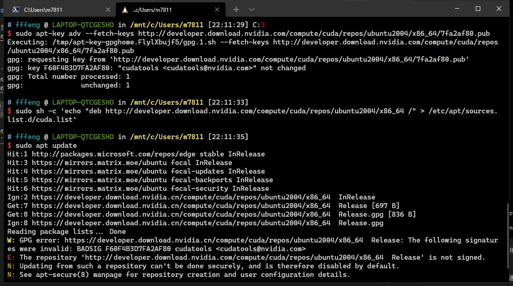

# WSL1 升级 WSL2 记录

- [WSL1 升级 WSL2 记录](#wsl1-升级-wsl2-记录)
  - [什么是 WSL](#什么是-wsl)
  - [WSL1 和 WSL2 的区别](#wsl1-和-wsl2-的区别)
  - [升级流程](#升级流程)
    - [步骤1 - 启用相关功能](#步骤1---启用相关功能)
    - [步骤2 - 下载 Linux 内核更新包](#步骤2---下载-linux-内核更新包)
    - [步骤3 - 设置默认版本为 WSL 2](#步骤3---设置默认版本为-wsl-2)
    - [步骤4 - 转换现有的 WSL 1](#步骤4---转换现有的-wsl-1)
      - [查看已经安装的 Linux 分发版](#查看已经安装的-linux-分发版)
      - [转换对应的分发版](#转换对应的分发版)
  - [其他流程](#其他流程)
    - [Ubuntu 升级流程](#ubuntu-升级流程)
      - [使用命令行进行升级](#使用命令行进行升级)
      - [使用 GUI](#使用-gui)
        - [相关问题](#相关问题)
          - [界面闪烁](#界面闪烁)
          - [应用崩溃](#应用崩溃)
    - [使用图形加速](#使用图形加速)

> 主要参考 [微软 WLS 文档](https://docs.microsoft.com/zh-cn/windows/wsl/)

## 什么是 WSL

WSL 全称 `Windows Subsystem for Linux` ，是能够直接运行在 windows 10 系统上的 GNU/Linux 环境，WSL 和虚拟机和双系统的区别：

|  类型  | 与 windows 同时使用 |       共享文件        |  资源占用  |                     安装难度                     | 能否备份 |
| :----: | :-----------------: | :-------------------: | :--------: | :----------------------------------------------: | :------: |
|  WSL   |          ✅          | ✅，直接与系统文件交互 |     小     |         微软文档，微软商店下载，自动安装         |    🈚     |
| 虚拟机 |          ✅          |   ✅，使用共享文件夹   |    较多    | 对应分发版文档，额外虚拟机软件，完整系统安装流程 | 快照功能 |
| 双系统 |          ❌          |           ❌           | *无法比较* |  对应分发本文档，额外引导硬件，完整系统安装流程  |    🈚     |

对于有常驻 windows ，但又需要 Linux 环境的需求，WSL 可以说是一个近乎完美的选择了。

## WSL1 和 WSL2 的区别

> 具体完整内容请查阅 [微软 WSL 文档：比较 WSL 1 和 WSL 2](https://docs.microsoft.com/zh-cn/windows/wsl/compare-versions)

| 功能                                           | WSL 1 | WSL 2 |
| :--------------------------------------------- | :---: | :---: |
| Windows 和 Linux 之间的集成                    |   ✅   |   ✅   |
| 启动时间短                                     |   ✅   |   ✅   |
| 与传统虚拟机相比，占用的资源量少               |   ✅   |   ✅   |
| 可以与当前版本的 VMware 和 VirtualBox 一起运行 |   ✅   |   ✅   |
| 托管 VM                                        |   ❌   |   ✅   |
| 完整的 Linux 内核                              |   ❌   |   ✅   |
| 完全的系统调用兼容性                           |   ❌   |   ✅   |
| 跨 OS 文件系统的性能                           |   ✅   |   ❌   |

> 为什么是 WSL 1 升级到 WSL 2

笔者在之前已经用了很久的 WSL 1 了，因为有长时间使用 windows 的需求 ，还能够够享受 Linux 的环境，但那时候由于 Hyper-V （WSL 2 的硬性要求）不能够和 vbox 兼容，部分情况下对虚拟机有界面需求的情况下，只能暂时继续使用 WSL 1 了。

WSL 2 在最近的 windows insider 版本中加入了对 GUI 的支持，能够在 windows 环境下使用到类原生的 Linux 带UI 应用，并且显卡厂商也添加了对 WSL 2 的硬件加速，能够更加方便地使用使用 WSL 2 来进行机器学习。

## 升级流程

> 详情请查阅：[微软 WSL 文档：适用于 Linux 的 Windows 子系统安装指南 (Windows 10)](https://docs.microsoft.com/zh-cn/windows/wsl/install-win10)

个人环境：

- windows 10 系统，insider 版本 dev 通道
- WSL 1 的 `Ubuntu 18.04`
- 独显 GTX 1060
- **集显被物理屏蔽**

### 步骤1 - 启用相关功能

**启用适用于 Linux 的 Windows 子系统**：在 powershell 中执行如下命令

```powershell
dism.exe /online /enable-feature /featurename:Microsoft-Windows-Subsystem-Linux /all /norestart
```

**启用虚拟机功能**：在 powershell 中执行如下命令

```powershell
dism.exe /online /enable-feature /featurename:VirtualMachinePlatform /all /norestart
```

### 步骤2 - 下载 Linux 内核更新包

下载链接：[适用于 x64 计算机的 WSL2 Linux 内核更新包](https://wslstorestorage.blob.core.windows.net/wslblob/wsl_update_x64.msi)，下载完成后直接双击运行 `.msi` 文件即可

### 步骤3 - 设置默认版本为 WSL 2

在 powershell 执行如下命令：

```powershell
wsl --set-default-version 2
```

> 为什么用这条命令？（踩过的坑）

如果没有将默认版本设置为 WSL 2 的话，从微软商店安装的 WSL 将会默认为1，需要手动进行版本转换（踩过的坑：开开心心用了一会儿 20.04，想试试 GUI 的时候，发现自己是 WSL 1 ，还得手动转换到 WSL 2 😂）

### 步骤4 - 转换现有的 WSL 1

#### 查看已经安装的 Linux 分发版

在 powershell 执行如下命令：

```powershell
wsl --list --verbose
# 等价于
# wsl -l -v
```

找到自己想转化的 WSL 1 的名字，例如我这边就是 `Ubuntu` ，如下图：



> 图中我的 `Ubuntu` 已经是 WSL 2 了，如果是 WSL 1 的话，那么 `VERSION` 列那里应该是**1**

#### 转换对应的分发版

在 powershell 执行如下命令：

```powershell
wsl --set-version <distribution name> <versionNumber>
# 对我来说就是
# wsl --set-version Ubuntu 2
```

WSL 1 到 WSL 2 的转换需要一定的时间，耐心等待即可，执行过程如图：


## 其他流程

### Ubuntu 升级流程

由于 Ubuntu 的 LTS 已经是20.04，新增了许多特性，而我的 WSL 仍然是18.04，因此需要进行升级

#### 使用命令行进行升级

> 为什么不用直接**图形更新管理器**？

这不废话么，WSL 哪来图形桌面，我升级 WSL 就是为了尝鲜使用 Linux 下带图形界面的应用

在 ubuntu 下执行如下命令进行强制升级：

```bash
sudo apt update && sudo apt upgrade -y # 先进行当前系统的更新
sudo do-release-upgrade -d # 更新版本
```

等待执行完成后重启 WSL 即可，重启可在 powershell 中输入如下命令：

```powershell
wsl --shutdown && wsl # 先关闭再打开
```

> 然而使用我使用命令升级失败了，在升级的时候会自动推出，具体原因不清楚，和朋友推论猜测是存在某些不兼容的东西；升级失败的图片如下：
> 
> 
> 
> 最后选择是卸载现有 Ubuntu 然后去微软商店重新下了一个（现在微软商店的 Ubuntu 已经默认是20.04了）

#### 使用 GUI

WSL 使用 GUI 的特性具体参考：[WSLg](https://github.com/microsoft/wslg)

安装对应的显卡驱动并重启 WSL 即可：

- [AMD GPU driver for WSL](https://community.amd.com/community/radeon-pro-graphics/blog/2020/06/17/announcing-amd-support-for-gpu-accelerated-machine-learning-training-on-windows-10)
- [Intel GPU driver for WSL](https://downloadcenter.intel.com/download/29526)
- [NVIDIA GPU driver for WSL](https://developer.nvidia.com/cuda/wsl)

我选择安装的是 NVIDIA 的 GeForce 版本驱动

##### 相关问题

暗影精灵4 8300H 1060 6G 的集显被物理屏蔽，无法安装 Intel 的集显驱动，在使用带界面的应用时会出现一些问题：

###### 界面闪烁

在启动 WSL 后，大概率导致任务管理器（其他窗口未测试）高频率闪动，实例如下图：


> 猜测是 WSL 对应的显卡驱动导致的问题，只能等待老黄出新的显卡驱动了

可以通过暂时禁用 WSL 2 的 GUI 支持，直接禁止 Wayland Server 的启动，从而避免 GPU 的虚拟化。具体操作为：

1. 在 `%userprofile%` 下面创建一个 `.wslconfig` 的文件
2. 在其中输入如下文本：

```text
[wsl2]
guiapplications=false
```

3. 保存并重启 WSL

上述操作完成后，尝试使用带 GUI 的应用会出现如下报错，说明关闭成功：



###### 应用崩溃

在通过命令行启动 microsoft-edge 并且时候时，会在命令行出现如下信息：



使用 edge 时有概率导致 `Wayland Server` 崩溃，并且导致所有带界面应用无法再次启动，再次尝试启动 edge 会出现如下报错：



`wayland` 崩溃后尝试启动 gedit 会有如下报错：



> Wayland Server 是 WSL 实现 GUI 显示的途径，只能等后续更新提高稳定性

### 使用图形加速

> 如果需要使用 Linux 下的图形加速，则需要在 WSL 中安装对应的 cuda ，详情查阅：[CUDA on WSL User Guide](https://docs.nvidia.com/cuda/wsl-user-guide/index.html)

在 Ubuntu 中分别执行如下命令，用于安装 cuda ：

```bash
apt-key adv --fetch-keys http://developer.download.nvidia.com/compute/cuda/repos/ubuntu2004/x86_64/7fa2af80.pub # 获取对应的 key ，需要注意的是，我是用的20.04版本的

sh -c 'echo "deb http://developer.download.nvidia.com/compute/cuda/repos/ubuntu2004/x86_64 /" > /etc/apt/sources.list.d/cuda.list' # 添加仓库下载链接

apt-get update # 更新
```

会出现如下报错：



发现是因为 http://developer.download.nvidia.com/compute/cuda/repos/ubuntu2004/x86_64/ 会无偿跳转到 http://developer.download.nvidia.cn/compute/cuda/repos/ubuntu2004/x86_64/ ，即使是挂了梯子，也会跳转到 `.cn` 域名，最终导致获取到的两个签名不一致，从而无法完成更新