# 安装 proteus

## 目录

1. <a href="#download">下载</a>
2. <a href="#install">正常安装</a>
3. <a href="#hace">破解</a>
4. <a href="#lang">语言补丁</a>
5. <a href="#problems">常见问题</a>

## 1. 下载

1. 方法一：<a href="http://172.18.40.173/%e6%95%b0%e7%94%b5%e8%b5%84%e6%96%99/Proteus.zip">点击下载1</a> <a href="http://172.26.70.204/%E6%95%B0%E7%94%B5%E8%B5%84%E6%96%99/Proteus.zip">点击下载2</a>
2. 方法二：打开<a href="172.18.40.173" target="_blank">这个网址</a> 或者 <a href="http://172.26.70.204/" target="_blank">这个网址</a>，选择 `学习资料` > `数电资料` 点击 proteus.zip 进行下载 
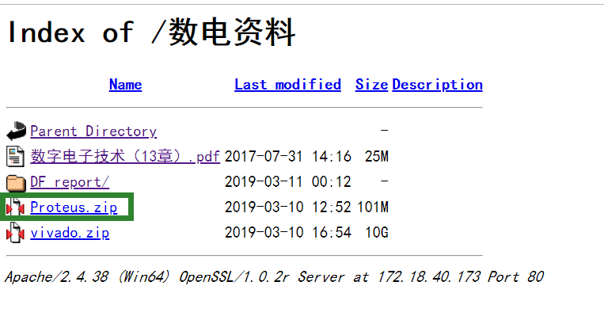  
3. 方法三：数电实验群文件  
> 前两个下载方法本质上都是一样的

## 2. 正常安装

1. 解压下载的 .zip 压缩文件，获得一个 `proteus` 文件夹  
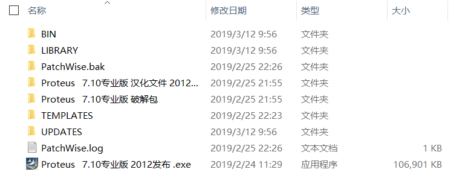  
2. 双击运行 `Proteus 7.10 专业版 2012发布.exe`，一路 **next**  
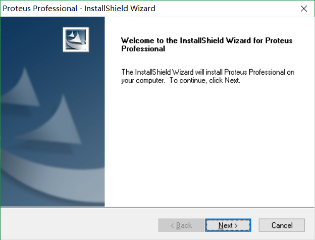  
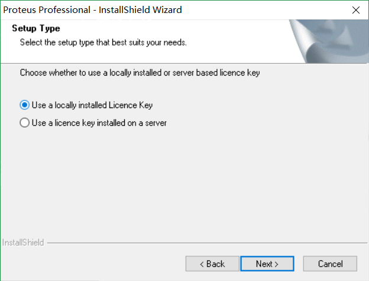  
3. 接下来可能进入到这个窗口，这时需要点击左下角的 `Browse For Key File`，找到刚才的 `proteus` 文件夹，进入 `Proteus 7.10专业版 破解包` 文件夹，选择 .lxk 后缀的文件  
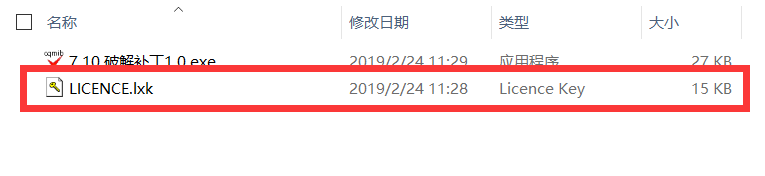  
4. 选择载入，并将 key 添加到右边框后 **close**  
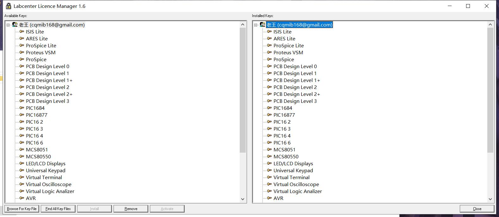  
5. 继续 **next**（别问我，我也不知道这个老王是个什么鬼  
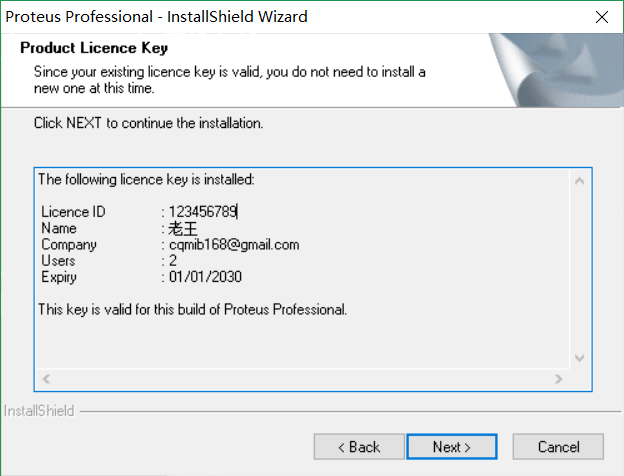  
6. 是否全部勾选无所谓，因为我也不知道23333  
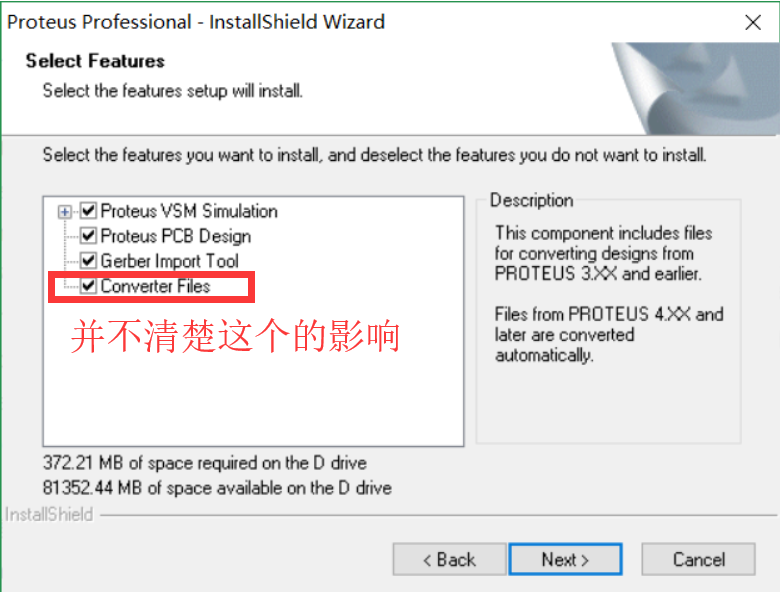  
7. 选择安装的路径  
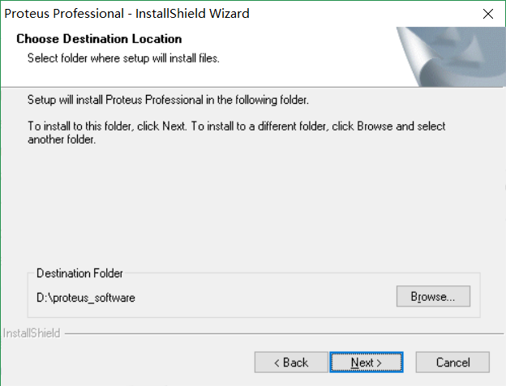  
8. 选择程序文件夹，不用管，默认就好（你就当没看到我那个 Apex英雄 吧23333  
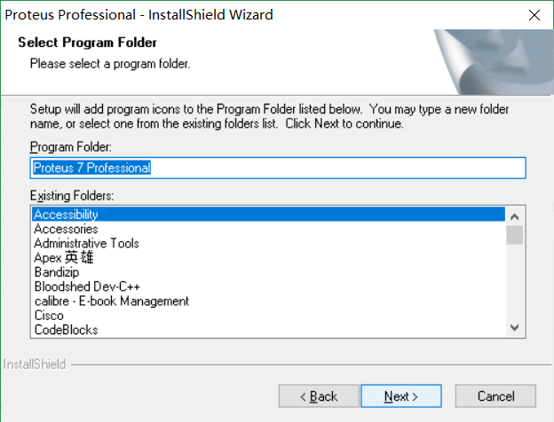  
9. 等待安装完成

> proteus 不会创建桌面快捷方式，因此你只能通过`开始菜单栏`或者将其**固定到`任务栏`**之后点击打开

## 3. 破解

1. 安装完成之后，尝试打开，发现失败  
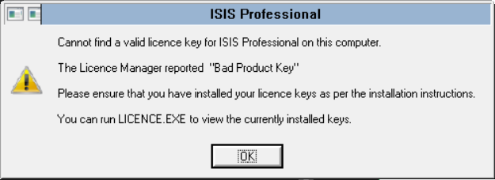  
2. 打开 `proteus` 文件夹下面的 `Proteus 7.10专业版 破解包` 文件夹，运行 `7.10 破解补丁1.0.exe` 程序，选择你安装 proteus 文件的那个文件夹，点击**升级**，等待完成后关闭即可  
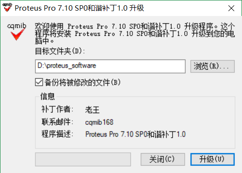  
3. 再次尝试打开 ISIS professional ，发现可以打开了  
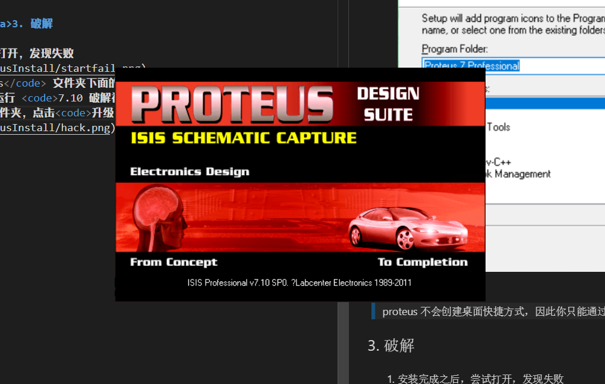

## 4. 语言补丁

1. 打开 ISIS professional 之后，发现全是英文，很难看懂  
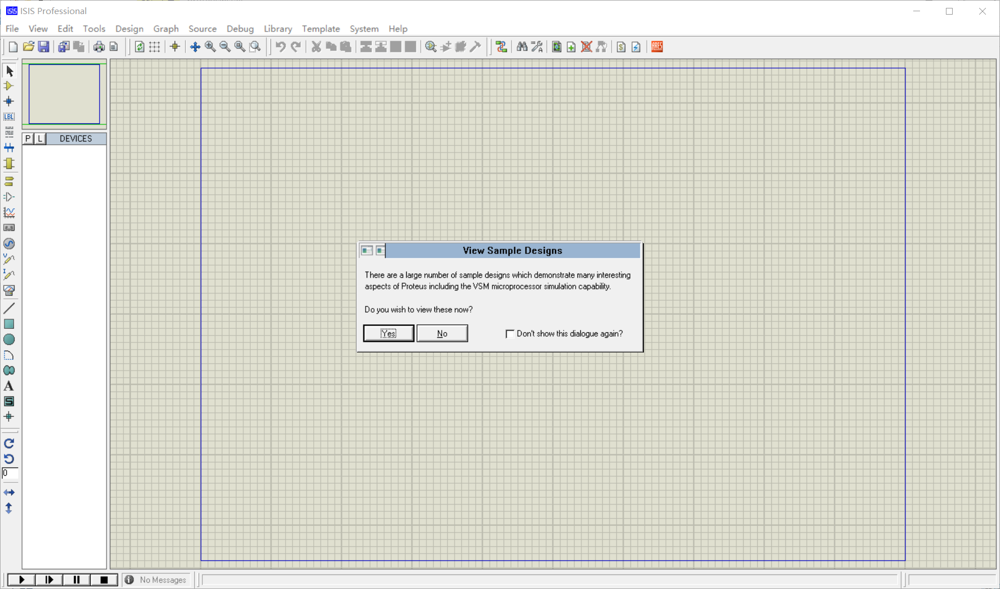  
2. 打开 `proteus` 文件夹，点开 `Proteus   7.10专业版 汉化文件 2012发布` 文件夹，再点开 `Proteus   7.10专业版 汉化文件` 文件夹，阅读 `Readme.txt`  
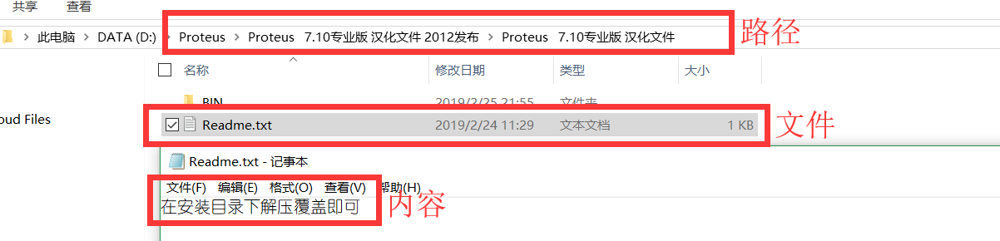  
3. 按照 `Readme.text` 文件的内容所说，将 `Bin` 文件夹直接**复制黏贴**到你安装 proteus 软件的文件夹里面，替换掉原有的 `Bin` 文件夹  
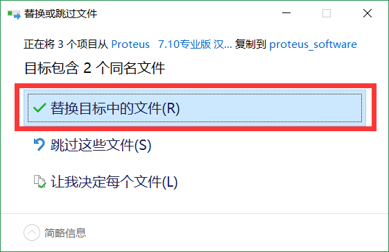  
4. 再次打开 ISIS professional，发现界面变成了中文  
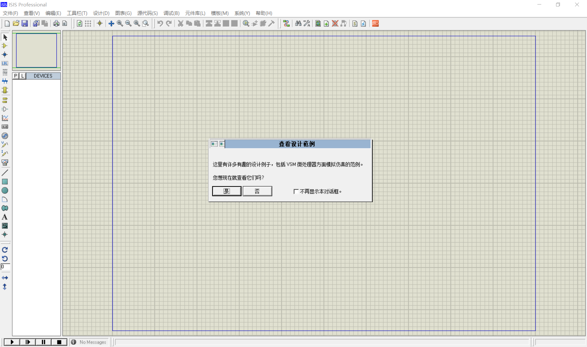

## 5. 常见问题

### 1. 仿真模拟时出现can not open "C...LISA3199.SDF

1. 这是**环境变量**的问题，需要对相关的环境变量进行修改  
2. 打开`控制面板`，`系统` > `高级系统设置` > `环境变量`  
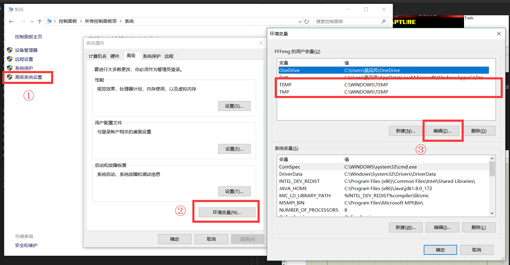  
3. 点击 `TEMP` / `TMP`，再点击**编辑**，分别将其修改为如下图所示  
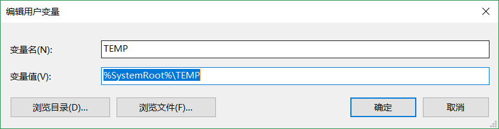  
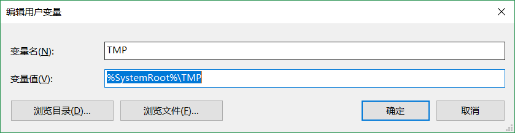  
4. 重启 ISIS professional 即可正常运行了