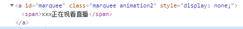
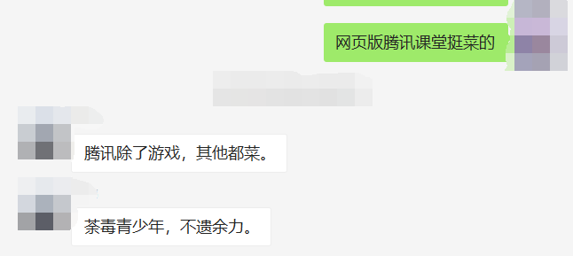

# 随性而记

> Q：这是一个什么样的板块？  
> A：无聊的时候开的一个板块，主要记录我遇到的一些有趣/奇葩的事情  。
>
> Q：这里面会有什么？  
> A：我可能会在这里写日记，但不会写在主版面（即000页面）；其余的趣闻什么的，大概会写在这里吧。

- [随性而记](#随性而记)
  - [2019.9.3](#201993)
  - [2019.9.2](#201992)
  - [2020](#2020)
    - [1](#1)
      - [15](#15)
      - [16](#16)
      - [20](#20)
    - [6](#6)
      - [18](#18)


## 2019.9.3

上周周二祭祖：

- 我：雀巢咖啡吨吨吨
- 老师：雀巢咖啡吨吨吨

这周周二祭祖：

- 我：魔爪吨吨吨
- 老师：红牛吨吨吨

都撑不住啊

---

本学期需要学习的语言：

- Haskell
- Java
- C艹
- MATLAB
- 汇编（MIPS精简指令集）
- verlog（Vivado）
- Web 相关: 
  - HTML
  - CSS
  - JavaScript

杀了我吧

## 2019.9.2

这是一个在《Astarial Chain》（译名“异星锁链”）中的谜题（是**逻辑判断说谎**的那种）：五个人之中只有`一个人`说实话

- $\color{red}{老大：老四说谎}$
- $\color{yellow}{老二：老五诚实}$
- $\color{green}{老三：老大老二没说谎}$
- $\color{blue}{老四：老三说谎}$
- $\color{purple}{老五：我和老三诚实}$

> 其实我只是在测试 *markdown* 对 `latex 语法公式`的支持

## 2020

### 1

#### 15

中美贸易协定第一阶段完成，相关协定签订

#### 16

两女性将车开进故宫，同时引出`叶剑英孙女太庙结婚`

#### 20

2020年1月20日14时许，市局110接报警，在朝阳医院门诊楼内一男子持菜刀伤人后逃离。朝阳分局民警在医院安保人员的配合下迅速将该男子(崔某,36岁)抓获。目前，三名受伤医护人员及一名受伤群众正在医院接受治疗，暂无生命危险。犯罪嫌疑人已被朝阳公安分局依法刑事拘留，案件正在进一步调查中。

---

北京朝阳医院一医生被患者家属砍伤。从朝阳医院一医生处获悉，被砍的是眼科主任医生陶勇，目前正手术室内接受救治。据医生称，事发后，伤人者已被控制，随后被警方押走。 ​

医院多名医生被砍伤，陶姓医生后脑勺胳膊被砍。资料显示，他是2015首都十大杰出青年医生，35岁，“80后”、年轻帅气、主任医师、硕士生导师、副教授、中国医师协会眼科分会葡萄膜炎与免疫专业委员会副主任委员。

他专长于葡萄膜炎和眼底疾病的诊治。2011年主持建立了国内唯一一家“眼免疫实验室”，为兄弟单位提供各类感染性和非感染性眼内炎症性疾病的眼内液检测服务近万份。

他在眼科SCI杂志发表论文55篇，中文核心期刊发表论文26篇，主持国际科研基金4项、国家级科研基金两项，省部级/市级科研基金两项，获国家专利3项。近5年来，他的科研工作主要集中在高分子材料在眼内的应用研发，先后获得霍英东教育基金会、青年863等项目支持，科研总经费超400万。

他是中华眼科学会眼科分会青年委员和眼免疫学组最年轻的委员，曾获北京市科技新星、教育部新世纪优秀人才等称号、获第二届医药卫生界“生命英雄”--“探索之星”奖，教育部科技进步一等奖。担任《中国糖尿病杂志》编委、《眼科学大查房》编委等。

他热心公益事业，先后三次参加由国家卫计委和香港健康快车慈善基金会联合举办的中华健康快车行动，为贫困患者实施免费白内障复明手术逾两千例。

陶医生曾说，“眼科手术就是个精细活，容不得有毫厘差错”

---

眼科四把刀”之首、“玻切女王”、中国现代玻璃体手术开拓者之一的黎晓新教授最得意的弟子，国内排名能进前五的眼科医生，就这么被砍了。

陶医生头部多处受伤，手掌肌腱及关键神经也受伤严重，目前正在接受手术。

---


---

> 后续：
> 
> 陶勇出院并且发声：不能执刀但会继续奉献

### 6

#### 18

今天发现了个 OBS 录播小技巧：

在 OBS 使用录制浏览器录制腾讯课堂时，可以通过设置自定义 CSS ，来将 `XXX 正在观看直播`的悬浮条屏蔽掉

通过 __F12__ 查看悬浮所在的元素 *id* 为 marquee



具体操作是在 `自定义 CSS` 中添加如下代码：

```css
/* marquee 是你想要屏蔽掉的 */
#marquee {
  display: none
}
```

之后刷新网页，就可以达到在 OBS 录制**腾讯课堂**的时候屏蔽掉悬浮条的效果了

> 无内鬼，来点腾讯课堂笑话
> 
> 