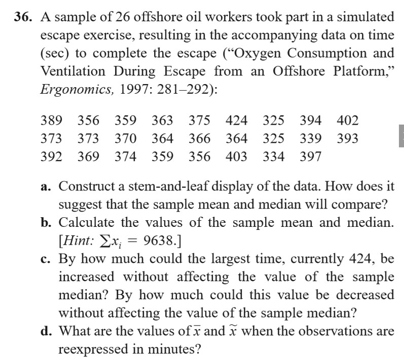
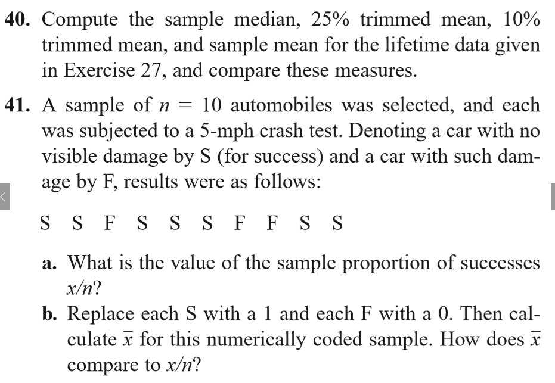
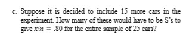

# Homework

> 这是一个记录作业的版面

## 内容

<!--
预定架构
```
|- 年份  
  |- 秋季学期  
  |- 春季学期  
    |- 第2周  
    |- 第1周  
      |- 周五  
      |- 周四  
      |- 周三  
      |- 周二  
      |- 周一  
        |- 科目一
        |- 科目二
```
-->

- [2019年](#2019年)
  - [秋季学期](#秋季学期)
    - [第二周](#第二周)
      - [周一](#周一)
        - [数值计算](#数值计算)
    - [第一周](#第一周)
      - [周三](#周三)
        - [概统](#概统)
      - [周二](#周二)
        - [Haskell](#haskell)

## 2019年

### 秋季学期

#### 第二周

##### 周一

> 日期：2019.9.2

###### 数值计算

|页码|题目|图片|
|:-:|:-:|:-:|
|P13|14||
|P37|1||
||3||
||9||

#### 第一周

> 日期：2019.8.26 ~ 9.1

##### 周三

###### 概统

|章节|题目|图片|
|:-:|:-:|:-:|
|1.2|14||
||19||
||23||
||27||
||||
|1.3|36||
||40||
||41||

##### 周二

###### Haskell

> 写在在**纸**上或**编辑器**上

|序号|题目|
|:-:|:-:|
|1|用你的语言解释什么是**程序**，什么是**数据**。|
|2|如果说程序是处理数据的，它有输入数据和输出数据，程序将输入数据转换为输出数据，请你举出**至少3个程序**的例子，并分别说明它们的**输入数据**和**输出数据**各是什么。|
