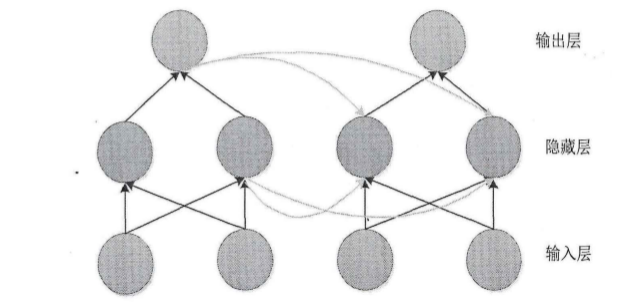
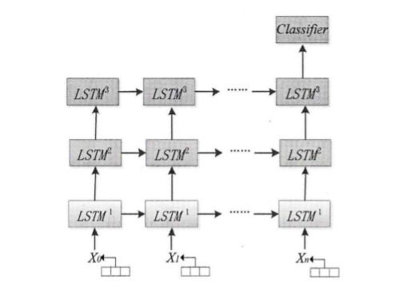
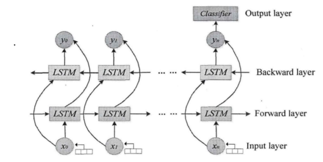
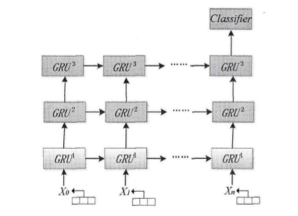
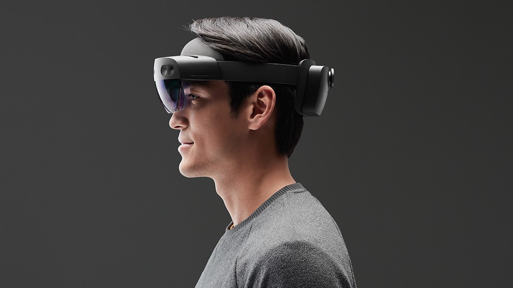
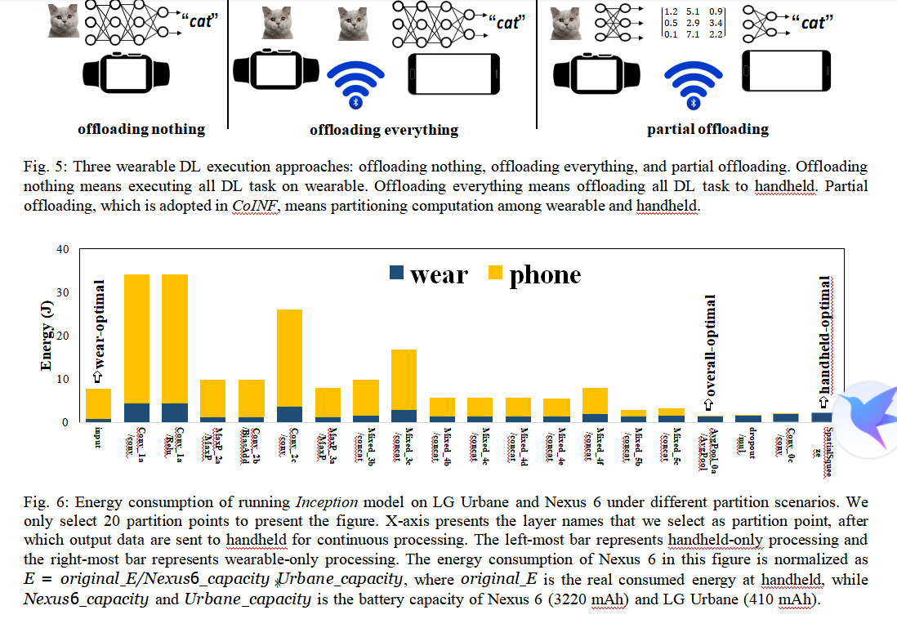
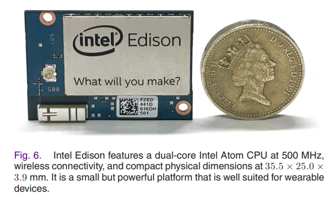

# 可穿戴设备上的深度学习

[TOC]

## 什么是深度学习

深度学习(Deep Learning)是机器学习(Mechine Learning)的一种。机器学习分为浅层学习(Shallow Learning)和深度学习。

传统的浅层学习算法
1. 支持向量机
2. 随机森林
3. 条件随机场
4. 神经网络
5. 决策树
6. 感知机

这些算法通常包含一到两层`非线性变换`，在面对复杂的场景问题，比如`语音处理`、`图像识别`，存在`表征能力`和`建模能力`不足的缺点。
即使在浅层学习中，神经网络作为一种灵活的算法，能够通过增加其网络层数来提高表征能力与建模能力，但随着层数的增加，会出现训练困难与过拟合的现象。

深度学习的基本思路，是通过参照人类大脑的神经连接，建立起一个由`多层非线性运算单元`组成的类似的网络结构，往往将较低等级单元的输出作为更高层次单元的输入，通过多个变换阶段分层的方式，对数据特征进行提取与描述，最终得出并表示数据的本质。相比于渐层学习，深度学习的模型有着更多的`非线性操作`的层数，能够通过逐层变换原始数据，实现其从原始数据空间到新特征空间的变换，从而自动学习数据的层次化特征。

感知机带动了神经网络的第一个高潮，但是由于其只能够解决`线性可分问题`，对于`非线性问题`与`抑或问题`并没有有效的解决方法。
第一个成功实现的卷积神经网络(CNN)是在1980年由`Fukushima`提出的基于`感受野`的层次结构神经网络模型`Neocognitron`。

`反向传播算法(BP)`是著名的机器学习算法之一，它在1986年被提出，是一种`非线性连续变换函数的多层感知器的网络参数训练方法`。
反向传播算法通过增加神经网络的隐藏层，能够建立更加复杂的数学模型，并且实现对自身网络参数的更新，但由于参数的更新，会出现新的问题，比如求解`非凸的目标损失函数`容易陷入`局部最优`而难以得到全局最优，同时，残差值在反向传播的过程中会出现`梯度弥散`，最终使得靠近输入层的网络参数无法得到有效训练，从而失去了多层数的优势。

## 常用的深度学习方法

1. 限制玻尔兹曼机(RBM)
   1. 深度信念网络(DBN)
   2. 深度玻尔兹曼机(DBM)
2. 深度自编码器(Deep Autoencoder)
3. 稀疏编码(Sparse Coding)
4. 卷积神经网络(CNN)
5. 递归神经网络(RNN)
   1. 长短期时间记忆网络(Long Sort Term Memory)
   2. 双向长短期时间记忆网络(Bidirectional Long Sort Term Memory)
   3. 门控循环单元(GRU)

### 卷积神经网络(CNN)

组成
* 卷积层：对数据进行卷积操作
* 全连通层：顶端
* 线性整流层：在不改变卷积的基础上对神经网络的非线性特性进行增强
* 池化层：压缩数据，降低过拟合的概率
* 损失函数层：在训练过程中用于“惩罚”预测和实际的差异

> 比较著名的模型有AlexNet和Google的GoogleNet

### 递归神经网络(RNN)

递归神经网络(RNN)自带反馈结构，输出与`当前输入`、`网络权重`、`之前的输入`相关。该神经网络是三层架构，包含`输入层`，`隐藏层`和`输出层`。

### 长短期时间记忆(LSTM)

该网络可以记忆长时间的上下文信息，是和对时间序列进行建模。

对于一个以时间为序列基础的数据样本，每个时间步为一个输入向量。

在LSTM网络中，每个节点都存在有记忆能力的储存单元，这些储存单元能够储存`之前时刻`的输入信息，并且存在一个隐藏的状态用于表示之前输入对当前输出中的影响/权重，即LSTM节点的输出不仅收到当前输入的影响，也与之前时刻的每一个输入有密切关系。在这些节点中，存在着两种`控制信息流动`的开关——输入门与遗忘门，输入门决定节点需要学习记忆的信息，遗忘门则决定节点需要遗忘删除的信息。

> 这是一个3层的LSTM模型，层与层之间使用`单向连接`，每个输入的`向量维度`为3，`时间步长`为128，即包含128个向量

### 双向长短期记忆网络(BLSTM)

每一个训练序列都有向前和向后`两个循环神经网络`(LSTM)，而这两个都连接着一个`输出层`。这样的结构能够提供完整地保存长时间内的上下文信息，并将这些信息传递到下一输出层。

> 该模型只含有一层`双向递归层`，即一个前向LSTM和后向LSTM，每个输入向量维度为3，时间步长128。

### 门控循环单元(GRU)

GRU可以看做是LSTM的一种变体，用于解决RNN因为时间过长而出现的`梯度消失`问题。

> 输入向量维度3，时间步长128。

## 深度学习在可穿戴设备上的应用

### 常见的应用方向

通常来说，可穿戴设备可以用来监测人的`行为模式`与`身体状况`，通过深度学习，能够迅速对其的变化做出个性化反应，从而可以应用在如下几个方面
1. 人机交互：目前主流的人机交互依赖于按键与鼠标等外部设备。但由于各种场景的存在，脱离外设，采用手势/动作/语音等方式来进行人机交互的需求在逐渐扩大。通过摆脱主流的硬件限制，能够更加大幅度解放生产力。微软的hololens与当今的VR(虚拟现实设备)便是在这些需求上进行开发的设备。

1. 身体行为检测：可穿戴设备（智能手环与手表等）相较于传统信息收集设备，有着`低能耗`、`便携`、`抗干扰能力强`、`获取数据方便快捷`等优点；和手机相比，智能可穿戴设备符合人体工学，特化搭载专门的传感器，从而收集到

### 三种在可穿戴设备上的深度学习框架类型

> 这三种类型基于CoINF的结构

1. 全部在可穿戴设备上实现
   * 优点：不依赖其他设备便可以完成任务
   * 缺点：对该可穿戴设备的性能要求高，需要设备能够承受住深度学习的框架，同时还要考虑能耗续航问题
2. 全部卸载(offloading)到云端/移动端
   * 优点：可穿戴设备性能无要求，只需要采集数据即可
   * 缺点：需要外部设备来进行计算，同时对网络有要求
3. 部分在可穿戴设备，部分在云端/移动端 
   * 优点：能利用上可穿戴设备的性能，同时减轻外部计算设备的负担
   * 缺点：需要合理的架构，同时信息传输也有一定的性能要求

### 总结

现在大多的深度学习框架，都含有大量的非线性变换，对于算力有着较高的要求，较大型的工程甚至只能上传到云端，使用更加高性能的计算机或者集群进行运算。
可穿戴设备的由于本身大小的局限，算力很难达到要求，在其本身上难以实现较为复杂的深度学习，因此如今常偏向于使用`可穿戴设备+其他端`作为主流架构。

随着计算机技术的发展，可穿戴设备能够达到的算力越来越强，如今移动端如手机也能够实现大型计算机的某些功能，即使可穿戴设备无法达到大型计算机或者个人计算机的层次，也能够在将来实现一些简单的深度学习的能力。

## 参考资料

1. **基于深度学习与可穿戴传感器的人体行为识别** 匡晓华 *https://kns.cnki.net/KCMS/detail/detail.aspx?dbcode=CMFD&dbname=CMFD201901&filename=1018130494.nh&uid=WEEvREcwSlJHSldRa1FhcEE0QVN2K0s2K084T2JEb05QQ01rR3ZmNjl1ND0=$9A4hF_YAuvQ5obgVAqNKPCYcEjKensW4IQMovwHtwkF4VYPoHbKxJw!!&v=MjUyMDl0WEZxNUViUElSOGVYMUx1eFlTN0RoMVQzcVRyV00xRnJDVVJMT2VaZWRxRkNqbFZiL0FWRjI2RnJLN0g=*
2. **Enabling Cooperative Inference of Deep Learning on Wearables and Smartphones** Mengwei Xu, Feng Qian, and Saumay Pushp *https://arxiv.org/pdf/1712.03073.pdf*
3. **Wiki: Convolutional neural network** *https://en.wikipedia.org/wiki/Convolutional_neural_network*
4. **A Deep Learning Approach to on-Node Sensor Data Analytics for Mobile or Wearable Devices** Daniele Rav`ı, Charence Wong, Benny Lo, and Guang-Zhong Yang, Fellow, IEEE *https://ieeexplore.ieee.org/stamp/stamp.jsp?tp=&arnumber=7797232*