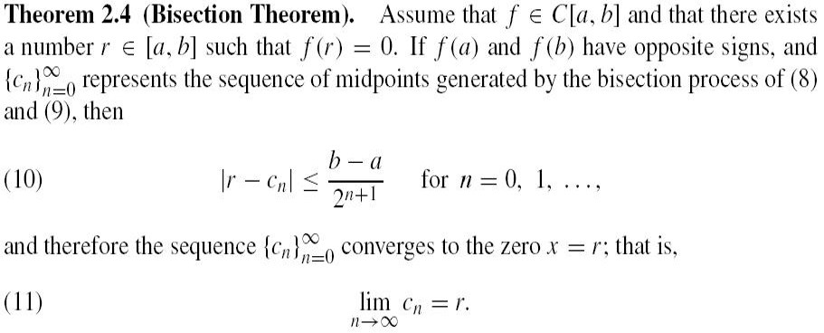
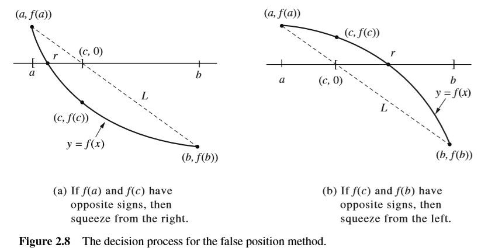
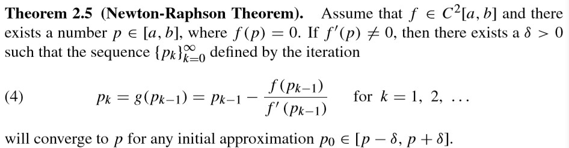
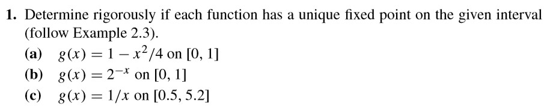
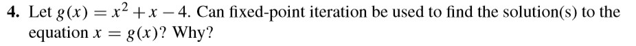
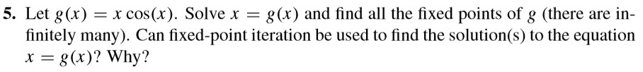

# 2019.9.4

MATLAB 使用 help 获取帮助
```matlab
help eps
```

## Chapter 2 Numerical Methods

牛顿法还可以用于解 Frechet 导数

### 不动点迭代

不动点迭代求解 $x_{i+1} = g(x_i) = 4 \frac{\text{sin}(x_i)}{x_i}$ 函数

```matlab
x = randm(1, 1)
x = 4 * sin(x) / x
```


- 收敛 $0 < \left| g'(P) \right| < 1$
  - 单调收敛 $0 < g'(P) < 1$
  - 震荡收敛 $-1 < g'(P) < 0$
- 发散 $\left| g'(P) \right| > 1$
  - 单调发散 $1 < g'(P)$
  - 震荡发散 $-1 > g'(P)$

### 二分法

要求：需要**相交**的情况，即根两端有变号 $f(a) * f(b) < 0$ ，**相切**无法使用二分法



更优的端点选择  


### Newton-Raphson Method 牛顿迭代法

- 牛顿法：切线法
- 割线法

$$
p_{n+1} = p_n - \frac{f(p_n)}{f'(p_n)}
$$

  
$k$是迭代索引

> Corollary 推论

## 作业

> 选做四道题

P50 - 1, 4, 5  
P61 - 4, 9, 11

| 页码  | 题目  |       图片        |
| :---: | :---: | :---------------: |
|  P50  |   1   |  |
|       |   4   |  |
|       |   5   |  |