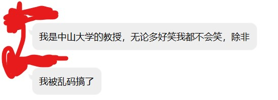

# 2019.8.28

> 水军的课前一水：
> 1. 车管所奇遇记：水军违反交通法，时速80开到了90，拐弯时限速变成了60，扣12分和驾照，重新学习。网上学习，注册帐号 BD007（邦德007），验证码 SNBB 不行。神奇的报错（乱码报错太草了），还要重新学习。  
>   
> 2. 经典之一：10多年前（我自己）开发的软件，你们还在用，说明开发的很好，微软能做到么.jpg  

[//]: # (还有个钓鱼之家钓友交流群，绝了)

> 要有工程文件，不要一个文件打天下

额外参考书：
* 严蔚敏、吴伟民，数据结构-C语言版，清华大学出版社，1997-2006
* 齐德昱，数据结构与算法，清华大学出版社，2003

## 数据

什么是数据：数值、字符、声音、图片、影像等。  
编码形式：10、2、8、16。  
数值：整数，浮点数  
编码：
* ASCII
* EBCDIC
声音：WAV, MIDI, CDA (CD), MP3 (MP4), WMA, DOC, AU等。  
图片：BMP, JPG, GIF, PNG, WMF, TIF, PIC等。  
影像：AVI, RM, RMVB, ASF, MOV, MPEG, DV, DivX等。  

> **数据是数据，结构是结构**  
> “Algorithms + Data Structures = Programs” - Niklaus Wirth
> 其中算法为主，数据结构为辅

> Date Structures + Algorithms = Programs - Xiangjun Wu (2006)

> 两者不冲突，出发点不同：
> * 前者强调算法，在现有解决问题方法的基础上，通过适当的数据组织形式来储存数据，然后用一种语言来实现  
> * 后者强调在一个数据结构的基础上进行算法设计，对于同样的问题，不同的数据结构会设计出不同的算法，最终编写出不同的程序
> * 这门课注重的是“数据结构”本身，而不是其应用

## 内容

1. 程序设计的基本原则（略讲）
2. Introduction of Stacks（堆栈，简单但是非常重要，是后面的基础）
3. Queues
4. Linked Stacks and Queues（链式栈与链式队列，前者用数组，后者用链表）
5. Recursion（递归）
6. Lists and Strings
7. Searching（搜索）
8. Sorting
9. Table and Information Retrieval（表与信息检索）
10. Binary Trees
11. Multiway Trees
12. Graphs
13. Case Study: The Polish Notation（非重点）

## Chapter 1 Programming Principles

### Problems of Large Program

1. Patchwork approach
2. Problem specification
3. Problem organization
4. Data structures and organization
5. Algorithms selection and analysis
6. Debugging（要学会并且善用 debug 工具）
7. Testing and verification
8. Maintenance
9. Highlights of C++
> Data abstraction

### Programming Precept

* Be sure you understand your problem completely
* If you must changes, explain excatly what you have done
* Design the user interface with the greatest care possible
* A program's success depends greatly on its attractiveness and ease of use
* Do not optimizd your code unless it is necessary to do so
* Do not optimizd your code until it is complete and correct
* Most program spend 90% of their time doing 10% of their instruction
> 题外话：玩游戏要有度，适当的时候做适当的事  

[//]: # (我强烈怀疑水军自己也是玩家)