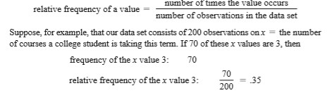
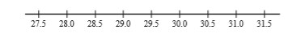
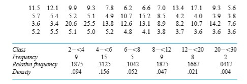
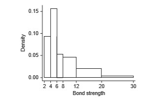

# 2019.8.28

前情回顾

- 作业：
    - 形式：交**纸**
    - 时间：上课交，**两周**收一次
    - 量：不会太多

[//]: # (老师说他自己大学的时候能够熬夜到5、6点，7、8点起来之后继续去上学)
[//]: # (老师：如果身体不行的话，推荐你考个研，然后去找个事业单位的工作（比如说公务员）；精力不够，学历来凑)

- 描述性的数据：
    - 茎叶图 *stem-and-leaf displays*
    - 克兰夫点图 *dotplots*

> 点图存在理论缺陷：  
>    - 无法特别精确地定位到位置/点精度过高时无法在轴上放点
>    - 但是现实生活中获取到的数据是有精度截取的

## Dotplots

The data set is reasonably small or there are relatively few *distinct* data values. 

## 直方图 *Histogram*

变量类型：  
- Discrete (离散) Variable: either is **finite** or else can be **listed in an infinite sequence** (有限个/无限序列可列中）
- Continuous Variable: Consisit of **an entire interval** on the number line. （数轴上的一个区间，不可列）

相对频率 = 特定值的数量 / 观测值的数量  

> 计算相对频率时，由于四舍五入，最终总频率**可能不为1**（可能超过也可能少于）
> - 离散情况下可以直接算出频率
> - 连续情况下需要寻找/划分一个**合理的区间**  
>   
> > - 区间划分常规在`5 ~ 20`类或者`根号x`类
> > - 部分数据分布不平均（某些比较集中，某些不叫稀疏）的情况下，采用**非等长**的分隔（可变区间长度）
> > - 直方图`长 * 宽`能够得到相对频率  
> >    

[//]: # (老师：我在中大读大一的时候，体育分别选了：篮球、足球、棒球；棒球选了一年，分数还很低。。。)
[//]: # (老师口癖：会在说完话之后加个“对”)

