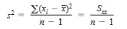
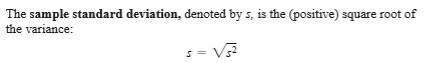

# 2019.9.1

> 新生开学了
>
> - 吃饭要抓紧了
> - 晚上没法去操场跑步了

我们知晓**整体**的存在，但**整体（Population）**不可知，我们只能拿到**样本（Sample）**

人工智能的**测试集**与**样本集**的效果不同

## The Mean

[//]: # (算是上节课的复习)

- Sample Mean：**线性**的
  - 能够反映出现的最多的量
- Sample Median：能够反映**分布**
- 可以通过两者推断出分布：
  - 正倾斜 $\hat{x} < \overline{x}$
  - 负倾斜 $\hat{x} > \overline{x}$
  - 对称分布 $\hat{x} = \overline{x}$

[//]: # (为什么不用三等分？因为对半分好分)
[//]: # (为什么考虑异常点？数据源于实际，采集数据的时候会出现问题)

对于100个样本数据，修正25%可以：

- 前面12个数据 + 后面13个数据 `25%`
- 前面13个数据 + 后面12个数据 `25%`
- 前后各12个数据 `24%`
- 前后各13个数据 `24%`

## 样本方差 Sample Variance

定义 $s^2 = \frac{\sum (x_i - \overline{x})}{n - 1} = \frac{S_{xx}}{n - 1}$  
<!---->

## 标准差 Sample Standard Deviation

定义 $s = \sqrt{s^2}$  
<!---->

> Q1：为什么选择`平方`而不是`绝对值`？  
> Q2：为什么选择 n - 1 而不是 n？
>
> A2：因为有时候选择 n - 1 能够更加符合总体方差

## 总体方差 Population Variance

$\sigma ^{2} = \sum_{i = 1}^N (x_{i} - \mu)^{2} / N$

另一种表示方法：$s^2 = \frac{\sum (x_i - \overline{x})}{n-1} = \frac{S_{xx}}{n-1}$

可以通过这个公式推导出一种更**方便计算**的公式：$S_{xx} = \sum(x_i - \overline{x})^2 = \sum x{_i}{^2} - \frac{(\sum x_i)^2}{n}$

## Boxplots 相图（近些年发明）

特点：可以描述

- *Center*
- *Spread*
- the *extent* and *nature of an departure form symmetry*
- identification of "*Outliers*"

> Fourth  
> $$f_x = upper fourth - lower fourth \text{， 上 1/4 的数据 - 下 1/4 的数据}$$
