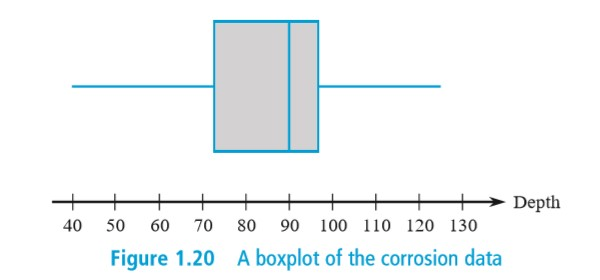

# 2019.9.4

课程公共邮箱

> 邮箱：sysu_19_ptms  
> 密码：

> 统计量：统计的**变量**

[\\]: # (我国数学传承自苏联，普遍描述概念，再告诉你怎么做；西方是先告诉你怎么做，在告诉你为什么)

## 方差

补充：线性规律

1. If $y_1 = x_1 +c, y_2 = x_2 + c, \cdot, y_n = x_n + c$, then $s_y^2 = s_x^2$
2. If $y_1 = cx_1, \cdot, y_n = cx_n$, then $s_y^2 = c^2s_x^2, s_y = |c|s_x$

## Boxplot

- *Center*
- *Spread*
- the *extent* and *nature of an departure form symmetry*
- identification of "*Outliers*" 即**异常点**
