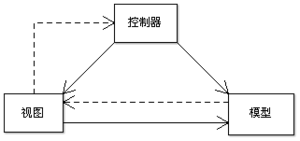
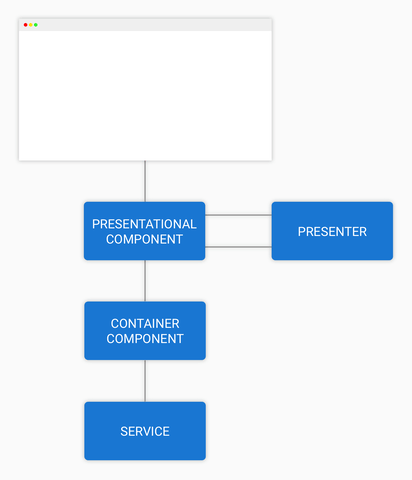

# Web 入门基础

## 内容

* 前言
* Web 三件套： HTML，CSS，JavaScript
  * HTML
  * CSS
  * JS
* 框架介绍：Angular
* 设计/架构模式：MVC，MVP，DDD
  * MVC
  * MVP
  * DDD
* 参考资料

## 前言

web 技术现在已经遍布我们身边的方方面面，无论是移动端还是PC端，我们总在和 web 打交道，从最简单的展示页面（比如说老式的博客），到逐渐被抛弃的页游（比如说赛尔号和奥比岛，时代的眼泪啊），再到现在琳琅满目的 APP （比如说现在的 Matrix，甚至我们现在用来打代码的 VSCode），这些都是 web 技术的体现。

学习 web 需要了解：

1. 文本标记语言，HTML
2. 样式表语言，比如 CSS，Less，Stylus
3. 唯一指定动态编程语言，JavaScript

其中，`文本标记语言`负责表述页面的结构，`样式表语言`负责整个页面的装饰效果，而 `JavaScript` ，则控制着整个页面的行为与交互

我们可以发现，想要学习 Web ，相比与 C 和 C++ 等编程语言，我们需要学习的东西有很多，但是，和初学编程语言时只能碰到黑乎乎的命令行窗口不同，Web 倒是一种“最容易”让你的代码脱离命令行窗口的方式了。

不过在此之前，我们还需要了解一下 Web 是如何运作的，请看下面这张图：


简单来讲，Web 的运作方法就是：
* 你（客户端）向 服务器 提交请求（例如 Http Request）
* 服务器解析请求，并返回对应的响应（例如 Http Response）
* 客户端解析文件，并向用户展示解析结果（表现形式可以是网页/动画等）
* ......（循环上面三个步骤）

## Web 基础三件套

### HTML（超文本标记语言）


#### 1. HTML 是什么

超文本标记语言 (英语：Hypertext Markup Language，简称：HTML ) 是一种用来结构化 Web 网页及其内容的标记语言。网页内容可以是：一组段落、一个重点信息列表、也可以含有图片和数据表。

HTML 由一系列的元素（elements）组成，这些元素可以用来包围不同部分的内容，使其以某种方式呈现或者工作。 一对标签（ tags）可以为一段文字或者一张图片添加超链接，将文字设置为斜体，改变字号，等等。

如果你学过 markdown ，那么了解对 HTML 的那一套模式也不太难

#### 2. HTML 元素（Element）

一般来讲，一个元素的结构如下图：


元素中还可以携带属性，我们一般在开始标签中插入属性，具体如下图：

.png)

HTML 的元素有很多，在此不一一说明，我们常用一些的有：

```HTML
<!-- 1. 包含整个页面内容 -->
<html></html>

<!-- 2. 该元素的内容不是直接展示给用户，这里我们可以引入 CSS 文件 -->
<head></head>

<!-- 3. 该元素的内容包含期望让用户访问页面是看到的内容 -->
<body>整个页面的内容</body>

<!-- 4. 表示段落 -->
<p>这是一个段落</p>

<!-- 5. 一个块级元素 -->
<div>一个块级元素</div>

<!-- 6. 一个行内元素 -->
<span>一个行内元素</span>

<!-- 7. 插入一个js文件 -->
<script>
    // 这里面是 JavaScript 代码
</script>

<!-- 一个完整的 HTML 文档结构 -->
<!DOCTYPE html>
<html>
  <head>
    <meta charset="utf-8">
    <title>测试页面</title>
  </head>
  <body>
    测试内容
    
  </body>
</html>
```

HTML 中除了嵌入文本之外，还能够嵌入图片，音频/视频等，没有你想不到，只有你做不到。

### CSS（层叠样式表）


#### CSS 是什么

层叠样式表（Cascading Style Sheet，简称：CSS）是为网页添加样式的代码。

人们可以用它来选择性地为 HTML 元素添加样式。

#### CSS 怎么用


选择器不仅可以通过 HTML 元素的名字来选择对应的元素，还可以通过这个 HTML 元素的 class / id 来进行选择，还可以选择这个元素的第几个子元素，从而实现更加自定义的样式控制，例子如下

```HTML
<!DOCTYPE html>
<html>
  <head>
    <meta charset="utf-8">
    <title>测试页面</title>
  </head>
  <body>
    <P class="test1">这是测试段落</p>
    <p id="test2">
        测试段落2
        <span>测试子元素</span>
        <span>测试子元素2</span>
    </p>
  </body>
</html>
```

```CSS
/* 选中 class 为 test1 的段落 */
.test1 {
    color: red;
}

/* 选中 id 为 test2 的段落 */
#test2 {
    color: yellow;
}

/* 选中所有的 span */
span {
    color: green;
}

/* 选中 id 为 test2 的段落中的第二个子元素 */
#test2:nth-child(2) {
    color: grey
}
```

需要注意的是，如果需要上述 CSS 的效果，

CSS 还能制作出许多特效，比如说按钮的动态交互效果，以及其他动画效果，比如说走马灯，在此不一一赘述，有兴趣的同学可以去我列出的参考资料里面的 mdn 网站去学习

### JavaScript


JavaScript 是一门完备的`动态编程语言`，当应用于 HTML 文档时，可为网站提供动态交互特性。（例如：游戏、动态样式，动画，以及在按下按钮或收到表单数据时做出的响应，等）。

> 这里为什么要注明是应用于 HTML 文档呢，因为 JS 存在很多的版本，其中有个叫做 Node.js ，这个版本 JS 是可以拿来写后端和服务器的。而且 JS 还有很多其他的用法。
> 
> 

开发者们基于 JavaScript 核心编写了大量实用工具，可以使 开发工作事半功倍。其中包括：
* 浏览器应用程序接口，可以用来动态创建 HTML 和修改 CSS 样式，生成图像和音频等。
* 第三方 API ，让开发者可以在自己的网站中使用其他开发者提供的功能。
* 第三方库，用来构建网站和应用

#### JS 的学习

JS 是一门动态编程语言，和静态编程语言的 C 和 C++ 不同的是，JS 不需要通过编译器进行编译，来生成可执行文件，而是能够直接在环境中直接执行，或者说，一行一行的执行，在哪里出现错误就在哪里停下来。如果你学过 python 的话，对这个概念应该会比较了解。

如果你想尝试一下简单的 JS 代码，可以直接在浏览器按`F12`打开开发者工具，在控制台（console）输入即可，非常方便。

JS 常见的数据类型有：
* 字符串 String
* 数字 Number
* 布尔值 Boolean
* 数组 Array
* 对象 Object

JS 的语法大致可以照搬 C 的，但是格式要求可能没那么严格，比如说每行后面加不加分号，当然，我个人建议还是加上的；并且， JS 的变量并没有要求声明数据类型，这点和 Python 很相似，因此数据类型的坑近乎人人初学的时候都踩过。下面列出了一些常见的 JS 语句：

```JavaScript
var a = 1; // 声明变量
let b = 2; // 也是声明变量，不过个人更喜欢用这个，因为 var 似乎存在的作用域问题
c = 1; // 这样也同样是可以的，但是作用域会变成全局，很多人踩过这个坑

// 选择语句
if (a) {
    a++;
}
else if (b === c) { // 为什么是 === 呢？
    console.log(c--); // 在 JS 中我们更常用这个 print() 相关的信息
}

// 循环语句
while(a == b) {
    a--;
}

// 获取到在 HTML 文档中 id 为 marguee 的 HTML 元素对象
document.getElementById('marquee'); 
// 获取在 HTML 文档中 class 为 marquee 的 HTML 元素，返回一个数组
document.getElementByClassName('marquee'); 
```

我们可以看到，这个例子的后面几行，展示了通过 JS 动态控制 HTML 和 CSS 的可能性，而在现实中，我们常常也这么干，`document,getElementById()`是原生 JS 的写法，写起来还是比较麻烦的，这就存在 jQuery 这种现成的库帮助简化操作。

原生 JS 的库不少，而社区上则有更多完善的轮子，这些来自世界各地的开发者们编写的轮子能够方便你实现想要的功能，想要获取这些现成的库，需要使用`包管理器`，比较常见的有 `npm` 和 `yarn` ，matrix 的开发使用的就是 yarn。


> 我们可以通过 `<script></script>` 标签在 HTML 中引入 JS 文件，但是一般都放在 `<body></body>` 元素的最后，这是因为：由于浏览器动态加载的原因，如果我们在 `<head></head>` 标签中引入的话，在这个这个标签中的内容没有下载完成的情况下， `<body></body>` 的内容没法完全展示给用户看，当 JS 文件又大有多的时候，这个网页的空白时间就会非常的常，十分的 `user-unfriendly`

#### 关于 Node.js

前面我们说到，Node.js 可以拿来写后端，事实上，大多数 web 开发者，都选择在使用 Node.js 搭建的简易服务器环境下，模拟网络的环境，从而在本地电脑上进行调试的。

对于简单的网页，我们只需要编写 .js 文件，让 node.js 运行这个文件即可，下面是一个简单的例子：
```JS
let http = require("http");
let url = require("url");
let fs = require("fs");

http.createServer(async (request, response) => {
    if (request.url == "/") { // 主页
        fs.readFile("./index.html", "utf-8", (err, html) => {
            response.writeHead(200, {"Content-Type" : "text/html"});
            response.end(html);
        });    
    }
}).listen(8000); // 设置监听端口为 8000
```

使用 node 运行这个当服务器启动后，会一直监听这个端口，得到请求后进行解析，最终返回合适的数据，是不是和之前说的 web 运作原理很一模一样。

## Angular 框架

根据是上面的知识，我们了解到，如果我们需要完成一个网站的搭建，我们至少需要
* 一个用于搭建服务器的 JS 文件
* 一个用于显示主页的 HTML 文档
* 若干控制页面交互的 JS 文件（可选）
* 一个控制页面样式的 CSS 文件（可选）

一个两个这样的页面可能还好，但对于数量越来越多，种类越来越多的网站，比如说 matrix ，每次都要写这么多的文件，岂不是很繁琐与劳累，而且用于创建服务器的文件因为路径的问题越来越复杂，这是完全不符合现在软件工程的工程化、模块化、流水线思想不相符。

因此，为了节省大家的时间，也为了满足集体开发的需要， web 开发框架便出现了，这里介绍一种，Angular


### Angular 是什么

Angular 是一个用 HTML 和 TypeScript 构建客户端应用的设计框架与开发平台，用于创建高效、复杂、精致的单页面应用。

它可以用于开发企业级页面应用，我们的 matrix 就是基于 Angular 开发的。

### Augular 使用

在学习 Angular 之前，你需要有下面这些基础

* 前面学习的 Web 基础三件套
* TypeScript (TS) ，这是一门与 JS 密切相关的语言，甚至可以说， TS 是 JS 加上类型的版本，甚至可以这么说，把 JS 代码表上类型，就可以是一段“合法”的 TS 代码了， TS 的强制要求声明数据类型可以帮助我们避免因为 JS 变量数据类型的不可控引起的错误。并且，Angular 本身就是使用 TS 来编写的。

### Angular 架构


#### 模块

Angular 的基本构造块是`模块`，它为`组件`提供了编译的上下文环境。模块会把相关的代码收集到一些功能集中。Angular 应用就是由一组模块定义出的。 应用至少会有一个用于引导应用的`根模块`，通常还会有很多`特性模块`。

模块可以将其组件和一组相关代码（如服务）关联起来，形成功能单元

像 JavaScript 模块一样，模块也可以从其它模块中导入功能，并允许导出它们自己的功能供其它模块使用。 比如，要在你的应用中使用路由器（Router）服务，就要导入 Router 这个 NgModule。

#### 组件

每个 Angular 应用都至少有一个`组件`，也就是`根组件`，它会把组件树和页面中的 DOM 连接起来。 每个组件都会定义一个类，其中包含应用的数据和逻辑，并与一个 HTML 模板相关联，该模板定义了一个供目标环境下显示的视图。

比如说，一个登陆的页面可以是一个模块，一个题目的显示界面也可以是一个模块

<!-- 演示 matrix -->

* 组件定义视图。视图是一组可见的屏幕元素，Angular 可以根据你的程序逻辑和数据来选择和修改它们。 每个应用都至少有一个根组件。
* 组件使用服务。服务会提供那些与视图不直接相关的功能。服务提供者可以作为依赖被注入到组件中， 这能让你的代码更加模块化、更加可复用、更加高效。

##### 模板，指令和数据绑定

在创建 Angular 组件的时候，默认每个组件都会有一个 HTML 文件，这就`模板`。模板会把 HTML 和 Angular 的标记（markup）组合起来，这些标记可以在 HTML 元素显示出来之前修改它们。模板中的`指令`会提供`程序逻辑`，而绑定标记会把你应用中的数据和 DOM 连接在一起。 有两种类型的数据绑定：

* `事件绑定`让你的应用可以通过更新应用的数据来响应目标环境下的用户输入。
* `属性绑定`让你将从应用数据中计算出来的值插入到 HTML 中。

绑定可以单向也可以双向，也就是说，模板既可以接受外来的数据，也可以将这个数据传出，从而对组件状态造成影响

### 服务与依赖注入

对于与特定视图无关并希望跨组件共享的数据或逻辑，可以创建`服务`类来实现。

比如说，我在选课系统中需要从后台获取我个人的选课列表，这个获取的动作就是由服务来完成的，当然，在组件中也可以实现，但是为了尽可能的满足软件工程中的`代码可复用`与`模块化`，我们更推荐将这些功能放在服务中来实现。

而依赖注入（或 DI）让你可以保持组件类的精简和高效。有了 DI，组件就不用从服务器获取数据、验证用户输入或直接把日志写到控制台，而是会把这些任务委托给服务。

### 路由

在前面的简单服务器中，我们创建的服务器是用过解析你发出的请求的 url 来返回对应的文件，在 Angular 中，这个导航的功能交给了路由来做。

Angular 的 Router 模块提供了一个服务，它可以让你定义在应用的各个不同状态和视图层次结构之间导航时要使用的路径。

了解了这些概念之后，你对 Angular 的架构已经基本熟悉，剩下的便是去掌握这些概念实体的各种各样的用法了。

## 设计模式

### MVC

MVC模式（Model–view–controller）是软件工程中的一种软件架构模式，把软件系统分为三个基本部分：模型（Model）、视图（View）和控制器（Controller）。



这三个部分各自的功能分别是
* 控制器（Controller）- 负责转发请求，对请求进行处理。
* 视图（View） - 界面设计人员进行图形界面设计。
* 模型（Model） - 程序员编写程序应有的功能（实现算法等等）、数据库专家进行数据管理和数据库设计(可以实现具体的功能)。

在 Angular 架构中，这三个部分已经几乎划分好了，即控制器部分是路由负责，视图部分交给了组件，而模型功能，则是服务来完成了。

来个具体的例子，在 matrix 中，我需要访问我的课程列表，于是我向服务器发送了对应的 Url 请求，服务器收到了我的请求了，路由根据解析的结果会将我最终拿到的文件引导到制定的组件上，这个组件负责了视图；而我的课程列表数据，使用服务来向数据库获取获取，并注入组件的模板中，从而拿到了我需要的界面。

### MVP

Model-view-presenter，简称MVP，是电脑软件设计工程中一种对针对MVC模式，再审议后所延伸提出的一种软件设计模式。

相比于 MVC 模式对于互联网的普遍性，MVP 更倾向于对于用户界面设计，它包括以下三个部分：
* Model 定义用户界面所需要被显示的数据模型，一个模型包含着相关的业务逻辑。
* View 视图为呈现用户界面的终端，用以表现来自 Model 的数据，和用户命令路由再经过 Presenter 对事件处理后的数据。
* Presenter 包含着组件的事件处理，负责检索 Model 获取数据，和将获取的数据经过格式转换与 View 进行沟通。

值得注意的是，MVP 其实也包含了控制器部分，只是没有特别说明

下面是一个关于数据和事件触发的例子



.gif)

现在，我们的一个组件分成了两个部分，一个是 presentational component，另一个则是 container component， presenter 的功能我们放到在一个服务里面来实现么，这使得组件的逻辑与现实再次细分，使得该显示的只负责显示，而逻辑则与这个负责显示的组件没有一分钱关系。这有助于后续的开发与维护

### DDD

Domain-Driven Design，简称 DDD ，中文名为领域驱动设计，为软件工程中大型软件项目代码的组织提供了解决方案。

本人目前所了解的 DDD 是来源于 enterprise-angular 文档中与 NX 相结合的版本。

根据业务的流程，可以将一个 APP 拆分为多个 domain ，也就是域；

每个域下面有不同的 Sub-domain ，这些子域是用于实现这个业务流程的特定步骤，并且有十分明确的界限，不允许和其他的子域有重叠；

而在 Sub-domain 中，又包含了许多的 Library ，这些 Library 则是用于实现这个步骤中的一些特定功能。

我们可以拿坐飞机举一个例子：

首先，这个业务可以分 在网上预约/购买机票 --> 获取机票 --> 乘航班，在这个业务流程中，这三个都是 domain ，但实际上我们做的 APP 是只需要负责第一部分即可。

而这是 enterprise-angular 文档给出的模块分级


虽然这个预约的流程被分成了两个域，一个是负责给管理员用的，另一个是给普通用户的，在这个流程中，管理员需要完成飞机的`预约`和`确认`两个步骤，普通用户则需要`追踪飞机`和`确认`两个步骤，这三个步骤就是三个 Bounded Context；所谓的 Bounded Context ，其实也就是含有 Shell Library 、并且是实现特定功能的 Sub-domain 。

在这个例子中，每个 Bounded-Context 都包含了三个 Library ，其中 Shell-Library 是负责供给使用这个 Sub-domain 的 Domain 的入口，反映到 Angular 中则一般是 feature library 中各种组件的`路由`模块。

Feature Library 则是包含了许多的用于实现特定功能的密切相关的组件。比如说在 Flight Tracking Bounded Context 中的 feature-flight-search 和 featrue-flight-details ，就分别是用于搜索航班和查看航班详情的功能。

## 参考资料

* [2020前端开发指南](https://confluence.vmatrix.org.cn/pages/viewpage.action?pageId=20152493) by  旺财
* [前端里程碑：重构、文档与测试](https://confluence.vmatrix.org.cn/pages/viewpage.action?pageId=24903760) By 周某
* [Angular 文档](https://angular.cn/guide/architecture)
* [mdn 的 web 入门文档](https://developer.mozilla.org/zh-CN/docs/Learn/Getting_started_with_the_web)
* [某不存在的中文百科](https://zh.wikipedia.org/wiki/Wikipedia:%E9%A6%96%E9%A1%B5)
* [Model-View-Presenter with Angular](https://indepth.dev/model-view-presenter-with-angular/) By Lars Gyrup Brink Nielsen