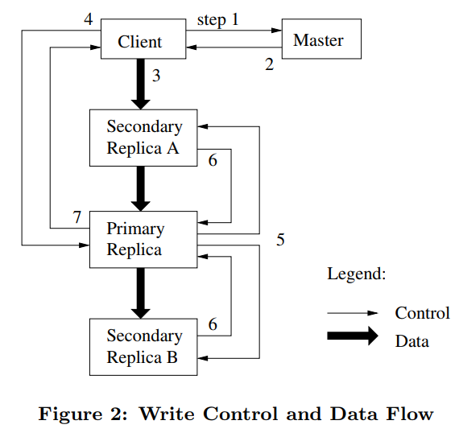

# GFS 论文阅读笔记

|  姓名  |   学号   |
| :----: | :------: |
| 米家龙 | 18342075 |

> 论文选择为 [The Google File System](https://static.googleusercontent.com/media/research.google.com/zh-CN//archive/gfs-sosp2003.pdf)

[TOC]

## 研究背景

2000年前后，随着互联网的发展，用户对互联网的使用越发多样化，服务器单一文件系统难以应对逐渐丰富与大量文件，作为和联网大数据领域的领头羊，谷歌提出并开发了 Google File System (GFS)；GFS 是谷歌公司开发的一种专用分布式分件系统，运行平台为 Linux ，GFS的设计目标包括易扩展，几乎线性扩展成大规模的集群运行在通用和廉价的硬件上提供可靠的容错机制并且满足高吞吐的性能要求；基于 GFS ，谷歌提出了 MapReduce 和 BigTable 框架，作为其大数据领域的三家马车；而随着技术的发展，以 GFS 为基础，也出现了更多的分布式文件系统(file system)，可见其地位与价值。

> 图源：[https://juicefs.com/blog/cn/posts/distributed-filesystem-comparison/](https://juicefs.com/blog/cn/posts/distributed-filesystem-comparison/)

### 分布式储存系统的需求背景

1. 分布式组件发生错误应当考虑为**常态**：在2003年时，大部分公司采用的都是配置不高的商业主机，除了主机性能导致的故障之外，还有诸如应用/操作系统 bug 、人为操作错误、硬盘/内存/网络/电源故障等其他故障
2. 储存文件以**大文件**为主：大文件指的是大于几百 MB 乃至到 GB 大小的的文件；但系统也应该支持小文件的操作
3. 主要负载为**大容量连续读**、**小容量随机读**和**追加式的连续写**
4. 大部分文件主要通过在**文件末尾追加新数据**的方式实现修改，而不是直接重写现有数据
5. **高数据吞吐量（带宽）**优先于低延时

## 方法介绍

### 架构

GFS 分为三种角色：

1. Client：GFS 提供给客户进行业务使用，内含各种以库的形式提供的 api
2. Master：管理集群的全局元数据（metadata）和命名空间（namespace）以及 chunck 的数据分布
3. Chunk Server：真正进行数据储存的实体，将文件切分成 chunk 并且分成多个副本进行储存

#### Client

##### 接口

GFS 对外提供了一个传统的单机文件系统接口，但并不是标准的文件系统 POSIX api 。文件通过**路径**进行定位，通过**目录**进行分层管理，支持如下操作：

- create
- delete
- open
- close
- read
- write
- snapshot：快照，能以低成本创建文件和目录树的副本
- record append：记录追加，GFS 能够允许多个客户端并发安全地向同一文件追加数据，并且保证每个追加操作的**原子性**
- 等等

client 还有如下特性：

1. 直接通过网络访问 chunk server 或者 master ，更高效
2. 缓存 master 的 metadata 到本地，使得每次 IO 都不必访问 master ，然后直接访问对应的 chunk server ，提高 master 的瓶颈
3. 不提供数据 cache ，有如下原因：
   - GFS 应用场景中主要为大文件的读写，如果需要缓存，需要大量内存，成本太高
   - 需要保证 client 之间的数据一致性，会导致相关机制复杂，降低性能
   - chunk server 处有缓存，会缓存经常访问的数据；从这个方面看，缓存是从 client 移到了 chunk server 上

##### 读

> GFS 设计大文件分块储存的 chunk size 为 **64MB**

client 对数据的查询是**批量**的，为了提高性能并保证数据的一致性，GFS 选择将多个 chunk server 的相关信息和对应的副本一次性返回，从而减少后续的操作，具体操作如下：

1. client 通过字节偏移量计算出对应的 chunk index ；
2. client 向 master 发送文件名(filename)和计算好的 chunk index ；
3. master 将收到了文件名和 chunk index 后，将这两者映射为对应的 chunk handle 和 chunk locations ，返回给 client
4. client 以 KV（键值对） 的形式缓存 `filename + chunk index : chunk handle + chunk locations`
5. client 向其中一个最可能是最近的副本发送查询请求，请求 chunk handle 和块中对应的字节范围

##### 修改

修改操作包括**追加**和**覆写**，对于 chunk 来说，需要进行两种修改：

- 在相关 chunk server 上进行 I/O 操作，并且最终同步到所有的数据副本
- 修改 master 上的 metadata

###### 租赁

> 租赁(lease)机制用于保证 master 在多个节点之间的写操作顺序上的**一致性**

具体操作：

1. master 将一个 chunk lease 发送给需要进行写操作的 chunk 的 chunk server 中的任意一个节点，该节点被选中后会被当做主节点，其他 chunk server 会被当做从节点；
2. chunk server 收到 chunk lease 和写操作请求后，决定多个写操作的串行执行顺序(serial order)
3. 主节点将带执行顺序的 lease 返回给 master ，master 将该顺序发送给从节点，并按照主节点决定的顺序执行

###### 写

写操作具体如下：

1. client 向 master 查询持有 chunk lease 的 chunk server
2. master 返回主节点的标识符和地址、以及其他从节点的地址；client 缓存数据后，在主节点失效（不可连接或者未持有 chunk lease ）之后才会再次向 master 请求
3. client 可以按照任意顺序想副本推送数据，对应的 chunk server 会将推送的数据储存在 LRU buffer cache 中
4. 当所有的副本都接受完了数据后，client 向主节点发送 write 指令，主节点为自己的多个写操作（可能来源于多个 client ）排序并执行到本地 I/O
5. 主节点根据 lease 的顺序将写请求范送给剩余的副本，这些副本节点将会按照主节点的执行顺序执行本地 I/0
6. 从节点（副本节点）执行完写操作后将返回响应给主节点
7. 主节点将响应和执行过程中的错误返回给 client ；如果 client 收到写失败响应，将会重新尝试写操作，执行第3~7步

###### 原子追加写

> - client 只需要负责指定要写的数据
> - 地址偏移量交由 chunk server 确定

操作具体步骤：

1. client 确定需要追加写的 filename 和字节数
2. client 向 master 发出追加写请求，附带 filename
3. master 接收到请求和相关数据后，通过其储存的 metadata 获取到对应的文件的最后一个 chunk 的 handle 和所在的 chunk server
4. master 将上述信息发送给 client
5. 后续操作类似上一小节的*写操作*，在写入成功的时候会更新对应的 chunk server 的 chunk version ，来应对写入失败导致的部分 chunk server 内容不一致的问题。

##### 快照(snapshot)

快照机制用于备份当前集群的状态，采用 copy on write 的方式，当只有在写文件的时候再进行 copy ，否则只是一个引用计数，这种方式大大提高了备份的速度和效率，也节省了空间，对于单个文件的损坏也可以通过副本来进行还原

流程如下：

1. client 发送快照请求给 master
2. master 回收对应文件的所有 chunk 的 lease ，用于保证后续写操作的正常进行
3. 在 lease 撤销后，将快照记录到操作日志中，并复制当前状态下 master 的 metadata
4. 新建快照中的 metadata 中的 chunk 指向源 chunk 文件，如果需要对这些 chunk 进行写操作，则 client 需要向 master 索要 lease ，master 在发现对应 chunk 有多个引用后，推迟给 client 响应，将原 chunk 分别在本地进行一次复制
5. 复制完成后 master 将引用计数减少1，并将原文件指向新 chunk ，并给其中一个副本 lease ，最后按照正常流程返回给 client 

#### Master

GFS 选择的是但 master 的架构，该 master 拥有这些功能：

- 管理所有的命名空间(namespace)
- 管理所有的 chunk 副本：
  - 决定 chunk 实际储存位置
  - 创建新的 chunk 及其副本
  - 协调来自 client 的各种操作，保证 chunk 能够正确备份
  - 管理 chunk server 的负载均衡
  - 垃圾回收

master 并不负责 chunk server 的 I/O 相关，从而避免了单节点成为性能瓶颈

master 会以写操作日志的形式对集群元数据进行持久化，在完成该写操作之前，master 会暂停对 client 的响应，避免变更导致的非一致性；同时为了避免单一文件的破坏难恢复，操作日志还会备份到其他机器上

##### 元数据(metadata)

元数据包含的信息有：

- 权限控制信息
- 文件和 chunk 的命名空间(namespace) ：以操作日志(operation log) 的方式记录在 master 的硬盘上
- 文件到 chunk 的映射 map ：同上
- 每一个 chunk 副本的储存位置：master 和 chunk server 之间通过心跳报告来更新 chunk 的状态

##### chunk lease

lease 用于 chunk 的修改，需要有时间限制，避免无限时间带来的对 master 的负载压力，可以通过心跳更新 lease 进行续约

##### 垃圾回收

GFS 的垃圾回收机制使得 chunk 在指定删除之后不会立即删除，从而使得误删的恢复成为可能

1. client 的删除文件记录在操作日志上，并将对应的文件名修改为 `hidden` ，并记录删除的时间，但是仍然可以通过对应的隐藏文件名访问到对应的文件，在去除 `hidden` 之后可以将文件恢复
2. master 定期扫描 metadata ，如果发现超出了删除的缓冲时间（可以自定义），则会通知 chunk server 删除对应的 chunk 
3. chunk server 通过心跳定期报告 chunk 的状态，master 定期检查 chunk handle id 对应的数据是否还在 metadata 中被使用，如果不被使用则可以告知 chunk server 删除
4. 对于老旧数据，master 每次分配 lease 时更新 chunk version ，并通知所有副本进行持久化更新，如果更新途中出现副本临时不可用，那么 chunk version 则不会更新，当不可用节点恢复后，便能够通过 chunk version 识别出是否是老旧数据

##### 检查点(checkpoint)

master 在日志达到一定大小后为当前状态创建检查点，并删除检查点之前的操作日志，检查点文件以 B 树的数据结构方式进行组织，在被映射到内存后不需要额外操作便能够检索储存的所有命名空间；当重新启动时，master 会通过检查点来快速回复自身的状态

##### 副本控制

###### 数据分布

当某个 chunk 的副本数量低于阈值的时候， master 会根据如下需求安排数据分布：

1. 同一份数据的不同副本应该分布在不同的 rack 上，用以保证安全
2. 优先储存在容量更多的硬盘上
3. 限制在 chunk server 上创建上创建多个临近 chunk ，避免增大读负担

###### 副本复制

副本复制由优先级影响：

- 最高优先级的副本是阻塞当前 client 的 chunk
- 对单副本的复制优先级较多副本来说更高
- 正在使用的副本优先级较等待垃圾回收的副本更高
- 为了保证 client I/O 的顺利进行，master 会限制复制的 chunk 的个数和复制读的 chunk 的带宽

##### Shadow Master

GFS 是单 master 架构，这就导致 master 很容易成为整个系统的短板，当该 master 出现故障时，整个系统便会因此停摆；为了避免这种情况的发生，GFS 还在集群中设计了提供只读功能的 shadow master ，shadow master 会延时同步 master 的全部数据，等价于 master 的备份，但无管理功能，可以用于在 master 故障/失效后能够继续为 GFS 集群提供 master 的数据，从而提高了集群的鲁棒性

#### Chunk Server

chunk server 是保存数据的具体实例，并通过如下方法进行储存：

- 将文件分割成 64M 大小的 chunk ，每个 chunk 有全局的 chunk handle id ，用于识别
- 每个 chunk 有多个备份副本（可自定义），储存在不同的 chunk server 上

> chunk server 的主要功能和交互方式已经在 clinet 和 master 处讲述

### 数据完整性

每个 chunk 有 64M ，按照64k进行切分，使得没64k就有一个32位的 checksum 校验和，该校验和同时保存在内存和持久化在日志中，并且与用户数据分开储存

当进行读操作时，chunk server 会检验 checksum 是否正确，如果错误：

1. chunk server 拒绝使错误数据扩散，并且对请求返回错误响应，同时报告 master
2. client 接收到错误响应后会到其他副本读取数据
3. master 会从别处的正确的副本处复制数据，并且删除错误数据

对于追加写操作，只需要计算新块的 checksum

对于覆盖写操作，则需要将前后部分都进行校验

## 思考

> 为什么使用心跳报告的方式来更新 chunk 状态而非持久化储存在 master 上？

1. 根据 GFS 应用场景的假设，节点服务器的损坏是常态，使用周期性查询的方法比固定信息储存位置更加简单、更加方便信息同步
2. chunk server 对于自己硬盘上得块有最终决定权，如果硬性交给 master 维护，并不能很好地对 chunk server 上的错误做出较好的判断

> 当 master 失效会这样？

由于存在 shadow master ，可以短时间内避免集群因为缺少 master 而整个宕机，但如果长时间 master 没有进行重启的话，还需要管理者人工介入，包括但不限于指定新的 master 、修复原本的 master 等操作来恢复集群

> 如何避免 master 成为性能瓶颈？

1. 减少 client 和 master 的交互，GFS 使 client 在从 master 拿到对应数据后直接与 chunk server 进行交互
2. master 将状态保存在内存中进行快速响应

> 追加写操作会导致数据写入到文件的一个难以预知的偏移量中，client 确定数据的位置？

追加操作主要面向会完整读取文件的应用，这些应用会读取所有的记录，但他们并不需要提前知道记录的位置，因此只需要执行遍历操作就可以了

> 个人感想

在GFS提出并实现了将近20多年的今天，即使计算机硬件水平比起过去提高了不只10倍，但集群相关的问题和瓶颈变化依然不大，GFS 的架构依然深深地影响了后续分布式集群的发展，一方面是用户的硬件水平也提升了，另一方面则是架构本身的稳定；GFS 简化了系统中各个组件的职能，系统的复杂度；多个备份提高冗余，遇到故障的时候自动转移，从而保证了系统的高可用；解耦数据流和控制流，提高了集群的性能。

对于分布式系统领域中的高性能与强一致性的矛盾，GFS 做出了一个选择：更高的性能和架构的简洁，但在强一致性上也给出了自己的解决方案；GFS 和之后的 BigTable 、MapReduce 是大数据时代的开山之作，而阅读这篇最为详细的 GFS 的论文，能够从基础上对分布式系统有扎实的了解。