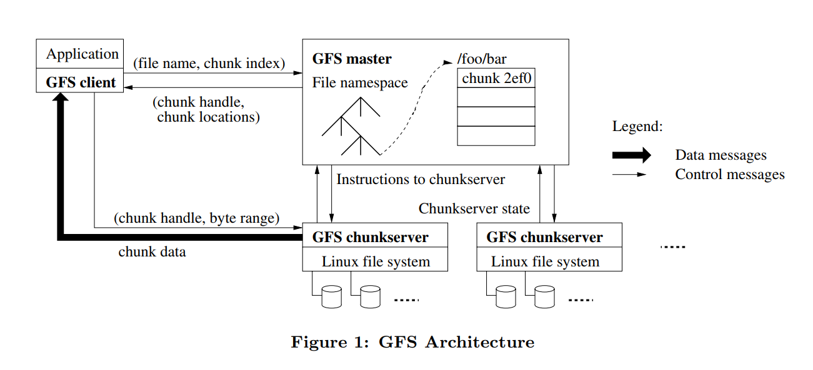
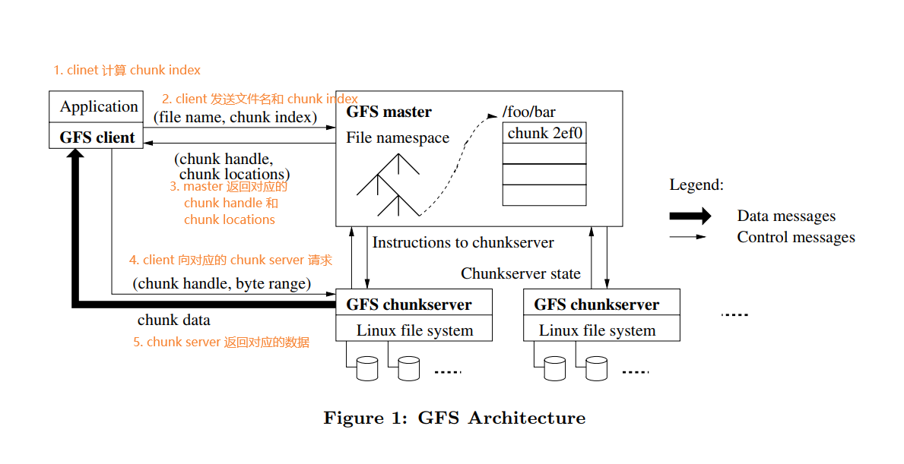

# 从 GFS、HDFS、Ceph、Tachyon 看分布式储存（文件系统）的发展

- [从 GFS、HDFS、Ceph、Tachyon 看分布式储存（文件系统）的发展](#从-gfshdfscephtachyon-看分布式储存文件系统的发展)
  - [分布式储存](#分布式储存)
    - [技术背景](#技术背景)
    - [常见架构](#常见架构)
  - [GFS](#gfs)
    - [GFS 架构](#gfs-架构)
    - [GFS 功能和实现](#gfs-功能和实现)
      - [GFS 中的读操作](#gfs-中的读操作)
      - [GFS 的修改操作](#gfs-的修改操作)
        - [GFS 中写操作的一致性](#gfs-中写操作的一致性)
        - [GFS 写操作](#gfs-写操作)
      - [GFS 的备份与恢复](#gfs-的备份与恢复)
        - [GFS 快照机制](#gfs-快照机制)
        - [GFS 的检查点](#gfs-的检查点)
        - [垃圾回收](#垃圾回收)
        - [Shadow Master](#shadow-master)
  - [HDFS](#hdfs)
    - [HDFS 架构](#hdfs-架构)
    - [HDFS 功能和实现](#hdfs-功能和实现)
      - [HDFS 的读操作](#hdfs-的读操作)
      - [HDFS 的写操作](#hdfs-的写操作)
      - [HDFS 的备份与恢复](#hdfs-的备份与恢复)
        - [HDFS 的树状结构分布](#hdfs-的树状结构分布)
        - [HDFS 的副本管理](#hdfs-的副本管理)
        - [HDFS 的节点静默](#hdfs-的节点静默)
    - [HDFS 和 GFS 的区别](#hdfs-和-gfs-的区别)
  - [Ceph](#ceph)
    - [Ceph 架构](#ceph-架构)
      - [Ceph 核心组件](#ceph-核心组件)
      - [Ceph 的储存类型](#ceph-的储存类型)
    - [Ceph 功能和特性](#ceph-功能和特性)
      - [Ceph 中的元数据](#ceph-中的元数据)
      - [Ceph File System](#ceph-file-system)
      - [Ceph 的心跳检测](#ceph-的心跳检测)
      - [Ceph CRUSH 算法](#ceph-crush-算法)
    - [Ceph 和 HDFS 的区别](#ceph-和-hdfs-的区别)
  - [Tachyon](#tachyon)
    - [Tachyon 架构](#tachyon-架构)
    - [Tachyon 的实现与特性](#tachyon-的实现与特性)
      - [Tachyon 文件储存](#tachyon-文件储存)
      - [Tachyon 读操作](#tachyon-读操作)
      - [Tachyon 写操作](#tachyon-写操作)
      - [Tachyon 的兼容文件接口](#tachyon-的兼容文件接口)
      - [Tachyon 的容错性](#tachyon-的容错性)
    - [和 HDFS 的区别](#和-hdfs-的区别)
  - [总结](#总结)
  - [参考资料](#参考资料)

## 分布式储存

### 技术背景

随着主机、磁盘、网络等技术的发展，十万、百万乃至千万级的数据以及请求已经十分常见，单机时代的服务器难以满足大容量数据的要求，随着直连式存储（Direct-Attached Storage，简称 DAS），中心化存储网络接入存储（Network-Attached Storage，简称 NAS）和存储区域网络（Storage Area Network，简称 SAN）等储存方案的出现，部分问题得到有效缓解，但依然难以满足时代的需求；随之诞生的分布式储存才算是真正勉强解决了这个时代的痛点。

### 常见架构

分布式存储通过网络使用企业中的每台机器上的磁盘空间，并将这些分散的存储资源构成一个虚拟的存储设备，数据分散的存储在企业机器的各个角落。传统的网络存储系统采用集中的存储服务器存放所有数据，这会使得服务器性能成为系统性能的瓶颈，不仅在可靠性和安全性方面容易出现短板，还不符合大规模存储应用的需求。分布式存储系统采用的是可扩展的系统结构，分为存储服务器和位置服务器，多台存储服务器用来分担存储负荷，位置服务器用于定位存储信息，这种架构不但提高了系统的可靠性、可用性和存取效率，还易于扩展。

分布式存储使用的设备一般是常规服务器，而非存储设备。分布式存储通过非标准协议实现服务器上存储整个资源，并进行存储资源池化和虚拟化处理，最后呈现给用户某种形式（块存储或者文件存储）的存储空间。分布式存储有其特异性，其使用的并非标准协议，因此通常需要在应用服务器安装其客户端软件实现存储空间的虚拟呈现，以及请求的处理。

由于分布式存储拓扑结构的复杂性，其出现故障的概率也大大增加了。因此，分布式存储需要实现基于网络的数据冗余、数据保护和数据容错等功能，以确保在出现任何异常情况（例如磁盘、网卡、交换机和服务器等）下存储系统的可用性和可靠性。

下面分别介绍 GFS、HDFS、Ceph 和 Tachyon 的

## GFS

GFS 是分布式储存的开山鼻祖，由谷歌在 2003 年的论文中提出，为后续的其他系统提供了思路和参考。GFS 核心的思想是硬盘横向扩展以及数据冗余，因此理论上能储存无限数量的数据。

### GFS 架构

GFS 中存在三种角色：

1. Client：GFS 提供给客户进行业务使用，内含各种以库的形式提供的 api
2. Master：管理集群的全局元数据（metadata）和命名空间（namespace）以及 chunck 的数据分布
3. Chunk Server：真正进行数据储存的实体，将文件切分成 chunk 并且分成多个副本进行储存

### GFS 功能和实现

#### GFS 中的读操作

在 GFS 中，预先假设了对数据的查询是批量的，因此 GFS 选择将多个 chunk server 的相关信息和对应的副本一次性返回，从而减少后续的操作，具体操作如下：

#### GFS 的修改操作

GFS 将写操作分为两类：

- 原子追加写
- 覆盖

##### GFS 中写操作的一致性

为了保证多节点之间的写操作顺序上的**一致性**，GFS 使用了租赁的机制。

1. 主服务器通过租赁选取主节点
2. 主节点对写操作排序后返回对应的租赁
3. 主服务器通过返回的租赁决定后续写操作的进行。

##### GFS 写操作

具体操作如下图：

#### GFS 的备份与恢复

##### GFS 快照机制

GFS 通过快照机制快速备份集群状态。

快照机制用于备份当前集群的状态，采用 COW(Copy On Write) 的方式，当只有在写文件的时候再进行 copy ，否则只是一个引用计数，这种方式大大提高了备份的速度和效率，也节省了空间，对于单个文件的损坏也可以通过副本来进行还原。

##### GFS 的检查点

GFS 的主服务器会在日志达到一定大小后以 B 树的数据结构方式为当前状态创建检查点，并删除检查点之前的操作日志，从而为快速恢复状态提供依据。

##### 垃圾回收

在 GFS 中，删除的文件不会立即从服务器上删除，而是被隐藏，通过去除隐藏可以恢复对应的文件。

删除操作会被记录在日志文件上，并且通过心跳报告机制确认是否需要进行保留/删除，在超出阈值之后会自动将隐藏的文件从服务器上删除。

##### Shadow Master

由于 GFS 采用了单主服务器的架构，会使得主服务器成为系统的短板，在其失效时会导致整个文件系统的停摆，因此还设计了提供只读功能的 Shadow Master ，通过延时同步主服务来完成备份，从而提高整个系统的鲁棒性。

## HDFS

GFS 的论文提供了分布式文件系统的思路和可行的解决方案，但是谷歌并没有开源对应的代码。基于谷歌发布的论文的思路，Apache Hadoop 项目对 GFS 进行了开源实现，其成果便是 HDFS。

和 GFS 一样，HDFS 适用于存储大单位数据（TB 乃至 PB），并且提供统一的访问接口。

### HDFS 架构

一个 HDFS 集群分为：

- Client：获取文件信息，可以进行读写操作
- 一个 NameNode：即 GFS 中的 Master ，存储所有 DateNode 的位置以及每个 DataNode 上文件的元信息，其本地备份被称作 Checkpoint
- 多个 DateNode：即 GFS 中的 Chunk Server ，数据真正储存的地方，并且文件在其中的储存形式如下图，每个文件被切分成多个块（块大小为 128M）；在 DateNode 中，每个 DataBlock 包含对应的数据和元数据（创建时间等信息）

- CheckpointNode：对 NameNode 进行备份，是 NameNode 的一个快照，定期对 NameNode 中的数据进行备份并进行垃圾回收
- BackupNode：对 NameNode 进行备份，除了创建对应的 Checkpoint 之外，还会实时同步 NameNode 的数据，可以看作一个只读的 NameNode

### HDFS 功能和实现

#### HDFS 的读操作

HDFS 的读操作和 GFS 非常相似

1. Client 通过 NameNode 找到最近的 DataNode
2. 对最近的 DataNode 进行读请求，失败则寻找下一个 DateNode
3. 在 DataNode 上读取对应的块时，如果块的校验和错误，那么会通知该 DataNode 存在错误并向下一个 DataNode 发送读请求

在 HDFS 中，Client 可以读取正在被写入的文件，会先获取最近该文件的长度再进行数据的读取，因此正在被写入的修改并不能保证可见。

#### HDFS 的写操作

HDFS 采用多读单写的模型，同一时间的同一文件只能被一个进程写，因此使用了锁的机制来保证单一写的进行；锁存在 softlimit 和 hardlimit 两个时间限制：

- softlimit：正在写入的 Client 需要发送 heartbeat 到 NameNode，未超过 softlimimt 时，该 writer 独占此文件的锁，超过 softlimit 之后，可以被其他 client 抢占此锁
- hardlimit：超过 hardlimit（即到了 hardlimit writer 也没有发送心跳也没有关闭文件，也没有人来抢占锁）HDFS 认为 client 已经退出并且自动关闭文件，释放掉锁

写入数据可以分为三个阶段：

1. pipeline setup: Client 将数据准备好，NameNode 将要接受写入的 NameNode 准备好，并且建立 pipeline
2. Data Streaming: Client 传送 packet 到 pipeline，DataNode 对每一个 packet 发送 ACK
3. close: 所有数据都已经发送完毕，ACK 均接收到，关闭链接

#### HDFS 的备份与恢复

##### HDFS 的树状结构分布

对于很大的集群，无法通过一个扁平的网络将其链接起来，而是将 DataNode 分布在多个 rack 里，一个 rack 里的所有 Node 使用一个交换机，rack 与 rack 之间再通过交换机相连，构成树状结构。

##### HDFS 的副本管理

管理块副本的是 NameNode ，会使用多个策略对副本的数量进行管理：在块备份数量过少时将其放入备份数量越少优先级越高的优先队列中进行备份；在块备份数量过多时进行清理。

HDFS 中的块的放置策略则是：第一个节点中的备份可写，第二个和第三个放到不同的 rack 中，其余的则随机（并根据策略进行清理）。

块放置策略可以有效避免单个数据的集中分布，但无法解决磁盘的利用均匀问题，因此还有负载均衡策略：均衡器会对不均匀分布的数据进行移动，不过在移动的时候他也会保证满足块放置策略。

##### HDFS 的节点静默

节点静默主要指的是 DataNode 被标记为退出集群的状态。在静默期的 DataNode 不会再接收到创建块副本的请求，但是可以读取；同时 NameNode 会开始将该节点的所有数据备份到其他的 DataNode 上；在备份结束后节点会被安全的移除

### HDFS 和 GFS 的区别

通过阅读论文可以发现，HDFS 的架构和实现和 GFS 非常相似，比如同样采用主从架构、文件分开储存的思路以及强大的数据压缩和可拓展性等，因为 HDFS 的出发点便是 GFS 的开源实现，而实际上，HDFS 也存在和 GFS 不同的细节：

HDFS 对 GFS 的读写操作模型进行了简化，使用的是多读单写模型，即同一时刻同一文件只允许单一客户端的覆盖/追加写，而 GFS 支持并发写操作。并发写入会带来复杂的数据一致性问题，必须让全部同时写入的客户端按同一种流水线方式去写入，才可能保证写入顺序一致。

GFS 和 HDFS 的写入流程都采用了流水线方式，但 HDFS 没有分离数据流和控制流。因此 HDFS 的数据流水线写入在网络上的传输顺序与最终写入文件的顺序一致。而 GFS 数据在网络上的传输顺序与最终写入文件的顺序可能不一致。

HDFS 还对 NameNode 进行了双重备份，在主节点遭遇故障时能更加方便快速地恢复集群。

对比之下，GFS 在支持并发写入和优化网络数据传输方面作出了最佳的折衷，而 HDFS 的简化和开源策略则能够更加用户的使用。

## Ceph

Ceph 是一个可以按对象/块/文件方式存储的开源分布式文件系统，其设计之初，就将单点故障作为首先要解决的问题，因此该系统具备高可用性、高性能及可 扩展等特点。根据论文的作者叙述，该文件系统是 HDFS 有力的替代者。

作者在最初设计 Ceph 的时候是作为一个分布式存储系统，也就是说其实 CephFS 才是最初的构想和设计，但随着后续的发展，Ceph 俨然已经发展为一整套存储解决方案，上层能够提供对象存储(RGW)、块存储(RBD)和 CephFS，可以说是一套适合各种场景，非常灵活，非常有可发挥空间的存储解决方案

Ceph 的设计目标是采用商用硬件来构建大规模的、具有高可用性、高可扩展性、高性能的分布式存储系统。

- 商用硬件：一般指标准的 x86 服务器，相对于专用硬件，性能和可靠性较差，但由于价格相对低廉，可通过集群优势来发挥高性能。
- 高可用性：指系统的某个部件失效后，系统依然可以提供正常服务能力；可用设备部件和数据的冗余来提高可用性。
- 高可扩展性：系统可灵活的应对集群的伸缩，如任意添加或删除存储节点和存储设备；系统的性能随集群的增加而线性增加。

### Ceph 架构

Ceph 分为对象存储（RADOS）和文件存储（MDS）两层。对象存储层是基础，提供可靠的 K/V 对存储服务。文件存储层则提供 POSIX 语义的目录和文件服务。

#### Ceph 核心组件

在 Ceph 存储中，包含以下几个核心组件，分别是 Ceph OSD，Ceph Monitor 和 Ceph MDS。

- Ceph OSD：全称是 Object Storage Device，主要功能包括存储数据，处理数据的复制、恢复、回补、平衡数据分布，并将一些相关数据提供给 Ceph Monitor，如 Ceph OSD 心跳等。
- Ceph Monitor：Ceph 的监控器，主要功能是维护整个集群健康状态，提供一致性的决策，包含 Monitor map、OSD map、PG(Placement Group) map 和 CRUSH map。
- Ceph MDS：全称是 Ceph Metadata server。主要保存的是 Ceph 文件系统（File system）的元数据。（Ceph 的块存储和对象存储不需要 Ceph MDS。Ceph MDS 为基于 POSIX 文件系统的用户提供一些基础命令，如 ls，find 等命令）。
- RADOS：RADOS 全称 Reliable Autonomic Distributed Object Store，是 Ceph 集群的精华，用户实现数据分配、Failover 等集群操作，是 Ceph Monitor 和 Ceph OSD Daemon 集群核心，Block Devices,Object Storage,Filesystem 都在这 RADOS 上封装。
- Librados：Librados 是 Rados 提供库，因为 RADOS 是协议很难直接访问，因此上层的 RBD、RGW 和 CephFS 都是通过 librados 访问的，目前提供 PHP、Ruby、Java、Python、C 和 C++支持。

#### Ceph 的储存类型

Ceph 支持三种存储接口：块存储、文件存储、对象存储。

- 块存储：使用磁盘阵列，硬盘；主要是将裸磁盘空间映射给主机使用。
- 文件存储：使用 FTP、NFS 服务，克服块存储文件无法共享的问题。
- 对象存储：内置大容量硬盘的分布式服务器(swift, s3)，多台服务器内置大容量硬盘，安装上对象存储管理软件，对外提供读写访问功能。

### Ceph 功能和特性

由于该文主要是对比文件系统，因此主要描述 Ceph File System，将会简化块储存和对象储存的介绍。

#### Ceph 中的元数据

在 Ceph 中，元数据主要负责记录数据的属性，如文件存储位置、文件大小和存储时间；负责资源查找、文件记录、存储位置记录、访问授权等。元数据主要储存在 MDS 中。

#### Ceph File System

CephFS 是一个支持 POSIX 接口的文件系统存储类型。CephFS 通过在 RADOS 基础之上增加 MDS（Metadata Server）来提供文件存储。它提供 libcephfs 库和标准的 POSIX 文件接口。CephFS 类似于传统的 NAS 存储，通过 NFS 或者 CIFS 协议提供文件系统或文件目录服务。

Ceph FS 有如下特点：

- 客户端可以方便的挂载到本地使用并作为资源共享用途
- 继承了 RADOS 的容错性和扩展性
- 同样可以提供基于副本的冗余方式来保障数据高可靠性。

使用 CephFS 需要使用 Metadata Server（MDS）来管理文件系统的命名空间及客户如何访问 OSD 数据存储，MDS 提供包含缓存层的一致性文件系统，并且不会直接向客户端提供任何数据，所有数据都是由后端 OSD 提供的，从而降低自身的读写次数。 MDS 还具备动态集群，其 MDS 可以加入或退出，可以快速接管故障节点。

MDS 进程可以配置成活跃或被动状态， 活跃的 MDS 即为主 MDS，其他的 MDS 则进入待机状态，当主 MDS 节点发生故障，待机节点将接管其工作并提升为主节点；其元数据信息以内存缓存方式响应外部访问请求。

Ceph FS 的 I/O 流程如下：

1. 当客户端打开一个文件时，客户端向 MDS 发送请求；
2. MDS 向 OSD 定位文件所在的索引节点，索引节点包含文件的元数据信息，如文件所有者、大小、权限等；
3. MDS 赋予客户端读取缓存文件内容的权限，当访问被授权后返回给客户端 File Inode 值、Layout（Layout 定义文件内容如何被映射到 Object）、文件大小；
4. 客户端根据 MDS 返回的信息定位到需要访问的文件，然后直接与 OSD 进行 I/O 交互。

#### Ceph 的心跳检测

心跳机制用于节点间检测对方是否故障，是故障检测中的一环。有两种心跳检测：

- OSD 之间互相心跳检测：在同一个 Placement Group 中的 OSD 会互相通过 ping/pong 发送信息进行心跳检测
- OSD 与 Monitor 之间心跳检测：
  - OSD 会在相关事件发生时（自启动、故障、Placement Group 变更等）向 Monitor 报告
  - 周期性检测失效的 OSD 并将报告发送给 Monitor 用于移除/下线对应的 OSD

通过这种心跳机制的设计有如下特点：

- 及时：伙伴 OSD 可以在秒级发现节点失效并汇报 Monitor，并在几分钟内由 Monitor 将失效 OSD 下线
- 压力适当：通过伙伴 OSD 心跳汇报，故障检测过程中中心节点的压力分散到所有的 OSD 上，从而可以加大 OSD 与 Monitor 之间的检测阈值，从而减少了中心 Monitor 的负载，最终提高中心节点 Monitor 的可靠性，进而提高整个集群的可扩展性。
- 容忍网络抖动：Monitor 收到 OSD 对其伙伴 OSD 的汇报后，并没有马上将目标 OSD 下线，而是周期性的等待：1） OSD 失效时间超过阈值；2）其他主机的汇报；3）源 OSD 的失效汇报未被取消之后才会下线对应的 OSD
- 扩散：作为中心节点的 Monitor 并没有在更新 OSDMap 后尝试广播通知所有的 OSD 和 Client，而是惰性的等待 OSD 和 Client 来获取。以此来减少 Monitor 压力并简化交互逻辑

#### Ceph CRUSH 算法

CRUSH 算法的全称为：Controlled Scalable Decentralized Placement of Replicated Data，可控的、可扩展的、分布式的副本数据放置算法。PG 到 OSD 的映射的过程就使用了 CRUSH 算法。(一个 Object 需要保存三个副本，也就是需要保存在三个 osd 上)。CRUSH 算法是一个伪随机的过程，他可以从所有的 OSD 中，随机性选择一个 OSD 集合，但是同一个 PG 每次随机选择的结果是不变的，也就是映射的 OSD 集合是固定的。

CRUSH Map 是一个树形结构。叶子节点是具体的设备（也就是 OSD），其他的节点称为 bucket 节点，这些 bucket 都是虚构的节点，可以根据物理结构进行抽象，当然树形结构只有一个最终的根节点，中间虚拟的 bucket 节点可以是数据中心抽象、机房抽象、机架抽象、主机抽象等。

### Ceph 和 HDFS 的区别

Ceph 一开始是以 HDFS 的替代者提出的，但随着技术的发展，单纯的文件系统已经不能满足各种应用场景的需求，因此块储存以及对象储存的功能更加被完善和开发。

除了使用更加完善以及负载均衡的心跳机制外，Ceph 的另一大特点是使用了无中心节点的架构，每个节点都是自治的、自管理的，整个 Ceph 集群只包含一类节点（比如 RADOS 就是 Ceph 定义的“同时包含 meta 数据和文件数据”的节点；同时 Ceph 在节点集群中维护了一个比较小的 Monitor 集群，数据节点向这个 monitor 集群汇报自己的情况，由其来判定是否被损坏或过期）。在解决了中心节点存在时的瓶颈之后，Ceph 理论上能做到无限扩容，并且 Ceph 使用了 CRUSH 算法，用来解决 Client 和 Server 直接交互时应该访问集群中那个节点的问题。

## Tachyon

文件系统层关注的焦点，开始向“低延时处理”方向转移，所以传统基于磁盘存储的文件系统，也开始向基于内存计算的文件系统转变——这种架构能大大降低 I/O 操作和磁盘序列化带来的访问开销。Tachyon 就是朝这个方向演化的范例。

### Tachyon 架构

Tachyon 采用了 Master-Worker 模式，运行中的 Tachyon 系统由一个 Master 和多个 Worker 构成。

- Tachyon Master：管理全部文件的元数据信息，同时也通过心跳机制监控各个 Tachyon Worker 的状态。
- Standby Master：由于采用的是中心节点的架构，为了避免 Master 故障导致整个集群不可用，加入了该节点作为备用。
- Tachyon Worker：文件以块为单位在 Worker 中进行存储和管理以及维护。主要部件是 Worker Storage，其作用是管理 Local Data（本地的内存文件系统）以及 Under File System（Tachyon 以下的磁盘文件系统，比如 HDFS）。还有 DataServer 组件用于处理其他的 Client 对其发起的数据读写请求。

### Tachyon 的实现与特性

#### Tachyon 文件储存

具体的文件是储存在 Worker 的 Ramdisk 上的，并以 Block 划分，默认单位为 1G，Master 为每个 Block 分配一个 BlockID，Worker 直接以 BlockID 作为该 Block 的实际文件名。

#### Tachyon 读操作

Tachyon 的文件读操作支持本地和远程两种模式，从 Client API 的角度来说对用户是透明的。具体操作如下：

1. 从 Master 处获取对应文件 Offset 位置对应的 Block 的 BlokcID
2. 连接本地 Worker 取得相应 BlockID 对应的文件名
   - 若文件存在：
     1. Client 端代码会通知 Worker 锁定对应的 Block
     2. Client 端代码直接映射相关文件为 RandomAccessFile 直接进行读操作，并不经由 Worker 代理读取实际的数据
   - 若本地没有 Worker，或者文件在本地 Worker 上不存在：
     1. Client 代码再进一步通过 Master 的 API 获取相关 Block 所对应的 Worker
     2. 通过 Worker 暴露的 DataServer 接口读取对应 Block 的内容，在 DataServer 内部，同样延续锁定对应 Block，映射文件的流程读取并将数据返回给 Client
   - 如果使用的不是 TachyonFile API （默认读操作 API）而是 FileStream API 的话，当远程 Worker 也没有对应文件 Block 时，Tachyon 还会尝试从底层持久化文件系统层去读取数据

#### Tachyon 写操作

写操作只支持本地写，按照写入位置分为：

- Cache：写到 Tachyon 内存文件系统中
- Through：写到底层持久化文件系统（即 Tachyon 以下的磁盘文件系统，比如 HDFS）中

实际的写操作是上述两种写入的组合。

写操作使用的单写入的模型，并不支持并发操作。还对追加写操作有局限性，因为 Block 尺寸按文件计算，尺寸固定，所以如果要进行追加写，就需要考虑必须在同一节点上操作，或者支持远程写数据到当前 Block 所在的节点上，或者支持动态 Block 大小。而对于异地写，依然要考虑并发写操作的问题，需要使用锁/阻止并发等操作。

#### Tachyon 的兼容文件接口

Tachyon 提供了一个 TFS 拓展 Hadoop 的 FileSystem 接口，通过 Tachyon Client 提供的接口实现 HDFS 对文件相关信息和 Metadata 的操作。

在具体的数据读写上，则是在建立好数据流的基础上，通过 Tachyon 的 FileInStream 和 FileOutStream 来执行。

#### Tachyon 的容错性

Tachyon 主要通过以下方面来提高数据容错性：

- 底层兼容持久化储存的文件系统如 HDFS，方便指定文件的持久化
- 使用 Journal 机制持久化元数据
- 使用 Zookeeper 构建 Master 的 HA
- 使用和 Spark RDD 类似的 Lineage 思想用于灾后重建，并没有使用副本容灾机制

### 和 HDFS 的区别

可以发现，Tachyon 依然采用了经典了的主从架构和心跳机制来维持架构的稳定和集群的监控。但除此之外便有了很大的不同，比如为了提高读写访问的速度，储存的位置有别于传统文件系统的服务器/硬盘，而是直接放在了内存，从而大大提高了整体响应速度，这也是 redis 这种内存数据库大量使用的原因之一。

在容灾方面，有别于传统的多地备份容灾，依托于内存 SSD 的高速特性，Tachyon 选择使用 Lineage 的思想来通过灾后恢复进行容灾，这种策略和三副本备份相比虽然稳定性较差，但是减少了硬件成本，是一种取舍。

除此之外，Tachyon 底层还额外兼容了其他的文件系统，这就大大提升了其应用的范围并降低了更换文件系统的成本。

## 总结

可以发现，GFS 的“Client-Master-DataServer”架构为后续分布式储存（文件系统）提供着主流思路，后续的系统在此基础上进行创新：

Master 方面，有的给 Master 提供备份节点，有的选择直接其中心节点替代为集群，但依然离不开储存文件元数据，作为信息中心监控 DataServer、为 Client 的连接提供地址指引。

DataServer 则出现了很多的创新，变得越来越多元化，除了传统的的文件系统，存储类型也增加了诸如块存储和对象存储这样选择，从而使得应用的场景更加多元化；除此之外，部分文件系统还实现了其他文件系统的兼容，从而使文件系统的嵌套/迁移变得更加容易。硬件成本的降低也使得使用内存储存文件的方法变得可行，从而为低延迟响应的需求提供了解决方案。

## 参考资料

- [The Google File System](https://static.googleusercontent.com/media/research.google.com/zh-CN//archive/gfs-sosp2003.pdf)
- [The Hadoop Distributed File System:Architecture and Design](http://svn.apache.org/repos/asf/hadoop/common/tags/release-0.16.1/docs/hdfs_design.pdf)
- [The Hadoop Distributed File System](https://ieeexplore.ieee.org/stamp/stamp.jsp?tp=&arnumber=5496972)
- [Ceph: A Scalable, High-Performance Distributed File System](https://www.usenix.org/legacy/events/osdi06/tech/full_papers/weil/weil_html/)
- [CRUSH: Controlled, Scalable, Decentralized Placement of Replicated Data](https://ceph.com/wp-content/uploads/2016/08/weil-crush-sc06.pdf)
- [Tachyon: Reliable, Memory Speed Storagefor Cluster Computing Frameworks](https://dl.acm.org/doi/pdf/10.1145/2670979.2670985)
