# 作业题目

- [作业题目](#作业题目)
  - [第一章](#第一章)
    - [14](#14)
    - [15](#15)
    - [20](#20)
    - [25](#25)
    - [26](#26)
    - [31](#31)
  - [第二章](#第二章)
    - [2.1](#21)
    - [2.7](#27)
    - [2.8](#28)
    - [2.9](#29)
    - [2.14](#214)
    - [2.17](#217)
    - [2.18](#218)
  - [第三章](#第三章)
    - [3](#3)
    - [6](#6)
    - [17](#17)
    - [20](#20-1)
    - [22 (b)](#22-b)
  - [第四章](#第四章)
    - [4.3 (b)](#43-b)
    - [4.4 (b)](#44-b)
    - [4.8](#48)
    - [4.10](#410)
    - [4.14](#414)
    - [4.21 (b), (g)](#421-b-g)
    - [4.24](#424)
    - [4.25](#425)
    - [4.33 (a), (b)](#433-a-b)
    - [4.34](#434)
    - [4.36](#436)
  - [第九章](#第九章)
    - [9.3](#93)
    - [9.6](#96)
    - [9.11](#911)
    - [9.14](#914)
    - [9.20](#920)
    - [9.28](#928)
  - [第十章](#第十章)
    - [10.1 (a) (b)](#101-a-b)
    - [10.3](#103)
    - [10.6](#106)
    - [10.11](#1011)
    - [10.14](#1014)
    - [10.20](#1020)
    - [10.33](#1033)
    - [10.42](#1042)
  - [额外](#额外)
    - [1.27](#127)
    - [1.28](#128)

## 第一章

[第一周作业](./第一章作业.md)

### 14

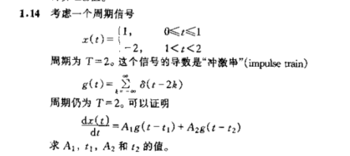

### 15

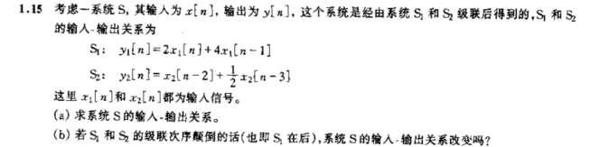

(a)

(b)

### 20

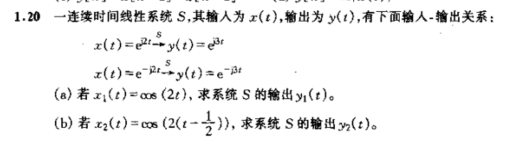

(a)

(b)

### 25

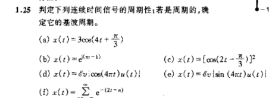

(a)

(b)

### 26

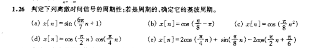

(b)

(d)

### 31

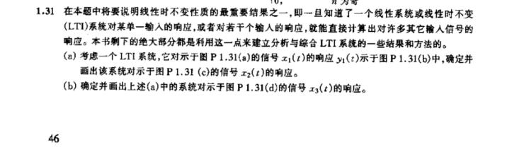

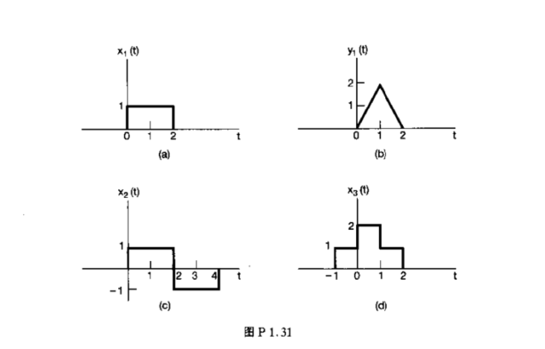

## 第二章

[第二章作业](./第二章作业.md)

### 2.1

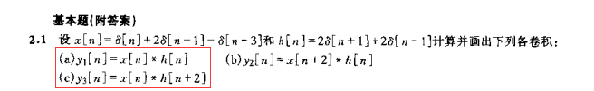

### 2.7

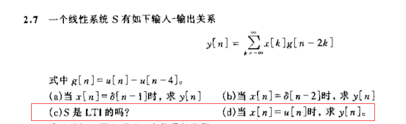

### 2.8

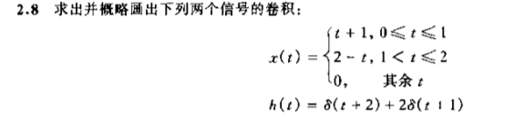

### 2.9

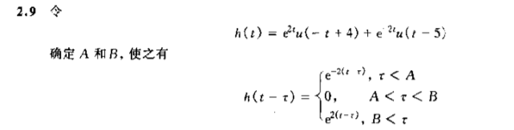

### 2.14

### 2.17

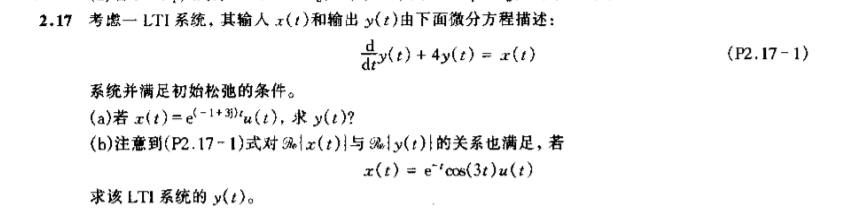

### 2.18

## 第三章

### 3

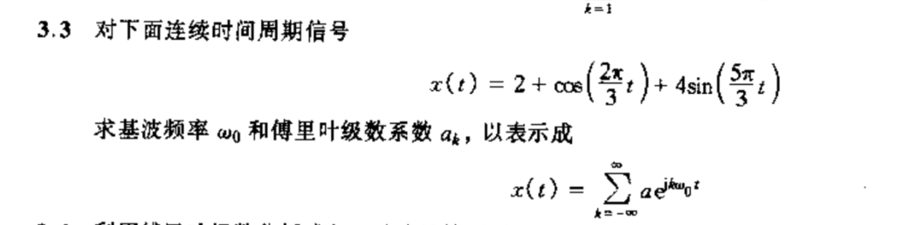

### 6

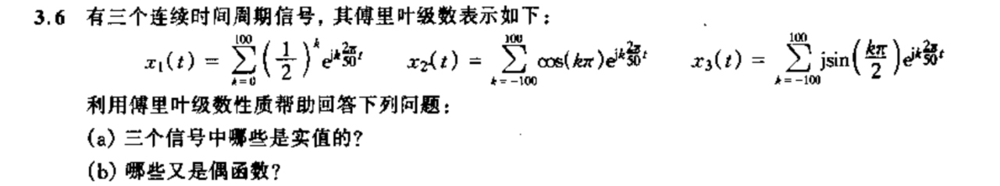

### 17

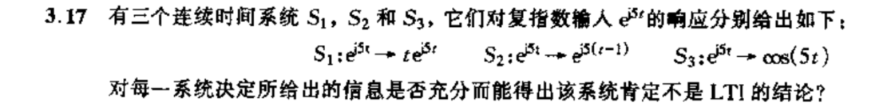

### 20

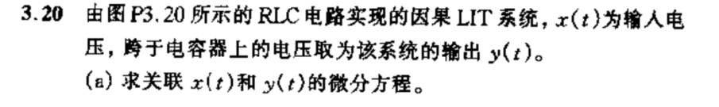

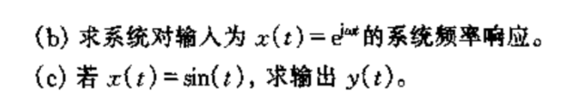

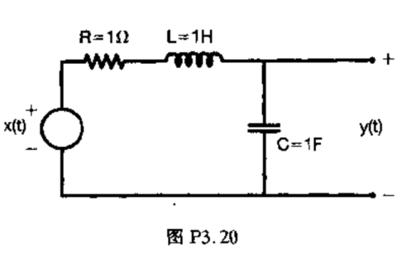

### 22 (b)

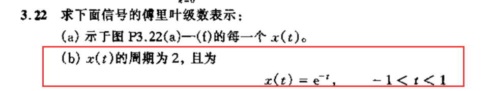

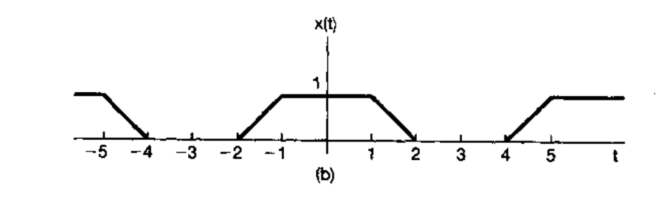

## 第四章

### 4.3 (b)

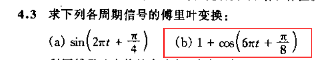

### 4.4 (b)

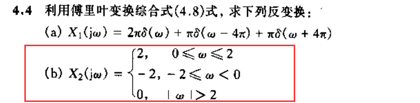

### 4.8

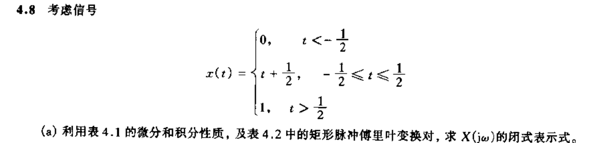

### 4.10

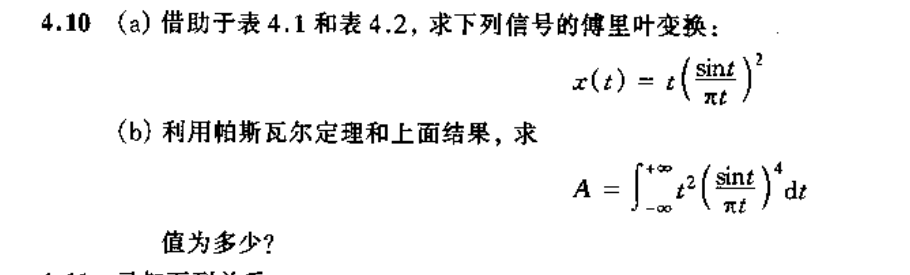

### 4.14

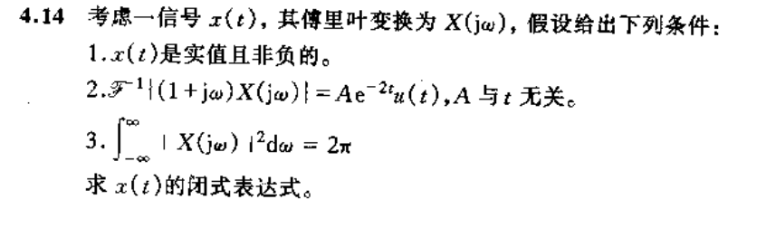

### 4.21 (b), (g)

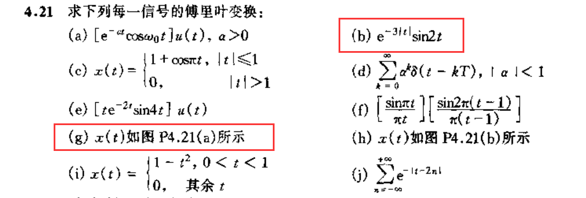

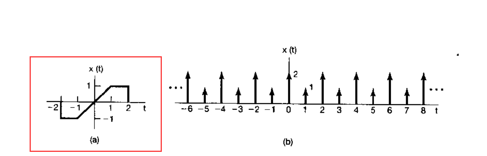

### 4.24

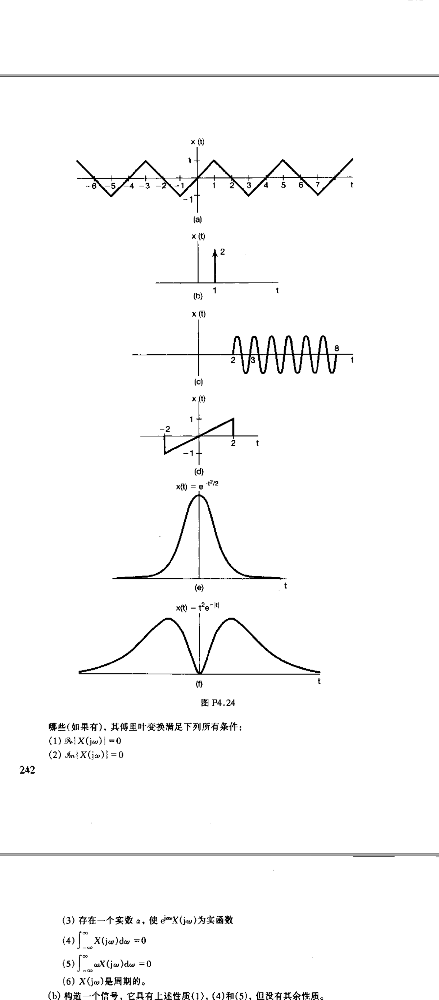

### 4.25

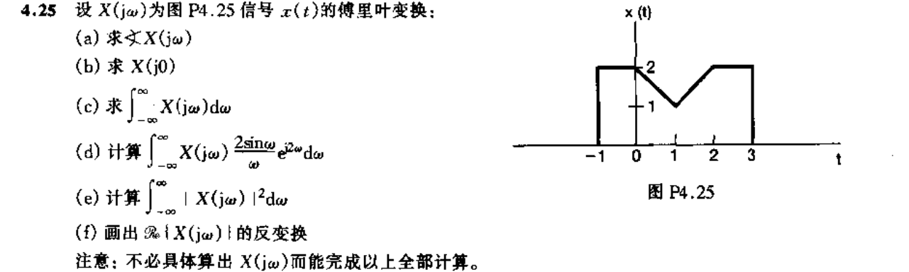

### 4.33 (a), (b)

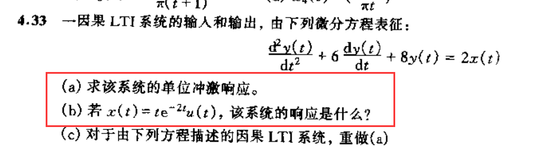

### 4.34

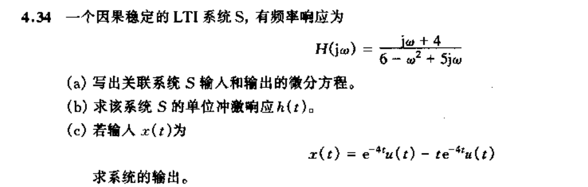

### 4.36

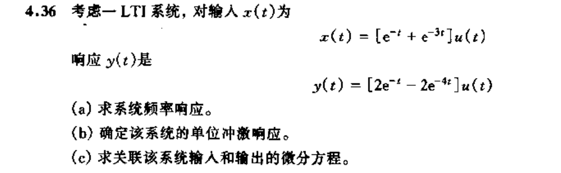

## 第九章

### 9.3

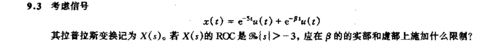

### 9.6

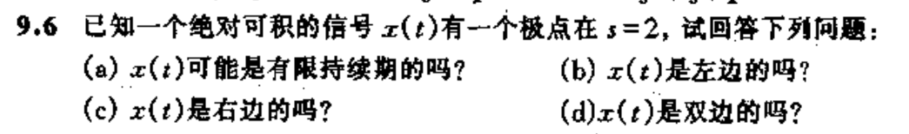

### 9.11

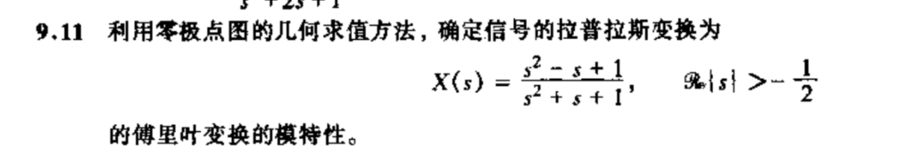

### 9.14

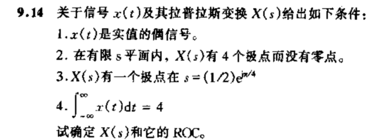

### 9.20

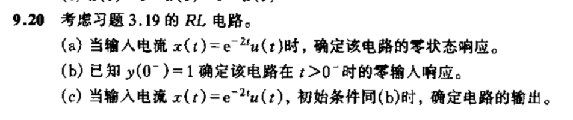

### 9.28

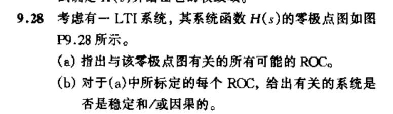

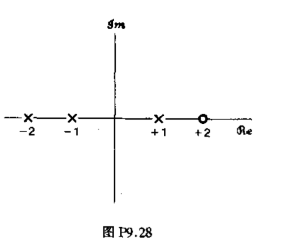

## 第十章

### 10.1 (a) (b)

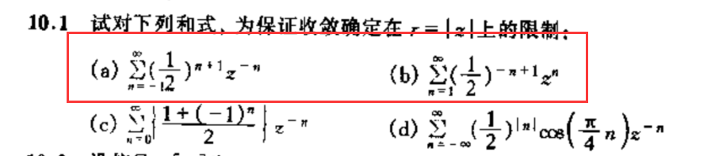

### 10.3

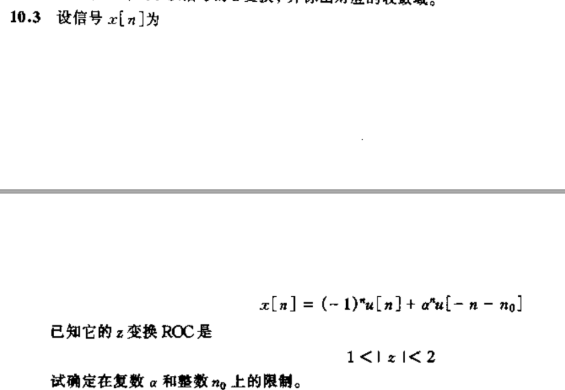

### 10.6

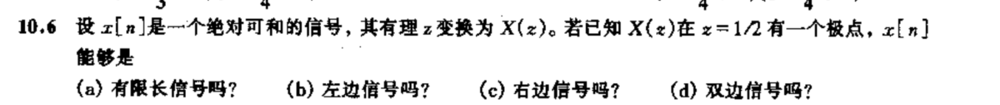

### 10.11

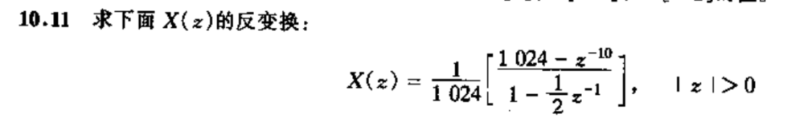

### 10.14

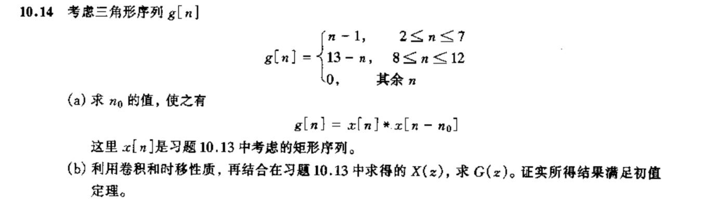

### 10.20

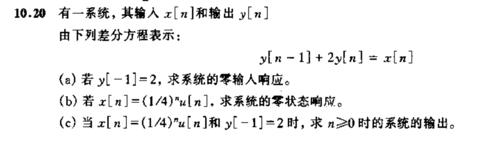

### 10.33

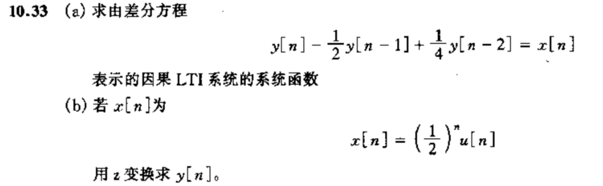

### 10.42

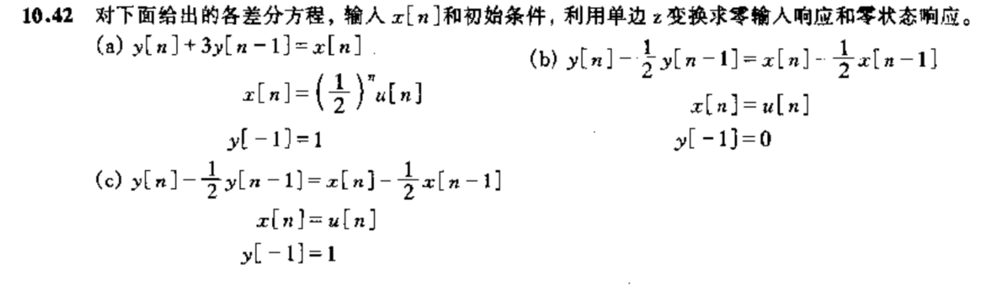

## 额外

### 1.27

### 1.28