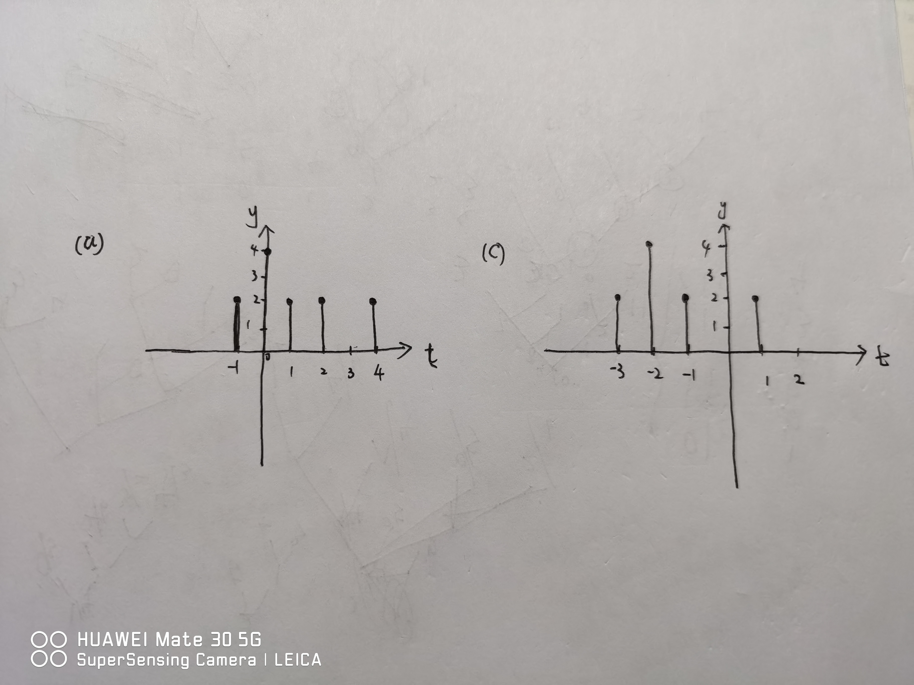

# 信号与系统

## 第二章习题

### 2.1

(a)

$$
y_1[n] = 2 \delta[n + 1] + 4 \delta [n] + 2 \delta [n - 2] + 2 \delta [n - 1] - 2 \delta [n - 4]
$$

(b)

$$
\begin{aligned}
  y_3[n]  & = y_1[n + 2] \\
          & = 2 \delta[n + 3] + 4 \delta [n + 2] + 2 \delta [n] + 2 \delta [n + 1] - 2 \delta [n - 2]
\end{aligned}
$$

### 2.7

(c)

由(a)，(b)可以得到
$$
当 x[n] = \delta [n - 1] 时 \\
\begin{aligned}
  y_a[n] & = \sum_{k = - \infty}^{\infty} x[k] (u[n - 2k] - u[n - 2k - 4]) \\
         & = \sum_{k = - \infty}^{\infty} \delta [k - 1] (u[n - 2k] - u[n - 4 - 2k]) \\
         & = u[n - 2] + u[n - 4]
\end{aligned}

\\

当 x[n] = \delta [n - 2] 时 \\ 
\begin{aligned}
  y_b[n] & = \sum_{k = - \infty}^{\infty} x[k] (u[n - 2k] - u[n - 4 - 2k]) \\
         & = \sum_{k = - \infty}^{\infty} \delta [k - 2] (u[n - 2k] - u[n - 4 - 2k]) \\
         & = u[n - 4] + u[n - 8]
\end{aligned}
$$

因此，该系统是线性时变系统

(d)

$$
当 x[n] = ui[n] 时 \\
\begin{aligned}
  y[n] & = \sum_{k = - \infty}^{\infty} u[k] (u[n - 2k] + u[n - 4 - 2k]) \\
       & = 2 \ u[n] - \delta [n] - \delta [n - 1]
\end{aligned}
$$

### 2.8

$$
\begin{aligned}
  y(t) & = \int_{- \infty}^{\infty} x(\tau) \ \delta(t + 2 - \tau) {\rm d} \tau + \int_{- \infty}^{\infty} x(\tau) \ \delta(t + 1 - \tau) {\rm d} \tau \\
       & = 
  \begin{cases}
    t + 3, & -2 < t \le -1 \\
    t + 4, & -1 < t \le 0 \\
    2 - 2t, & 0 < t \le 1 \\
    0, & \text{其他}
  \end{cases}

\end{aligned}
$$

### 2.9

$$
\begin{aligned}
  h(t - \tau) & = e^{2(t - \tau)}u(-t + \tau +4) + e^{-2(t - \tau)}u(t - \tau - 5) \\
              & = 
              \begin{cases}
                e^{-2(t - \tau)}, & \tau < A \\
                0, & A < \tau < B \\
                e^{2(t - \tau)}, & B < \tau \\
              \end{cases}
\end{aligned}
$$

可以得到
$$
\begin{aligned}
  \tau < A 时 \\ 
  \begin{cases}
    u(-t + \tau +4) = 1 \\
    u(t - \tau - 5) = 0
  \end{cases} 
  \rightarrow
  \begin{cases}
    \tau < t - 5 \\
    \tau < t - 4
  \end{cases}
  \rightarrow
  A = t - 5
\end{aligned}

\\

\begin{aligned}
  A < \tau < B 时 \\
  \begin{cases}
    u(-t + \tau +4) = 1 \\
    u(t - \tau - 5) = 1
  \end{cases} 
  \rightarrow
  \begin{cases}
    \tau > t - 5 \\
    \tau < t - 4
  \end{cases}
  \rightarrow
  B = t - 4
\end{aligned}

\\

计算第三种情况，可以验证 B = t - 4
$$

### 2.14

(a)

$$
\begin{aligned}
  \int_{\infty}^{\infty} h_1(t) {\rm d} t & = \int_{0}^{\infty}e^{-(1 - 2j) t} {\rm d} t \\
\end{aligned}
$$

上式有界，因此稳定

$$
\begin{aligned}
  \int_{- \infty}^{\infty} h_1(t - \tau) {\rm d} t & = \int_{\tau}^{\infty} e^{-(1 - 2j) (t - \tau)} {\rm d} t \\
                                                   & = \int_{x}^{\infty} e^{-(1 - 2j) x} {\rm d} x, & x = t - \tau
\end{aligned}
$$

上式得到其时不变性

易得其线性

因此该单位冲击响应对应于稳定线性时不变系统

(b)

$$
\begin{aligned}
  \int_{- \infty}^{\infty} h_2(t) {\rm d}t & = \int_{0}^{\infty} e^{-t} \ {\rm cos} (2t) \ {\rm d} t
\end{aligned}
$$

上式有界，稳定

$$
\begin{aligned}
  \int_{- \infty}^{\infty} h_2(t - \tau) {\rm d}t & = \int_{\tau}^{\infty} e^{- (t - \tau)} \ {\rm cos} [2(t - \tau)] \ {\rm d} t \\
                                                  & = \int_{0}^{\infty} e^{- x} \ {\rm cos} [2x] \ {\rm d} x, & x = t - \tau
\end{aligned}
$$

因此时不变，并且易得其线性，因此该单位冲击响应对应于稳定线性时不变系统

### 2.17

(a)

假设特解 $y_p(t) = Y \ e^{(-1 + 3j) t}$

可以得到 $(4 - 1 + 3j) Y \ e^{(-1 + 3j) t} = e^{(-1 + 3j) t}$

得到特解 $y_p(t) = \frac{1}{3 + 3j} \ e^{(-1 + 3j) t}$

假设通解 $y_h(t) = A \ e^{st}$

可以得到 $(As + 4A) \ e^{st} = 0$

并且因为系统初始松弛，$y(0) = A + \frac{1}{3 + 3j} = 0$

得到通解 $y_h(t) = - \frac{1}{3 + 3j} \ e^{-4t}$

所以得到结果为 $y_h(t) = \frac{1}{3 + 3j}[e^{(-1 + 3j)t} - e^{-4t}]u(t)$

(b)

同上，得到特解为 $y_p(t) = \frac{1}{6} e^{-t}({\rm cos}(3t) + {\rm sin} (3t))$

通解为 $y_h(t) = \frac{1}{6} e^{-4t}$

得到$y(t) = \frac{1}{6}[e^{-t}({\rm cos} \ 3t + {\rm sin} \ 3t) - e^{-4t}]u(t)$

### 2.18

由于 $y[1] = \frac{1}{4} y[0] + 1$

并且 $y[-1] = \frac{1}{4} y[-1]$

假设初始松弛，则可以得到 $y[n] = (1/4)^{n - 1} \ y[1] = (1/4)^{n - 1} \ u[n - 1]$

因此，结果为
$$
y[n] = (1/4)^{n - 1} \ u[n - 1]
$$