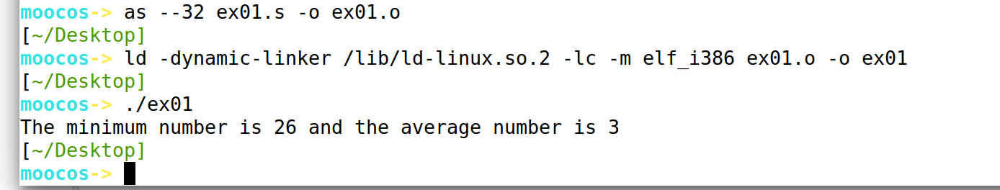

# 实验一

## 个人信息

* 数据科学与计算机学院 软件工程
* 2018级 米家龙

## 实验目的

* 熟悉 Linux 下使用 AT&T 汇编的编译链接命令
* 初步掌握使用 AT&T 汇编程序设计技术

## 实验要求

* 使用 AT&T 汇编语言编写一组程序求一组数(12，4，6，7，80，34，54，46，3，23)的`最小值`和`均值`，并将其在屏幕上`输出`。

## 实验方案

### 实验环境

使用老师提供的`mooc-os-2015.vdi`，在虚拟机中创建64位的 Ubuntu 并加载该 vdi ，获得了版本为：

```
Linux moocos-VirtualBox 3.13.0-24-generic #46-Ubuntu SMP Thu Apr 10 19:11:08 UTC 2014 x86_64 x86_64 x86_64 GNU/Linux
```

的虚拟机环境

### 方案思想

* 使用数组储存这10个数
* 使用循环进行累加和比较操作
* 比较操作中需要跳转
* 使用 C 语言函数库简化操作

## 实验过程

### 实验代码

``` mips
#ex01.s

.section .data
    array:
        .int 12,4,5,7,80,34,54,46,3,23
    output:
        .ascii "The minimum number is %d and the average number is %d\n"
        len = . - output
.globl _start
_start:
    movl $0, %ecx # 次数
    movl array(, %ecx, 4), %eax # 先储存总和，再计算并储存均值
    movl array(, %ecx, 4), %ebx # 储存最小值
    LPCMP: # 比较和累加
        addl $1, %ecx
        movl array(, %ecx, 4), %edx # 加载数
        add %edx, %eax
        cmp %ebx, %edx
        cmovl %edx, %ebx # if <, ebx = edx
        cmp $9, %ecx
        jne LPCMP
        je END
    END:
        movl $0, %edx
        movl $10, %ecx
        divl %ecx # 得到除法结果
        pushl %ebx
        pushl %eax
        pushl $output
        call printf
        pushl $0
        call exit # 程序终止
```

### 实验结果

``` bash
moocos-> as --32 ex01.s -o ex01.o
[~/Desktop]
moocos-> ld -dynamic-linker /lib/ld-linux.so.2 -lc -m elf_i386 ex01.o -o ex01
[~/Desktop]
moocos-> ./ex01 
The minimum number is 26 and the average number is 3
```

程序运行过程：



> 遇到的问题：divl 指令的参数如果是立即数，会报错
> 
> 解决方法：参数修改为寄存器

## 实验总结

1. AT&T 汇编语言与已经学过的 mips 汇编语言相比，语法格式相近，但具体的指令以及参数有很大的区别，并且指令更加丰富，能够通过改变前缀与后缀精确地操控使用的寄存器位数
2. AT&T 汇编语言通过与 C 语言内联，能够更加地方便编写，同时，由于拓展性内联汇编的存在，能够通过少量的语句便可轻松获得目标的汇编语句
3. 本次实验中，加强了我对汇编语言的理解，同时对于汇编语言的分段有了更好的掌握，同时，对于虚拟机创建和使用，以及 Linux 系统的理解，又更进一步
4. 不足：本次实验得到的最终结果是整数，如果应该得到真正的结果，即小数26.8，应该怎么做，使用怎样的命令，还是需要去了解；而每次编译汇编语言，都需要使用至少两条命令，应该尝试编写 makefile 文件，使用 make 来简化操作

## 参考资料

* [AT&T汇编指令](https://blog.csdn.net/hunwo/article/details/6287288)
* [00-1AT&T汇编语言初步（new）](./参考资料/00-1AT&T汇编语言初步（new）.pdf)