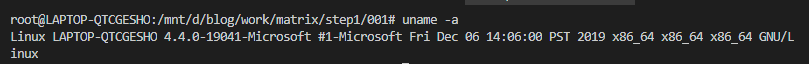
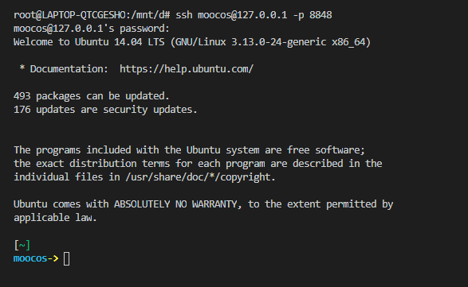
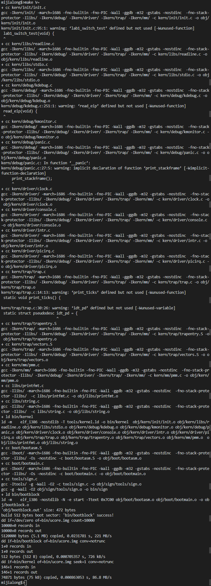
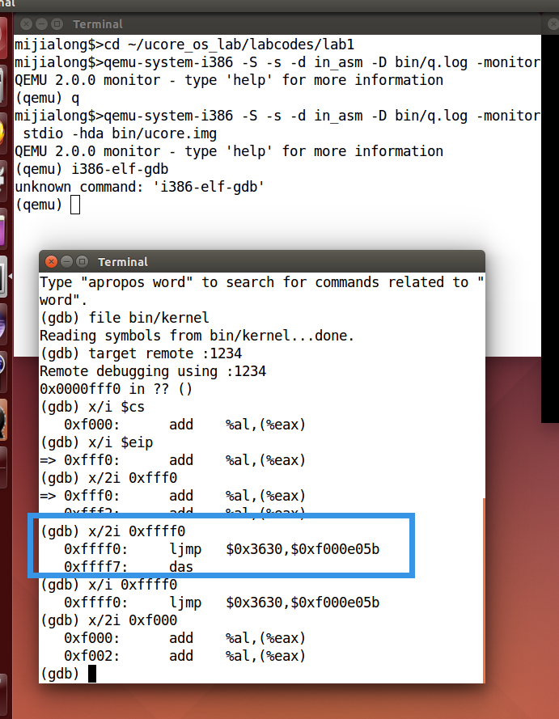
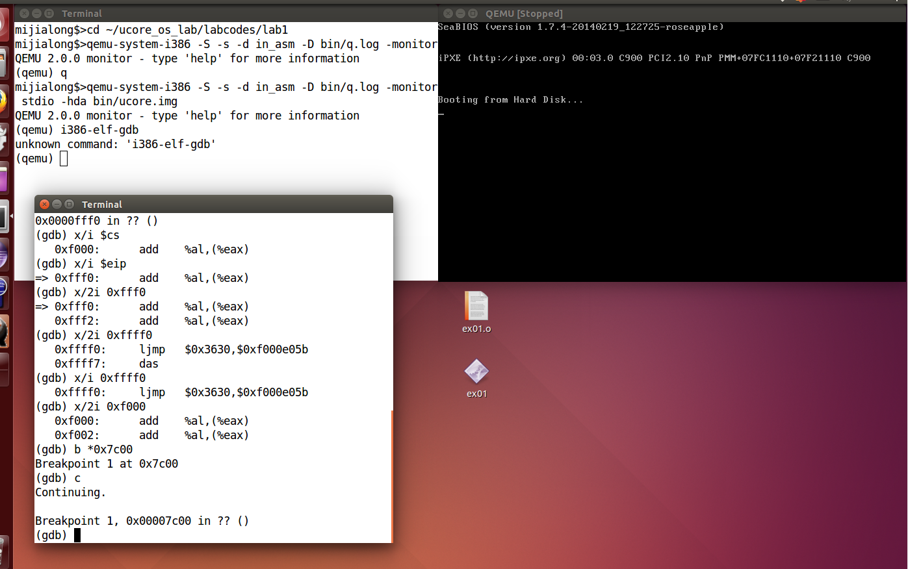

# 实验 2 第 1 部分

- [实验 2 第 1 部分](#实验-2-第-1-部分)
	- [个人信息](#个人信息)
	- [实验名称](#实验名称)
	- [实验目的](#实验目的)
	- [实验要求](#实验要求)
	- [实验环境](#实验环境)
	- [实验过程](#实验过程)
		- [修改命令提示符](#修改命令提示符)
		- [查看 lab1 中的 Makefile](#查看-lab1-中的-makefile)
			- [详细解释 Makefile 代码](#详细解释-makefile-代码)
				- [1. 设置变量](#1-设置变量)
				- [2. 调整 GCC 参数](#2-调整-gcc-参数)
				- [3. 调整 qemu 参数](#3-调整-qemu-参数)
				- [4. 选择编译器和设置编译时的参数](#4-选择编译器和设置编译时的参数)
				- [5. 其他相关命令](#5-其他相关命令)
				- [6. 设置函数](#6-设置函数)
				- [7. kernel](#7-kernel)
				- [8. 创建 bootblock](#8-创建-bootblock)
				- [9. 创建 sign 相关的工具](#9-创建-sign-相关的工具)
				- [10. 创建镜像文件](#10-创建镜像文件)
				- [11. 脚本命令相关](#11-脚本命令相关)
			- [使用 make 之后，查看打印的信息](#使用-make-之后查看打印的信息)
			- [一个被系统认为是符合规范的磁盘主引导扇区的特征是什么？](#一个被系统认为是符合规范的磁盘主引导扇区的特征是什么)
		- [使用 qemu 执行并调试 lab1 中的软件](#使用-qemu-执行并调试-lab1-中的软件)
			- [从 CPU 加电后执行第一条指令开始，单步跟踪 BIOS 的执行](#从-cpu-加电后执行第一条指令开始单步跟踪-bios-的执行)
			- [在初始化位置 0x7c00 设置实地址断点，测试断点正常](#在初始化位置-0x7c00-设置实地址断点测试断点正常)
			- [改变参数后的部分操作](#改变参数后的部分操作)
	- [实验结果](#实验结果)
	- [实验总结](#实验总结)
		- [1. qemu 启动报错](#1-qemu-启动报错)
		- [2. 找不到 bootblock.asm 文件](#2-找不到-bootblockasm-文件)

## 个人信息

- 数据科学与计算机学院
- 2018 级 米家龙

## 实验名称

系统软件启动过程

## 实验目的

- 熟悉并掌握 Ubuntu 系统的相关操作
- 熟悉并掌握 Makefile 的相关语法
- 熟悉并掌握 Make 生成执行文件的过程
- 了解并掌握硬件模拟器 Qemu 的操作
- 熟悉并掌握 gdb 的相关操作
- 学会使用 Qemu 和 gdb 运行和调试程序

## 实验要求

1. 修改 u-Core 虚拟机的命令提示符
2. 理解通过 make 生成执行文件的过程，回答如下问题：
   1. 操作系统镜像文件 ucore.img 是如何一步步生成的？（需要详细地解释 Makefile 中每一条相关命令和命令参数的含义，以及说明命令导致的相关结果）
   2. 一个被系统认为是符合规范的磁盘主引导扇区的特征是什么？
3. 使用 qemu 执行并调试 lab1 中的软件，简要写出练习过程：
   - 从 CPU 加电后执行第一条指令开始，单步跟踪 BIOS 的执行
   - 在初始化位置 0x7c00 设置实地址断点，测试断点正常
   - 在调用 qemu 时增加 `-d in_asm -D q.log` 参数，便可以将运行的汇编指令保存在 `q.log` 中。将执行的汇编代码与 bootasm.S 和 bootblock.asn 进行比较，看看二者是否一致

## 实验环境

使用老师提供的`mooc-os-2015.vdi`，在虚拟机中创建 64 位的 Ubuntu 虚拟机并加载该 vdi ，获得了版本为：

```bash
Linux moocos-VirtualBox 3.13.0-24-generic #46-Ubuntu SMP Thu Apr 10 19:11:08 UTC 2014 x86_64 x86_64 x86_64 GNU/Linux
```

的虚拟机操作系统

而为了方便使用 vs code 进行代码的编辑，会使用 windows 下的 WSL 虚拟机作为终端，和 moocos 通过 ssh 进行连接，从而实现在虚拟机外部使用命令行进行相关系统操作和文件传输。

WSL 环境配置如下：

```bash
root@LAPTOP-QTCGESHO:/mnt/d/blog/work/matrix/step1/001# uname -a
Linux LAPTOP-QTCGESHO 4.4.0-19041-Microsoft #1-Microsoft Fri Dec 06 14:06:00 PST 2019 x86_64 x86_64 x86_64 GNU/Linux
```



使用 vs code 的终端打开 WSL ，通过 ssh 连接到 moocos 虚拟机的效果如下图：



## 实验过程

### 修改命令提示符

使用 nano 修改 .bashrc 文件，在文件中添加两行：

```bash
PS1='mijialong$>'
export PS1
```

修改后如下图：


### 查看 lab1 中的 Makefile

#### 详细解释 Makefile 代码

##### 1. 设置变量

```makefile
PROJ	:= challenge # 设置变量
EMPTY	:= # 设置变量
SPACE	:= $(EMPTY) $(EMPTY) # 设置变量
SLASH	:= / # 设置变量

V       := @ # 加在每个命令前用来抑制输出，如果命令行调用 make 的时候设置了 V= ，也就是设置变量为空，这样能够使得每个命令执行的时会输出命令本身
#need llvm/cang-3.5+
#USELLVM := 1
```

##### 2. 调整 GCC 参数

```makefile
# try to infer the correct GCCPREFX
ifndef GCCPREFIX
GCCPREFIX := $(shell if i386-elf-objdump -i 2>&1 | grep '^elf32-i386$$' >/dev/null 2>&1; \
	then echo 'i386-elf-'; \
	elif objdump -i 2>&1 | grep 'elf32-i386' >/dev/null 2>&1; \
	then echo ''; \
	else echo "***" 1>&2; \
	echo "*** Error: Couldn't find an i386-elf version of GCC/binutils." 1>&2; \
	echo "*** Is the directory with i386-elf-gcc in your PATH?" 1>&2; \
	echo "*** If your i386-elf toolchain is installed with a command" 1>&2; \
	echo "*** prefix other than 'i386-elf-', set your GCCPREFIX" 1>&2; \
	echo "*** environment variable to that prefix and run 'make' again." 1>&2; \
	echo "*** To turn off this error, run 'gmake GCCPREFIX= ...'." 1>&2; \
	echo "***" 1>&2; exit 1; fi)
endif
```

该代码目的是寻找到对应 版本的 i386-elf-objdump ，如果没有，则给出了其他的解决方法：修改 Makefile 里面的 GCCPREFIX 参数之后再进行 make；如果是为了关闭这个报错，则通过 `gmake GCCPREFIX=...` 修改相关参数

其中 objdump 用于显示对象文件的信息

##### 3. 调整 qemu 参数

```makefile
# try to infer the correct QEMU
ifndef QEMU
QEMU := $(shell if which qemu-system-i386 > /dev/null; \
	then echo 'qemu-system-i386'; exit; \
	elif which i386-elf-qemu > /dev/null; \
	then echo 'i386-elf-qemu'; exit; \
	elif which qemu > /dev/null; \
	then echo 'qemu'; exit; \
	else \
	echo "***" 1>&2; \
	echo "*** Error: Couldn't find a working QEMU executable." 1>&2; \
	echo "*** Is the directory containing the qemu binary in your PATH" 1>&2; \
	echo "***" 1>&2; exit 1; fi)
endif
```

该代码的目的是为了加载合适 qemu 硬件模拟器，要求为 qemu-system-i386 ，当对应目标不存在时，则报错

```makefile
# eliminate default suffix rules
# 建立默认的 suffix 规则
.SUFFIXES: .c .S .h
```

```makefile
# delete target files if there is an error (or make is interrupted)
# 当 make 被中断、或文件存在错误时，删除对应的文件
.DELETE_ON_ERROR:
```

##### 4. 选择编译器和设置编译时的参数

```makefile
# define compiler and flags
ifndef  USELLVM
HOSTCC		:= gcc
# 默认使用gcc
HOSTCFLAGS	:= -g -Wall -O2
CC		:= $(GCCPREFIX)gcc
CFLAGS	:= -march=i686 -fno-builtin -fno-PIC -Wall -ggdb -m32 -gstabs -nostdinc $(DEFS)
CFLAGS	+= $(shell $(CC) -fno-stack-protector -E -x c /dev/null >/dev/null 2>&1 && echo -fno-stack-protector)
else
# 否则使用 clang
HOSTCC		:= clang
HOSTCFLAGS	:= -g -Wall -O2
CC		:= clang
CFLAGS	:= -march=i686 -fno-builtin -fno-PIC -Wall -g -m32 -nostdinc $(DEFS)
CFLAGS	+= $(shell $(CC) -fno-stack-protector -E -x c /dev/null >/dev/null 2>&1 && echo -fno-stack-protector)
endif
```

使用的相关参数：

- `-g` `-ggdb` 生成可调式信息
- `-Wall` 生成尽可能多的警告，数量在 -Wextra 之下
- `-O2` 使用 O2 优化
- `-march=i686` 匹配 i686 平台
- `-fno-builtin` 对所有 GNU C Compiler 内建函数，必须以 `__builtin_` 开头才能被编译器识别，否则作为未定义标识符（或者用户定义标识符）
- `-fno-stack-protector` 关闭 canary 保护，由于内核本身乱写内存的特性，如果开启了针对栈溢出的保护的话会出现问题
- `-m32` 生成 x86 架构下的 32 位环境的兼容指令
- `-nostdinc` 不搜索系统标准头文件，只是用 `-I` 选项指明的目录
- `-E` 只运行，不编译/汇编/链接
- `-x` 指定文件对应的语言，后面跟着的参数 `c` 则代表为 c 语言

##### 5. 其他相关命令

```makefile
CTYPE	:= c S # 相关代码的文件后缀

LD      := $(GCCPREFIX)ld # 使用 ld 命令
LDFLAGS	:= -m $(shell $(LD) -V | grep elf_i386 2>/dev/null | head -n 1)
LDFLAGS	+= -nostdlib

OBJCOPY := $(GCCPREFIX)objcopy
OBJDUMP := $(GCCPREFIX)objdump

COPY	:= cp # 复制命令
MKDIR   := mkdir -p # 创建文件夹命令， -p 参数则是代表文件夹存在不报错，并且在需要父文件夹的时候自动创建对应文件夹
MV		:= mv # 移动命令
RM		:= rm -f # 删除命令， -f 代表强制执行
AWK		:= awk # awk 命令
SED		:= sed # 流编辑器命令
SH		:= sh # 脚本命令
TR		:= tr # translate or delete characters，字符串控制命令
TOUCH	:= touch -c # 创建新文件命令， -c 参数代表不创建任何文件

OBJDIR	:= obj # obj 文件夹
BINDIR	:= bin # bin 文件夹

# 三个空变量，用于储存对应值
ALLOBJS	:=
ALLDEPS	:=
TARGETS	:=
```

对于 ld 命令：

- `-m` 指明生成文件格式，`elf_i386` 则生成 x86 架构的 elf 格式可执行文件
- `-V` 打印出版本和生成信息
- `-n` 不按页对齐代码
- `-nostdlib` 不链接标准库

##### 6. 设置函数

```makefile
# 加载对应函数文件
include tools/function.mk

listf_cc = $(call listf,$(1),$(CTYPE)) # 定义 list 函数

# for cc
add_files_cc = $(call add_files,$(1),$(CC),$(CFLAGS) $(3),$(2),$(4)) # 添加文件
create_target_cc = $(call create_target,$(1),$(2),$(3),$(CC),$(CFLAGS)) # 创建目标函数

# for hostcc
add_files_host = $(call add_files,$(1),$(HOSTCC),$(HOSTCFLAGS),$(2),$(3)) # 添加文件
create_target_host = $(call create_target,$(1),$(2),$(3),$(HOSTCC),$(HOSTCFLAGS)) # 创建文件

cgtype = $(patsubst %.$(2),%.$(3),$(1)) # 字符串替换
objfile = $(call toobj,$(1)) # 调用 toobj 函数，得到 .o 的对象文件
asmfile = $(call cgtype,$(call toobj,$(1)),o,asm) # 得到 .asm 的对象文件
outfile = $(call cgtype,$(call toobj,$(1)),o,out) # 得到 .out 的对象文件
symfile = $(call cgtype,$(call toobj,$(1)),o,sym) # 得到 .sym 的对象文件

# for match pattern
match = $(shell echo $(2) | $(AWK) '{for(i=1;i<=NF;i++){if(match("$(1)","^"$$(i)"$$")){exit 1;}}}'; echo $$?)
```

##### 7. kernel

```makefile
# >>>>>>>>>>>>>>>>>>>>>>>>>>>>>>>>>>>>>>>>>>>>>>>>>>>>>>>>>>>>>>>>>>>
# include kernel/user

INCLUDE	+= libs/ # 代表当前目录的 /libs

CFLAGS	+= $(addprefix -I,$(INCLUDE)) # 添加前缀， -I 为将指定文件夹加入搜索头文件的目录列表中

LIBDIR	+= libs

$(call add_files_cc,$(call listf_cc,$(LIBDIR)),libs,) # 将 LIBDIR 中的 libs 文件夹中的文件加入到库中

# -------------------------------------------------------------------
# kernel

# kernel 需要加载的库
KINCLUDE	+= kern/debug/ \
			   kern/driver/ \
			   kern/trap/ \
			   kern/mm/

# kernel 的源代码所在
KSRCDIR		+= kern/init \
			   kern/libs \
			   kern/debug \
			   kern/driver \
			   kern/trap \
			   kern/mm

KCFLAGS		+= $(addprefix -I,$(KINCLUDE)) # 从 KINCLUDE 中找需要的头文件

$(call add_files_cc,$(call listf_cc,$(KSRCDIR)),kernel,$(KCFLAGS)) # 将 KSRCDIR 中的相关文件夹中的文件加入到库中

KOBJS	= $(call read_packet,kernel libs) # 上一条指令生成的对象文件

# create kernel target
kernel = $(call totarget,kernel)

$(kernel): tools/kernel.ld # 需要 tools/kernel.ld 文件

# 使用 ld 和 objdump 生成任何能被命令运行的目标
$(kernel): $(KOBJS)
	@echo + ld $@
	$(V)$(LD) $(LDFLAGS) -T tools/kernel.ld -o $@ $(KOBJS) # 运行脚本
	@$(OBJDUMP) -S $@ > $(call asmfile,kernel)
	@$(OBJDUMP) -t $@ | $(SED) '1,/SYMBOL TABLE/d; s/ .* / /; /^$$/d' > $(call symfile,kernel) # 使用 sed 进行流文本替换

$(call create_target,kernel) # 正式创建 kernel

# -------------------------------------------------------------------
```

使用到的相关参数：

- ld 命令
  - `-T` 指明连接脚本， `tools/kernel.kd` 指明了各个段的位置以及入口等链接信息
  - `-o` 指明输出文件名
- objdump 命令
  - `-S` 将源代码和反汇编混合
  - `-t` 显示符号表的内容

##### 8. 创建 bootblock

```makefile
# create bootblock
bootfiles = $(call listf_cc,boot) # 获取 boot 中的文件
$(foreach f,$(bootfiles),$(call cc_compile,$(f),$(CC),$(CFLAGS) -Os -nostdinc)) # 对 bootfile 中的文件进行编译

bootblock = $(call totarget,bootblock)

$(bootblock): $(call toobj,$(bootfiles)) | $(call totarget,sign)
	@echo + ld $@
	$(V)$(LD) $(LDFLAGS) -N -e start -Ttext 0x7C00 $^ -o $(call toobj,bootblock) # 通过 ld 连接规则中符合先决条件的库
	@$(OBJDUMP) -S $(call objfile,bootblock) > $(call asmfile,bootblock)
	@$(OBJCOPY) -S -O binary $(call objfile,bootblock) $(call outfile,bootblock)
	@$(call totarget,sign) $(call outfile,bootblock) $(bootblock) # 用 totarget 函数对 sign 进行操作，输出 bootblock 文件和 bootblock 变量本身

$(call create_target,bootblock) # 创建 bootblock

# -------------------------------------------------------------------
```

相关命令的参数：

- ld
  - `-N` 不按页对齐代码，text 和 data 段可写
  - `-e` 设置开始地址，这里设置为入口函数 `start`
  - `-Ttext` 指明 text 段在运行时的内存地址为 `0x7C00` ，便于重定位
- objdump
  - `-O` 没有找到对应的参数

##### 9. 创建 sign 相关的工具

```makefile
# create 'sign' tools
$(call add_files_host,tools/sign.c,sign,sign) # 添加 tools/sign.c 到对应的库
$(call create_target_host,sign,sign) # 使用 HOSTCC 创建对象文件

# -------------------------------------------------------------------
```

##### 10. 创建镜像文件

```makefile
# create ucore.img
UCOREIMG	:= $(call totarget,ucore.img) # 创建镜像文件

$(UCOREIMG): $(kernel) $(bootblock)
	$(V)dd if=/dev/zero of=$@ count=10000 # 使用 dd 指令创建一个 10000 字节的 /dev/zero 文件
	$(V)dd if=$(bootblock) of=$@ conv=notrunc # 使用 dd 指令创建 bootblock 文件
	$(V)dd if=$(kernel) of=$@ seek=1 conv=notrunc # 使用 dd 指令创建 kernel 文件

$(call create_target,ucore.img) # 创建 ucore.img 对象

# >>>>>>>>>>>>>>>>>>>>>>>>>>>>>>>>>>>>>>>>>>>>>>>>>>>>>>>>>>>>>>>>>>>

$(call finish_all) # 进行链接和剩下的工作

IGNORE_ALLDEPS	= clean \
				  dist-clean \
				  grade \
				  touch \
				  print-.+ \
				  handin

ifeq ($(call match,$(MAKECMDGOALS),$(IGNORE_ALLDEPS)),0) # 查看 IGNORE_ALLDEPS 是否匹配
-include $(ALLDEPS)
endif
```

##### 11. 脚本命令相关

```makefile
# files for grade script

TARGETS: $(TARGETS)

.DEFAULT_GOAL := TARGETS

.PHONY: qemu qemu-nox debug debug-nox # 假目标

# qemu 相关命令

# 使用了显示器
qemu-mon: $(UCOREIMG)
	$(V)$(QEMU)  -no-reboot -monitor stdio -hda $< -serial null

# 使用了并行串口
qemu: $(UCOREIMG)
	$(V)$(QEMU) -no-reboot -parallel stdio -hda $< -serial null

# 用于记录并生成日志文件
log: $(UCOREIMG)
	$(V)$(QEMU) -no-reboot -d int,cpu_reset  -D q.log -parallel stdio -hda $< -serial null

# 不使用图形化输出
qemu-nox: $(UCOREIMG)
	$(V)$(QEMU)   -no-reboot -serial mon:stdio -hda $< -nographic
TERMINAL        :=gnome-terminal # 使用 gnome 终端

# debug 用命令
debug: $(UCOREIMG)
	$(V)$(QEMU) -S -s -parallel stdio -hda $< -serial null & # 使用了并行端口
	$(V)sleep 2 # 休眠 2s
	$(V)$(TERMINAL) -e "gdb -q -tui -x tools/gdbinit" # 执行 tools/gdbinit 中的命令

debug-nox: $(UCOREIMG)
	$(V)$(QEMU) -S -s -serial mon:stdio -hda $< -nographic # 使用串行端口 mon:stdio
	$(V)sleep 2 # 休眠 2s
	$(V)$(TERMINAL) -e "gdb -q -x tools/gdbinit" # 执行 tools/gdbinit 中的命令
```

关于命令参数：

- qemu：
  - `-no-reboot` 选择退出而不是重启
  - `-monitor stdio` 重定向显示器到字符设备 `stdio`
  - `-hda` 使用后续文件作为 IDE 的硬盘 0/1 镜像
  - `-parallel stdio` 将并行端口重定向到字符设备 `stdio`
  - `-serial null` 将串行端口重定向到 `null`
  - `-d` 记录特定对象的日志，如代码中的 `int` 和 `cpu_reset`
  - `-D` 设置日志日志文件的路径与名称
  - `-nographic` 不使用图形化界面并且重定向 I/O 端口到控制台
- gnome-terminal：
  - `-e` 将后续字符串作为命令在 gnome-terminal 中运行
- gdb：
  - `-q` 使用 gdb 调试的时候不打印介绍和 copyright 信息
  - `-x` 执行后面的文件 `tools/gdbinit`

```makefile
.PHONY: grade touch # 定义 grade 和 touch 为假目标

GRADE_GDB_IN	:= .gdb.in # 使用 gdb
GRADE_QEMU_OUT	:= .qemu.out # 退出 qemu
HANDIN			:= proj$(PROJ)-handin.tar.gz # 提交时的压缩包名字

TOUCH_FILES		:= kern/trap/trap.c # 使用 touch 时创建的文件名

MAKEOPTS		:= --quiet --no-print-directory # make 执行时的选项

grade: # 更新操作
  # 先执行 clean 操作
	$(V)$(MAKE) $(MAKEOPTS) clean
  # 运行脚本
	$(V)$(SH) tools/grade.sh

touch: # 创建文件
  # 使用 foreach 进行循环创建
	$(V)$(foreach f,$(TOUCH_FILES),$(TOUCH) $(f))

# 打印相关信息
print-%:
	@echo $($(shell echo $(patsubst print-%,%,$@) | $(TR) [a-z] [A-Z]))

.PHONY: clean dist-clean handin packall tags # 创建对应的假目标

# 清除 make 生成的文件
clean:
	$(V)$(RM) $(GRADE_GDB_IN) $(GRADE_QEMU_OUT) cscope* tags
	-$(RM) -r $(OBJDIR) $(BINDIR)

# 清除提交的压缩包
dist-clean: clean
	-$(RM) $(HANDIN)

# 上传压缩包
handin: packall
	@echo Please visit http://learn.tsinghua.edu.cn and upload $(HANDIN). Thanks!

# 打包
packall: clean
	@$(RM) -f $(HANDIN) # 先删除旧版
	@tar -czf $(HANDIN) `find . -type f -o -type d | grep -v '^\.*$$' | grep -vF '$(HANDIN)'` # 生成心得压缩包

# 设置 tags
tags:
	@echo TAGS ALL
	$(V)rm -f cscope.files cscope.in.out cscope.out cscope.po.out tags # 清除旧版
	$(V)find . -type f -name "*.[chS]" >cscope.files # 获取到对应的文件名列表
	$(V)cscope -bq
	$(V)ctags -L cscope.files # 生成新版
```

命令参数：

- rm
  - `-r` 删除文件夹
- tar
  - `-czf` 等价于 `-c -z -f` ，创建封存文件，通过 gzip 对 其进行过滤，使用封存文件或 ARCHIVE 设备
- find
  - `-type` 对应的类型
  - `-name` 对应的图案
- escope 在 ucore 中没有找到对应的文件，可能是函数
  - `-bq`
- ctags
  - `-L files` 使用从特定文件 files 中读取到的文件名

#### 使用 make 之后，查看打印的信息

生成过程如下图：



生成 bootblock ：

```bash
+ cc boot/bootasm.S
gcc -Iboot/ -march=i686 -fno-builtin -fno-PIC -Wall -ggdb -m32 -gstabs -nostdinc  -fno-stack-protector -Ilibs/ -Os -nostdinc -c boot/bootasm.S -o obj/boot/bootasm.o
+ cc boot/bootmain.c
gcc -Iboot/ -march=i686 -fno-builtin -fno-PIC -Wall -ggdb -m32 -gstabs -nostdinc  -fno-stack-protector -Ilibs/ -Os -nostdinc -c boot/bootmain.c -o obj/boot/bootmain.o
+ cc tools/sign.c
gcc -Itools/ -g -Wall -O2 -c tools/sign.c -o obj/sign/tools/sign.o
gcc -g -Wall -O2 obj/sign/tools/sign.o -o bin/sign
+ ld bin/bootblock
ld -m    elf_i386 -nostdlib -N -e start -Ttext 0x7C00 obj/boot/bootasm.o obj/boot/bootmain.o -o obj/bootblock.o
'obj/bootblock.out' size: 472 bytes
build 512 bytes boot sector: 'bin/bootblock' success!
```

生成 kernel ：

```bash
+ ld bin/kernel
ld -m    elf_i386 -nostdlib -T tools/kernel.ld -o bin/kernel  obj/kern/init/init.o obj/kern/libs/readline.o obj/kern/libs/stdio.o obj/kern/debug/kdebug.o obj/kern/debug/kmonitor.o obj/kern/debug/panic.o obj/kern/driver/clock.o obj/kern/driver/console.o obj/kern/driver/intr.o obj/kern/driver/picirq.o obj/kern/trap/trap.o obj/kern/trap/trapentry.o obj/kern/trap/vectors.o obj/kern/mm/pmm.o  obj/libs/printfmt.o obj/libs/string.o
```

#### 一个被系统认为是符合规范的磁盘主引导扇区的特征是什么？

通过查看 `tool/sign.c` 中的代码可以看到，在第 22 行，第 31、32 行中分别存在如下代码：

```c
char buf[512]; // 22 行

buf[510] = 0x55; // 31
buf[511] = 0xAA; // 32
```

通过上述代码以及 make 过程中产生的信息可以得到，一个符合规范的磁盘主引导扇区的特征是：

- 扇区大小固定为 512 字节
- 最后两字节分别为 0x55 和 0xAA

### 使用 qemu 执行并调试 lab1 中的软件

在使用了 ssh 连接到虚拟机的 wsl 终端中执行：

```bash
qemu-system-i386 -S -s -d in_asm -D bin/q.log -monitor stdio -hda bin/ucore.img
```

会出现报错：

```bash
mijialong$>qemu-system-i386 -S -s -d in_asm -D bin/q.log -monitor stdio -hda bin/ucore.img
QEMU 2.0.0 monitor - type 'help' for more information
(qemu) Could not initialize SDL(No available video device) - exiting
```

需要视频设备，于是使用 vbox 打开可视化桌面，仍使用上面的命令，得到下图：


#### 从 CPU 加电后执行第一条指令开始，单步跟踪 BIOS 的执行

新开终端后，使该终端进入到上一个终端所在的位置 `lab1` ，使用 `gdb` 进入调试

使用如下命令，得到相关信息：

```bash
(gdb) file bin/kernel
Reading symbols from bin/kernel...done.
(gdb) target remote :1234
# 查看 CS:EIP
Remote debugging using :1234
0x0000fff0 in ?? ()
(gdb) x/i $cs
   0xf000:	add    %al,(%eax)
(gdb) x/i $eip
=> 0xfff0:	add    %al,(%eax)
(gdb)
```

可以得到，在实际模式下， CPU 在加点之后执行的第一条指令地址为 `0xf000:0xfff0 => 0xffff0`

查看 `0xffff0` 地址的指令，得到如下结果：

```bash
(gdb) x/2i 0xffff0
   0xffff0:	ljmp   $0x3630,$0xf000e05b
   0xffff7:	das
```



可以得到，当第一条指令执行后，会调转到 `0xf000e05b` ，可以得到 BIOS 开始地址 `0xfe05b`

#### 在初始化位置 0x7c00 设置实地址断点，测试断点正常

运行结果如下图：



#### 改变参数后的部分操作

在调用 qemu 时增加 `-d in_asm -D q.log` 参数，便可以将运行的汇编指令保存在 `q.log` 中。将执行的汇编代码与 bootasm.S 和 bootblock.asm 进行比较，看看二者是否一致

使用远程终端运行下面命令

```bash
qemu -S -s -hda bin/ucore.img -monitor vc -nographic
```

并运行如下指令配置 gdb ：

```bash
set architecture i8086

target remote :1234

define hook-stop
hook-stop x/i $pc
end

set auto-load auto-path /
```


可以获得如下指令

```as
// start标志
=> 0x7c00: cli
=> 0x7c01: cld
=> 0x7c02: xor %eax,%eax
=> 0x7c04: mov %eax,%ds
=> 0x7c06: mov %eax,%es
=> 0x7c08: mov %eax,%ss


// seta20.1标志
=> 0x7c0a: in $0x64,%al
=> 0x7c0c: test $0x2,%al
=> 0x7c0e: jne 0x7c0a
=> 0x7c10: mov $0xd1,%al
=> 0x7c12: out %al,$0x64


// seta20.2标志
=> 0x7c14: in $0x64,%al
=> 0x7c16: test $0x2,%al
=> 0x7c18: jne 0x7c14
=> 0x7c1a: mov $0xdf,%al
=> 0x7c1c: out %al,$0x60
=> 0x7c1e: lgdtl (%esi)
=> 0x7c23: mov %cr0,%eax
=> 0x7c26: or $0x1,%ax
=> 0x7c2a: mov %eax,%cr0
=> 0x7c2d: ljmp $0xb866,$0x87c32


// protcseg标志
=> 0x7c32: mov $0x10,%ax
=> 0x7c36: mov %eax,%ds
=> 0x7c38: mov %eax,%es
=> 0x7c3a: mov %eax,%fs
=> 0x7c3c: mov %eax,%gs
=> 0x7c3e: mov %eax,%ss
=> 0x7c40: mov $0x0,%ebp
=> 0x7c45: mov $0x7c00,%esp
=> 0x7c4a: call 0x7d11


// 通过查看 bootasm.S 文件可知， bootmain 的开始地址是 0x7d11
// bootamin 代码
=> 0x7d11: push %ebp
=> 0x7d12: xor %ecx,%ecx
=> 0x7d14: mov %esp,%ebp
=> 0x7d16: mov $0x1000,%edx
...bootmain
```

将以上代码与 bootasm.S 和 bootblock.asm 比较，发现 bootblock.asm 中包含反汇编得到的代
码和 bootasm.S 中的代码：
并且反汇编得到的机器码和 bootasm.S 中的写法上有一定的不同，但本质是相同的。

## 实验结果

本次实验从阅读 Makefile 文件开始，逐步分析 ucore 的启动过程，通过查看 ucore.img 的生成过程，初步了解操作系统加载的过程。

## 实验总结

本次实验的代码阅读量较大，逐步解释的过程中需要查看其他资料，包括上课时的文件。

在本次实验中，遇到了

### 1. qemu 启动报错

在使用下面命令启动 qemu 时，出现了对应的报错

```bash
mijialong$>qemu-system-i386 -S -s -d in_asm -D bin/q.log -monitor stdio -hda bin/ucore.img
QEMU 2.0.0 monitor - type 'help' for more information
(qemu) Could not initialize SDL(No available video device) - exiting
```

根据之前查阅资料解释 Makefile 中的相关命令和参数，了解到该命令需要显示器，而当时使用了终端进行远程连接，因此决定使用可视化界面进行操作。

后来查阅资料之后，修改指令的 `-monitor` 为 `vc` 并且添加 `-nographic` 后，便可以终端进行启动

### 2. 找不到 bootblock.asm 文件

在 bin/ 与 tools/ 中没找到 bootblock.asm 

需要在 gdb 中添加配置

```bash
set auto-load safe-path /
```

并且生成的反编译文件是在 obj/ 文件夹