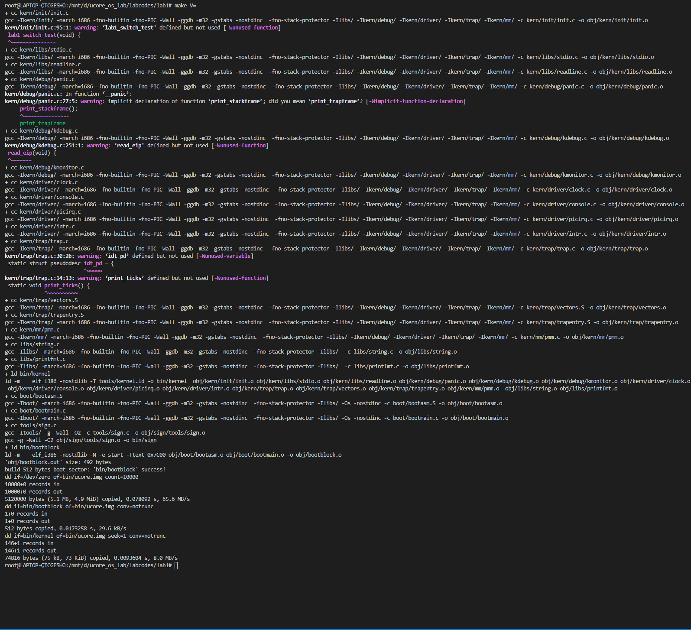
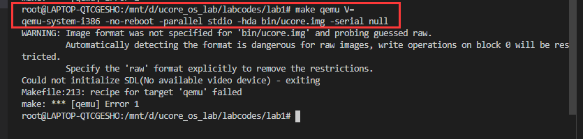
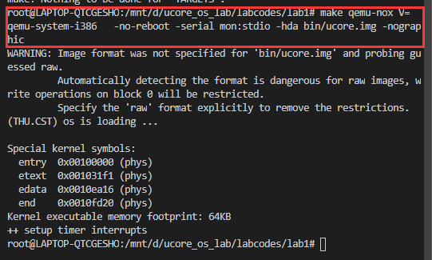
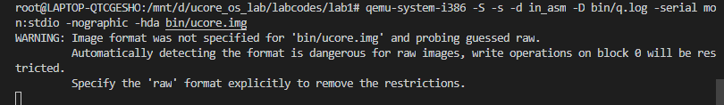
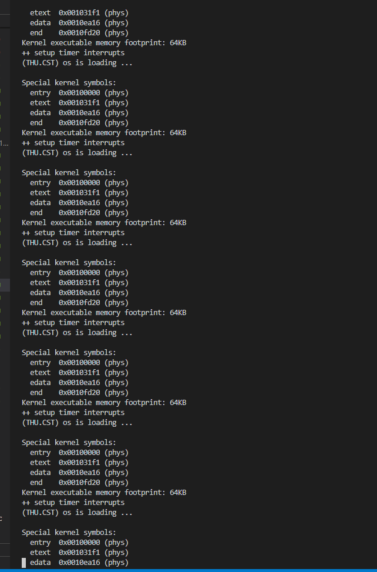
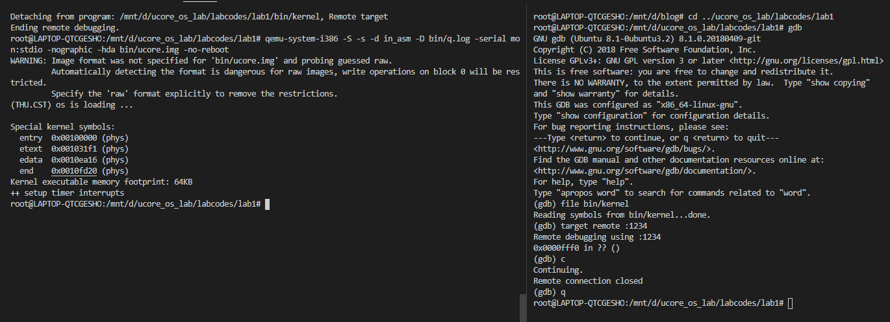
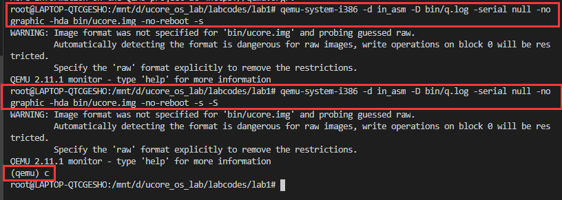

# 实验 2 第 1 部分

- [实验 2 第 1 部分](#实验-2-第-1-部分)
  - [个人信息](#个人信息)
  - [实验名称](#实验名称)
  - [实验目的](#实验目的)
  - [实验要求](#实验要求)
  - [实验环境](#实验环境)
    - [1. 虚拟机](#1-虚拟机)
    - [2. WSL](#2-wsl)
  - [实验过程](#实验过程)
    - [练习3 分析 bootloader 进入保护模式的过程](#练习3-分析-bootloader-进入保护模式的过程)
    - [练习4 分析 bootloader 加载 ELF 格式的 OS 过程](#练习4-分析-bootloader-加载-elf-格式的-os-过程)
      - [1. bootloader 如何读取硬盘扇区](#1-bootloader-如何读取硬盘扇区)
      - [2. bootloader 如何加载 ELF 格式的 OS 的](#2-bootloader-如何加载-elf-格式的-os-的)
    - [练习5 实验函数调用堆栈跟踪函数](#练习5-实验函数调用堆栈跟踪函数)
    - [练习6 完善中断初始化和处理](#练习6-完善中断初始化和处理)
  - [实验结果](#实验结果)
  - [实验总结](#实验总结)
    - [1. 尝试在 WSL 环境下运行相应代码](#1-尝试在-wsl-环境下运行相应代码)

## 个人信息

- 数据科学与计算机学院
- 2018级 米家龙

## 实验名称

系统软件启动过程 - 第2部分

## 实验目的

- 熟悉并掌握 Ubuntu 系统的相关操作
- 了解并掌握硬件模拟器 Qemu 的操作
- 熟悉并掌握 gdb 的相关操作
- 学会使用 Qemu 和 gdb 运行和调试程序
- 了解 bootloader 进入保护模式的过程
- 了解 bootloader 加载 OS 的过程
- 了解并熟悉操作系统的中断和堆栈调用

## 实验要求

1. 练习3：分析 bootloader 从实模式进入保护模式的过程
2. 练习4：分析 bootloader 加载 ELF 格式 OS 的过程
   1. bootloader 如何读取硬盘扇区的？
   2. bootloader 如何加载 ELF 格式的 OS 的？
3. 练习5：实验函数调用堆栈跟踪函数
4. 练习6：完善中断初始化和处理

## 实验环境

### 1. 虚拟机

使用老师提供的`mooc-os-2015.vdi`，在虚拟机中创建 64 位的 Ubuntu 虚拟机并加载该 vdi ，获得了版本为：

```bash
Linux moocos-VirtualBox 3.13.0-24-generic #46-Ubuntu SMP Thu Apr 10 19:11:08 UTC 2014 x86_64 x86_64 x86_64 GNU/Linux
```

的虚拟机操作系统

### 2. WSL

WSL 配置如下：

```bash
root@LAPTOP-QTCGESHO:/mnt/d/blog/work/matrix/step1/001# uname -a
Linux LAPTOP-QTCGESHO 4.4.0-19041-Microsoft #1-Microsoft Fri Dec 06 14:06:00 PST 2019 x86_64 x86_64 x86_64 GNU/Linux
```

## 实验过程

### 练习3 分析 bootloader 进入保护模式的过程

从前两个练习中可以分析得到， bootloader 在接手 BIOS 之后，开始执行 `bootasm.S` 中的源码，此时系统处于实模式的运行状态，地址为16位，需要通过修改 A20 地址线进行引导进入保护模式，从而扩大地址到32位并且内存扩大到4G

查看 bootasm.S 的代码，了解 bootloader 是如何从实模式转到保护模式的

```s
.set PROT_MODE_CSEG,        0x8                     # kernel code segment selector
.set PROT_MODE_DSEG,        0x10                    # kernel data segment selector
.set CR0_PE_ON,             0x1                     # protected mode enable flag
```

上述代码通过宏定义了内核代码段选择子、内核数据段选择子以及保护模式标志位

```s
# start address should be 0:7c00, in real mode, the beginning address of the running bootloader
.globl start
start:
.code16                                             # Assemble for 16-bit mode
    cli                                             # Disable interrupts
    cld                                             # String operations increment

    # Set up the important data segment registers (DS, ES, SS).
    xorw %ax, %ax                                   # Segment number zero
    movw %ax, %ds                                   # -> Data Segment
    movw %ax, %es                                   # -> Extra Segment
    movw %ax, %ss                                   # -> Stack Segment
```

上述代码中，设置全局标识符为 `start` ，在该代码中，先设置了运行模式为16位，并且关闭了中断信号的处理


```s
    # Enable A20:
    #  For backwards compatibility with the earliest PCs, physical
    #  address line 20 is tied low, so that addresses higher than
    #  1MB wrap around to zero by default. This code undoes this.
seta20.1:
    inb $0x64, %al                                  # Wait for not busy(8042 input buffer empty).
    testb $0x2, %al
    jnz seta20.1

    movb $0xd1, %al                                 # 0xd1 -> port 0x64
    outb %al, $0x64                                 # 0xd1 means: write data to 8042's P2 port

seta20.2:
    inb $0x64, %al                                  # Wait for not busy(8042 input buffer empty).
    testb $0x2, %al
    jnz seta20.2

    movb $0xdf, %al                                 # 0xdf -> port 0x60
    outb %al, $0x60                                 # 0xdf = 11011111, means set P2's A20 bit(the 1 bit) to 1

    # Switch from real to protected mode, using a bootstrap GDT
    # and segment translation that makes virtual addresses
    # identical to physical addresses, so that the
    # effective memory map does not change during the switch.
    lgdt gdtdesc
    movl %cr0, %eax
    orl $CR0_PE_ON, %eax
    movl %eax, %cr0

    # Jump to next instruction, but in 32-bit code segment.
    # Switches processor into 32-bit mode.
    ljmp $PROT_MODE_CSEG, $protcseg

.code32                                             # Assemble for 32-bit mode
protcseg:
    # Set up the protected-mode data segment registers
    movw $PROT_MODE_DSEG, %ax                       # Our data segment selector
    movw %ax, %ds                                   # -> DS: Data Segment
    movw %ax, %es                                   # -> ES: Extra Segment
    movw %ax, %fs                                   # -> FS
    movw %ax, %gs                                   # -> GS
    movw %ax, %ss                                   # -> SS: Stack Segment

    # Set up the stack pointer and call into C. The stack region is from 0--start(0x7c00)
    movl $0x0, %ebp
    movl $start, %esp
    call bootmain

    # If bootmain returns (it shouldn't), loop.
spin:
    jmp spin

# Bootstrap GDT
.p2align 2                                          # force 4 byte alignment
gdt:
    SEG_NULLASM                                     # null seg
    SEG_ASM(STA_X|STA_R, 0x0, 0xffffffff)           # code seg for bootloader and kernel
    SEG_ASM(STA_W, 0x0, 0xffffffff)                 # data seg for bootloader and kernel

gdtdesc:
    .word 0x17                                      # sizeof(gdt) - 1
    .long gdt                                       # address gdt

```

### 练习4 分析 bootloader 加载 ELF 格式的 OS 过程

#### 1. bootloader 如何读取硬盘扇区

#### 2. bootloader 如何加载 ELF 格式的 OS 的

### 练习5 实验函数调用堆栈跟踪函数

### 练习6 完善中断初始化和处理

## 实验结果

## 实验总结

### 1. 尝试在 WSL 环境下运行相应代码

在 WSL 环境下，使用命令 `sudo apt install qemu` 安装 qemu 后，对 lab1 的代码进行编译，发现能够正常编译



使用 `make qemu V=` 则会报错



其中包含了两个错误，第一个是关于镜像格式的错误；第二个是关于显示器设备的问题，可以通过添加参数 `-nographic` 来解决

使用命令 `make qemu-nox V=` 后发现能够得到想要的结果



这两条命令差别除了是否显示图形化界面之外，还包括了并行/串行端口的分配

接下来使用前一份实验报告中的 qemu 命令，尝试复现实验2第1部分

在此之前需要对命令进行修改，修改为 `qemu-system-i386 -S -s -d in_asm -D bin/q.log -serial mon:stdio -nographic -hda bin/ucore.img`

发现终端卡死，即使使用 `ctrl + c` 进行终止也没有反应



但是在 gdb 进行调试之后，仍然会进入无限循环模式



加上了 `-no-reboot` 参数之后，虽然出现了终端卡死的情况，但是在进入了 gdb 并且进行了相关调试操作之后，能够正常结束，这表明了虽然终端卡死，但是程序是正常运行的



经过控制变量法测试，发现是 `-S` 参数的问题，在没有该参数时，qemu 能够正常运行，在带有该参数时，则会导致终端卡死，无法接收中断信号

已知该参数是在模拟启动时，将 CPU 冻结，可以通过在 qemu 界面输入 `c` 使得 CPU 停止冻结，开始执行相关文件

猜测是因为使用了 `-serial mon:stdio` 参数，使得 OS 的进程反映到当前的终端上，而 `-S` 参数的存在导致了反映到当前终端的 OS 没有办法接收到信号，而 qemu 本身被 OS 覆盖，也因此无法接收到终端信号的输入，从而使得整个终端卡死

于是将串行端口的相关参数修改为 `-serial null` 再执行命令，进过测试，可以发现能够正常使用，符合上述猜测



综上，可以尝试使用 WSL1 来进行相关的模拟

但是由于 gcc 版本过高的问题，对于会遇到什么样的奇怪 bug 没有定数，因此暂时依然选择使用 moocos 虚拟机进行相关的练习，但是会在练习之后尝试使用 wsl 复现练习情况