# 实验4

## 个人信息

- 数据科学与计算机学院
- 2018级 软工3班
- 18342075
- 米家龙

## 目录

- [实验4](#实验4)
  - [个人信息](#个人信息)
  - [目录](#目录)
  - [实验名称](#实验名称)
  - [实验目的](#实验目的)
  - [实验要求](#实验要求)
  - [实验内容](#实验内容)
  - [实验环境](#实验环境)
  - [实验过程](#实验过程)
    - [练习0：填写已有实验](#练习0填写已有实验)
    - [练习1：给未被映射的地址映射上物理页](#练习1给未被映射的地址映射上物理页)
      - [查看 vmm.c 开头的注释](#查看-vmmc-开头的注释)
      - [查看 do_pgfault() 函数的介绍](#查看-do_pgfault-函数的介绍)
      - [查看 do_pgfault() 函数中练习1的相关注释](#查看-do_pgfault-函数中练习1的相关注释)
      - [完成 do_pgfault() 函数](#完成-do_pgfault-函数)
      - [回答问题](#回答问题)
        - [请描述页目录项（Page Directory Entry）和页表项（Page Table Entry）中组成部分对 ucore 实现页替换算法的潜在用处。](#请描述页目录项page-directory-entry和页表项page-table-entry中组成部分对-ucore-实现页替换算法的潜在用处)
        - [如果 ucore 的缺页服务例程在执行过程中访问内存，出现了页访问异常，请问硬件要做哪些事情？](#如果-ucore-的缺页服务例程在执行过程中访问内存出现了页访问异常请问硬件要做哪些事情)
    - [练习2：补充完成基于 FIFO 的页面替换算法](#练习2补充完成基于-fifo-的页面替换算法)
      - [完善 do_pgfault() 函数](#完善-do_pgfault-函数)
      - [其他函数的实现](#其他函数的实现)
        - [完成 _fifo_map_swappable() 函数](#完成-_fifo_map_swappable-函数)
        - [完成 _fifo_swap_out_victim() 函数](#完成-_fifo_swap_out_victim-函数)
      - [测试](#测试)
      - [回答问题](#回答问题-1)
        - [设计方案](#设计方案)
        - [需要被换出的页特征](#需要被换出的页特征)
        - [在 ucore 中如何判断具有这样特征的页](#在-ucore-中如何判断具有这样特征的页)
        - [何时进行换入换出操作](#何时进行换入换出操作)
  - [实验结果](#实验结果)
  - [实验总结](#实验总结)
    - [完成实验后，请分析ucore_lab中提供的参考答案，并请在实验报告中说明你的实现与参考答案的区别](#完成实验后请分析ucore_lab中提供的参考答案并请在实验报告中说明你的实现与参考答案的区别)
    - [列出你认为本实验中重要的知识点，以及与对应的OS原理中的知识点，并简要说明你对二者的含义，关系，差异等方面的理解（也可能出现实验中的知识点没有对应的原理知识点）](#列出你认为本实验中重要的知识点以及与对应的os原理中的知识点并简要说明你对二者的含义关系差异等方面的理解也可能出现实验中的知识点没有对应的原理知识点)
    - [列出你认为OS原理中很重要， 但在实验中没有对应上的知识点](#列出你认为os原理中很重要-但在实验中没有对应上的知识点)

## 实验名称

实验4 虚拟内存管理

## 实验目的

- 了解虚拟内存的 Page Fault 异常处理实现
- 了解页替换算法在操作系统中的实现

## 实验要求

- 本次实验是在前一实验的基础上，借助于页表机制和 lab1 中涉及的中断异常处理机制，完成 **Page Fault 异常处理**和 **FIFO 页替换算法**的实现。
- 实验原理最大的区别是在设计了如何在磁盘上缓存内存页，从而能够支持虚存管理，提供一个比实际物理内存空间“更大”的虚拟内存空间给系统使用。
- 这个实验与实际操作系统中的实现比较起来要简单，不过需要了解 UCORE 实验一和实验二的具体实现。实际操作系统系统中的虚拟内存管理设计与实现是相当复杂的，涉及到与进程管理系统、文件系统等的交叉访问。

## 实验内容

- 练习0：填写已有实验
- 练习1：给未被映射的地址映射上物理页（需要编程）
- 练习2：补充完成基于 **FIFO** 的页面替换算法（需要编程）

## 实验环境

使用老师提供的`mooc-os-2015.vdi`，在虚拟机中创建 64 位的 Ubuntu 虚拟机并加载该 vdi ，获得了版本为：

```bash
Linux moocos-VirtualBox 3.13.0-24-generic #46-Ubuntu SMP Thu Apr 10 19:11:08 UTC 2014 x86_64 x86_64 x86_64 GNU/Linux
```

的虚拟机操作系统

并且使用 vscode 配合 Remote SSH 插件，实现通过远程终端在 windows 环境的对文件的编辑

## 实验过程

### 练习0：填写已有实验

> 本实验依赖 ucore 实验1/2。请把你做的 ucore 实验1/2的代码填入本实验中代码中有 “LAB1”, “LAB2” 的注释相应部分。

根据之前的实验，需要修改的地方为

- kern/debug/kdebug.c
  - print_stackfram()
- kern/mm/default_pmm.c
  - default_init_memmap()
  - default_alloc_pages()
  - default_free_pages()
- kern/mm/pmm.c
  - get_pte()
  - page_remove_pte()
- kern/trap/trap.c
  - idt_init()
  - trap_dispatch()

详情见下图

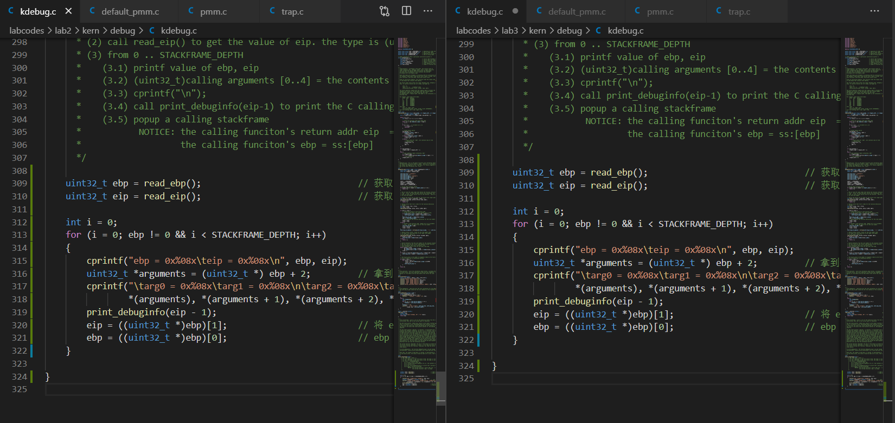

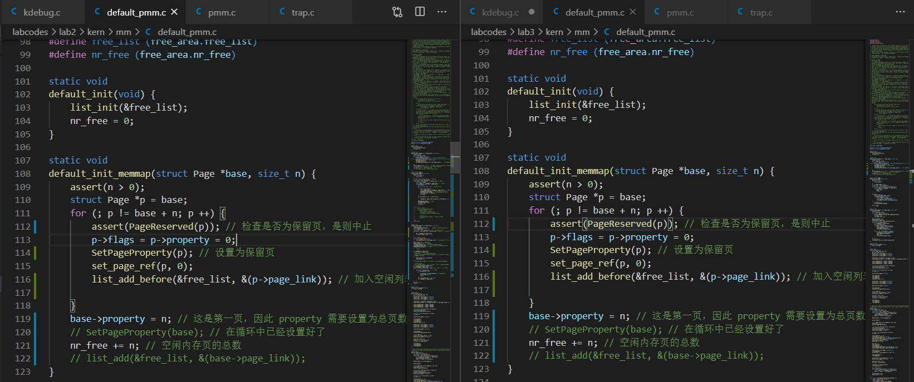

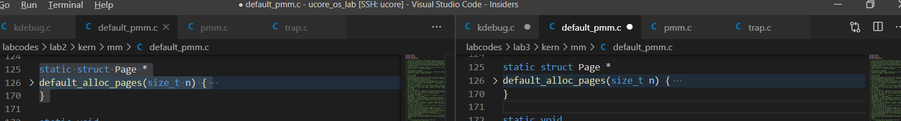

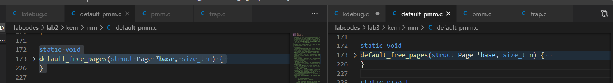

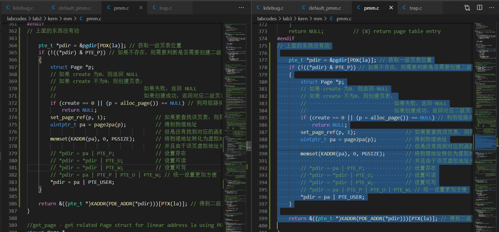

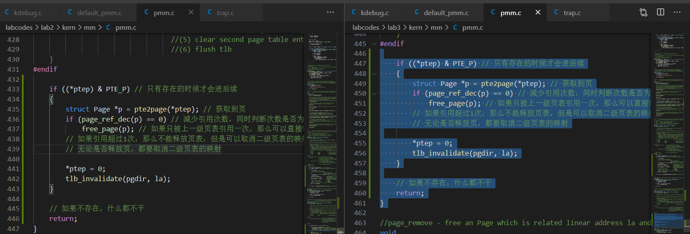

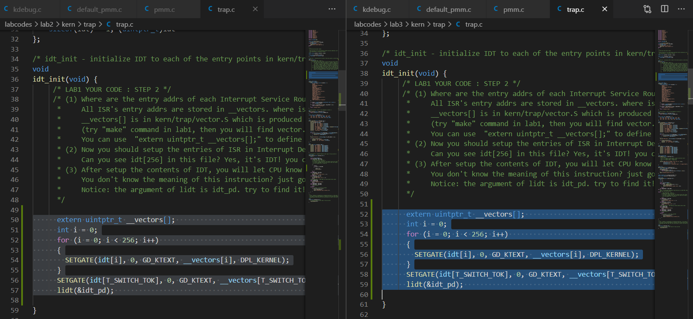

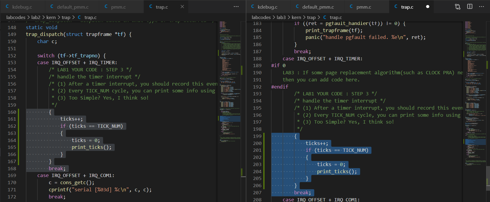

进行测试，出现如下显示

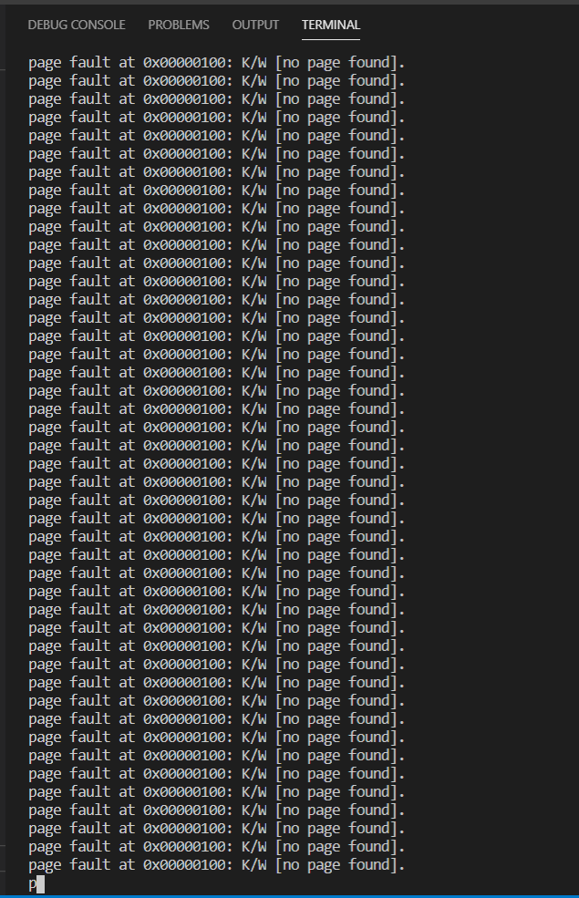

### 练习1：给未被映射的地址映射上物理页

- 完成 **do_pgfault（mm/vmm.c）函数**，给未被映射的地址映射上物理页。设置访问权限的时候需要参考页面所在 VMA 的权限，同时需要注意映射物理页时需要操作内存控制结构所指定的页表，而不是内核的页表。注意：在LAB3 EXERCISE 1 处填写代码。执行 `make qemu` 后， 如果通过 **check_pgfault 函数**的测试后， 会有 `check_pgfault() succeeded!` 的输出，表示练习1基本正确。
- 请在实验报告中简要说明你的设计实现过程。请回答如下问题：
  - 请描述页目录项（Page Directory Entry）和页表项（Page Table Entry）中组成部分对 ucore 实现页替换算法的**潜在用处**。
  - 如果 ucore 的缺页服务例程在执行过程中访问内存，出现了**页访问异常**，请问硬件要做哪些事情？

#### 查看 vmm.c 开头的注释

查看 kern/mm/vmm.c 开头的注释：

```cpp
/* 
  vmm design include two parts: mm_struct (mm) & vma_struct (vma)
  mm is the memory manager for the set of continuous virtual memory  
  area which have the same PDT. vma is a continuous virtual memory area.
  There a linear link list for vma & a redblack link list for vma in mm.
---------------
  mm related functions:
   golbal functions
     struct mm_struct * mm_create(void)
     void mm_destroy(struct mm_struct *mm)
     int do_pgfault(struct mm_struct *mm, uint32_t error_code, uintptr_t addr)
--------------
  vma related functions:
   global functions
     struct vma_struct * vma_create (uintptr_t vm_start, uintptr_t vm_end,...)
     void insert_vma_struct(struct mm_struct *mm, struct vma_struct *vma)
     struct vma_struct * find_vma(struct mm_struct *mm, uintptr_t addr)
   local functions
     inline void check_vma_overlap(struct vma_struct *prev, struct vma_struct *next)
---------------
   check correctness functions
     void check_vmm(void);
     void check_vma_struct(void);
     void check_pgfault(void);
*/
```

注释中介绍了俩种结构体：

- `mm` 是内存管理器，用于管理使用相同 pdt 的连续虚拟内存空间的集合，相关函数为：
  - 全局函数 
    - mm_create() 用于创建 mm
    - mm_destroy() 用于销毁 mm
    - do_pgfault() 用于处理页错误
- `vma` 则是连续虚拟内存空间，相关函数为：
  - 全局函数
    - vma_create() 用于创建 vma
    - insert_vma_struct(mm, vma) 用于将 vma 插入到 mm 的列表连接中
    - find_vma(mm, addr) 用于在 mm 中搜寻 vma `(vma->vm_start <= addr <= vma_vm_end)`
  - 局部函数
    - check_vma_overlap(vma1, vma2) 用于判断 vma1 是否交叠 vma2
- 其他校验函数：
  - check_vmm() 用于检查 vmm 的正确性
  - check_vma_struct() 用于检查 vma 的正确性
  - check_pgfault() 用于检查 pgfault_handler 的正确性

分别查看上述结构体的组成和函数的使用方法

#### 查看 do_pgfault() 函数的介绍

查看 kern/mm/vmm.c 中 do_pgfault() 函数的注释：

```cpp
/* do_pgfault - 用于处理页错误的中断处理程序
 * @mm         : 用于控制使用相同 pdt 的 vma 的结构体
 * @error_code : 错误代码，由 x86 硬件设置，被记录在 trapframe->tf_err 中
 * @addr       : 导致内存访问异常的地址，是 CR2 寄存器中的内容
 *
 * 调用关系图（具体见下图）: trap--> trap_dispatch-->pgfault_handler-->do_pgfault
 * 处理器为ucore的do_pgfault函数提供两项信息，以帮助诊断异常并从中恢复。
 *   (1) CR2 寄存器的内容。处理器通过加载 CR2 寄存器获取32位线性地址，该地址会由于异常而更新
 *       do_pgfault() 函数能够通过这个地址定位到相关的页目录和页表条目
 *   (2) 内核堆栈上的错误代码/页错误的错误代码和其他异常的格式不同
 *       错误代码告诉异常处理程序三件事情：
 *         -- The P flag   (bit 0)  页面不存在（0） | 访问权限冲突或保留位的使用（1）
 *         -- The W/R flag (bit 1)  导致异常内存访问的操作是读（0）|写（1）
 *         -- The U/S flag (bit 2)  发生异常时，异常处理程序是在用户态（1）还是特权级（0）执行
 */
```

查阅资料，了解关于虚拟地址及其空间和物理地址之间的关系：


以及 do_pgfault() 函数的调用关系：

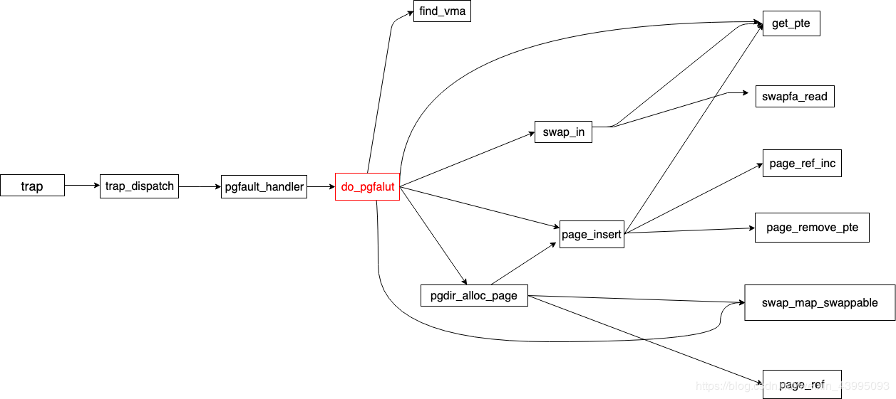

#### 查看 do_pgfault() 函数中练习1的相关注释

查看相关注释：

```cpp
/*LAB3 EXERCISE 1: YOUR CODE
* Maybe you want help comment, BELOW comments can help you finish the code
*
* Some Useful MACROs and DEFINEs, you can use them in below implementation.
* MACROs or Functions:
*   get_pte : 如果在包含该 pte 的 pt 不存在，那么获取一个 pte 并且，为 la 返回该 pte 的内核虚拟地址，并为 pt 分配一个页（需要注意第三个参数为 '1'）
*   pgdir_alloc_page : 调用 alloc_page() 和 page_insert() 函数分别进行：
*                      （1） 分配一页大小的内存
*                      （2） 设置有线性地址 la 和 pdt pgdir 的地址映射 pa <---> la
* DEFINES:
*   VM_WRITE  : 如果 vma->vm_flags & VM_WRITE == 1/0, 代表该 vma 是可写/不可写
*   PTE_W           0x002                   // 可写
*   PTE_U           0x004                   // 用户可用
* VARIABLES:
*   mm->pgdir : vma 的 pdt
*
*/
```

```cpp
#if 0
    /*LAB3 EXERCISE 1: YOUR CODE*/
    ptep = ???              //(1) try to find a pte, if pte's PT(Page Table) isn't existed, then create a PT.
    if (*ptep == 0) {
                            //(2) if the phy addr isn't exist, then alloc a page & map the phy addr with logical addr

    }
    else {
        if(swap_init_ok) {
            struct Page *page=NULL;
                                    //(1）According to the mm AND addr, try to load the content of right disk page
                                    //    into the memory which page managed.
                                    //(2) According to the mm, addr AND page, setup the map of phy addr <---> logical addr
                                    //(3) make the page swappable.
        }
        else {
            cprintf("no swap_init_ok but ptep is %x, failed\n",*ptep);
            goto failed;
        }
   }
#endif
```

因此，具体步骤为：

1. 尝试寻找 pte ，如果 pte 的 pt 不存在，那么创建一个 pt
2. 如果 pa （物理地址）不存在，那么分配一个页，并且将 **逻辑地址** 和 pa 映射起来

#### 完成 do_pgfault() 函数

修改 do_pgfault() 函数的代码为：

```cpp
int
do_pgfault(struct mm_struct *mm, uint32_t error_code, uintptr_t addr) {
    int ret = -E_INVAL;
    //try to find a vma which include addr
    struct vma_struct *vma = find_vma(mm, addr);

    pgfault_num++;
    //If the addr is in the range of a mm's vma?
    if (vma == NULL || vma->vm_start > addr) {
        cprintf("not valid addr %x, and  can not find it in vma\n", addr);
        goto failed;
    }
    //check the error_code
    switch (error_code & 3) {
    default:
            /* error code flag : default is 3 ( W/R=1, P=1): write, present */
    case 2: /* error code flag : (W/R=1, P=0): write, not present */
        if (!(vma->vm_flags & VM_WRITE)) {
            cprintf("do_pgfault failed: error code flag = write AND not present, but the addr's vma cannot write\n");
            goto failed;
        }
        break;
    case 1: /* error code flag : (W/R=0, P=1): read, present */
        cprintf("do_pgfault failed: error code flag = read AND present\n");
        goto failed;
    case 0: /* error code flag : (W/R=0, P=0): read, not present */
        if (!(vma->vm_flags & (VM_READ | VM_EXEC))) {
            cprintf("do_pgfault failed: error code flag = read AND not present, but the addr's vma cannot read or exec\n");
            goto failed;
        }
    }
    /* IF (write an existed addr ) OR
     *    (write an non_existed addr && addr is writable) OR
     *    (read  an non_existed addr && addr is readable)
     * THEN
     *    continue process
     */
    uint32_t perm = PTE_U;
    if (vma->vm_flags & VM_WRITE) {
        perm |= PTE_W;
    }
    addr = ROUNDDOWN(addr, PGSIZE);

    ret = -E_NO_MEM;

    pte_t *ptep=NULL;
#if 0
    /*LAB3 EXERCISE 1: YOUR CODE*/
    ptep = ???              //(1) try to find a pte, if pte's PT(Page Table) isn't existed, then create a PT.
    if (*ptep == 0) {
                            //(2) if the phy addr isn't exist, then alloc a page & map the phy addr with logical addr

    }
    else {
    /*LAB3 EXERCISE 2: YOUR CODE
    * Now we think this pte is a  swap entry, we should load data from disk to a page with phy addr,
    * and map the phy addr with logical addr, trigger swap manager to record the access situation of this page.
    *
    *  Some Useful MACROs and DEFINEs, you can use them in below implementation.
    *  MACROs or Functions:
    *    swap_in(mm, addr, &page) : alloc a memory page, then according to the swap entry in PTE for addr,
    *                               find the addr of disk page, read the content of disk page into this memroy page
    *    page_insert ： build the map of phy addr of an Page with the linear addr la
    *    swap_map_swappable ： set the page swappable
    */
        if(swap_init_ok) {
            struct Page *page=NULL;
                                    //(1）According to the mm AND addr, try to load the content of right disk page
                                    //    into the memory which page managed.
                                    //(2) According to the mm, addr AND page, setup the map of phy addr <---> logical addr
                                    //(3) make the page swappable.
        }
        else {
            cprintf("no swap_init_ok but ptep is %x, failed\n",*ptep);
            goto failed;
        }
   }
#endif
    // 以下是 练习1 代码
    ptep = get_pte(mm->pgdir, addr, 1); // 获取 ptep
    if (ptep == NULL)                   // 如果 ptep 的 pt 不存在
    {
        cprintf("ptep isn't existed, get_pte() in do_pafault() failed\n");
        goto failed;
    }

    if (*ptep == 0) // 如果 pa 不存在
    {
        if(pgdir_alloc_page(mm->pgdir, addr, perm) == NULL) // 尝试分配页并且映射
        {
            cprintf("pa isn't existed, and alloc page failed in do_pgfault() failed\n");
            goto failed;
        }
    }

   ret = 0;
failed:
    return ret;
}
```

使用 `make` 生成文件后，运行 `make qemu-nox` ，得到结果如下：

具体结果如下：

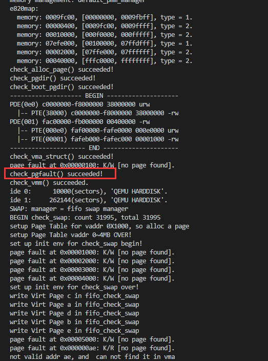

完整结果如下：

> 由于图片过长，在生成 pdf 时会被截断；在第二个红框处能够得到正确的结果

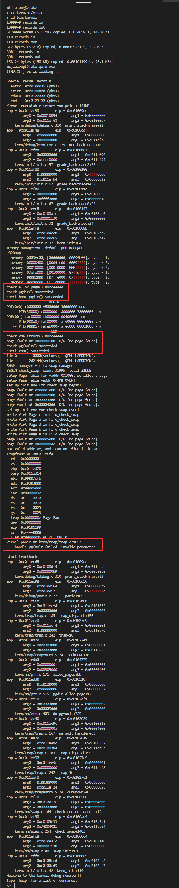

#### 回答问题

##### 请描述页目录项（Page Directory Entry）和页表项（Page Table Entry）中组成部分对 ucore 实现页替换算法的潜在用处。

从实验3和 kern/mm/mmu.h 中可以得到

```cpp
/* page table/directory entry flags */
#define PTE_P           0x001                   // Present
#define PTE_W           0x002                   // Writeable
#define PTE_U           0x004                   // User
#define PTE_PWT         0x008                   // Write-Through
#define PTE_PCD         0x010                   // Cache-Disable
#define PTE_A           0x020                   // Accessed
#define PTE_D           0x040                   // Dirty
#define PTE_PS          0x080                   // Page Size
#define PTE_MBZ         0x180                   // Bits must be zero
#define PTE_AVAIL       0xE00                   // Available for software use
                                                // The PTE_AVAIL bits aren't used by the kernel or interpreted by the
                                                // hardware, so user processes are allowed to set them arbitrarily.
#define PTE_USER        (PTE_U | PTE_W | PTE_P)
```

可以得到如下表格

|   名称    | 地址所在位 |             作用             |
| :-------: | :--------: | :--------------------------: |
|   PTE_P   |     0      |            存在位            |
|   PTE_W   |     1      |             可写             |
|   PTE_U   |     2      |    访问该页所需要的特权级    |
|  PTE_PWT  |     3      |    是否使用 write-through    |
|  PTE_PCD  |     4      |   是否使用缓存，1位不使用    |
|   PTE_A   |     5      |         是否被使用过         |
|   PTE_D   |     6      |             脏位             |
|  PTE_PS   |     7      |            页大小            |
|  PTE_MBZ  |     8      |           必须为0            |
| PTE_AVAIL |    9~11    | 内核和中断无效，用户可以设置 |

已知页替换的两个操作：**换入**和**换出**：

- 换入：将**虚拟地址对应的磁盘页内容**读取到**内存**中
- 换出：将**虚拟页的内容**写入到磁盘

根据上述操作的相关步骤，可以得到

- 页表项记录虚拟页在磁盘中的位置，在换入换出操作中提供**磁盘位置相关信息**
- 页目录可以用于**索引**对应的页表
  
并且在上述表格中，可以看到 `PTE_AVAIL` 是保留的三位，这三位可供操作系统为页替换算法提供支持


##### 如果 ucore 的缺页服务例程在执行过程中访问内存，出现了页访问异常，请问硬件要做哪些事情？

### 练习2：补充完成基于 FIFO 的页面替换算法

- 完成 vmm.c 中的 **do_pgfault 函数**，并且在实现 FIFO 算法的 swap_fifo.c 中完成 **map_swappable** 和 **swap_out_victim** 函数。通过对 swap 的测试。注意：在 LAB3 EXERCISE 2 处填写代码。执行 `make qemu` 后，如果通过 check_swap 函数的测试后，会有 `check_swap()succeeded!` 的输出，表示练习2基本正确。
- 请在实验报告中回答如下问题：
  - 如果要在 ucore 上实现“**extended clock页替换算法**”，现有的 swap_manager 框架是否足以支持在 ucore 中实现此算法？
    - 如果是，请给你的设计方案。
    - 如果不是，请给出你的新的扩展和基此扩展的设计方案。
    - 并需要回答如下问题：
      - 需要被换出的页的特征是什么？
      - 在 ucore 中如何判断具有这样特征的页？
      - 何时进行换入和换出操作？

#### 完善 do_pgfault() 函数

查看相关的注释

```cpp
#if 0
    /*LAB3 EXERCISE 1: YOUR CODE*/
    ptep = ???              //(1) try to find a pte, if pte's PT(Page Table) isn't existed, then create a PT.
    if (*ptep == 0) {
                            //(2) if the phy addr isn't exist, then alloc a page & map the phy addr with logical addr

    }
    else {
    /*LAB3 EXERCISE 2: YOUR CODE
    * pte 现在是交换项
    * 应该使用 pa 将数据从磁盘加载到页
    * 使用逻辑地址映射 pa ，触发交换管理器来记录页面访问情况
    *
    *  Some Useful MACROs and DEFINEs, you can use them in below implementation.
    *  MACROs or Functions:
    *    swap_in(mm, addr, &page) : 分配内存页，然后根据 pte 中地址的交换项，找到磁盘页面的地址，将磁盘页面的地址读入此内存页
    *    page_insert ： 建立页中的 pa 和线性地址的映射
    *    swap_map_swappable ： 使页可交换
    */
        if(swap_init_ok) {
            struct Page *page=NULL;
                                    //(1）根据 mm 和 addr ，尝试从正确的磁盘页中加载内容到页管理的内存
                                    //(2) 根据 mm, addr 和 页，设置 pa <---> 逻辑地址的映射
                                    //(3) 使页可交换
        }
        else {
            cprintf("no swap_init_ok but ptep is %x, failed\n",*ptep);
            goto failed;
        }
   }
#endif
```

查看注释，可以得到相关步骤：

1. 根据 mm 和 addr ，尝试从正确的磁盘页中加载内容到页管理的内存
2. 根据 mm, addr 和 页，设置 `pa <---> 逻辑地址`的映射
3. 使页可交换

> 需要注意的地方：
> 
> - 在设置映射时，需要设置**物理页权限**，用于保证和对应的**虚拟页权限**一致
> - 在设置完页**可交换**之后，需要设置页对应的**虚拟地址**

完善 do_pgfault() 函数：

```cpp
int
do_pgfault(struct mm_struct *mm, uint32_t error_code, uintptr_t addr) {
    int ret = -E_INVAL;
    //try to find a vma which include addr
    struct vma_struct *vma = find_vma(mm, addr);

    pgfault_num++;
    //If the addr is in the range of a mm's vma?
    if (vma == NULL || vma->vm_start > addr) {
        cprintf("not valid addr %x, and  can not find it in vma\n", addr);
        goto failed;
    }
    //check the error_code
    switch (error_code & 3) {
    default:
            /* error code flag : default is 3 ( W/R=1, P=1): write, present */
    case 2: /* error code flag : (W/R=1, P=0): write, not present */
        if (!(vma->vm_flags & VM_WRITE)) {
            cprintf("do_pgfault failed: error code flag = write AND not present, but the addr's vma cannot write\n");
            goto failed;
        }
        break;
    case 1: /* error code flag : (W/R=0, P=1): read, present */
        cprintf("do_pgfault failed: error code flag = read AND present\n");
        goto failed;
    case 0: /* error code flag : (W/R=0, P=0): read, not present */
        if (!(vma->vm_flags & (VM_READ | VM_EXEC))) {
            cprintf("do_pgfault failed: error code flag = read AND not present, but the addr's vma cannot read or exec\n");
            goto failed;
        }
    }
    uint32_t perm = PTE_U;
    if (vma->vm_flags & VM_WRITE) {
        perm |= PTE_W;
    }
    addr = ROUNDDOWN(addr, PGSIZE);

    ret = -E_NO_MEM;

    pte_t *ptep=NULL;
#if 0
    /*LAB3 EXERCISE 1: YOUR CODE*/
    ptep = ???              //(1) try to find a pte, if pte's PT(Page Table) isn't existed, then create a PT.
    if (*ptep == 0) {
                            //(2) if the phy addr isn't exist, then alloc a page & map the phy addr with logical addr

    }
    else {
        if(swap_init_ok) {
            struct Page *page=NULL;
                                    //(1）According to the mm AND addr, try to load the content of right disk page
                                    //    into the memory which page managed.
                                    //(2) According to the mm, addr AND page, setup the map of phy addr <---> logical addr
                                    //(3) make the page swappable.
        }
        else {
            cprintf("no swap_init_ok but ptep is %x, failed\n",*ptep);
            goto failed;
        }
   }
#endif
    // 以下是 练习1 代码
    ptep = get_pte(mm->pgdir, addr, 1); // 获取 ptep
    if (ptep == NULL)                   // 如果 ptep 的 pt 不存在
    {
        cprintf("ptep isn't existed, get_pte() in do_pafault() failed\n");
        goto failed;
    }

    if (*ptep == 0) // 如果 pa 不存在
    {
        if(pgdir_alloc_page(mm->pgdir, addr, perm) == NULL) // 尝试分配页并且映射
        {
            cprintf("pa isn't existed, and alloc page failed in do_pgfault() failed\n");
            goto failed;
        }
    }

    // 以下是练习2代码
    else // 如果 pa 不为空，即页表项非空，尝试换入该页面
    {
        if (swap_init_ok) // 代表初始化成功
        {
            struct Page *page = NULL;
            ret = swap_in(mm, addr, &page); // 换页
            if (ret != 0)                   // 如果换页失败
            {
                cprintf("swap_in in do_pgfault failed\n");
                goto failed;
            }
            
            page_insert(mm->pgdir, page, addr, perm);   // 建立映射，同时通过 perm 设置物理页权限
            swap_map_swappable(mm, addr, page, 1);      // 设置为可交换

            page->pra_vaddr = addr;                     // 设置页对应的虚拟地址
        }
        else // 初始化失败
        {
            cprintf("no swap_init_ok but ptep is %x, failed\n",*ptep);
            goto failed;
        }
    }

   ret = 0;
failed:
    return ret;
}
```

> 上面的代码中，频繁用到了 `goto` ,按照已经学习的知识，使用 `goto` 并不是一个十分优秀的选择，应该减少使用，但是在上述代码中， `goto` 语句切实增强了代码的可读性，方便了阅读；实际上，直接选择 `return ret` 可能会更加方便，不过损失了可读性

#### 其他函数的实现

查看 kern/mm/swap_fifo.c 中的注释：

> FIFO 算法：
> 
> [wikipedia]The simplest Page Replacement Algorithm(PRA) is a FIFO algorithm. The first-in, first-out page replacement algorithm is a low-overhead algorithm that requires little book-keeping on the part of the operating system. The idea is obvious from the name - the operating system keeps track of all the pages in memory in a queue, with the most recent arrival at the back, and the earliest arrival in front. When a page needs to be replaced, the page at the front of the queue (the oldest page) is selected. While FIFO is cheap and intuitive, it performs poorly in practical application. Thus, it is rarely used in its unmodified form. This algorithm experiences Belady's anomaly.

```cpp
/* Details of FIFO PRA
 * (1) Prepare: In order to implement FIFO PRA, we should manage all swappable pages, so we can
 *              link these pages into pra_list_head according the time order. At first you should
 *              be familiar to the struct list in list.h. struct list is a simple doubly linked list
 *              implementation. You should know howto USE: list_init, list_add(list_add_after),
 *              list_add_before, list_del, list_next, list_prev. Another tricky method is to transform
 *              a general list struct to a special struct (such as struct page). You can find some MACRO:
 *              le2page (in memlayout.h), (in future labs: le2vma (in vmm.h), le2proc (in proc.h),etc.
 */
```

需要了解的相关信息：

- 函数
  - list_init()
  - list_add()
  - list_add_before
  - list_del()
  - list_next()
  - list_prev()
  - le2page()
- 结构体
  - Page
  - list (list.h)

##### 完成 _fifo_map_swappable() 函数

原函数为：

```cpp
/*
 * (3)_fifo_map_swappable: According FIFO PRA, we should link the most recent arrival page at the back of pra_list_head qeueue
 */
static int
_fifo_map_swappable(struct mm_struct *mm, uintptr_t addr, struct Page *page, int swap_in)
{
    list_entry_t *head=(list_entry_t*) mm->sm_priv;
    list_entry_t *entry=&(page->pra_page_link);
 
    assert(entry != NULL && head != NULL);
    //record the page access situlation
    /*LAB3 EXERCISE 2: YOUR CODE*/ 
    //(1)link the most recent arrival page at the back of the pra_list_head qeueue.
    return 0;
}
```

根据注释提示，修改后为：

```cpp
static int
_fifo_map_swappable(struct mm_struct *mm, uintptr_t addr, struct Page *page, int swap_in)
{
    list_entry_t *head=(list_entry_t*) mm->sm_priv;
    list_entry_t *entry=&(page->pra_page_link);
 
    assert(entry != NULL && head != NULL);
    //record the page access situlation
    /*LAB3 EXERCISE 2: YOUR CODE*/ 
    //(1)link the most recent arrival page at the back of the pra_list_head qeueue.
    list_add(head, entry); // 连接
    return 0;
}
```

##### 完成 _fifo_swap_out_victim() 函数

原函数为：

```cpp
/*
 *  (4)_fifo_swap_out_victim: According FIFO PRA, we should unlink the  earliest arrival page in front of pra_list_head qeueue,
 *                            then assign the value of *ptr_page to the addr of this page.
 */
static int
_fifo_swap_out_victim(struct mm_struct *mm, struct Page ** ptr_page, int in_tick)
{
     list_entry_t *head=(list_entry_t*) mm->sm_priv;
         assert(head != NULL);
     assert(in_tick==0);
     /* Select the victim */
     /*LAB3 EXERCISE 2: YOUR CODE*/ 
     //(1)  unlink the  earliest arrival page in front of pra_list_head qeueue
     //(2)  assign the value of *ptr_page to the addr of this page
     return 0;
}
```

根据注释提示，修改后为：

```cpp
/*
 *  (4)_fifo_swap_out_victim: According FIFO PRA, we should unlink the  earliest arrival page in front of pra_list_head qeueue,
 *                            then assign the value of *ptr_page to the addr of this page.
 */
static int
_fifo_swap_out_victim(struct mm_struct *mm, struct Page ** ptr_page, int in_tick)
{
     list_entry_t *head=(list_entry_t*) mm->sm_priv;
         assert(head != NULL);
     assert(in_tick==0);
     /* Select the victim */
     /*LAB3 EXERCISE 2: YOUR CODE*/ 
     //(1)  unlink the  earliest arrival page in front of pra_list_head qeueue
     list_entry_t *to_swap = list_prev(head);   // 获取前一个节点（换出的页）
     assert(head != to_swap);                   // 判断是否是同一个
     //(2)  assign the value of *ptr_page to the addr of this page
     struct Page *page = le2page(to_swap, pra_page_link);   // 获取该页
     list_del(to_swap);                                     // 删除该页
     assert(page != NULL);
     *ptr_page = page;
     return 0;
}
```

#### 测试

运行 `make qemu-nox` 命令之后，显示结果如下，在第二个红框出可以看出是符合基本要求的：

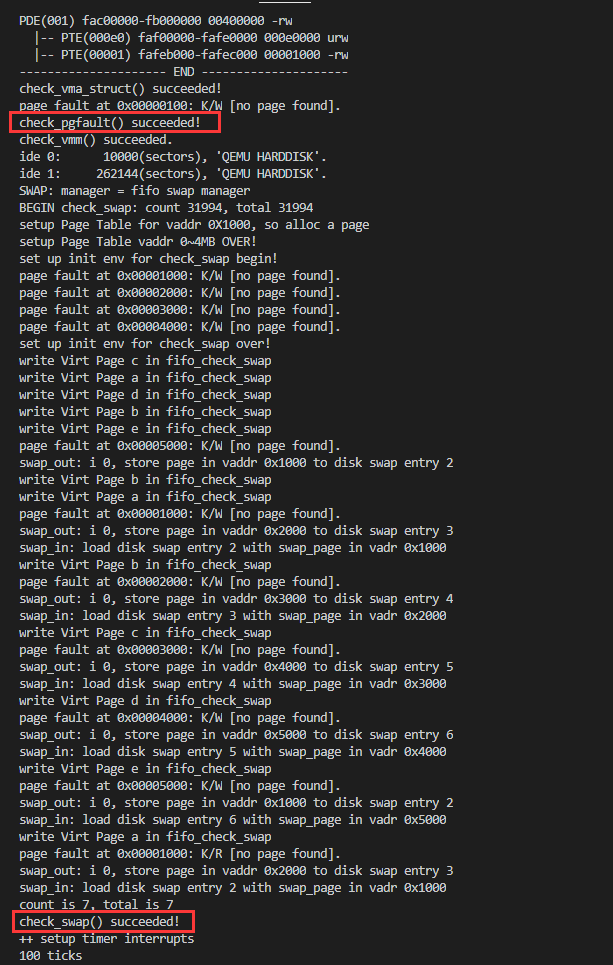

#### 回答问题

- 如果要在 ucore 上实现“**extended clock页替换算法**”，现有的 swap_manager 框架是否足以支持在 ucore 中实现此算法？
  - 如果是，请给你的设计方案。
  - 如果不是，请给出你的新的扩展和基此扩展的设计方案。
  - 并需要回答如下问题：
    - 需要被换出的页的特征是什么？
    - 在 ucore 中如何判断具有这样特征的页？
    - 何时进行换入和换出操作？

##### 设计方案

可以实现

1. 需要将页面连接成**环形链表**
2. 当前指针指向**最早进入的页**
3. 设置页表项的 `PTE_D` 位，如果访问过，则为1，否则为0（初始化为0）
4. 需要进行页替换时，遍历环形链表
   - 如果该页表项的 `PTE_D` 位为1，则置0，访问下一页
   - 如果该页表项的 `PTE_D` 位为0，则将该页淘汰

##### 需要被换出的页特征

- 当前页未被访问（或者脏位在上一次遍历过程中由1被置0）
- 当前页数据与外部储存一致

##### 在 ucore 中如何判断具有这样特征的页

判断当前页 `PTE_D` 位是否为0

- 如果为0，则淘汰该页
- 如果为1，则置0，访问下一页表项，直到访问到第一个 `PTE_D` 为0的页

##### 何时进行换入换出操作

- 需要的页不在页表中
- 页表满

## 实验结果

运行 `make grade` 得到如下结果

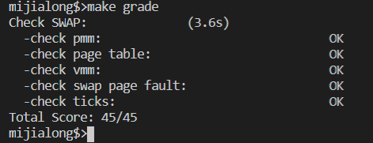

## 实验总结

本次实验的代码量相比于上次，少了许多，但是更加考验对操作系统的理解，并且注释中给出的相关提示，仔细阅读相关代码之后能够快速地理解需要做的事情，从而完成本次实验

### 完成实验后，请分析ucore_lab中提供的参考答案，并请在实验报告中说明你的实现与参考答案的区别

实现无区别

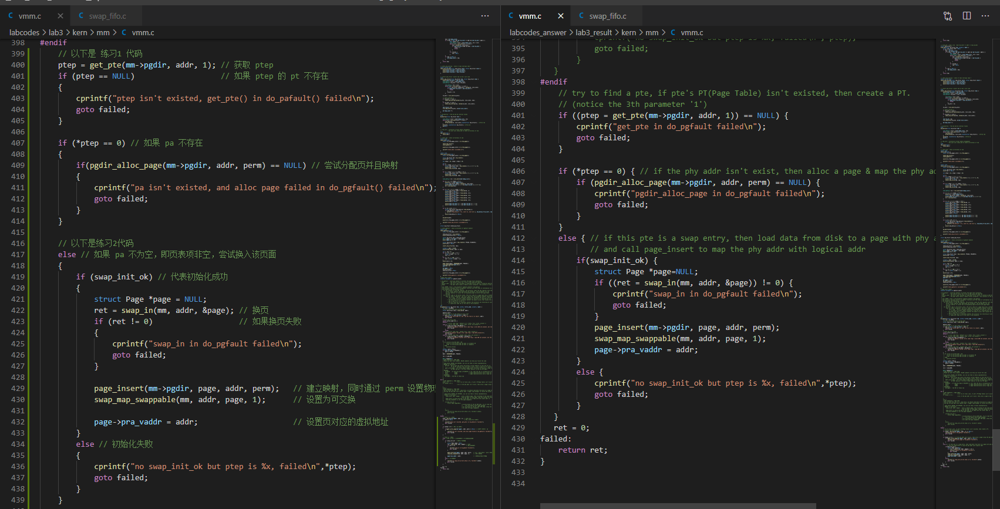

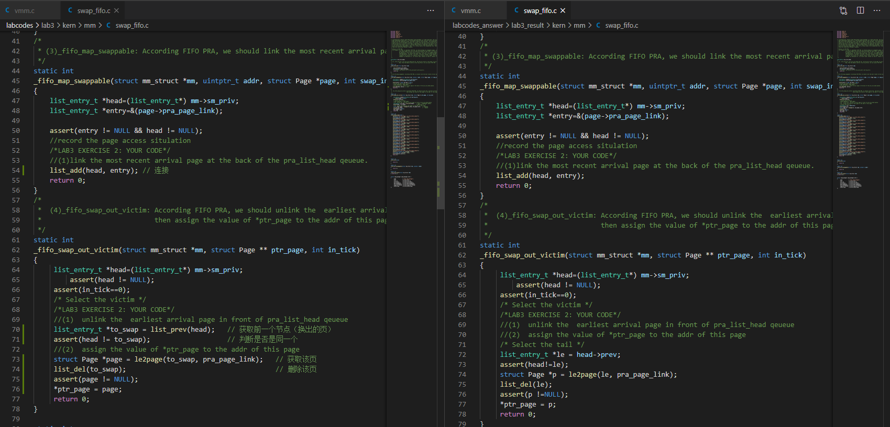

### 列出你认为本实验中重要的知识点，以及与对应的OS原理中的知识点，并简要说明你对二者的含义，关系，差异等方面的理解（也可能出现实验中的知识点没有对应的原理知识点）

实验：

- 页异常处理
- FIFO 页替换算法
- extended clock页替换算法

原理：

- 虚拟储存技术
- 虚拟页式储存
- 缺页异常处理
- 页替换算法
  - FIFO （先进先出）算法
  - extended clock （拓展时钟替换）算法
  - LRU （最近最少使用）算法
  - OPT （最有页面替换）算法
- 局部性原理
  - 时间局部性
  - 空间局部性
  - 分支局部性

理解

- 实验中的知识点是原理中的具体应用，需要考虑到具体的操作，会更加的复杂繁琐
- 前者为后者提供具体的内存管理功能的详细操作和底层支持
- 前者涉及到了除开操作系统之外的一些知识，比如说数据结构和算法，使得实现起来稍微麻烦一些


### 列出你认为OS原理中很重要， 但在实验中没有对应上的知识点

- OPT 算法