# 实验4

## 个人信息

- 数据科学与计算机学院
- 2018级 软工3班
- 18342075
- 米家龙

## 目录

- [实验4](#实验4)
  - [个人信息](#个人信息)
  - [目录](#目录)
  - [实验名称](#实验名称)
  - [实验目的](#实验目的)
  - [实验要求](#实验要求)
  - [实验内容](#实验内容)
  - [实验环境](#实验环境)
    - [2. WSL](#2-wsl)
  - [实验过程](#实验过程)
    - [练习0：填写已有实验](#练习0填写已有实验)
    - [练习1：分配并初始化一个进程控制块](#练习1分配并初始化一个进程控制块)
      - [查看 proc.c / proc.h 的注释](#查看-procc--proch-的注释)
      - [完成 `alloc_proc()`](#完成-alloc_proc)
      - [回答问题](#回答问题)
    - [练习2：为新创建的内核线程分配资源](#练习2为新创建的内核线程分配资源)
      - [查看 `do_fork()` 函数的注释](#查看-do_fork-函数的注释)
      - [完成 `do_fork()` 函数](#完成-do_fork-函数)
      - [回答问题](#回答问题-1)
    - [练习3：分析代码：`proc_run` 函数](#练习3分析代码proc_run-函数)
      - [进程切换](#进程切换)
      - [创建了几个内核进程](#创建了几个内核进程)
      - [语句的作用](#语句的作用)
  - [实验结果](#实验结果)
  - [实验总结](#实验总结)
    - [对比 ucore_lab 中提供的参考答案，描述区别](#对比-ucore_lab-中提供的参考答案描述区别)
    - [重要并且对应的知识点](#重要并且对应的知识点)
    - [实验中没有对应上的知识点](#实验中没有对应上的知识点)

## 实验名称

实验5 内核线程管理

## 实验目的

- 了解内核线程创建/执行的管理过程
- 了解内核线程的切换和基本调度过程

## 实验要求

本次实验将首先接触的是内核线程的管理。内核线程是一种特殊的进程，内核线程与用户进程的区别有两个：

- 内核线程值运行在内核态
- 用户进程会在用户态和内核态交替运行
- 所有内核线程公用 ucore 内核内存空间，不需要为每个内核线程维护单独的内存空间
- 用户进程需要维护各自的用户内存空间

## 实验内容

- 练习0：填写已有实验
- 练习1：分配并初始化一个进程控制块（需要编程）
- 练习2：为新创建的内核线程分配资源（需要编程）
- 练习3：阅读代码，理解 `proc_run` 函数和它调用的函数如何完成进程切换的

## 实验环境

使用老师提供的`mooc-os-2015.vdi`，在虚拟机中创建 64 位的 Ubuntu 虚拟机并加载该 vdi ，获得了版本为：

```bash
Linux moocos-VirtualBox 3.13.0-24-generic #46-Ubuntu SMP Thu Apr 10 19:11:08 UTC 2014 x86_64 x86_64 x86_64 GNU/Linux
```

的虚拟机操作系统

并且使用 vscode 配合 Remote SSH 插件，实现通过远程终端在 windows 环境的对文件的编辑和运行

### 2. WSL

WSL 配置如下：

```bash
root@LAPTOP-QTCGESHO:/mnt/d/blog/work/matrix/step1/001# uname -a
Linux LAPTOP-QTCGESHO 4.4.0-19041-Microsoft #1-Microsoft Fri Dec 06 14:06:00 PST 2019 x86_64 x86_64 x86_64 GNU/Linux
```

## 实验过程

### 练习0：填写已有实验

本实验依赖ucore实验1/2/3。请把你做的ucore实验1/2/3的代码填入本实验中代码中有“LAB1”,“LAB2” ,“LAB3”的注释相应部分。

需要修改的文件如下：

- kern/debug/kdebug.c 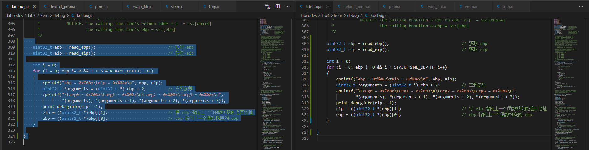
- kern/mm/default_pmm.c 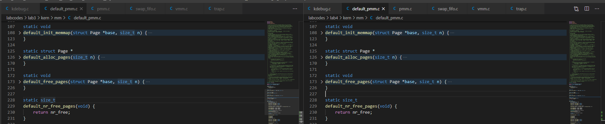
- kern/mm/pmm.c 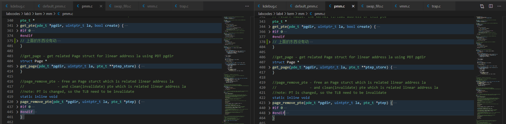
- kern/trap/trap.c 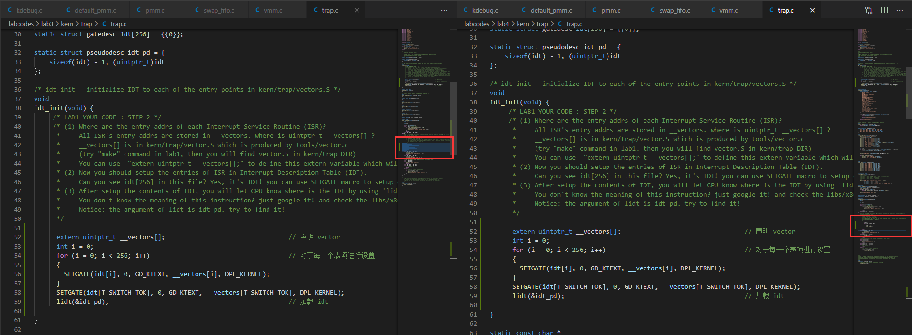
- kern/mm/vmm.c 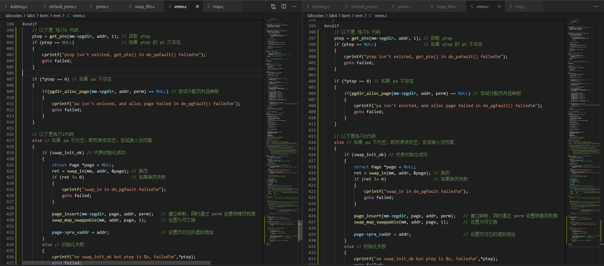
- kern/mm/swap_fifo.c 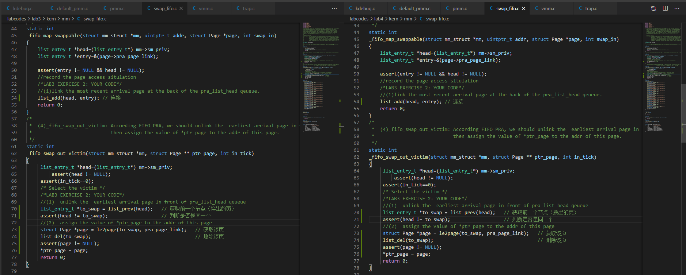

### 练习1：分配并初始化一个进程控制块

- alloc_proc函数（位于 `kern/process/proc.c` 中）负责分配并返回一个新的 `struct proc_struct` 结构，用于存储新建立的**内核线程的管理信息**。ucore 需要对这个结构进行最基本的初始化，你需要完成这个初始化过程。
  - 【提示】在 `alloc_proc` 函数的实现中，需要初始化的 `proc_struct` 结构中的成员变量至少包括： `state`/`pid`/`runs`/`kstack`/`need_resched`/`parent`/`mm`/`context`/`tf`/`cr3`/`flags`/`name`。 
- 请在实验报告中简要说明你的设计实现过程。请回答如下问题：
  - 请说明 `proc_struct` 中 `struct context context` 和 `struct trapframe *tf` **成员变量含义**和在本实验中的**作用**是啥？（提示通过看代码和编程调试可以判断出来）

#### 查看 proc.c / proc.h 的注释

了解到进程的状态：

|     状态      |      含义       |             相关函数              |
| :-----------: | :-------------: | :-------------------------------: |
|  PROC_UNINIT  |    未初始化     |            alloc_proc             |
| PROC_SLEEPING |    休眠状态     | try_free_pages, do_wait, do_sleep |
| PROC_RUNNABLE | 可运行/正在运行 |      proc_init, wakeup_proc       |
|  PROC_ZOMBIE  |    将要死亡     |              do_exit              |

找到对应的枚举类型

```cpp
// process's state in his life cycle
enum proc_state {
    PROC_UNINIT = 0,  // 未初始化
    PROC_SLEEPING,    // 休眠
    PROC_RUNNABLE,    // 可运行/正在运行
    PROC_ZOMBIE,      // 将近死亡，等待父进程回收资源
};
```

查看结构体 `proc_stuct` 的代码，了解相关成员变量的作用

```cpp
#define PROC_NAME_LEN               15                // 进程名长度
#define MAX_PROCESS                 4096              // 最大进程数量
#define MAX_PID                     (MAX_PROCESS * 2) // 最大 pid 数量

extern list_entry_t proc_list; // 储存变量的列表

struct proc_struct {
    enum proc_state state;                      // 进程状态
    int pid;                                    // 进程 id
    int runs;                                   // 运行时间
    uintptr_t kstack;                           // 内核栈位置
    volatile bool need_resched;                 // 是否需要 CPU 调度
    struct proc_struct *parent;                 // 父进程
    struct mm_struct *mm;                       // 内存管理字段
    struct context context;                     // 用于进程切换
    struct trapframe *tf;                       // 当前中断帧
    uintptr_t cr3;                              // CR3寄存器：CR3保存页表的物理地址
    uint32_t flags;                             // 进程标志
    char name[PROC_NAME_LEN + 1];               // 进程名
    list_entry_t list_link;                     // 进程链表
    list_entry_t hash_link;                     // 进程哈希表
};
```

查看结构体 `context` 的代码：

```cpp
// 为内核的上下文切换保存寄存器
// 由于段寄存器是跨内核的上下文的常量，因此不需要保存 %fs 等所有的段寄存器
// 保存所有常规寄存器，从而不需要关心哪些是调用者保存的，而不是返回 %eax（简化代码）
// 上下文布局需和 switch.S 中的代码匹配
struct context {
    uint32_t eip;
    uint32_t esp;
    uint32_t ebx;
    uint32_t ecx;
    uint32_t edx;
    uint32_t esi;
    uint32_t edi;
    uint32_t ebp;
};
```

#### 完成 `alloc_proc()`

如果要初始化，那么需要将大部分成员变量设置为**0**或者**空**，除了初始的 cr3 寄存器需要初始化为页目录表的基址，完成该函数如下：

```cpp
// alloc_proc - alloc a proc_struct and init all fields of proc_struct
static struct proc_struct *
alloc_proc(void) {
    struct proc_struct *proc = kmalloc(sizeof(struct proc_struct));
    if (proc != NULL) {
        proc->state = PROC_UNINIT;                              // 状态
        proc->pid = -1;                                         // 给一个无
        proc->runs = 0;                                         // 未运行过
        proc->kstack = 0;                                       // 没有内核栈
        proc->need_resched = false;                             // 不需要被 CPU 调度
        proc->parent = NULL;                                    // 没有父进程
        proc->mm = NULL;                                        // 没有内存管理字段
        memset(&(proc->context), 0, sizeof(struct context));    // 设置上下文
        proc->tf = NULL;                                        // 无中断帧
        proc->cr3 = boot_cr3;                                   // 设置为内核页目录表的基址
        proc->flag = 0;                                         // 设置进程标志
        memset(proc->name, 0, PROC_NAME_LEN + 1);               // 设置进程名为空
    }
    return proc;
}
```

#### 回答问题

请说明 `proc_struct` 中 `struct context context` 和 `struct trapframe *tf` **成员变量含义**和在本实验中的**作用**是啥？

- `context` 保存前一个进程各个寄存器的状态，用于上下文切换。
  - 当该进程变为 `init` 进程时，保存寄存器状态
  - 当该进程变为 `idle` 进程是，根据 `context` 恢复现场从而继续执行
- `*tf` 是中断帧。
  - 当进程从用户空间跳入**内核空间**时，中断帧记录被中断前的状态。
  - 当该进程跳回内核空间后，需要调整中断帧来恢复对应的寄存器值，从而使得进程继续执行。
  - 和 `context` 相比，中断帧包含了 `context` 的信息，以及**段寄存器、中断号和 err 等信息**。
  - 中断帧一般在**系统调用**或**中断**时，因为发生了**特权级的转换**。


### 练习2：为新创建的内核线程分配资源

> 创建一个内核线程需要分配和设置好很多资源。`kernel_thread` 函数通过调用 `do_fork` 函数完成具体内核线程的创建工作。`do_kernel` 函数会 调用 `alloc_proc` 函数来分配并初始化一个进程控制块，但 `alloc_proc` 只是找到了一小块内存用以记录进程的必要信息，并没有实际分配这些资源。ucore 一般通过 `do_fork` 实际创建新的内核线程。 `do_fork` 的作用 是，创建当前内核线程的一个副本，它们的执行上下文、代码、数据 都一样，但是存储位置不同。在这个过程中，需要给新内核线程分配 资源，并且复制原进程的状态。你需要完成在 `kern/process/proc.c` 中的 `do_fork` 函数中的处理过程。

`do_fork` 的大致步骤包括：

- 调用alloc_proc，首先获得一块用户信息块
- 为进程分配一个内核栈
- 复制原进程的内存管理信息到新进程（但内核线程不必做此事）
- 复制原进程上下文到新进程
- 将新进程添加到进程列表 
- 唤醒新进程
- 返回新进程号

请在实验报告中简要说明你的设计实现过程。请回答如下问题：

- 请说明 ucore 是否做到给每个新 fork 的线程一个**唯一的 id** ？请说明你的分析和理由。

#### 查看 `do_fork()` 函数的注释

获取到部分函数和宏定义和变量：

- 宏/函数
  - `alloc_proc`：创建并初始化一个 proc 结构体
  - `setup_kstack`：申请一块大小为 **KSTACKPAGE** 的页作为进程内核堆栈
  - `copy_mm`：**进程 proc** 还是**共享当前进程 current** ，由 `clone_flags` 决定，如果 `clone_flags & CLONE_VM` 为真，则共享，否则复制
  - `copy_thread`：在进程内和堆栈顶设置中断帧，并设置该进程的内核入口和堆栈
  - `hash_proc`：将进程添加到进程哈希列表
  - `get_pid`：为进程申请一个独一的 pid
  - `wakeup_proc`：将进程的状态设置为 `PROC_RUNNABLE`，唤醒进程
- 变量
  - `proc_list`：进程集合的列表
  - `nr_process`：进程集合的数量

分别查看并了解上述定义的作用

#### 完成 `do_fork()` 函数

根据注释，可以得到具体步骤为：

- 使用 `alloc_proc` 初始化进程控制模块
- 使用 `setup_stack` 为子进程分配并初始化内核栈
- 使用 `copy_mm` 根据 `clone_flag` 复制/共享进程内存管理结构
- 使用 `copy_thread` 设置进程在内核正常运行和调度所需的中断帧和上下文
- 将设置好的控制进程模块插入到 `hash_list` 和 `proc_list` 中
- 使用 `wakeup_proc` 将进程设置为**就绪**状态
- 将返回结果设置为**子进程 pid**

完成代码如下：

```cpp
/* do_fork -     parent process for a new child process
 * @clone_flags: used to guide how to clone the child process
 * @stack:       the parent's user stack pointer. if stack==0, It means to fork a kernel thread.
 * @tf:          the trapframe info, which will be copied to child process's proc->tf
 */
int
do_fork(uint32_t clone_flags, uintptr_t stack, struct trapframe *tf) {
    int ret = -E_NO_FREE_PROC;
    struct proc_struct *proc;
    if (nr_process >= MAX_PROCESS) {
        goto fork_out;
    }
    ret = -E_NO_MEM;
    //LAB4:EXERCISE2 YOUR CODE

    //    1. 使用 `alloc_proc` 初始化进程控制模块
    if ((proc = alloc_proc()) == NULL) // 申请内存失败
        goto fork_out;
    //    2. 使用 `setup_stack` 为子进程分配并初始化内核栈
    proc->parent = current; // 将父进程设置为当前进程
    if (setup_kstack(proc) != 0) // 如果分配内核栈失败
        goto bad_fork_cleanup_kstack;
    //    3. 使用 `copy_mm` 根据 `clone_flag` 复制/共享进程内存管理结构
    if (copy_mm(clone_flags, proc) != 0) // 复制父进程信息失败
        goto bad_fork_cleanup_proc;
    //    4. 使用 `copy_thread` 设置进程在内核正常运行和调度所需的中断帧和上下文
    copy_thread(proc, stack, tf);
    //    5. 将设置好的控制进程模块插入到 `hash_list` 和 `proc_list` 中
    bool intr_flag;             // 标志
    local_intr_save(intr_flag); // 屏蔽中断，并将标志设置为1
    {
        proc->pid = get_pid();                      // 获取 pid
        hash_proc(proc);                            // 建立映射
        nr_process++;                               // 记录数量增加
        list_add(&proc_list, &(proc->list_link));   // 进程加入到进程链表中
    }
    local_intr_restore(proc); // 恢复中断
    //    6. 使用 `wakeup_proc` 将进程设置为**就绪**状态
    wakeup_proc(proc); // 唤醒进程
    //    7. 将返回结果设置为**子进程 pid**
    ret = proc->pid;

fork_out:
    return ret;

bad_fork_cleanup_kstack:
    put_kstack(proc);
bad_fork_cleanup_proc:
    kfree(proc);
    goto fork_out;
}
```

#### 回答问题

请说明 ucore 是否做到给每个新 fork 的线程一个**唯一的 id** ？请说明你的分析和理由。

查看 `get_pid` 函数的代码

```cpp
// get_pid - alloc a unique pid for process
static int
get_pid(void) {
    static_assert(MAX_PID > MAX_PROCESS);
    struct proc_struct *proc;
    list_entry_t *list = &proc_list, *le;
    static int next_safe = MAX_PID, last_pid = MAX_PID;
    if (++ last_pid >= MAX_PID) {
        last_pid = 1;
        goto inside;
    }
    if (last_pid >= next_safe) {
    inside:
        next_safe = MAX_PID;
    repeat:
        le = list;
        while ((le = list_next(le)) != list) {
            proc = le2proc(le, list_link);
            if (proc->pid == last_pid) {
                if (++ last_pid >= next_safe) {
                    if (last_pid >= MAX_PID) {
                        last_pid = 1;
                    }
                    next_safe = MAX_PID;
                    goto repeat;
                }
            }
            else if (proc->pid > last_pid && next_safe > proc->pid) {
                next_safe = proc->pid;
            }
        }
    }
    return last_pid;
}
```

该函数运行的过程为：

- 判断 **MAX_PID** 是否小于 **MAX_PROCESS** ，避免文件改动带来的错误
- 声明静态局部变量 `next_safe` 和 `last_pid` ，并初始化为 **MAX_PID**
- 将 `last_pid` 置为1，遍历 \[1, MAX_PID\]
  - 当 `last_pid` 未和已知 pid 冲突，则缩小 `next_safe` ，此时 \[last_pid, MAX_PID\] 之间是未被使用的 pid
  - 当出现冲突，`last_pid` + 1，检查 \[last_pid, MAX_PID\] 是否合法
    - 如果合法，继续遍历
    - 不合法则表示小于 `last_pid` 已经消耗完，则重新开始扫描 \[last_pid, MAX_PID\]
- 遍历结束时，`last_pid` 为未被使用过的 pid ，可以使用

因此可以判断能够给每个 fork 的新线程一个唯一的 id

### 练习3：分析代码：`proc_run` 函数

- 阅读代码，理解 `proc_run` 函数和它调用的函数如何完成进程切换的。
- 请在实验报告中简要说明你对 `proc_run` 函数的分析。并回答如下问题：
  - 在本实验的执行过程中，创建且运行了几个内核线程
  - 语句 `local_intr_save(intr_flag);....local_intr_restore(intr_flag);` 在这里有何作用？请说明理由。

#### 进程切换

查看 `proc_run` 函数的代码：

```cpp
// proc_run - make process "proc" running on cpu
// NOTE: before call switch_to, should load  base addr of "proc"'s new PDT
void proc_run(struct proc_struct *proc)
{
    if (proc != current)
    {
        bool intr_flag;
        struct proc_struct *prev = current, *next = proc;
        local_intr_save(intr_flag);
        {
            current = proc;
            load_esp0(next->kstack + KSTACKSIZE);
            lcr3(next->cr3);
            switch_to(&(prev->context), &(next->context));
        }
        local_intr_restore(intr_flag);
    }
}
```

过程分为三个步骤：

1. 屏蔽中断
2. 修改 exp0 和页表项，并且进行上下文切换
3. 恢复中断

其中调用了三个函数

- `load_esp0()` 修改 **exp0** ，以便在使用中间帧从用户到内核后能够使用不同的内核堆栈
- `lcr3()` 使得进程能够在 CPU 中运行
- `switch_to()` 切换进程

查看 `switch_to()` 的代码：

```s
.text
.globl switch_to
switch_to:                      # switch_to(from, to)

    # save from's registers
    movl 4(%esp), %eax          # eax points to from
    popl 0(%eax)                # save eip !popl
    movl %esp, 4(%eax)          # save esp::context of from
    movl %ebx, 8(%eax)          # save ebx::context of from
    movl %ecx, 12(%eax)         # save ecx::context of from
    movl %edx, 16(%eax)         # save edx::context of from
    movl %esi, 20(%eax)         # save esi::context of from
    movl %edi, 24(%eax)         # save edi::context of from
    movl %ebp, 28(%eax)         # save ebp::context of from

    # restore to's registers
    movl 4(%esp), %eax          # not 8(%esp): popped return address already
                                # eax now points to to
    movl 28(%eax), %ebp         # restore ebp::context of to
    movl 24(%eax), %edi         # restore edi::context of to
    movl 20(%eax), %esi         # restore esi::context of to
    movl 16(%eax), %edx         # restore edx::context of to
    movl 12(%eax), %ecx         # restore ecx::context of to
    movl 8(%eax), %ebx          # restore ebx::context of to
    movl 4(%eax), %esp          # restore esp::context of to

    pushl 0(%eax)               # push eip

    ret
```

该函数的作用：

- 储存前一个进程的7个寄存器值到 `context`
- 将 `context` 中的值恢复到寄存器

从而实现进程的上下文切换

#### 创建了几个内核进程

两个

```cpp
// idle proc
struct proc_struct *idleproc = NULL;
// init proc
struct proc_struct *initproc = NULL;
```

并且在 `proc_init` 函数中也能够看到对上述两个线程的初始化

1. **idleproc** ，用于完成内核中各个子系统的初始化，然后调度、运行其他进程
2. **initproc** ，上一个进程完成后就运行该进程，输出一段字符串

#### 语句的作用

用于屏蔽中断和恢复中断，以免在进程切换中出现中断，导致其他进程进行调度

## 实验结果

运行 `make grade` 命令，结果如下

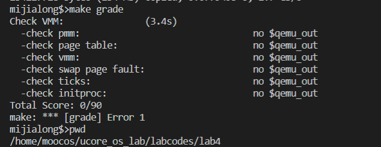

然后对比答案，发现自己和答案思路一致，并没有其他有问题的地方

于是尝试在 WSL 上尝试运行，结果如下图

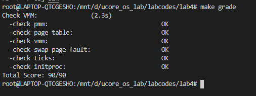

由于之前出现过使用 VSCode 的 Remote SSH 插件连接虚拟机时因为出现了储存空间不足导致连接失败的情况，因此猜测是虚拟机能够运行 ucore 的空间不足，在对之前的 lab 中执行 `make clean` 命令删除对应的文件和文件夹，再在 lab4 文件夹中执行 `make grade` 命令，能够通过，结果如下图：

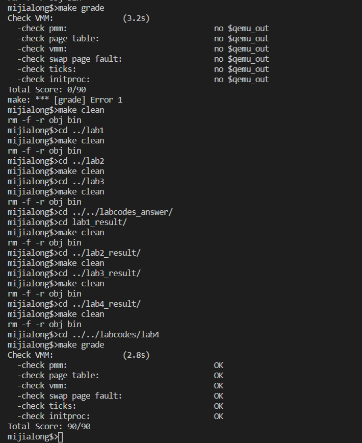

确实是储存空间的问题

执行 `make qemu-nox` ，观察输出，结果如下，基本符合预期

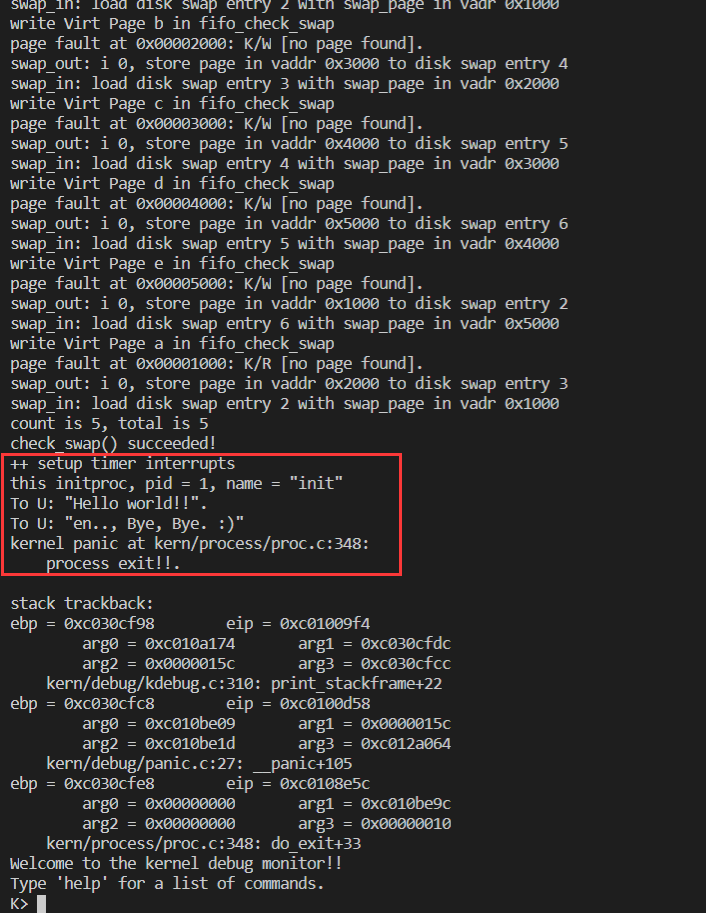

## 实验总结

比较简单地了解了进程创建和初始化等相关步骤的直接操作，对进程的调度和生存周期有了更深刻地了解；在编程过程中也发现了编程环境的一些问题，并且较为顺利地解决，并且使用了 WSL 来进行验证。

### 对比 ucore_lab 中提供的参考答案，描述区别

两个函数都没有区别

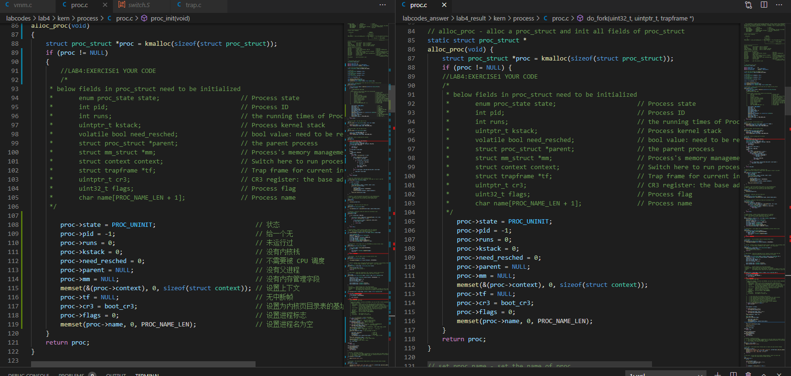

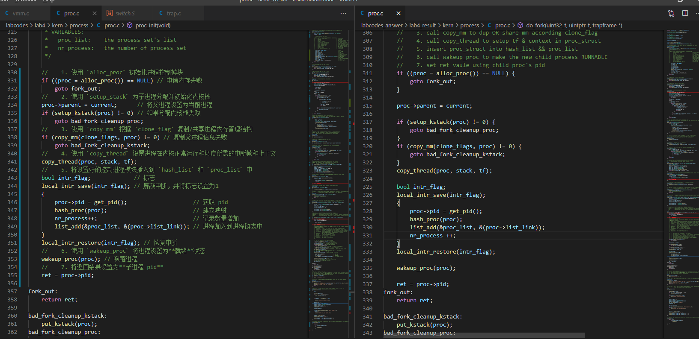

### 重要并且对应的知识点

实验

- 线程控制块的概念以及组成
- 切换不同线程的方法

原理：

- 对内核线程的管理
- 对内核线程之间的切换

这两者之间的关系为，前者为后者在OS中的具体实现提供了基础；

### 实验中没有对应上的知识点

- OS中对用户进程的管理
- OS中对线程/进程的调度