# 期末综合实验

## 个人信息

- 数据科学与计算机学院
- 2018级 软工3班
- 18342075
- 米家龙

## 目录

[TOC]

## 实验名称

1. 实验6-调度器
2. 实验7-同步互斥
3. 实验8-文件系统实现及综合实验

## 实验目的

### 1. 实验6-调度器

- 理解操作系统的调度管理机制
- 熟悉 ucore 的系统调度器框架，以及缺省的 Round-Robin 调度算法
- 基于调度器框架实现一个（Stride Scheduling）调度算法来替换缺省的调度算法

### 2. 实验7-同步互斥

- 理解操作系统的同步互斥的设计实现；
- 理解底层支撑技术：禁用中断、定时器、等待队列；
- 在ucore中理解信号量（semaphore）机制的具体实现；
- 了解经典进程同步问题，并能使用同步机制解决进程同步问题

### 3. 实验8-文件系统实现及综合实验

- 考察对操作系统的文件系统的设计实现了解；
- 考察操作系统进程调度算法的实现。
- 考察操作系统内存管理的虚存技术的掌握（选做，加分题）

## 实验要求

### 1. 实验6-调度器

ucore lab5 可在用户态运行多个进程，但采用的调度策略是很简单的 FIFO 调度策略。

本实验 ucore lab6 主要是熟悉ucore的系统调度器框架，以及基于此框架的 Round-Robin（RR） 调度算法。然后参考 RR 调度算法的实现，完成 Stride Scheduling 调度算法。

### 2. 实验7-同步互斥

前1实验完成了用户进程的调度框架和具体的调度算法，可调度运行多个进程。如果多个进程需要协同操作或访问共享资源，则存在如何同步和有序竞争的问题。本次实验，主要是熟悉 ucore 的进程同步机制—信号量（semaphore）机制，以及基于信号量的哲学家就餐问题解决方案。在本次实验中，在 kern/sync/check_sync.c 中提供了一个基于信号量的哲学家就餐问题解法。

哲学家就餐问题描述如下：有五个哲学家，他们的生活方式是交替地进行思考和进餐。哲学家们公用一张圆桌，周围放有五把椅子，每人坐一把。在圆桌上有五个碗和五根筷子，当一个哲学家思考时，他不与其他人交谈，饥饿时便试图取用其左、右最靠近他的筷子，但他可能一根都拿不到。只有在他拿到两根筷子时，方能进餐，进餐完后，放下筷子又继续思考。

### 3. 实验8-文件系统实现及综合实验

## 实验内容

### 1. 实验6-调度器

- 练习0：填写已有实验
- 练习1：使用 Round Robin 调度算法（不需要编码）
  - 请理解并分析 sched_calss 中各个函数指针的用法，并结合 Round Robin 调度算法描述 ucore 的调度执行过程
  - 请在实验报告中简要说明如何设计实现“多级反馈队列调度算法”，给出概要设计，鼓励给出详细设计
- 练习2：实现 Stride Scheduling 调度算法（需要编码）
  - 首先需要换掉 RR 调度器的实现，即用 default_sched_stride_c 覆盖 default_sched.c 。然后根据此文件和后续文档对 Stride 度器的相关描述，完成 Stride 调度算法的实现。
- 练习3：阅读分析源代码，结合中断处理和调度程序，再次理解进程控制块中的 trapframe 和 context 在进程切换时作用。（不需要编码）

### 2. 实验7-同步互斥

- 练习0：填写已有实验
- 练习1：理解内核级信号量的实现和基于内核级信号量的哲学家就餐问题（不需要编码）
  - 请在实验报告中给出内核级信号量的设计描述，并说其大致执行流流程。
  - 请在实验报告中给出给用户态进程/线程提供信号量机制的设计方案，并比较说明给内核级提供信号量机制的异同。

### 3. 实验8-文件系统实现及综合实验

- 练习0：在前面 ucore 实验 lab1-lab7 的基础上，完成 ucore 文件系统
- 练习1：在上述实验的基础上，修改ucore调度器为采用多级反馈队列调度算法的，队列共设6个优先级（6个队列），最高级的时间片为 q (使用原RR算法中的时间片），并且每降低1级，其时间片为上一级时间片乘2（参见理论课）
- 练习2：在上述实验的基础上，修改虚拟存储中的页面置换算法为某种工作集页面置换算法，具体如下：
  - 对每一用 exec 新建进程分配3帧物理页面
  - 当需要页面置换时，选择最近一段时间缺页次数最少的进程中的页面置换到外存
  - 对进程中的页面置换算法用改进的 clock 页替换算法
  - 在一段时间（如1000个时间片）后将所有进程缺页次数清零，然后重新计数

## 实验环境

使用老师提供的`mooc-os-2015.vdi`，在虚拟机中创建 64 位的 Ubuntu 虚拟机并加载该 vdi ，获得了版本为：

```bash
mijialong@LAPTOP-QTCGESHO:/mnt/d/ucore_os_lab/labcodes/lab5$ uname -a
Linux LAPTOP-QTCGESHO 4.4.0-19041-Microsoft #1-Microsoft Fri Dec 06 14:06:00 PST 2019 x86_64 x86_64 x86_64 GNU/Linux
```

的虚拟机操作系统

并且使用 vscode 配合 Remote SSH 插件，实现通过远程终端在 windows 环境的对文件的编辑和运行

### 2. WSL

WSL 配置如下：

```bash
Linux LAPTOP-QTCGESHO 4.4.0-19041-Microsoft #1-Microsoft Fri Dec 06 14:06:00 PST 2019 x86_64 x86_64 x86_64 GNU/Linux
```

**其中 WSL 为主要运行平台**

## 实验过程

### 1. 实验6-调度器

#### 练习0：填写已有代码

随着代码量逐渐增多，直接用肉眼进行 diff/merge 比较麻烦，因此决定使用 meld 软件进行可视化的 merga 
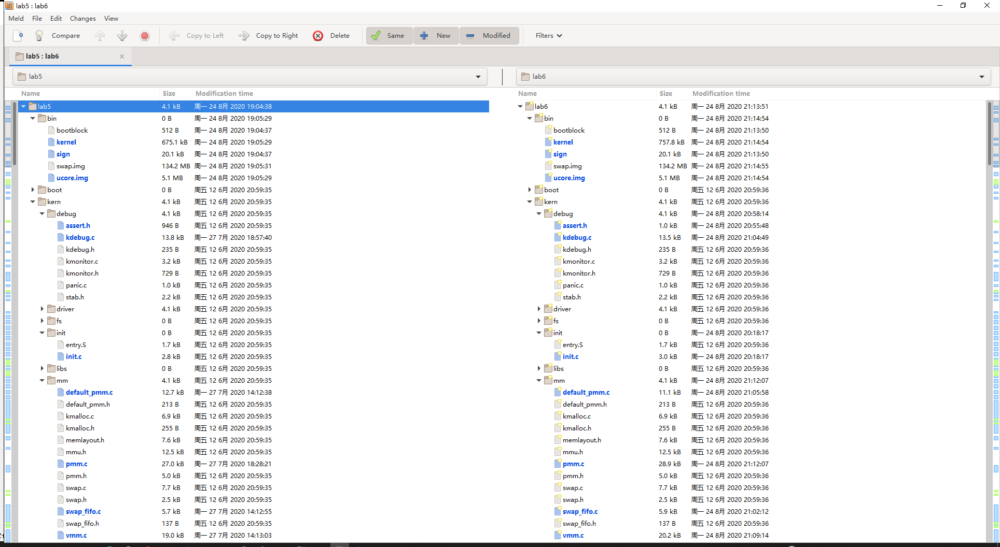

在进行了 merge 后的 lab6 中运行 `make grade` 命令检查，基本符合教材要求，在优先级检测处报错

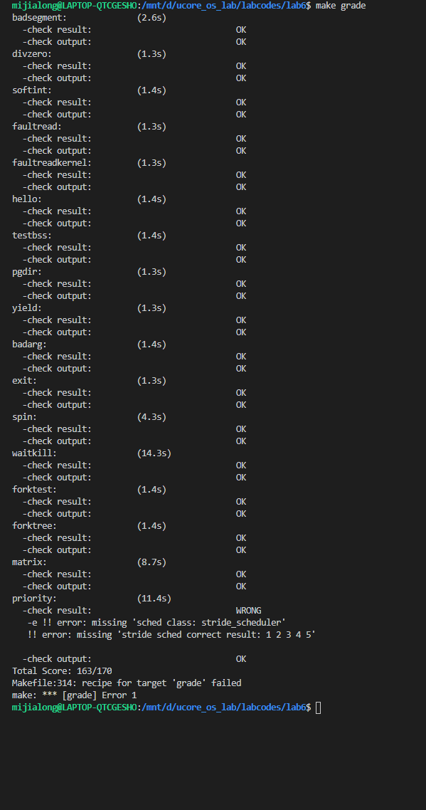

#### 练习1：使用 Round Robin 调度算法（不需要编码）

##### 1. 请理解并分析 sched_calss 中各个函数指针的用法，并结合 Round Robin 调度算法描述 ucore 的调度执行过程

###### 分析 sched_class 类

在 *kern/schedule/sched.h* 查看 sched_class 类
```cpp
// The introduction of scheduling classes is borrrowed from Linux, and makes the
// core scheduler quite extensible. These classes (the scheduler modules) encapsulate
// the scheduling policies.
// 调度类是从Linux中引入的，这使得核心调度程序具有相当的可扩展性。
// 这些类(调度程序模块)封装了调度策略。
struct sched_class
{
    // the name of sched_class
    // 调度器名称
    const char *name;
    // Init the run queue
    // 初始化运行队列
    void (*init)(struct run_queue *rq);
    // put the proc into runqueue, and this function must be called with rq_lock
    // 将进程放入队列中，该函数必须使用 rq_lock
    void (*enqueue)(struct run_queue *rq, struct proc_struct *proc);
    // get the proc out runqueue, and this function must be called with rq_lock
    // 将进程从队列中移除，该函数必须使用 rq_lock
    void (*dequeue)(struct run_queue *rq, struct proc_struct *proc);
    // choose the next runnable task
    // 选择下一个可运行任务
    struct proc_struct *(*pick_next)(struct run_queue *rq);
    // dealer of the time-tick
    // 更新调度器的时钟信息
    void (*proc_tick)(struct run_queue *rq, struct proc_struct *proc);
    /* for SMP support in the future
     *  load_balance
     *     void (*load_balance)(struct rq* rq);
     *  get some proc from this rq, used in load_balance,
     *  使用 load_balance 函数，获得队列中的一些进程
     *  return value is the num of gotten proc
     *  返回值是获得的进程的数量
     *  int (*get_proc)(struct rq* rq, struct proc* procs_moved[]);
     */
};
```

查看 *kern/schedule/sched.c* 中的后续代码，可以找到 sched_class 类相关功能的实现函数，分别为：
- `sched_init(void)`
```cpp
void
sched_init(void) {
    list_init(&timer_list);

    sched_class = &default_sched_class;

    rq = &__rq;
    rq->max_time_slice = MAX_TIME_SLICE;
    sched_class->init(rq);

    cprintf("sched class: %s\n", sched_class->name);
}
```
- `sched_class_enqueue(struct proc_struct *proc)`
```cpp
static inline void
sched_class_enqueue(struct proc_struct *proc) {
    if (proc != idleproc) {
        sched_class->enqueue(rq, proc);
    }
}
```
- `sched_class_dequeue(struct proc_struct *proc)`
```cpp
static inline void
sched_class_dequeue(struct proc_struct *proc) {
    sched_class->dequeue(rq, proc);
}
```
- `sched_class_pick_next(void)`
```cpp
static inline struct proc_struct *
sched_class_pick_next(void) {
    return sched_class->pick_next(rq);
}
```
- `sched_class_proc_tick(struct proc_struct *proc)`
```cpp
void
sched_class_proc_tick(struct proc_struct *proc) {
    if (proc != idleproc) {
        sched_class->proc_tick(rq, proc);
    }
    else {
        proc->need_resched = 1;
    }
}
```

###### RR 调度算法

> - RR调度算法的调度思想是让所有 runnable 态的进程**分时轮流使用** CPU 时间。
> - **RR调度器**维护当前runnable进程的有序运行队列。当前进程的时间片用完之后，调度器将当前进程放置到运行队列的尾部，再从其头部取出进程进行调度。
> - RR调度算法的就绪队列在组织结构上也是一个**双向链表**，只是增加了一个成员变量，表明在此就绪进程队列中的最大执行时间片。
> - 而且在进程控制块 proc_struct 中增加了一个成员变量 `time_slice` ，用来记录进程当前的可运行时间片段，用于限制每个进程运行的时间。
> - 在每个 timer 到时的时候，操作系统会递减当前执行进程的 time_slice ，当 time_slice 为0时，就意味着这个进程运行了一段时间（这个时间片段称为进程的时间片），需要把 CPU 让给其他进程执行，于是操作系统就需要让此进程重新回到 rq 的队列尾，且重置此进程的时间片为就绪队列的成员变量最大时间片 max_time_slice 值，然后再从 rq 的队列头取出一个新的进程执行。

在 *kern/schedule/default_sched.c* 中查看 RR 调度算法对应的5个功能函数

- 初始化队列
```cpp
static void
RR_init(struct run_queue *rq)
{
  list_init(&(rq->run_list));
  rq->proc_num = 0;
}
```
- 将进程放入队列中
```cpp
static void
RR_enqueue(struct run_queue *rq, struct proc_struct *proc)
{
  assert(list_empty(&(proc->run_link)));               // 验证是否合法
  list_add_before(&(rq->run_list), &(proc->run_link)); // 加入到队尾
  // 如果进程时间片为0或者大于最大时间片，则重置为 max_time_slice
  if (proc->time_slice == 0 || proc->time_slice > rq->max_time_slice)
  {
    proc->time_slice = rq->max_time_slice;
  }
  proc->rq = rq;  // 更新队列
  rq->proc_num++; // 进程数 + 1
}
```
- 将进程从队列中移除
```cpp
static void
RR_dequeue(struct run_queue *rq, struct proc_struct *proc)
{
  // 验证队列不为空并且是双向链表
  assert(!list_empty(&(proc->run_link)) && proc->rq == rq);
  list_del_init(&(proc->run_link)); // 删除对应进程
  rq->proc_num--;                   // 进程数 - 1
}
```
- 选择下一个可执行任务
```cpp
static struct proc_struct *
RR_pick_next(struct run_queue *rq)
{
  list_entry_t *le = list_next(&(rq->run_list)); // 从队列头选出进程
  if (le != &(rq->run_list))                     // 如果合法就返回
  {
    return le2proc(le, run_link);
  }
  return NULL; // 并且将执行权交给内核线程idle
               // idle会不断调用schedule
               // 直到整个系统出现下一个可以执行的进程
}
```
- 更新调度器时钟信息
```cpp
static void
RR_proc_tick(struct run_queue *rq, struct proc_struct *proc)
{
  if (proc->time_slice > 0) // 削减时间片
  {
    proc->time_slice--;
  }
  if (proc->time_slice == 0) // 需要移除
  {
    proc->need_resched = 1;
  }
}
```

###### ucore 调度执行过程

- 调度器的主体函数代码只存在 `wakeup_proc` 和 `schedule` 函数，前者的作用在于将某一个指定进程放入可执行进程队列中，后者在于将当前进程放入可执行队列中，然后将队列中选择的下一个执行的进程取出执行
- 将某一个进程从就绪队列中取出的时候，将其从队列中删除
- 取出执行的下一个进程的时候，将就绪队列的队头取出
- 每当出现一个时钟中断，则会将当前执行的进程的剩余可执行时间减1，一旦减到了0，则将其标记为可以被调度的，这样在 ISR 中的后续部分就会调用 schedule 函数将这个进程切换出去

##### 多级反馈队列调度算法

###### 思路

1. 优先调用优先级高的队列中的进程，如果高优先级队列中午可调度的进程，才会在次优先级队列中调度进程
2. 对于同一个队列中的各个进程，按照时间片轮转法调度。当处于P1队列的（时间片Q）的作业经历了预定的时间片中如果还没有完成，则进入次优先级的P2队列中等待，（时间片变为上一优先级的2倍），在消耗完时间片后如果还不能完成，置入再次一级优先级的队列中，以此循环，直到完成
3. 在低优先级的队列中的进程在运行时，如果有新到达高优先级的作业，那么在运行完这个时间片后，CPU马上分配给新到达的作业

###### 具体实现

1. 运行队列需要支持该6个优先级，因此需要以 `run_queue` 类为基础，对其中的 `run_list` 成员变量进行修改，修改后如下：
```cpp
struct run_queue
{
    list_entry_t run_list;
    // list_entry_t run_list[6]; // 应对多级调度
    unsigned int proc_num;
    int max_time_slice;
    // For LAB6 ONLY
    skew_heap_entry_t *lab6_run_pool;
};
```
2. 为了支持优先级，需要在 `proc_struct` 中加入 `priority` 成员变量（初始化为0）用于储存优先级，并且，将 `*rq` 的类型改为多运行队列的类
```cpp
struct proc_struct
{
    enum proc_state state;                  // Process state
    int pid;                                // Process ID
    int runs;                               // the running times of Proces
    uintptr_t kstack;                       // Process kernel stack
    volatile bool need_resched;             // bool value: need to be rescheduled to release CPU?
    struct proc_struct *parent;             // the parent process
    struct mm_struct *mm;                   // Process's memory management field
    struct context context;                 // Switch here to run process
    struct trapframe *tf;                   // Trap frame for current interrupt
    uintptr_t cr3;                          // CR3 register: the base addr of Page Directroy Table(PDT)
    uint32_t flags;                         // Process flag
    char name[PROC_NAME_LEN + 1];           // Process name
    list_entry_t list_link;                 // Process link list
    list_entry_t hash_link;                 // Process hash list
    int exit_code;                          // exit code (be sent to parent proc)
    uint32_t wait_state;                    // waiting state
    struct proc_struct *cptr, *yptr, *optr; // relations between processes
    struct MLFQRun_queue *rq;                   // running queue contains Process
    list_entry_t run_link;                  // the entry linked in run queue
    int time_slice;                         // time slice for occupying the CPU
    skew_heap_entry_t lab6_run_pool;        // FOR LAB6 ONLY: the entry in the run pool
    uint32_t lab6_stride;                   // FOR LAB6 ONLY: the current stride of the process
    // uint32_t lab6_priority;                 // FOR LAB6 ONLY: the priority of process, set by lab6_set_priority(uint32_t)
    uint64_t priority;               // 初始化为0
};
```
3. 其余的功能实现函数
```cpp
/**
 * 多级调度队列初始化
*/
static void
MLFQ_init(struct MLFQRun_queue *rq)
{
  int i;
  for (i = 0; i < 6; i++)
    list_init(&(rq->run_list[i]));
  rq->proc_num = 0;
}

/**
 * 多级调度队列插入进程
*/
static void
MLFQ_enqueue(struct MLFQRun_queue *rq, struct proc_struct *proc)
{
  assert(list_empty(&(proc->run_link)));
  if (proc->time_slice == 0 && proc->priority != 5)
  {
    ++(proc->priority);
  }
  list_add_before(&(rq->run_list[proc->priority]), &(proc->run_link));
  // 每一次优先级都比前一优先级时间片长一倍
  proc->time_slice = (rq->max_time_slice << proc->priority);
  proc->rq = rq;
  rq->proc_num++;
}

/**
 * 多级调度队列删除进程
*/
static void
MLFQ_dequeue(struct MLFQRun_queue *rq, struct proc_struct *proc)
{
  assert(!list_empty(&(proc->run_link)) && proc->rq == rq); // 验证是否有效
  list_del_init(&(proc->run_link));
  rq->proc_num--;
}

/**
 * 多级调度队列寻找下一可运行任务
 * 为了避免优先级较低的进程出现饥饿，
 * 对每个优先级设置一定的选中概率，
 * 高优先级是低优先级选中率的两倍，
 * 选出一个优先级后，返回相应优先级队列的第一个进程。
*/
static struct proc_struct *
MLFQ_pick_next(struct MLFQRun_queue *rq)
{
  int p = rand() % (32 + 16 + 8 + 4 + 2 + 1);
  int priority;
  if (p >= 0 && p < 32)
  {
    priority = 0;
  }
  else if (p >= 32 && p < 48)
  {
    priority = 1;
  }
  else if (p >= 48 && p < 56)
  {
    priority = 2;
  }
  else if (p >= 56 && p < 60)
  {
    priority = 3;
  }
  else if (p >= 60 && p < 62)
  {
    priority = 4;
  }
  else
    priority = 5;
  list_entry_t *le = list_next(&(rq->run_list[priority]));
  if (le != &(rq->run_list[priority]))
  {
    return le2proc(le, run_link);
  }
  else
  {
    for (int i = 0; i < 6; ++i)
    {
      le = list_next(&(rq->run_list[i]));
      if (le != &(rq->run_list[i]))
        return le2proc(le, run_link);
    }
  }
  return NULL;
}

static void
MLFQ_proc_tick(struct MLFQRun_queue *rq, struct proc_struct *proc)
{
  if (proc->time_slice > 0) // 削减时间片
  {
    proc->time_slice--;
  }
  if (proc->time_slice == 0) // 需要移除
  {
    proc->need_resched = 1; // 然后由schedule函数进行调度
  }
}
```

#### 练习2：实现 Stride Scheduling 调度算法（需要编码）

> 在完成练习2之前，需要对之前的代码进行更新，完成对应的 PCB 初始化，并且需要在时钟中断的处理部分删去 print_ticks 函数

查阅资料，了解 Stride Scheduling 调度算法
> Stride 算法是结合时间片的一种优先级调度策略。每一个时间片结束时，选择就绪状态的进程中 Pass 值最小的进程分配一个时间片，在一个时间段中进程所获得的时间片数量和进程的优先级大致成正比。

该算法需要如下变量：
- *resource right*：进程获得时间片的权利
- *ticket*：在一个系统中，所有进程的 ticket 和是固定的。根据进程的优先级将 ticket 分配给进程，优先级越高，ticket 值越大，resource right 越大，一定时间内获得的时间片越多
- *stride*：步幅，和进程的 ticket 值成反比，每当一个进程获得一个时间片，pass 值会增大一个 stride，因此 stride 是 pass 值增长的单位.
- pass：进程通过的虚拟距离，以 stride 为单位增长。是选择进程分配时间片的指标，每次选择 pass 值最小的进程分配。

具体实现
- 比较两个进程的 pass
```cpp
/* The compare function for two skew_heap_node_t's and the
 * corresponding procs*/
static int
proc_stride_comp_f(void *a, void *b)
{
     struct proc_struct *p = le2proc(a, lab6_run_pool);
     struct proc_struct *q = le2proc(b, lab6_run_pool);
     int32_t c = p->lab6_stride - q->lab6_stride;
     if (c > 0)
          return 1;
     else if (c == 0)
          return 0;
     else
          return -1;
}
```
- 初始化
```cpp
/*
 * stride_init initializes the run-queue rq with correct assignment for
 * member variables, including:
 *
 *   - run_list: should be a empty list after initialization.
 *   - lab6_run_pool: NULL
 *   - proc_num: 0
 *   - max_time_slice: no need here, the variable would be assigned by the caller.
 *
 * hint: see libs/list.h for routines of the list structures.
 */
static void
stride_init(struct run_queue *rq)
{
     /* LAB6: YOUR CODE 
      * (1) init the ready process list: rq->run_list
      * (2) init the run pool: rq->lab6_run_pool
      * (3) set number of process: rq->proc_num to 0       
      */

     list_init(&(rq->run_list)); // 初始化列表
     rq->lab6_run_pool = NULL;   // 初始化运行池
     rq->proc_num = 0;           // 初始化进程数量为0
}
```
- 插入队列
```cpp
/*
 * stride_enqueue inserts the process ``proc'' into the run-queue
 * ``rq''. The procedure should verify/initialize the relevant members
 * of ``proc'', and then put the ``lab6_run_pool'' node into the
 * queue(since we use priority queue here). The procedure should also
 * update the meta date in ``rq'' structure.
 *
 * proc->time_slice denotes the time slices allocation for the
 * process, which should set to rq->max_time_slice.
 * 
 * hint: see libs/skew_heap.h for routines of the priority
 * queue structures.
 */
static void
stride_enqueue(struct run_queue *rq, struct proc_struct *proc)
{
     /* LAB6: YOUR CODE 
      * (1) insert the proc into rq correctly
      * NOTICE: you can use skew_heap or list. Important functions
      *         skew_heap_insert: insert a entry into skew_heap
      *         list_add_before: insert  a entry into the last of list   
      * (2) recalculate proc->time_slice
      * (3) set proc->rq pointer to rq
      * (4) increase rq->proc_num
      */

#if USE_SKEW_HEAP // 如果使用 斜堆
     rq->lab6_run_pool = skew_heap_insert(rq->lab6_run_pool,
                                          &(proc->lab6_run_pool),
                                          proc_stride_comp_f);
#else // 否则使用链表
     assert(list_empty(&(proc->run_link)));
     list_add_before(&(rq->run_list), &(proc->run_link));
#endif
     // 设置时间片
     if (proc->time_slice == 0 || proc->time_slice > rq->max_time_slice)
     {
          proc->time_slice = rq->max_time_slice;
     }
     proc->rq = rq;  // 更新队列
     rq->proc_num++; // 进程数量 + 1
}
```
- 从队列中移除
```cpp
/*
 * stride_dequeue removes the process ``proc'' from the run-queue
 * ``rq'', the operation would be finished by the skew_heap_remove
 * operations. Remember to update the ``rq'' structure.
 *
 * hint: see libs/skew_heap.h for routines of the priority
 * queue structures.
 */
static void
stride_dequeue(struct run_queue *rq, struct proc_struct *proc)
{
/* LAB6: YOUR CODE 
      * (1) remove the proc from rq correctly
      * NOTICE: you can use skew_heap or list. Important functions
      *         skew_heap_remove: remove a entry from skew_heap
      *         list_del_init: remove a entry from the  list
      */
#if USE_SKEW_HEAP // 如果使用 斜堆
     rq->lab6_run_pool = skew_heap_remove(rq->lab6_run_pool,
                                          &(proc->lab6_run_pool),
                                          proc_stride_comp_f);
#else // 否则使用链表
     assert(!list_empty(&(proc->run_link)) && proc->rq == rq);
     list_del_init(&(proc->run_link));
#endif
     rq->proc_num--; // 进程数量 - 1
}
```
- 寻找下一个可执行任务
```cpp
// 将 BIG_STRIDE 设置成学号
#define BIG_STRIDE 18342075 /* you should give a value, and is ??? */

/*
 * stride_pick_next pick the element from the ``run-queue'', with the
 * minimum value of stride, and returns the corresponding process
 * pointer. The process pointer would be calculated by macro le2proc,
 * see kern/process/proc.h for definition. Return NULL if
 * there is no process in the queue.
 *
 * When one proc structure is selected, remember to update the stride
 * property of the proc. (stride += BIG_STRIDE / priority)
 *
 * hint: see libs/skew_heap.h for routines of the priority
 * queue structures.
 */
static struct proc_struct *
stride_pick_next(struct run_queue *rq)
{
     /* LAB6: YOUR CODE 
      * (1) get a  proc_struct pointer p  with the minimum value of stride
             (1.1) If using skew_heap, we can use le2proc get the p from rq->lab6_run_poll
             (1.2) If using list, we have to search list to find the p with minimum stride value
      * (2) update p;s stride value: p->lab6_stride
      * (3) return p
      */
     struct proc_struct *p;
#if USE_SKEW_HEAP                   // 如果使用 斜堆
     if (rq->lab6_run_pool == NULL) // 队列为空，返回 NULL
          return NULL;
     p = le2proc(rq->lab6_run_pool, lab6_run_pool);
#else // 否则使用链表
     list_entry_t *le = list_next(&(rq->run_list));
     if (le == &rq->run_list) // 队列为空，返回 NULL
          return NULL;
     p = le2proc(le, run_link);
     le = list_next(le);
     while (le != &(rq->run_list)) // 遍历队列，找出 stride 值最小的进程
     {
          struct proc_struct *q = le2proc(le, run_link);
          if (p->lab6_stride > q->lab6_stride) // 比较值
          {
               p = q;
          }
          le = list_next(le);
     }
#endif
     // 更新进程的 stride 值
     if (p->lab6_priority == 0)
          p->lab6_stride += BIG_STRIDE;
     else
          p->lab6_stride += BIG_STRIDE / p->lab6_priority;
     return p;
}
```
- 时钟信号处理（和RR算法一样）
```cpp
/*
 * stride_proc_tick works with the tick event of current process. You
 * should check whether the time slices for current process is
 * exhausted and update the proc struct ``proc''. proc->time_slice
 * denotes the time slices left for current
 * process. proc->need_resched is the flag variable for process
 * switching.
 */
static void
stride_proc_tick(struct run_queue *rq, struct proc_struct *proc)
{
     /* LAB6: YOUR CODE */
     if (proc->time_slice > 0) // 削减时间片
     {
          proc->time_slice--;
     }
     if (proc->time_slice == 0) // 需要移除
     {
          proc->need_resched = 1; // 然后由schedule函数进行调度
     }
}
```

#### 练习3：阅读分析源代码，结合中断处理和调度程序，再次理解进程控制块中的 trapframe 和 context 在进程切换时作用。（不需要编码）

- `context` 保存前一个进程各个寄存器的状态，用于上下文切换。
  - 当该进程变为 `init` 进程时，保存寄存器状态
  - 当该进程变为 `idle` 进程是，根据 `context` 恢复现场从而继续执行
- `trapframe` 是中断帧。
  - 当进程从用户空间跳入**内核空间**时，中断帧记录被中断前的状态。
  - 当该进程跳回内核空间后，需要调整中断帧来恢复对应的寄存器值，从而使得进程继续执行。
  - 和 `context` 相比，中断帧包含了 `context` 的信息，以及**段寄存器、中断号和 err 等信息**。
  - 中断帧一般在**系统调用**或**中断**时，因为发生了**特权级的转换**。

调度进程本质上是中断与恢复，因此上述两者在调度的进程切换中发挥着重要作用

### 2. 实验7-同步互斥

#### 练习0：填写已有实验

使用 meld 软件进行可视化的 merga 
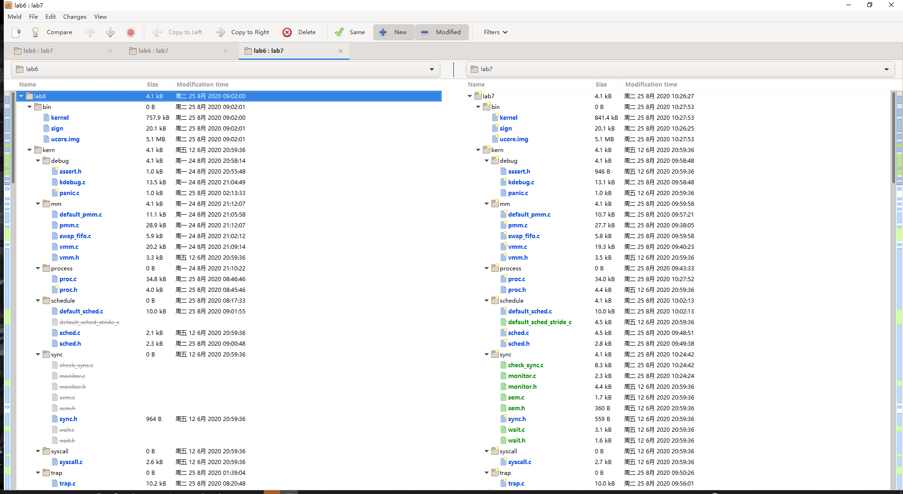

在进行了 merge 后的 lab7 中运行 `make grade` 命令检查，样例能过全部通过

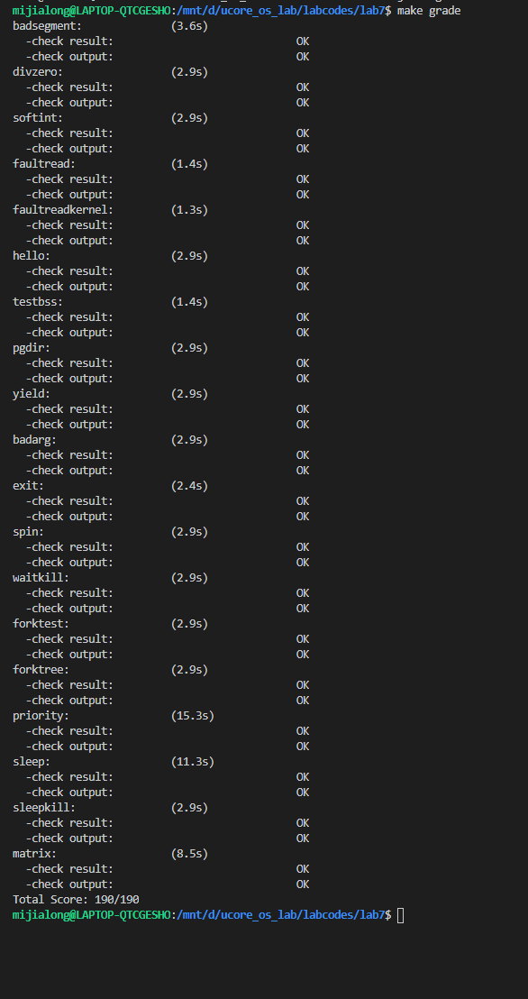

#### 练习1：理解内核级信号量的实现和基于内核级信号量的哲学家就餐问题（不需要编码）

##### 请在实验报告中给出内核级信号量的设计描述，并说其大致执行流流程

信号量结构体
```cpp
typedef struct {
    int value;
    wait_queue_t wait_queue;
} semaphore_t;
```

在该 lab7 中，哲学家问题最主要的是通过 `check_sync()` 函数进行解决该函数在 `init_main()` 中被调用
```cpp
void check_sync(void)
{
    int i;
    // check semaphore
    // 使用信号量解决
    sem_init(&mutex, 1);
    for (i = 0; i < N; i++) // 哲学家数量为 N
    {
        sem_init(&s[i], 0);                                                 // 初始化信号量
        int pid = kernel_thread(philosopher_using_semaphore, (void *)i, 0); // 创建内核线程
        if (pid <= 0)
        {
            panic("create No.%d philosopher_using_semaphore failed.\n");
        }
        philosopher_proc_sema[i] = find_proc(pid);
        set_proc_name(philosopher_proc_sema[i], "philosopher_sema_proc");
    }

    // check condition variable
    // 使用管程解决
    monitor_init(&mt, N);
    for (i = 0; i < N; i++)
    {
        state_condvar[i] = THINKING;
        int pid = kernel_thread(philosopher_using_condvar, (void *)i, 0);
        if (pid <= 0)
        {
            panic("create No.%d philosopher_using_condvar failed.\n");
        }
        philosopher_proc_condvar[i] = find_proc(pid);
        set_proc_name(philosopher_proc_condvar[i], "philosopher_condvar_proc");
    }
}
```

上述代码分别使用了两种方式来解决哲学家问题，分别是：
- 信号量
- 管程

通过上面的代码，可以发现，在该函数中创建了一个线程用于执行 `philosopher_using_semaphore` 函数，查看并分析该函数
```cpp
int philosopher_using_semaphore(void *arg) /* i：哲学家号码，从0到N-1 */
{
    int i, iter = 0;
    i = (int)arg;
    cprintf("I am No.%d philosopher_sema\n", i);
    while (iter++ < TIMES)                                                 // 循环的意义是模拟多次试验
    {                                                                      /* 无限循环 */
        cprintf("Iter %d, No.%d philosopher_sema is thinking\n", iter, i); /* 哲学家正在思考 */
        do_sleep(SLEEP_TIME);
        phi_take_forks_sema(i);
        /* 需要两只叉子，或者阻塞 */
        cprintf("Iter %d, No.%d philosopher_sema is eating\n", iter, i); /* 进餐 */
        do_sleep(SLEEP_TIME);
        phi_put_forks_sema(i);
        /* 把两把叉子同时放回桌子 */
    }
    cprintf("No.%d philosopher_sema quit\n", i);
    return 0;
}
```

该函数最主要的获取/释放信号量的步骤由 `phi_take_forks_sema` 和 `phi_put_forks_sema` 两个函数来进行实现：
```cpp
void phi_take_forks_sema(int i) /* i：哲学家号码从0到N-1 */
{
    down(&mutex);           /* 进入临界区 */
    state_sema[i] = HUNGRY; /* 记录下哲学家i饥饿的事实 */
    phi_test_sema(i);       /* 试图得到两只叉子 */
    up(&mutex);             /* 离开临界区 */
    down(&s[i]);            /* 如果得不到叉子就阻塞 */
}

void phi_put_forks_sema(int i) /* i：哲学家号码从0到N-1 */
{
    down(&mutex);             /* 进入临界区 */
    state_sema[i] = THINKING; /* 哲学家进餐结束 */
    phi_test_sema(LEFT);      /* 看一下左邻居现在是否能进餐 */
    phi_test_sema(RIGHT);     /* 看一下右邻居现在是否能进餐 */
    up(&mutex);               /* 离开临界区 */
}
```

而在这两个函数中，最重要的步骤：离开临界区和阻塞则是分别通过 `up` 和 `down` 来实现

查看 `up` 和其真正的代码：
```cpp
static __noinline void __up(semaphore_t *sem, uint32_t wait_state)
{
    bool intr_flag;
    local_intr_save(intr_flag); // 关闭中断
    {
        wait_t *wait;
        if ((wait = wait_queue_first(&(sem->wait_queue))) == NULL)
        {
            sem->value++; // 当没有进程等待时，信号量 + 1
        }
        else // 否则唤醒队列中第一个进程
        {
            assert(wait->proc->wait_state == wait_state);
            wakeup_wait(&(sem->wait_queue), wait, wait_state, 1);
        }
    }
    local_intr_restore(intr_flag); // 恢复中断
}

void up(semaphore_t *sem)
{
    __up(sem, WT_KSEM);
}
```

查看 `down` 和其真正的代码：
```cpp
static __noinline uint32_t __down(semaphore_t *sem, uint32_t wait_state)
{
    bool intr_flag;
    local_intr_save(intr_flag); // 关闭中断
    if (sem->value > 0)         // 如果信号量大于0
    {
        sem->value--;                  // 当前进程获得我信号量，信号量数值 - 1
        local_intr_restore(intr_flag); // 恢复中断
        return 0;                      // 退出，停止阻塞
    }
    wait_t __wait, *wait = &__wait;
    wait_current_set(&(sem->wait_queue), wait, wait_state); // 进程加入等待队列
    local_intr_restore(intr_flag);                          // 恢复中断

    schedule(); // 调度选择执行其他的进程

    // 被 V 操作唤醒后
    local_intr_save(intr_flag);                 // 关闭中断
    wait_current_del(&(sem->wait_queue), wait); // 从等待队列中删除自己
    local_intr_restore(intr_flag);              // 恢复中断

    if (wait->wakeup_flags != wait_state)
    {
        return wait->wakeup_flags;
    }
    return 0;
}

void down(semaphore_t *sem)
{
    uint32_t flags = __down(sem, WT_KSEM);
    assert(flags == 0);
}
```

##### 请在实验报告中给出给用户态进程/线程提供信号量机制的设计方案，并比较说明给内核级提供信号量机制的异同

设计方案：线程/进程的信号量机制和内核级信号量区别不大，只需要增加部分操作的接口函数即可
- `sem_init` 初始化：设置 `sem.value` 和 `sem.wait_queue`
- `sem_get_value` 获取当前信号量的值：返回 `sem_value`
- `sem_close` 删除调用的进程和它之前打开的一个信号量之间的关联
- `sem_del` 删除该信号量的名字并且在所有进程关闭该信号量（通过调用 `sem_close`）时删除该信号量

区别：由于沿用的内核级信号量，因此在用户态使用信号量时，需要进行系统调用**进入内核态**进行操作

### 3. 实验8-文件系统实现及综合实验

#### 练习0：在前面 ucore 实验 lab1-lab7 的基础上，完成 ucore 文件系统

##### 内容0：填写已有实验

使用 meld 进行可视化 merge
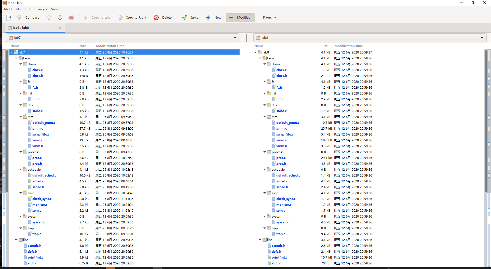

##### 内容1: 完成读文件操作的实现

###### 了解 ucore 文件系统

通过相关参考资料以及阅读源代码，我们可以了解到

ucore 的文件系统架构：
- 通用文件系统访问接口层：提供了用户空间到文件系统的标准访问接口，能够让应用程序获得 ucore 内核的文件系统服务
- 文件系统抽象层：
  - 向上：为内核的文件系统相关的**系统调用实现模块**和其他内核功能模块的访问提供了一致的接口
  - 向下：提供抽象函数指针列表和数据机构来屏蔽不同文件系统的实现细节
- Simple FS 文件系统层：一个基于索引方式的文件系统实例
  - 向上：提供各种具体函数实现对应文件抽象层的抽象函数
  - 向下：访问外设接口
- 外设接口层：
  - 向上：提供设备访问接口并屏蔽不同硬件细节
  - 向下：实现访问各种具体设备（如硬盘、串口、键盘等设备）驱动的接口

ucore 的文件系统数据结构：
- SuperBlock（超级块）：从全局角度描述文件系统的全局信息。范围是整个操作系统空间
- iNode（索引节点）：从文件系统的单个文件角度描述该文件的各种属性和数据所在位置。范围是整个操作空间
- dentry（目录项）：从文件系统的文件路径角度描述路径中的特定目录。范围是整个操作系统空间
- file（文件）：从进程的角度描述进程在访问文件时需要了解的文件标识、读写位置、引用情况等详细信息。范围是具体进程

ucore 读写硬盘操作的流程：
1. 应用程序发出请求，请求硬盘读/写数据；该程序通过 *FS syscall* 接口执行系统调用，获得操作系统关于文件的服务
2. 一旦操作系统内系统调用得到请求，会前往 *VFS* （虚拟文件系统）层面，该抽象层包含文件/目录接口等，会屏蔽底层具体文件系统
3. 如果 VFS 能够被处理，那么 VFS 将会将 *iNode* 传递给 *Simple FS* ，将该 iNode 从抽象转化为具体
4. 通过上述的 iNode 经过 I/O 接口进行磁盘读写

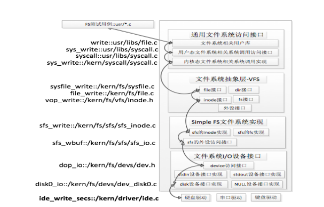

查看相关源代码

Simple FS 文件系统代码如下，前三个数据结构便是硬盘文件布局的全局信息，可以看到后面还涉及到操作相关的信号量等相关成员
```cpp
/* filesystem for sfs */
struct sfs_fs {
    struct sfs_super super;                         /* on-disk superblock */
    struct device *dev;                             /* device mounted on */
    struct bitmap *freemap;                         /* blocks in use are mared 0 */
    bool super_dirty;                               /* true if super/freemap modified */
    void *sfs_buffer;                               /* buffer for non-block aligned io */
    semaphore_t fs_sem;                             /* semaphore for fs */
    semaphore_t io_sem;                             /* semaphore for io */
    semaphore_t mutex_sem;                          /* semaphore for link/unlink and rename */
    list_entry_t inode_list;                        /* inode linked-list */
    list_entry_t *hash_list;                        /* inode hash linked-list */
};
```

查看超级块 *sfs_super* 数据结构，为了从全局角度描述特定文件系统的全局信息，分别定义了标识符、块数、空闲块数和相关信息四个成员变量
```cpp
/*
 * On-disk superblock
 */
struct sfs_super {
    uint32_t magic;                                 /* magic number, should be SFS_MAGIC */
    uint32_t blocks;                                /* # of blocks in fs */
    uint32_t unused_blocks;                         /* # of unused blocks in fs */
    char info[SFS_MAX_INFO_LEN + 1];                /* infomation for sfs  */
};
```

iNode 数据结构有两种，分别对应磁盘和 SFS 层面
1. 磁盘层面的 iNode：
```cpp
/* inode (on disk) */
struct sfs_disk_inode {
    uint32_t size;                                  /* size of the file (in bytes) */
    uint16_t type;                                  /* one of SYS_TYPE_* above */
    uint16_t nlinks;                                /* # of hard links to this file */
    uint32_t blocks;                                /* # of blocks */
    uint32_t direct[SFS_NDIRECT];                   /* direct blocks */
    uint32_t indirect;                              /* indirect blocks */
//    uint32_t db_indirect;                           /* double indirect blocks */
//   unused
};
```
对于磁盘上的 iNode ，最后两个成员变量 `direct` 和 `indirect` 分别对应根目录下的**直接索引**和**间接索引**：
- direct[] 直接指向保存文件内容数据的数据块索引
- indirect 间接指向保存文件内容数据的数据块，即**间接数据块**，该数据块存放数据索引，这些索引指向的数据块则是文件内容数据
2. SFS 层面的 iNode：
```cpp
/* inode for sfs */
struct sfs_inode {
    struct sfs_disk_inode *din;                     /* on-disk inode */
    uint32_t ino;                                   /* inode number */
    bool dirty;                                     /* true if inode modified */
    int reclaim_count;                              /* kill inode if it hits zero */
    semaphore_t sem;                                /* semaphore for din */
    list_entry_t inode_link;                        /* entry for linked-list in sfs_fs */
    list_entry_t hash_link;                         /* entry for hash linked-list in sfs_fs */
};
```

> VFS（文件系统抽象层）是把不同文件系统的**对外共性接口**提取出来，形成的一个**函数指针数组**，从而使*文件系统访问接口层*只需要访问 VFS 而不需要考虑和关心具体的实现

查看该数据结构的代码，可以发现其有很大一部分抽象的方法（和调度相关的 sched_class 类似）：
```cpp
struct fs {
    union {
        struct sfs_fs __sfs_info;                   
    } fs_info;                                     // filesystem-specific data 
    enum {
        fs_type_sfs_info,
    } fs_type;                                     // filesystem type 
    int (*fs_sync)(struct fs *fs);                 // Flush all dirty buffers to disk 
    struct inode *(*fs_get_root)(struct fs *fs);   // Return root inode of filesystem.
    int (*fs_unmount)(struct fs *fs);              // Attempt unmount of filesystem.
    void (*fs_cleanup)(struct fs *fs);             // Cleanup of filesystem.???
};
```

关于进程在内核中直接访问的相关文件信息，由 *file* 接口实现：
```cpp
struct file
{
    enum
    {
        FD_NONE,
        FD_INIT,
        FD_OPENED,
        FD_CLOSED,
    } status;           // 文件的可执行状态
    bool readable;      // 是否可读
    bool writable;      // 是否可写
    int fd;             // 在 filemap 中的索引
    off_t pos;          // 文件的位置
    struct inode *node; // 对应的 iNode 指针
    int open_count;     // 打开的次数
};
```

发现在 VFS 中还存在一个 iNode 接口：
```cpp
/*
 * Abstract low-level file.
 *
 * Note: in_info is Filesystem-specific data, in_type is the inode type
 *
 * open_count is managed using VOP_INCOPEN and VOP_DECOPEN by
 * vfs_open() and vfs_close(). Code above the VFS layer should not
 * need to worry about it.
 */
struct inode
{
    union
    {
        struct device __device_info;       // 设备文件系统中的 iNode 信息
        struct sfs_inode __sfs_inode_info; // SFS 文件系统中的 iNode 信息
    } in_info;
    enum
    {
        inode_type_device_info = 0x1234,
        inode_type_sfs_inode_info,
    } in_type;                      // 所属文件系统类型
    int ref_count;                  // 引用次数
    int open_count;                 // 打开此 iNode 对应文件个数
    struct fs *in_fs;               // 抽象文件系统，包含访问文件系统的函数指针
    const struct inode_ops *in_ops; // 抽象 iNode 操作，包含访问 iNode 的函数指针
};
```
这个位于内存中的索引负责把不同文件系统的特定索引节点信息统一封装，**避免进程直接访问具体文件系统**，包含两个储存函数指针的成员变量，第一个已在上面给出，第二个 *inode_ops* 类型的成员变量是针对 `inode` 的操作函数指针列表，包含了具体的操作，从而使用户进程不需要去了解文件系统的具体实现细节，代码如下：
```cpp
/*
 * Abstract operations on a inode.
 *
 * These are used in the form VOP_FOO(inode, args), which are macros
 * that expands to inode->inode_ops->vop_foo(inode, args). The operations
 * "foo" are:
 *
 *    vop_open        - Called on open() of a file. Can be used to
 *                      reject illegal or undesired open modes. Note that
 *                      various operations can be performed without the
 *                      file actually being opened.
 *                      The inode need not look at O_CREAT, O_EXCL, or 
 *                      O_TRUNC, as these are handled in the VFS layer.
 *
 *                      VOP_EACHOPEN should not be called directly from
 *                      above the VFS layer - use vfs_open() to open inodes.
 *                      This maintains the open count so VOP_LASTCLOSE can
 *                      be called at the right time.
 *
 *    vop_close       - To be called on *last* close() of a file.
 *
 *                      VOP_LASTCLOSE should not be called directly from
 *                      above the VFS layer - use vfs_close() to close
 *                      inodes opened with vfs_open().
 *
 *    vop_reclaim     - Called when inode is no longer in use. Note that
 *                      this may be substantially after vop_lastclose is
 *                      called.
 *
 *****************************************
 *
 *    vop_read        - Read data from file to uio, at offset specified
 *                      in the uio, updating uio_resid to reflect the
 *                      amount read, and updating uio_offset to match.
 *                      Not allowed on directories or symlinks.
 *
 *    vop_getdirentry - Read a single filename from a directory into a
 *                      uio, choosing what name based on the offset
 *                      field in the uio, and updating that field.
 *                      Unlike with I/O on regular files, the value of
 *                      the offset field is not interpreted outside
 *                      the filesystem and thus need not be a byte
 *                      count. However, the uio_resid field should be
 *                      handled in the normal fashion.
 *                      On non-directory objects, return ENOTDIR.
 *
 *    vop_write       - Write data from uio to file at offset specified
 *                      in the uio, updating uio_resid to reflect the
 *                      amount written, and updating uio_offset to match.
 *                      Not allowed on directories or symlinks.
 *
 *    vop_ioctl       - Perform ioctl operation OP on file using data
 *                      DATA. The interpretation of the data is specific
 *                      to each ioctl.
 *
 *    vop_fstat        -Return info about a file. The pointer is a 
 *                      pointer to struct stat; see stat.h.
 *
 *    vop_gettype     - Return type of file. The values for file types
 *                      are in sfs.h.
 *
 *    vop_tryseek     - Check if seeking to the specified position within
 *                      the file is legal. (For instance, all seeks
 *                      are illegal on serial port devices, and seeks
 *                      past EOF on files whose sizes are fixed may be
 *                      as well.)
 *
 *    vop_fsync       - Force any dirty buffers associated with this file
 *                      to stable storage.
 *
 *    vop_truncate    - Forcibly set size of file to the length passed
 *                      in, discarding any excess blocks.
 *
 *    vop_namefile    - Compute pathname relative to filesystem root
 *                      of the file and copy to the specified io buffer. 
 *                      Need not work on objects that are not
 *                      directories.
 *
 *****************************************
 *
 *    vop_creat       - Create a regular file named NAME in the passed
 *                      directory DIR. If boolean EXCL is true, fail if
 *                      the file already exists; otherwise, use the
 *                      existing file if there is one. Hand back the
 *                      inode for the file as per vop_lookup.
 *
 *****************************************
 *
 *    vop_lookup      - Parse PATHNAME relative to the passed directory
 *                      DIR, and hand back the inode for the file it
 *                      refers to. May destroy PATHNAME. Should increment
 *                      refcount on inode handed back.
 */
struct inode_ops
{
    unsigned long vop_magic;
    int (*vop_open)(struct inode *node, uint32_t open_flags);
    int (*vop_close)(struct inode *node);
    int (*vop_read)(struct inode *node, struct iobuf *iob);
    int (*vop_write)(struct inode *node, struct iobuf *iob);
    int (*vop_fstat)(struct inode *node, struct stat *stat);
    int (*vop_fsync)(struct inode *node);
    int (*vop_namefile)(struct inode *node, struct iobuf *iob);
    int (*vop_getdirentry)(struct inode *node, struct iobuf *iob);
    int (*vop_reclaim)(struct inode *node);
    int (*vop_gettype)(struct inode *node, uint32_t *type_store);
    int (*vop_tryseek)(struct inode *node, off_t pos);
    int (*vop_truncate)(struct inode *node, off_t len);
    int (*vop_create)(struct inode *node, const char *name, bool excl, struct inode **node_store);
    int (*vop_lookup)(struct inode *node, char *path, struct inode **node_store);
    int (*vop_ioctl)(struct inode *node, int op, void *data);
};
```

打开文件的流程：
1. 通过调用 `safe_open` 函数获取文件描述符
2. 在通用文件访问接口层，调用用户态函数进入内核态调用相关函数，并且把用户空间中的路径参数拷贝到内核空间中，进入文件系统抽象层
3. 进入文件系统抽象层之后，为即将打开的文件分配一个 *file* 数据结构变量，其索引值需要返回给用户进程并且复制给第1步中的文件描述符；之后需要通过路径来找到文件所对应的 VFS 索引节点 iNode，具体操作为通过 `vfs_lookup` 找到对应的 inode，通过 `vop_open` 打开文件
4. SFS 文件系统层有两个操作
   - `sfs_lookup` 函数会以 '/' 为分割符分解路径获得子目录和最终文件对应的 iNode 节点；之后循环查找子目录下的文件所对应的 iNode 节点，直到路径无法分解，拿到对应的节点
   - `sfs_lookup_once` 函数则是查找与路径匹配的目录项：
     - 如果找到了，则根据目录项中记录的 iNode 所处数据块索引找到路径对应的 SFS 磁盘 *inode* ，并且读入其内容，创建 SFS 内存 inode

###### 具体实现

该练习需要完成 `sfs_io_nolock` 函数，阅读注释，可以了解到具体操作为
1. 判断第一块是否对齐，如果没有对齐，就从第一块结尾处的偏移读取部分内容
2. 读写对齐的块
3. 最后一块没有对齐，需要读写部分最后块的内容

具体代码实现为：
```cpp
/*  
 * sfs_io_nolock - Rd/Wr a file contentfrom offset position to offset+ length  disk blocks<-->buffer (in memroy)
 * @sfs:      sfs file system
 * @sin:      sfs inode in memory
 * @buf:      the buffer Rd/Wr
 * @offset:   the offset of file
 * @alenp:    the length need to read (is a pointer). and will RETURN the really Rd/Wr lenght
 * @write:    BOOL, 0 read, 1 write
 */
static int
sfs_io_nolock(struct sfs_fs *sfs, struct sfs_inode *sin, void *buf, off_t offset, size_t *alenp, bool write)
{

    ······

    //LAB8:EXERCISE1 YOUR CODE HINT: call sfs_bmap_load_nolock, sfs_rbuf, sfs_rblock,etc. read different kind of blocks in file
    /*
	 * (1) If offset isn't aligned with the first block, Rd/Wr some content from offset to the end of the first block
	 *       NOTICE: useful function: sfs_bmap_load_nolock, sfs_buf_op
	 *               Rd/Wr size = (nblks != 0) ? (SFS_BLKSIZE - blkoff) : (endpos - offset)
	 * (2) Rd/Wr aligned blocks 
	 *       NOTICE: useful function: sfs_bmap_load_nolock, sfs_block_op
     * (3) If end position isn't aligned with the last block, Rd/Wr some content from begin to the (endpos % SFS_BLKSIZE) of the last block
	 *       NOTICE: useful function: sfs_bmap_load_nolock, sfs_buf_op	
	*/

    // 第一块没有对齐
    if ((blkoff = offset % SFS_BLKSIZE) != 0) // 检查是否对齐
    {
        // endpos 和 offset 是否处于同一块
        //                  是， size 为 SFS_BLKSIZE - blkoff
        //                  否， size 为 endpos - offset
        size = (nblks != 0) ? (SFS_BLKSIZE - blkoff) : (endpos - offset);
        if ((ret = sfs_bmap_load_nolock(sfs, sin, blkno, &ino)) != 0)
        {
            goto out;
        }
        if ((ret = sfs_buf_op(sfs, buf, size, ino, blkoff)) != 0)
        {
            goto out;
        }
        alen += size;
        if (nblks == 0)
        {
            goto out;
        }

        // 维护已经读写成功的数据长度信息
        buf += size;
        blkno++;
        nblks--;
    }

    // 中间对齐
    size = SFS_BLKSIZE;
    while (nblks != 0)
    {
        // 操作近似于上面
        if ((ret = sfs_bmap_load_nolock(sfs, sin, blkno, &ino)) != 0)
        {
            goto out;
        }
        if ((ret = sfs_block_op(sfs, buf, ino, 1)) != 0)
        {
            goto out;
        }
        // 维护已经读写成功的数据长度信息
        alen += size;
        buf += size;
        blkno++;
        nblks--;
    }

    // 最后一块没有对齐
    if ((size = endpos % SFS_BLKSIZE) != 0)
    {
        // 操作近似于上面
        if ((ret = sfs_bmap_load_nolock(sfs, sin, blkno, &ino)) != 0)
        {
            goto out;
        }
        if ((ret = sfs_buf_op(sfs, buf, size, ino, 0)) != 0)
        {
            goto out;
        }
        alen += size;
    }


    ······
}
```

##### 内容2: 完成基于文件系统的执行程序机制的实现

> 练习需要改写 *kern/process/proc.c* 中的 `load_code` 函数，通过运行 `make qemu` ，如果能看看到sh用户程序的执行界面，则基本成功了。如果在sh用户界面上可 以执行”ls”,”hello”等其他放置在sfs文件系统中的其他执行程序，则可以认为本实验基本成功。

从而实现基本的的基于文件系统的执行程序机制，在 meld 的时候可以发现，先前的实验中，仅将原先就加载到了内核内存空间中的 *elf* 可执行文件加载到用户内存空间中，而没有涉及从磁盘读取数据的操作；而在 LAB8 中，很多相关函数读 *elf* 文件的方式由从内存读变成了从磁盘上读

查看注释，具体步骤如下：
1. 为当前进程创建一个新的内存管理结构 *mm*
2. 创建一个新的页目录表 PDT ，并将 `mm->pgdir` 设置为 PDT 的 *kva*
3. 将磁盘上的ELF文件的TEXT/DATA/BSS段加载（复制）到进程内存空间中
   1. 从磁盘中读取 elf 文件头
   2. 根据获取到的 elf 文件头获取磁盘上的程序头
   3. 调用 `mm_map` 建立 TEXT/DATA 的虚拟内存地址
   4. 调用 `pgdir_alloc_page` 为 TEXT/DATA 申请页，并且读取磁盘内容并复制到新申请的页中（需要建立映射）
   5. 调用 `pgdir_alloc_page` 为 BSS 段申请页，并初始化为0（需要建立映射）
4. 调用 `mm_map` 设置用户栈，并将参数放入该栈中，具体操作为：将用户栈的虚拟空间设置为合法，并且为栈顶部分先分配4个物理页，建立好映射关系
5. 设置当前进程的 *mm* 、 *cr3* ，并且使用 `lcr3` 宏重置 *pgdir*，用于切换到用户地址空间
6. 设置用户栈的 *uargc* 和 *uargv* （即需要传递给执行程序的参数）
7. 设置用户环境下的中断帧
8. 如果上述步骤失败，需要清理环境

具体实现为：
```cpp
static int
load_icode(int fd, int argc, char **kargv)
{

    ······

    /* LAB8:EXERCISE2 YOUR CODE  HINT:how to load the file with handler fd  in to process's memory? how to setup argc/argv?
     * MACROs or Functions:
     *  mm_create        - create a mm
     *  setup_pgdir      - setup pgdir in mm
     *  load_icode_read  - read raw data content of program file
     *  mm_map           - build new vma
     *  pgdir_alloc_page - allocate new memory for  TEXT/DATA/BSS/stack parts
     *  lcr3             - update Page Directory Addr Register -- CR3
     */
    /* (1) create a new mm for current process
     * (2) create a new PDT, and mm->pgdir= kernel virtual addr of PDT
     * (3) copy TEXT/DATA/BSS parts in binary to memory space of process
     *    (3.1) read raw data content in file and resolve elfhdr
     *    (3.2) read raw data content in file and resolve proghdr based on info in elfhdr
     *    (3.3) call mm_map to build vma related to TEXT/DATA
     *    (3.4) callpgdir_alloc_page to allocate page for TEXT/DATA, read contents in file
     *          and copy them into the new allocated pages
     *    (3.5) callpgdir_alloc_page to allocate pages for BSS, memset zero in these pages
     * (4) call mm_map to setup user stack, and put parameters into user stack
     * (5) setup current process's mm, cr3, reset pgidr (using lcr3 MARCO)
     * (6) setup uargc and uargv in user stacks
     * (7) setup trapframe for user environment
     * (8) if up steps failed, you should cleanup the env.
     */
    assert(argc >= 0 && argc <= EXEC_MAX_ARG_NUM);
    // 1. 为当前进程创建一个新的内存管理结构 *mm*
    if (current->mm != NULL) // 判断 mm 是否已经释放（需要已经释放）
    {
        panic("load_icode: current->mm must be empty\n");
    }

    int ret = -E_NO_MEM;
    struct mm_struct *mm;

    if ((mm = mm_create()) == NULL)
    {
        goto bad_mm;
    }

    // (2) create a new PDT, and mm->pgdir= kernel virtual addr of PDT
    // 2. 创建一个新的页目录表 PDT ，并将 `mm->pgdir` 设置为 PDT 的 *kva*

    if (setup_pgdir(mm) != 0)
    {
        goto bad_pgdir_cleanup_mm;
    }
    struct Page *page;
    // (3) copy TEXT/DATA/BSS parts in binary to memory space of process
    // 3. 将磁盘上的ELF文件的TEXT/DATA/BSS段加载（复制）到进程内存空间中

    //      (3.1) read raw data content in file and resolve elfhdr
    //      3.1. 从磁盘中读取 elf 文件头

    struct elfhdr elf, *elfp = &elf;
    if ((ret = load_icode_read(fd, elfp, sizeof(struct elfhdr), 0)) != 0) // 读取 elf 文件头
    {
        goto bad_elf_cleanup_pgdir;
    }

    if (elfp->e_magic != ELF_MAGIC) // 判断 elf 文件合法与否
    {
        ret = -E_INVAL_ELF;
        goto bad_elf_cleanup_pgdir;
    }

    struct proghdr phdr, *phdrp = &phdr;
    uint32_t vm_flags, perm, phnum;

    for (phnum = 0; phnum < elfp->e_phnum; phnum++)
    {
        off_t phoff = elfp->e_phoff + phnum * sizeof(struct proghdr);
        if ((ret = load_icode_read(fd, phdrp, sizeof(struct proghdr), phoff)) != 0) // 读取程序头
        {
            goto bad_cleanup_mmap;
        }

        if (phdrp->p_type != ELF_PT_LOAD)
        {
            continue;
        }

        if (phdrp->p_filesz > phdrp->p_memsz)
        {
            ret = -E_INVAL_ELF;
            goto bad_cleanup_mmap;
        }

        if (phdrp->p_filesz == 0)
        {
            continue;
        }

        // 以上顺序不能调换

        //      (3.3) call mm_map to build vma related to TEXT/DATA
        //      3.3. 调用 `mm_map` 建立 TEXT/DATA 的虚拟内存地址

        vm_flags = 0;
        perm = PTE_U;

        // 设置权限
        if (phdrp->p_flags & ELF_PF_X)
            vm_flags |= VM_EXEC;
        if (phdrp->p_flags & ELF_PF_W)
            vm_flags |= VM_WRITE;
        if (phdrp->p_flags & ELF_PF_R)
            vm_flags |= VM_READ;
        if (vm_flags & VM_WRITE)
            perm |= PTE_W;

        if ((ret = mm_map(mm, phdrp->p_va, phdrp->p_memsz, vm_flags, NULL)) != 0) // 设置虚拟内存为合法
        {
            goto bad_cleanup_mmap;
        }

        //      (3.4) callpgdir_alloc_page to allocate page for TEXT/DATA, read contents in file and copy them into the new allocated pages
        //      3.4. 调用 `pgdir_alloc_page` 为 TEXT/DATA 申请页，并且读取磁盘内容并复制到新申请的页中（需要建立映射）

        off_t offset = phdrp->p_offset;
        size_t off, size;
        uintptr_t start = phdrp->p_va, la = ROUNDDOWN(start, PGSIZE);
        ret = -E_NO_MEM;

        uintptr_t end = phdrp->p_va + phdrp->p_filesz;

        while (start < end)
        {
            if ((page = pgdir_alloc_page(mm->pgdir, la, perm)) == NULL) // 为TEXT/DATA段分配物理内存空间
            {
                ret = -E_NO_MEM;
                goto bad_cleanup_mmap;
            }
            off = start - la;
            size = PGSIZE - off;
            la += PGSIZE;
            if (end < la)
            {
                size -= (la - end);
            }
            if ((ret = load_icode_read(fd, page2kva(page) + off, size, offset)) != 0) // 将磁盘上的TEXT/DATA段读入到分配好的内存空间中去
            {
                goto bad_cleanup_mmap;
            }
            start += size;
            offset += size;
        }
        //      (3.5) callpgdir_alloc_page to allocate pages for BSS, memset zero in these pages
        //      3.5. 调用 `pgdir_alloc_page` 为 BSS 段申请页，并初始化为0（需要建立映射）

        end = phdrp->p_va + phdrp->p_memsz;
        if (start < la)
        {
            // 如果存在BSS段，并且先前的 TEXT/DATA 段分配的最后一页没有被完全占用
            // 则剩余的部分被BSS段占用，因此进行清零初始化
            if (start == end)
            {
                continue;
            }
            off = start + PGSIZE - la;
            size = PGSIZE - off;
            if (end < la)
            {
                size -= (la - end);
            }
            memset(page2kva(page) + off, 0, size);
            start += size;
            assert((end < la && start == end) || (end >= la && start == la)); // 两种需要注意的情况
        }
        while (start < end) // 如果 BSS 段需要更多的内存，需要进一步进行分配
        {
            if ((page = pgdir_alloc_page(mm->pgdir, la, perm)) == NULL) // 分配新的物理内存页
            {
                ret = -E_NO_MEM;
                goto bad_cleanup_mmap;
            }
            off = start - la;
            size = PGSIZE - off;
            la += PGSIZE;
            if (end < la)
            {
                size -= (la - end);
            }
            memset(page2kva(page), 0, size); // 清零初始化
            start += size;
        }
    }
    sysfile_close(fd); // 关闭传入的文件

    // (4) call mm_map to setup user stack, and put parameters into user stack
    // 4. 调用 `mm_map` 设置用户栈，并将参数放入该栈中，具体操作为：将用户栈的虚拟空间设置为合法，并且为栈顶部分先分配4个物理页，建立好映射关系

    vm_flags = VM_READ | VM_WRITE | VM_STACK;                                        // 设置用户栈权限
    if ((ret = mm_map(mm, USTACKTOP - USTACKSIZE, USTACKSIZE, vm_flags, NULL)) != 0) // 设置用户栈所在虚拟内存区域为合法
    {
        goto bad_cleanup_mmap;
    }

    // 分配4帧物理页
    int i = 1;
    for (; i <= 4; i++)
    {
        assert(pgdir_alloc_page(mm->pgdir, USTACKTOP - i * PGSIZE, PTE_USER) != NULL);
    }

    // (5) setup current process's mm, cr3, reset pgidr (using lcr3 MARCO)
    // 5. 设置当前进程的 *mm* 、 *cr3* ，并且使用 `lcr3` 宏重置 *pgdir*，用于切换到用户地址空间

    // 将空间不足而导致的分配物理页的操作已经交由 page fault 处理
    mm_count_inc(mm);
    current->mm = mm;
    current->cr3 = PADDR(mm->pgdir);
    lcr3(PADDR(mm->pgdir));
    // (6) setup uargc and uargv in user stacks
    // 6. 设置用户栈的 *uargc* 和 *uargv* （即需要传递给执行程序的参数）

    uint32_t argvSize = 0;
    for (i = 0; i < argc; i++)
    {
        argvSize += strnlen(kargv[i], EXEC_MAX_ARG_LEN + 1) + 1;
    }
    uintptr_t stackTop = USTACKTOP - (argvSize / sizeof(long) + 1) * sizeof(long); // 推导栈顶位置
    char **uargv = (char **)(stackTop - argc * sizeof(char *));
    argvSize = 0;
    for (i = 0; i < argc; i++)
    {
        uargv[i] = strcpy((char *)(stackTop + argvSize), kargv[i]);
        argvSize += (strnlen(kargv[i], EXEC_MAX_ARG_LEN + 1) + 1);
    }

    stackTop = (uintptr_t)uargv - sizeof(int);
    *(int *)stackTop = argc; // 真正的栈顶

    // (7) setup trapframe for user environment
    // 7. 设置用户环境下的中断帧

    struct trapframe *tf = current->tf;
    memset(tf, 0, sizeof(struct trapframe)); // 初始化
    tf->tf_cs = USER_CS;                     // 采用用户态数据段和代码段选择子是为了返回用户态
    tf->tf_ds = tf->tf_es = tf->tf_ss = USER_DS;
    tf->tf_esp = stackTop;
    tf->tf_eip = elfp->e_entry; // 设置返回地址为用户程序的入口
    tf->tf_eflags = FL_IF;      // 允许中断
    ret = 0;

    // (8) if up steps failed, you should cleanup the env.
    // 8. 如果上述步骤失败，需要清理环境

out:
    return ret;
bad_cleanup_mmap:
    exit_mmap(mm);
bad_elf_cleanup_pgdir:
    put_pgdir(mm);
bad_pgdir_cleanup_mm:
    mm_destroy(mm);
bad_mm:
    goto out;
}
```

搜索 LAB8 对应的注释，发现还有其他需要修改的地方：

`alloc_proc` 函数需要进行部分更新
```cpp
// alloc_proc - alloc a proc_struct and init all fields of proc_struct
static struct proc_struct *
alloc_proc(void)
{
    struct proc_struct *proc = kmalloc(sizeof(struct proc_struct));
    if (proc != NULL)
    {
    
        ······


        //LAB8:EXERCISE2 YOUR CODE HINT:need add some code to init fs in proc_struct, ...
        proc->filesp = NULL; // 初始化 PCB
    }
    return proc;
}
```

`do_fork` 函数需要进行部分更新
```cpp
int do_fork(uint32_t clone_flags, uintptr_t stack, struct trapframe *tf)
{

    ······

    wakeup_proc(proc); // 唤醒进程
    //    7. 将返回结果设置为**子进程 pid**
    ret = proc->pid;

    //LAB5 YOUR CODE : (update LAB4 steps)
    /* Some Functions
    *    set_links:  set the relation links of process.  ALSO SEE: remove_links:  lean the relation links of process 
    *    -------------------
	*    update step 1: set child proc's parent to current process, make sure current process's wait_state is 0
	*    update step 5: insert proc_struct into hash_list && proc_list, set the relation links of process
    */

    // LAB8 所需要的
    copy_files(clone_flags, proc);

    ······

}
```

在执行 `make grade` 和 `make qemu-nox` 的过程中出现较多的错误，在网上搜索资料后猜测可能是环境没有配置好和 *qemu* 版本过高导致的 *grade.sh* 不兼容
1. 首先尝试了使用新版的 *grade.sh* 进行测试，发现部分测试能够通过，但是会出现 `init check memory pass` 的 WRONG
2. 接着查看了 ucore 的 github 页面，在该页面下寻找到手动配置 Linux 环境的教程，在 WSL 中使用命令 `sudo apt-get install build-essential git qemu-system-x86 vim-gnome gdb cgdb eclipse-cdt make diffutils exuberant-ctags tmux openssh-server cscope meld qgit gitg gcc-multilib gcc-multilib g++-multilib` 和 `apt-get install zlib1g-dev libsdl1.2-dev libesd0-dev automake` 之后，发现需要安装很多软件，因此怀疑是缺乏其中的一些安装包导致环境不兼容，因为在之间运行参考答案的代码时，也出现了类似的报错
3. 在更新了环境之并且保存了 lab8 中专门的代码之后， discard 了所有的操作，重新使用 meld 进行 *merge* 操作，在操作过程中发现 LAB8的 `load_icode` 函数的前面的代码和 LAB7 中不同，但在此之前没有特别的印象，因此怀疑在进行 merge 操作时误把这部分代码也覆盖掉了，因此导致了 bug
4. 重新 merge 完代码之后，将原先完成的代码和更新置入，再执行 `make grade` 命令，得到如下结果，发现能够通过所有的检测
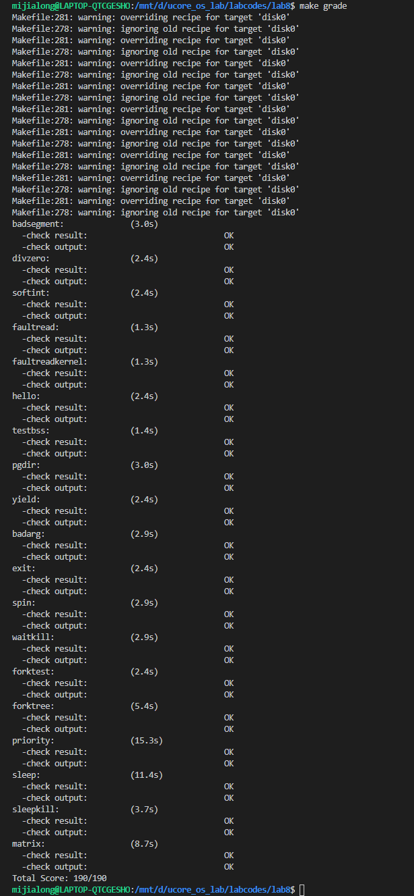

执行 `make qemu-nox` 命令，在终端中能够执行对应的命令，发现可以运行对应的代码
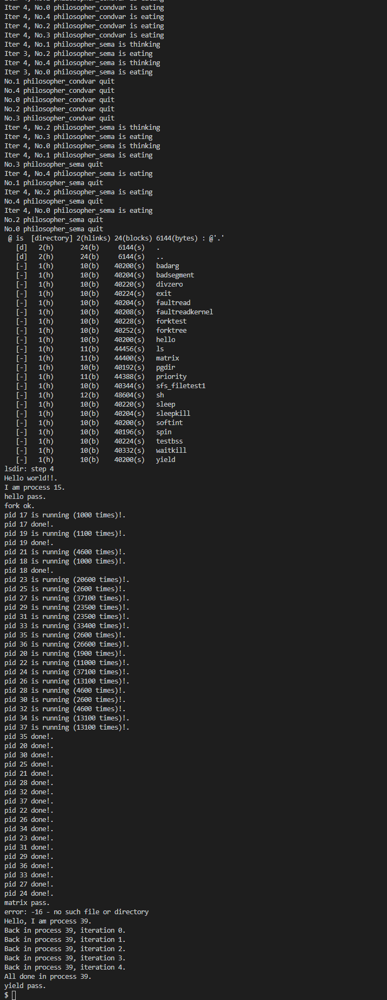

#### 练习1：在上述实验的基础上，修改ucore调度器为采用多级反馈队列调度算法

> 该练习代码在 **lab8-MFLQ** 中

具体实现在 lab6 中就已经给出，修改对应的代码，执行 `make grade` 命令，结果如下，可以发现，除了算法没有使用 stride 算法导致一个测试没有通过之外，其他测试都能够通过
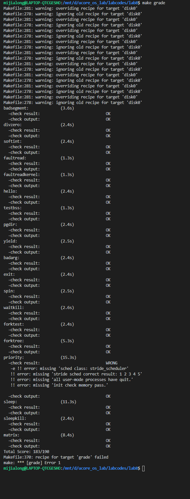

执行 `make qemu-nox` 选择执行部分命令，能够运行，具体如下
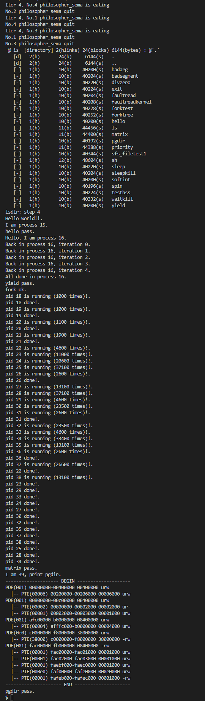

## 实验结果

### 1. 实验6-调度器

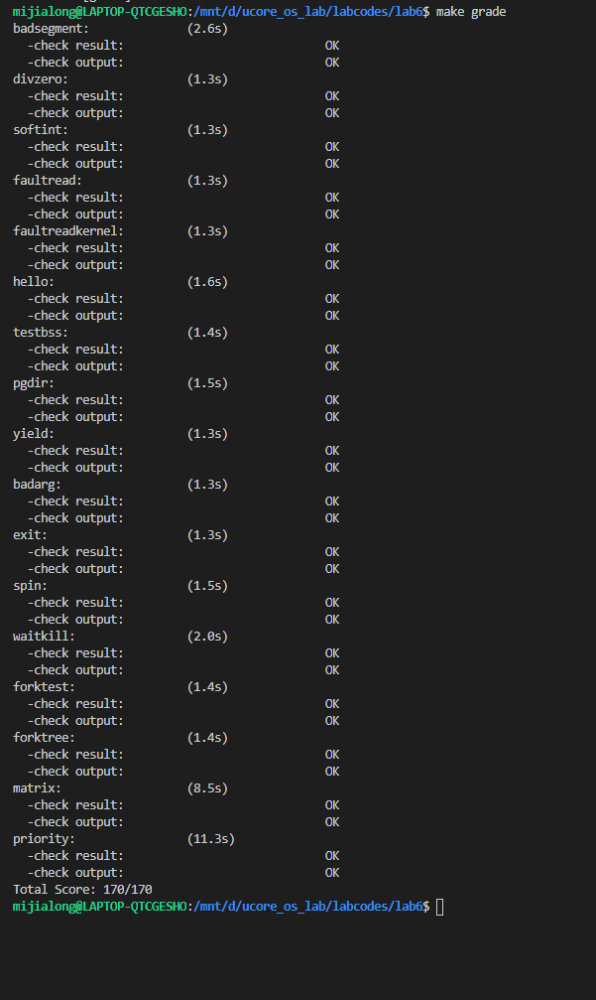

### 2. 实验7-同步互斥


### 3. 实验8-文件系统实现及综合实验

完成练习0后：


完成练习1后：


## 实验总结

### 实验6-调度器

在理解了调度机制和进程切换的具体操作之后，整个实验就比较好理解了，并且完成了多级调度队列的具体实现

### 实验7-同步互斥

由于在理论实验中完成了 生产者消费者问题 和 读者写者问题 的解决，因此在面对哲学家问题时理解起来比较方便

### 实验8-文件系统实现及综合实验

本次实验是最困难的一次，代码量大，需要理解的过程和信息多，因此在部分代码上参考了他人的完成代码用于理解对应过程，虽然困难很多，但是最终能够在 make qemu-nox 命令下运行对应的命令，还是非常开心的，这几月一来的学习和实践有了结果，虽然过程很艰难，但最终的结果换来了是满满的收获和欣喜

### 对比 ucore_lab 中提供的参考答案，描述区别

在部分代码细节上有区别，总体来说一致

### 重要并且对应的知识点

实验：
1. 实验6-调度器
   - 面向对象编程思想
   - Round-Robin调度算法
   - Stride调度算法
   - 多级反馈队列调度算法
   - 调度算法框架的实现
2. 实验7-同步互斥
   - 底层为操作系统实现互斥访问的机制：禁用中断、定时器、等待队列、Test and Set指令等
   - 信号量机制；条件变量和管程机制
   - 解决同步互斥问题的方法
3. 实验8-文件系统实现
   - 虚拟文件系统
   - SFS文件系统
   - 将设备抽象为文件的管理方式
   - 系统调用
   - 进程间的调度、管理
   - ELF文件格式
   - ucore中用户进程虚拟空间的划分

理论：
1. 实验6-调度器
   - ucore中对调度算法的具体封装方式
   - ucore中具体的三种调度算法的实现
2. 实验7-同步互斥
   - 在OS中实现对资源互斥访问的方法
   - 在OS中具体实现信号量机制、条件变量和管程机制的方法
   - 具体解决同步互斥问题（哲学家问题）的实现
3. 实验8-文件系统实现
   - 在ucore中文件系统、虚拟文件系统、以及SFS文件系统的具体实现
   - 在ucore中将stdin，stdout抽象成文件的机制
   - 在ucore中系统调用的机制
   - 在ucore中完成ELF文件从磁盘到内存的加载的具体机制

关系：
- 前者的知识点为后者具体在操作系统中实现具体的功能提供了基础知识
- 前者为后者提供了底层的支持，比如对SFS文件系统的了解才能够使得可以在OS中正确地实现对使用该文件系统的磁盘的访问；
- 前者给后者提供了必要的基础知识，比如只有了解了ELF文件的格式，以及了解了用户进程空间的划分之后，才能够正确地在OS中实现将指定ELF文件加载到内存中运行的操作（exec系统调用）

### 实验中没有对应上的知识点

1. 实验6-调度器
   - 操作系统的启动过程
   - 具体各种不同的调度算法之间的理论分析对比以及实验分析对比
   - 进程之间的同步互斥机制
2. 实验7-同步互斥
   - 操作系统的启动过程
   - 操作系统的内存管理
   - 操作系统对I/O设备的管理
3. 实验8-文件系统实现
   - 进程之间的同步互斥机制
   - 操作系统的启动机制
   - 操作系统对网络协议栈的支持