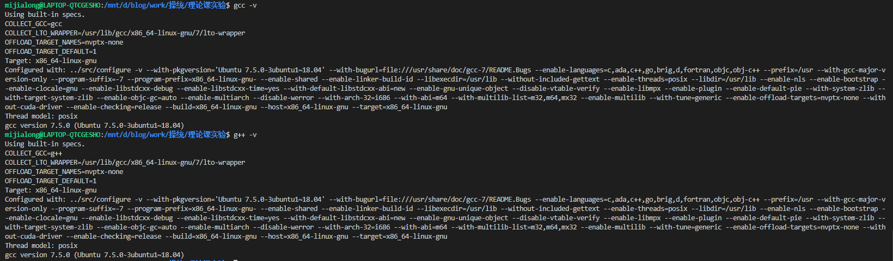
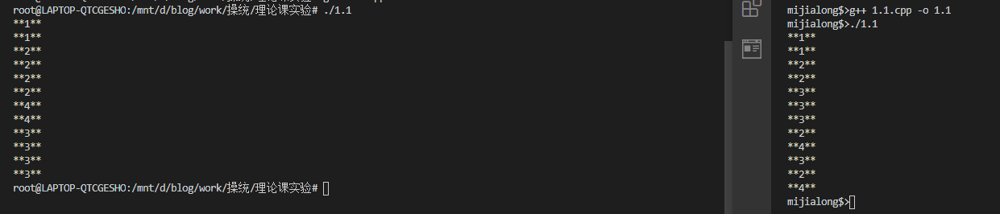
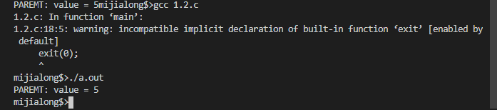
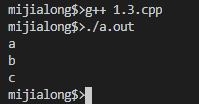
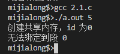
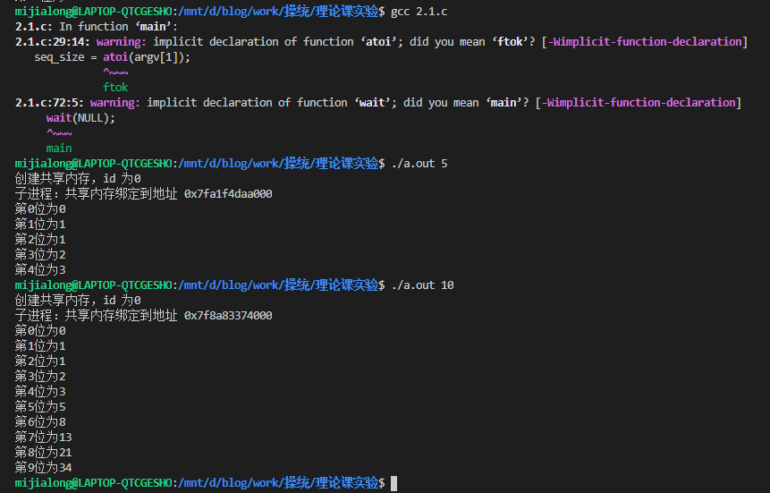
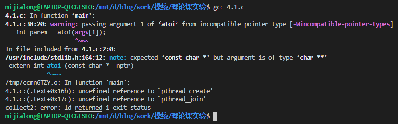
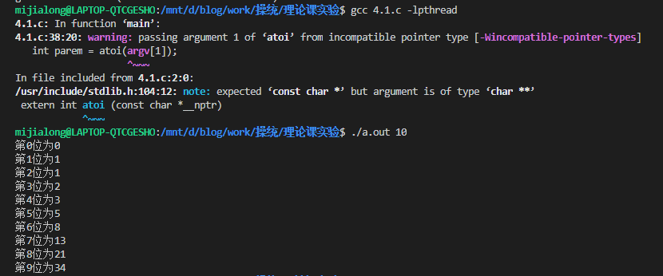
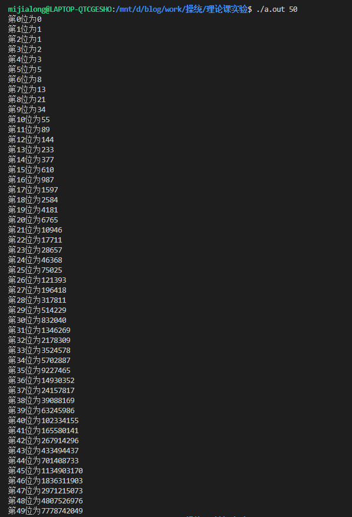

# 理论课实验

- 数据科学与计算机学院
- 软件工程3班
- 米家龙
- 18342075

## 目录

[TOC]

## 实验题目

1. 进程的创建实验
2. 进程间通信
3. 命令解释器
4. 线程实验——用线程生成 Fibonacci 数列
5. 同步互斥问题
   - 生产者消费者问题
   - 读者写者问题

## 实验环境

使用老师提供的`mooc-os-2015.vdi`，在虚拟机中创建 64 位的 Ubuntu 虚拟机并加载该 vdi ，获得了版本为：

```bash
Linux moocos-VirtualBox 3.13.0-24-generic #46-Ubuntu SMP Thu Apr 10 19:11:08 UTC 2014 x86_64 x86_64 x86_64 GNU/Linux
```

的虚拟机操作系统

并且使用 vscode 配合 Remote SSH 插件，实现通过远程终端在 windows 环境的对文件的编辑和运行

### 2. WSL

WSL 配置如下：

```shell
Linux LAPTOP-QTCGESHO 4.4.0-19041-Microsoft #1-Microsoft Fri Dec 06 14:06:00 PST 2019 x86_64 x86_64 x86_64 GNU/Linux
```

其中 gcc 和 g++ 版本如下图



## 1. 进程的创建实验

### 实验目的

1. 加深对进程概念的理解，明确进程和程序的区别。进一步认识并发执行的实质。
2. 认识进程生成的过程，学会使用fork生成子进程，并知道如何使子进程完成与父进程不同的工作。

### 实验内容

#### 1. 编译运行程序，解释现象

代码如下
```cpp {.line-numbers}
#include <sys/types.h>
#include <stdio.h>
#include <unistd.h>

int main()
{
  int pid1 = fork();
  printf("**1**\n");
  int pid2 = fork();
  printf("**2**\n");
  if (pid1 == 0)
  {
    int pid3 = fork();
    printf("**3**\n");
  }
  else
    printf("**4**\n");
  return 0;
}
```

分别在 WSL 和虚拟机中编译运行，运行结果如下



根据 `fork()` 函数的定义，了解到当执行fork()函数后，会生成一个子进程，子进程的执行从 `fork()` 的返回值开始且代码继续往下执行。 `fork()` 执行一次后会有两次返回值：第一次为原来的进程，即父进程会有一次返回值，表示新生成的子进程的进程ID；第二次为子进程的起始执行，返回值为0。

查看 WSL 输出顺序，推导出代码执行过程如下：
1. *主进程*创建*子进程1*
2. *主进程*和*子进程1*输出 `**1**\n`
3. *主进程*创建*子进程2*，*子进程1*创建*子进程12*
4. *主进程*和*子进程1*和*子进程2*和*子进程12*输出 `**2**\n`
5. 各个进程判断自己的 **pid1** 是否为0，其中*主进程*和*子进程2*的 **pid1** ==存在且相同==
6. *主进程*和*子进程2*输出 `**4**\n`，*子进程1*和*子进程12*创建*子进程13*和*子进程123*
7. *子进程1*和*子进程12*和*子进程13*和*子进程123*输出 `**3**\n`

发现 WSL 和虚拟机中编译运行的结果不同，在虚拟机上多次运行，输出结果也不完全相同，是因为线程的执行的顺序不同导致的，但对于单个线程来说，执行的步骤没有区别

|        代码         |          主进程           |          子进程1           |            子进程2            |            子进程12            |                  子进程13                  |            子进程123             |
| :-----------------: | :-----------------------: | :------------------------: | :---------------------------: | :----------------------------: | :----------------------------------------: | :------------------------------: |
| `int pid1 = fork()` | 创建*子进程*1， pid1 != 0 |    创建成功， pid1 = 0     |               \               |               \                |                     \                      |                \                 |
| `printf("**1**\n")` |      输出 `**1**\n`       |       输出 `**1**\n`       |               \               |               \                |                     \                      |                \                 |
| `int pid2 = fork()` | 创建*子进程2*， pid2 != 0 | 创建*子进程12*， pid2 != 0 | 创建成功 pid1 != 0， pid2 = 0 | 创建成功， pid1 = 0， pid2 = 0 |                     \                      |                \                 |
| `printf("**2**\n")` |      输出 `**2**\n`       |       输出 `**2**\n`       |        输出 `**2**\n`         |         输出 `**2**\n`         |                     \                      |                \                 |
|  `if (pid1 == 0)`   |      判断 -> 不进入       |        判断 -> 进入        |        判断 -> 不进入         |          判断 -> 进入          |                     \                      |                \                 |
| `int pid3 = fork()` |             \             | 创建*子进程13*，pid3 != 0  |               \               |  创建*子进程123*， pid3 != 0   | 创建成功， pid1 = 0， pid2 != 0， pid3 = 0 | 创建成功，pid1 = pid2 = pid3 = 0 |
| `printf("**3**\n")` |             \             |       输出 `**3**\n`       |               \               |         输出 `**3**\n`         |               输出 `**3**\n`               |          输出 `**3**\n`          |
| `printf("**4**\n")` |      输出 `**4**\n`       |             \              |        输出 `**4**\n`         |               \                |                     \                      |

#### 2. 通过实验完成习题3.4

习题3.4的代码如下
```cpp {.line-numbers}
#include <sys/types.h>
#include <stdio.h>
#include <unistd.h>

int value = 5;

int main()
{
  pid_t pid;
  pid = fork();

  if (pid == 0)
    value += 15;
  else if (pid > 0)
  {
    wait(NULL);
    printf("PAREMT: value = %d", value);
    exit(0);
  }
}
```

尝试在 WSL 中运行，发现会报错，报错原因是缺少 `wait()` 和 `exit()` 函数，于是在虚拟机中运行，虽然会 Warning 提示 `exit()` 函数的问题，但是可以运行，运行结果如下



经过查阅资料后了解到，c++ 中缺少上述函数，而在 c 语言中则并不会，因此要求代码使用 c 语言来编写

#### 3. 编程练习

> 编写一段程序，使用系统调用 `fork()` 创建两个子进程。当此程 序运行时，在系统中有一个父进程和两个子进程活动。让每一 个进程在屏幕上显示一个字符；父进程显示字符“a”；子进程分别显示字符“b”和字符“c”。试观察记录屏幕上的显示结果，并分析原因

代码如下
```cpp {.line-numbers}
#include <sys/types.h>
#include <stdio.h>
#include <unistd.h>
#include <iostream>

using namespace std;

int main()
{
  cout << 'a' << endl;

  // 创建子进程b
  pid_t pid_b = fork();
  if (pid_b == 0) // 确认是子进程b
  {
    cout << 'b' << endl;
    pid_t pid_c = fork();

    if (pid_c == 0) // 确认是子进程c
    {
      cout << 'c' << endl;
    }
  }

  return 0;
}
```

运行结果如下



出现该现象的原因是因为：
1. *主进程*输出“a”
2. *主进程*创建的*子进程b*
3. 只有*子进程b*才会运行接下来的代码
   1. 输出“b”
   2. 创建*子进程c*
   3. 只有*子进程c*才会运行接下来的代码
      1. 输出“c”

## 2. 进程间的通信

### 实验目的

进程间共享内存实验，初步了解这种进程间通讯

### 实验内容

> 完成课本第三章的练习3.10的程序

代码如下
```cpp {.line-numbers}
#include <sys/types.h>
#include <sys/shm.h>
#include <sys/stat.h>
#include <stdio.h>
#include <unistd.h>

#define PERMS (S_IRUSR | S_IWUSR) // 定义权限
#define MAX_SEQUEENCE 10          // 定义队列长度

typedef struct
{
  long fib_squenece[MAX_SEQUEENCE];
  int sequence_size;
} shared_data;

int main(int argc, char **argv)
{
  int seq_size;
  pid_t pid;
  int seg_id;              // 共享内存段的 id
  shared_data *shared_mem; // 共享内存段的指针

  if (argc != 2) // 参数不够
  {
    fprintf(stderr, "Usage: ./shm-fib <int sequence size>\n");
    return -1;
  }

  seq_size = atoi(argv[1]);
  if (seq_size > MAX_SEQUEENCE) // 超出长度
  {
    fprintf(stderr, "队列长度需要小于 %d\n", MAX_SEQUEENCE);
    return -1;
  }

  // 创建内存段
  if (seg_id = shmget(IPC_PRIVATE, sizeof(shared_data), PERMS) == -1)
  {
    fprintf(stderr, "无法创建合适的内存段\n");
    return 1;
  }

  printf("创建共享内存，id 为%d\n", seg_id);

  // 创建共享内存
  if ((shared_mem = (shared_data *)shmat(seg_id, 0, 0)) == (shared_data *)-1)
  {
    fprintf(stderr, "无法绑定到段 %d\n", seg_id);
    return 0;
  }
  shared_mem->sequence_size = seq_size;

  if ((pid = fork()) == (pid_t)-1) // 创建线程失败
    return 1;

  if (pid == 0) // 如果是子进程
  {
    printf("子进程：共享内存绑定到地址 %p\n", shared_mem);

    shared_mem->fib_squenece[0] = 0;
    shared_mem->fib_squenece[1] = 1;

    for (int i = 2; i < shared_mem->sequence_size; i++)
      shared_mem->fib_squenece[i] =
          shared_mem->fib_squenece[i - 1] + shared_mem->fib_squenece[i - 2];

    // 清空
    shmdt((void *)shared_mem);
  }
  else
  {
    wait(NULL);

    for (int i = 0; i < shared_mem->sequence_size; i++)
      printf("第%d位为%ld\n", i, shared_mem->fib_squenece[i]);

    // 清空
    shmdt((void *)shared_mem);
    shmctl(seg_id, IPC_RMID, NULL);
  }

  return 0;
}
```

尝试在虚拟机中运行代码，发现会出现如下错误



而在 WSL 运行，则可以运行，如下图



## 3. 命令解释器

### 实验内容

> - 完成课本上第三章的项目：实现shell
> - 实现程序的后台运行

## 4. 线程实验

> 用 pthread 线程库，按照第四章习题4.11的 要求生成并输出 *Fibonacci* 数列

代码如下
```cpp
#include <stdio.h>
#include <stdlib.h>
#include <pthread.h>

#define MAX_SIZE 256

int fib[MAX_SIZE]; // 储存用的数组

void *run(void *arg)
{
  int upper = atoi(arg); // 上限

  if (upper == 0)
    pthread_exit(0);
  else
  {
    fib[0] = 0;
    fib[1] = 1;

    for (int i = 2; i < upper; i++)
      fib[i] = fib[i - 1] + fib[i - 2];
  }

  pthread_exit(0);
}

int main(int argc, char **argv[])
{
  pthread_t tid;        // 线程 id
  pthread_attr_t tattr; // 线程属性

  if (argc != 2) // 参数不够
  {
    fprintf(stderr, "Usage: ./a.out <int value>\n");
    return -1;
  }

  int parem = atoi(argv[1]);
  if (parem < 0)
  {
    fprintf(stderr, "参数为%d，需要大于0", parem);
    return -1;
  }

  pthread_attr_init(&tattr);                  // 初始化属性
  pthread_create(&tid, &tattr, run, argv[1]); // 创建线程

  pthread_join(tid, NULL); // 等待结束

  for (int i = 0; i < parem; i++)
    printf("第%d位为%d\n", i, fib[i]);
    // printf("%d is %d\n", i, fib[i]);

  return 0;
}
```

尝试编译，结果出现如下报错



查阅资料后了解到，如果需要使用 pthread 库，不仅需要在环境中安装 *manpages-posix* 软件包，还需要在编译时加入参数 `-lpthread` 链接到对应的库

使用命令 `sudo apt install manpages-posix` 安装了对应的软件包后，对代码进行编译运行，结果如下



但是在将参数加大后，发现会出现溢出的情况，于是将对应的数组类型从 `int` 改为 `long` ，优化后代码如下



但对于更大的数据， `long` 数据类型依然有其局限性

## 5. 同步互斥问题

### 生产者消费者问题

#### 1. 利用线程同步机制，实现消费者-生产者问题

#### 2. 第六章 project

### 读者写者问题