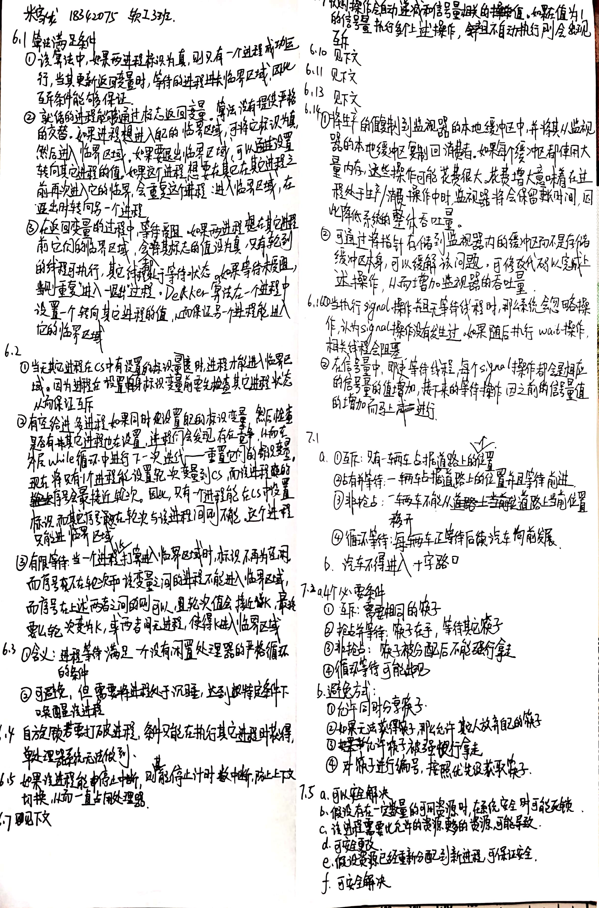

# 操作系统第4次书面作业

- 数据科学与计算机学院
- 软工三班
- 米家龙
- 18342075




6.7

```cpp
do
{
  waiting[1] = true;
  key = true;
  while(waiting[1] && key)
    key = Swap(&lock, &key);
  
  waiting[1] = false;

  j = (i + 1) % n;
  while((j != 1) && !waiting[j])
    j = (j + 1) % n;
  
  if (j == 1)
    lock = false;
  else
    waiting[j] = false;
}
while(true)
```

6.10

```cpp
int guard = 0;
int semaphore_value = 0;

wait()
{
  while (TestAndSet(&guard) == 1)
    ;
  if (semaphore_value == 0)
  {
    // 自动将进程加入进程等待队列
    guard = 0;
  }
  else
  {
    semaphore_value--;
    guard = 0;
  }
}
signal()
{
  while (TestAndSet(&guard) == 1)
    ;
  if (semaphore_value == 0 && process_on_wait_queue)
    ; // 唤醒队列的第一个进程
  else
    semaphore_value++;
  guard = 0;
}
```

6.10

1. 对于 BarberShop

```java
public class BarberShop
{
  private int chairNum;
  private int barber;
  private int chairState[];

  // 使用静态变量来表示状态
  static final int FULL = -1;
  static final int EMPTY = 0;
  static final int OCUPIED = 1;
  static final int SLEEPING = 2;
  static final int DONE = 3;
  static final int WAITED = 4;

  // 初始化
  public BarberShop(int chairNum)
  {
    this.chairNum = chairNum;
    this.chairState = new int[chairNum];
    this.barber = SLEEPING;

    for (int i = 0; i < this.chairNum; i++)
      this.chairState[i] = EMPTY;
  }

  // 找椅子
  private boolean findChair(int customer)
  {
    int tmp = getFirstEmptyChair();
    if (tmp == FULL) // 如果彻底满了
      return false;
    else             // 如果有位置
      this.chairState[tmp] = OCUPIED; // 占这个位置
  }

  public synchronized int getHairCut(int customer)
  {
    if (this.barber == SLEEPING) // 如果在休眠
    {
      this.barber = OCUPIED;
      return SLEEPING;
    }
    else if (this.barber == OCUPIED) // 如果拥塞
    {
      boolean tmp = findChair(customer);
      if (!tmp) // 人满
        return FULL;
      else
      {
        while(this.barber == OCUPIED) // 当处于拥挤的情况下，等待
        {
          try
          {
            this.wait();
          }
          catch(InterruptedException err)
          {}
        }

        for (int i = 0; i < this.chairNum; i++)
        {
          if (this.chairState[i] == OCUPIED) // 位置准备释放
          {
            this.chairState[i] = EMPTY;
            break;
          }
        }

        this.barber = OCUPIED;
        return WAITED;
      }
    }
    else
    {
      this.barber = OCUPIED;
      return DONE;
    }
  }

  public synchronized void leaveBarberShop(int customer)
  {
    boolean tmp = isAnyoneWaiting(); // 是否有人在等待
    if (tmp == true)
      this.barber = DONE;
    else
      this.barber = SLEEPING;

    notify();
  }

  private int getFirstEmptyChair()
  {
    // 循环找位置
    for (int i = 0; i < this.chairNum; i++)
    {
      if (this.chairState[i] == EMPTY)
        return i;
    }

    return FULL;
  }

  // 查看是否有人在等待 == 是否有位置被占用
  private boolean isAnyoneWaiting()
  {
    for (int i = 0; i < this.chairNum; i++)
    {
      if (this.chairState[i] == OCUPIED);
        return true;
    }
    return false;
  }
}
```

2. 对于 Customer.java

```java
import java.util.*;

public class Customer implements Runnable
{
  private BarberShop barberShop;
  private int customer;
  private int HAIRCUT_TIME = 5; // 剪发花费时间（等待时间）

  public Customer(int customer, BarberShop bShop)
  {
    this.customer = customer;
    this.barberShop = bShop;
  }

  public void run()
  {
    int sleepTime = (int =) (this.HAIRCUT_TIME * Math.random());
    System.out.println("Customer " + this.customer + "enter barber shop");
    int tmp = this.barberShop.getHairCut(this.customer); // 尝试剪发

    if (tmp == BarberShop.WAITED) // 如果阻塞
    {
      System.out.println("Customer " + this.customer + "waiting for haricut");;
    }
    else if (tmp == BarberShop.FULL) // 店满了
    {
      System.out.println("Customer " + this.customer + "cannot get haircut");
      return ;
    }
    else // 准备就绪，可以剪发
    {
      System.out.println("Customer " + this.customer + "start to haircut");
      SleepUtilities.nap(); // 剪发花费时间
      System.out.println("Customer " + this.customer + "leave barber shop");
      this.barberShop.leaveBarberShop(this.customer);
    }
  }
}
```

3. 关于 sleepUtilities.java

```java
public class SleepUtilities
{
  private static final int NAP_TIME = 5;

  public static void nap()
  {
    nap(NAP_TIME);
  }

  public static void nap(int duration)
  {
    int sleepTime = (int) (NAP_TIME * Math.random());
    try 
    {
      Thread.sleep(sleepTime * 1000);
    }
    catch (InterruptedException err)
    {}
  }
}```

4. 创建测试

```java
public class CreateBarberShopTest implements Runnable
{
  static final private int WAIT_TIME = 3;
  static public void main(String [] args)
  {
    new Thread(new CreateBarberShopTest()).start();
  }

  public void run()
  {
    BarberShop newShop = new BarberShop(15);
    int customer = 1;

    while (customer <= 10000)
    {
      new Thread(new Customer(customer, newShop)).start();
      customer++;
    }
  }
}
```

6.13

```cpp
monitor bounded_buffer
{
  int items[MAX_ITEMS];
  int numItems = 0;
  condition full, empty;

  void produce(int v)
  {
    while (numItems == MAX_ITEMS)
      full.wait();
    items[numItems++] = v;
    empty.signal();
  }

  int consume()
  {
    int res;
    while (numItems == 0)
      empty.wait();
    res = items[--numItems];
    full.signal();
    return res;
  }
}
```

7.15

```cpp
semaphore ok to cross = 1;
void enter bridge()
{
  ok to cross.wait();
}

void exit bridge()
{
  ok to cross.signal();
}
```