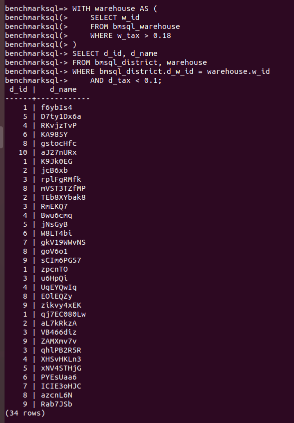
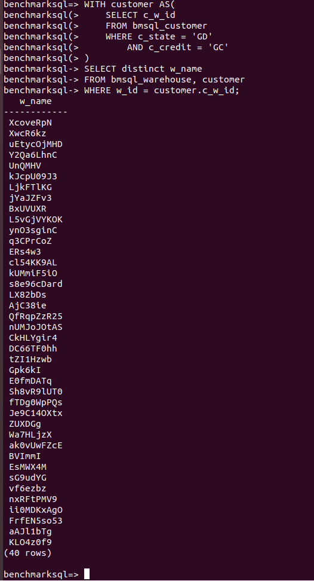
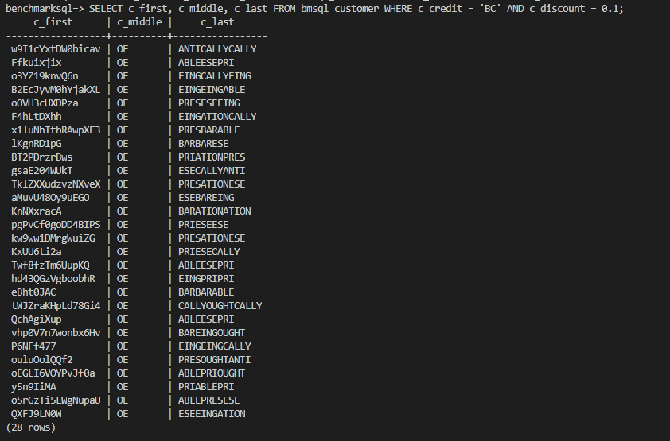
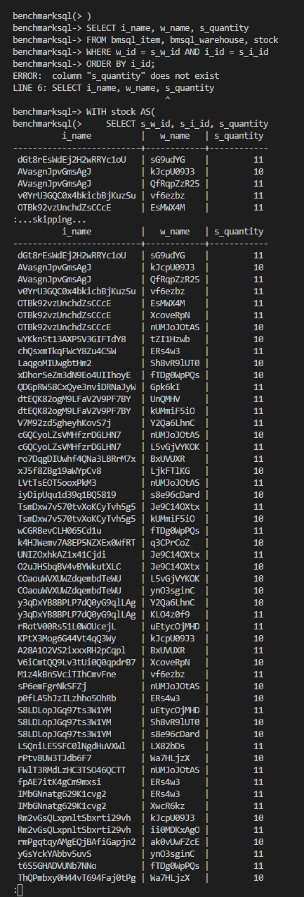
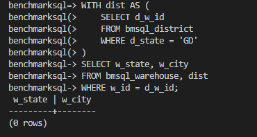
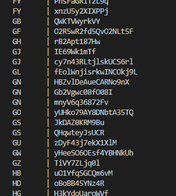

# 数据库第一次作业

米家龙 18342075

> 第三题开始使用 vsc 自带的终端使用 ssh 连接到虚拟机，因此截图有所变化

1. 找出满足以下要求的销售区域，显示销售区域的号码（ID）和名字：销售区域的销售税小于0.1，且对应供货仓库的销售税大于0.18。



2. 找出满足下面要求的仓库名字（不输出重复的名字）： 有来自广东省（state为GD）且信用良好的顾客购买过该仓库的商品。



3. 找出享有九折优惠但信用不良的顾客，显示他们的姓名（包括中间名）。



4. 如果一种货物剩余的数量少于12，我们就认为该货物短缺。找出所有短缺的货物的名字，其所在仓库的名字，以及货物剩余的数量。



5. 找出给广东销售区域供货的仓库都来自哪个省和城市。



> 发现没有一行之后，决定使用下列语句查找 `bmsql_district` 表中是否含有`广东省`的区域

```pgsql
SELECT d_state, d_city 
FROM bmsql_district 
ORDER BY d_state;
```

在表中找到`G`开头的省份，如图，发现确实没有广东

