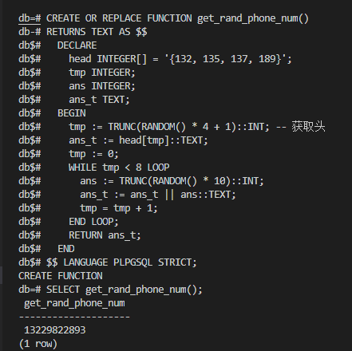
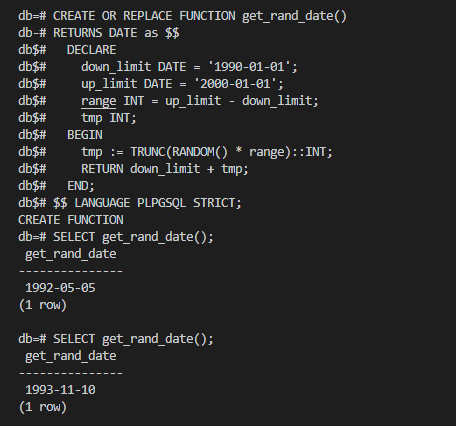
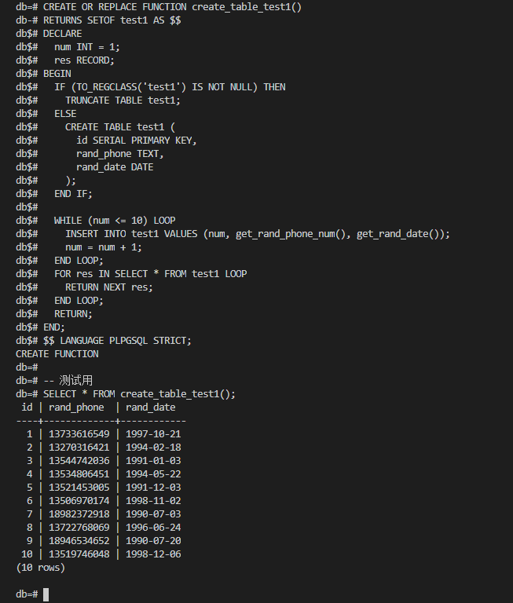
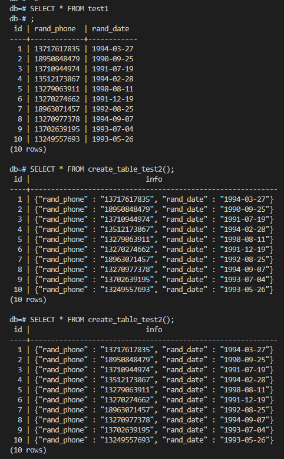
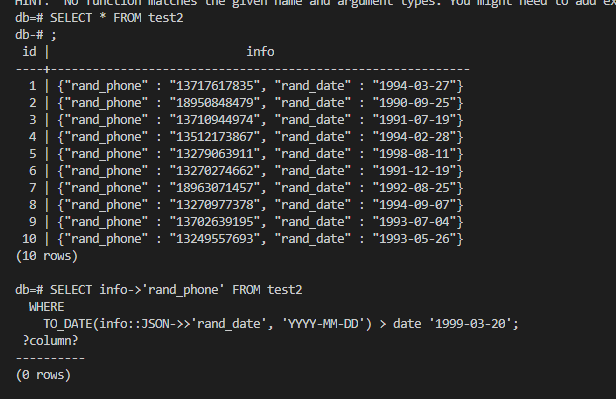

# 数据库第三次作业

米家龙 18342075

1. 编写一个函数，函数名为 `get_rand_phone_num` ，无接收参数，返回一 个随机的电话号码，长度11位，电话号码以'132'或 '137'或 '189'或 '135'开头，要求任意满足该要求的电话号码能等概率生成。

2. 编写一个函数，函数名为 get_rand_date ，无接收参数，返回一个随机 的日期，日期格式为'yyyy-mm-dd'。要求返回的日期区间为[1990-01-01, 2000-01-01)，所有满足要求的日期能被等概率返回。

3. 编写一个函数，函数名为 create_table_test1，无接收参数。在该函数 中，新建一个数据表test1，该数据表拥有3个字段，分别是id, rand_phone, rand_date，其中id为自增的序列，从1开始自增，且为 主键；然后，往该数据表新增10条记录，这10条记录中，rand_phone 和rand_date使用上述自己编写的函数随机生成。最后返回该表。该函 数理应可以连续调用多次，每次生成并返回的表都不一样。

4. 编写一个函数，函数名为 create_table_test2，无接收参数。在该函数 中，新建一个数据表test2，该数据表拥有2个字段，分别是id和info， 其中id类型为整数，同时为主键，info为json格式数据；然后，把 test1中的所有记录首先转换为如下的json格式： {rand_phone:'rand_pnhone', rand_date:'rand_date'}，即拥有2个键值 对，键分别是rand_phone和rand_date，值为test1表中对应的值；最 后，把test1的数据生成json格式的记录插入test2中。test2的id与 test1对应的id相同。最后返回该表。该函数理应可以连续调用多次， 每次生成并返回的表和test1一样，即不重复调用create_table_test1的 情况下，多次调用create_table_test2返回的表应该是相同的。

5. 查询：使用test2表，找出所有日期在1999年3月20日（包括这一天） 之后的记录的电话号码。

