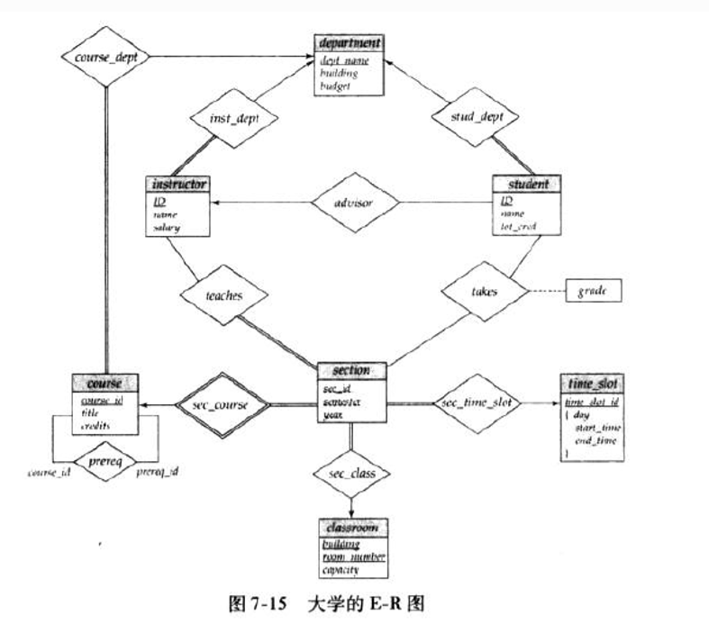
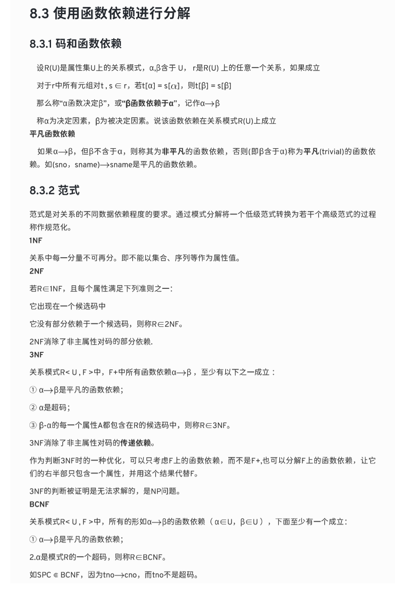
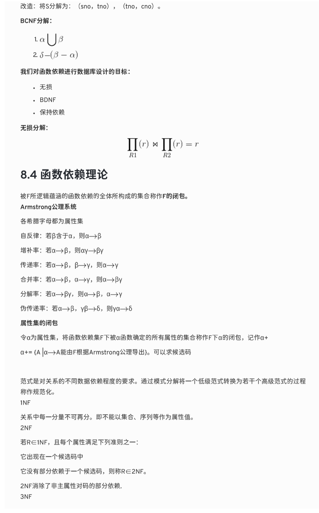
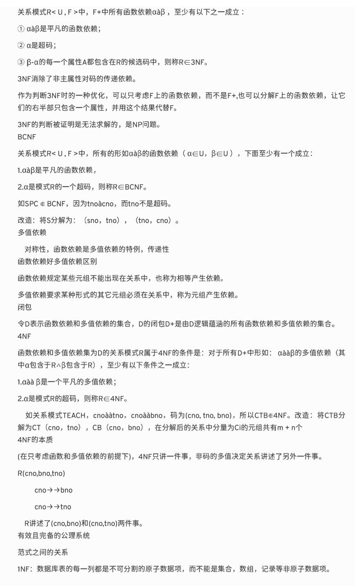

[TOC]

## cmu 1

查询语句：
- 程序性（关系代数）：指定数据库查询所需结果的（高级）策略
- 非程序性（关系演算）：查询指定的需要的数据，不指定如何查找

关系代数：

$$
\begin{alignedat}{0}
  \sigma \qquad \text{Select，选行} \\
  \pi \qquad \text{Projection，选列} \\
  \bigcup \qquad \text{Union，并} \\
  \bigcap \qquad \text{Intersection，交} \\
  - \qquad \text{Difference} \\
  \times \qquad \text{Product} \\
  \Join \qquad \text{Join，联结} \\
\end{alignedat}
$$

- Rename (ρ) 
- Assignment (R ← S) 
- Duplicate Elimination (δ) 
- Aggregation (γ) 
- Sorting (τ) 
- Division (R ÷ S)

## cmu 2

常用函数：
- AVG(col)
- MIN(col)
- MAX(col)
- SUM(col)
- COUNT(col)

## cmu 3

> 为什么不像 OS 那样进行内存映射
对于只读进程来说很好，但当对于多写者时，会出冲突

上述问题的解决方法
- madvise: Tell the OS how you expect to read certain pages. 
- mlock: Tell the OS that memory ranges cannot be paged out. 
- msync: Tell the OS to flush memory ranges out to disk.

DBMS（几乎）总是希望自己控制事物，并且可以做得更好。
- 以正确的顺序将脏页刷新到磁盘。
- 专门的预取。 
- 缓冲区更换策略。
- 线程/进程调度。

常见的页：
- 硬件页（通常为 4KB）
- OS 页（通常为 4KB）
- 数据页（512B ~ 16KB）
> By hardware page, we mean at what level the device can guarantee a "failsafe write".
> google translation: 在硬件页面上，我们指的是设备可以保证“故障安全写入”的级别。

页储存架构
不同的DBMS以不同的方式管理磁盘上文件中的页面。 
- 堆文件组织
  - 堆文件是页面的无序集合，其中元组以随机顺序存储。
    - 对页的操作：create / get / write / delete
    - 对所有页面的迭代
  - 需要元数据来跟踪存在哪些页面以及哪些页面具有可用空间。
  - 表示堆文件的两种方法：
    - 链表
      - 一个页头，链接**空闲页表**和**数据列表**
      - 每个页面都会跟踪其自身中的可用插槽数。
    - 页目录
      - DBMS维护特殊页，这些页跟踪数据库文件中**数据页的位置**。
      - 该目录还记录每页的可用插槽数。
      - DBMS必须确保目录页面与数据页面同步。
- 顺序/排序文件组织
- 哈希文件组织

## cmu 4

工作负载特征：
- OLTP（在线事务处理）：简单查询，用于读取/更新与数据库中单个实体相关的少量数据。
- OLAP（在线分析处理）：复杂查询，读取跨多个实体的数据库的大部分
- HTAP 混合（事务+分析）处理

数据储存模型：
- n 元储存模型（行存储 NSM）：DBMS在页面中连续存储单个元组的所有属性
  - 对于查询倾向于仅在**单个实体**上运行并插入繁重工作负载的OLTP工作负载而言，它是理想的选择。
  - 优点：
    - 快速插入，更新和删除
    - 常适合需要整个元组的查询
  - 缺点：
    - 不利于扫描表的大部分和/或属性的子集
- 分解存储模型（列存储 DSM）：DBMS在页面中连续存储所有元组的单个属性的值
  - 是OLAP工作负载的理想选择，其中只读查询会对表属性的子集执行大型扫描
  - 优点
    - 因为DBMS只读取它需要的数据，减少了浪费的I / O数量
    - 更好的查询处理和数据压缩
  - 缺点
    - 由于元组拆分/拼接，点查询，插入，更新和删除的速度很慢

元组标识：
- 方法1：固定长度偏移量：每个值的属性长度相同
- 方法2：嵌入式元组ID：每个值及其元组ID存储在列中

## cmu 5

数据库储存需要考虑的东西：
- 空间控制
  - 在磁盘何处写入页
  - 怎样使经常一起使用的页面在磁盘上在物理上尽可能紧密地保持在一起
- 时间控制
  - 何时将页面读取到内存中以及何时将它们写入磁盘
  - 怎样最大程度地减少必须从磁盘读取数据的停顿数

页面表跟踪当前内存中的页面。 
每页还维护其他元数据：
- 脏标志
- 引脚/参考计数器

同步：
- 锁：
  - 保护数据库的逻辑内容免受其他事务的影响。
  - 保持事务持续时间。
  - 需要能够回滚更改。
- 锁存器：
  - 保护 DBMS 内部数据结构的关键部分免受其他线程的攻击。
  - 保持操作时间。
  - 不需要能够回滚更改。

页表和页目录
- 页表
  - 页面目录是数据库文件中页面ID到页面位置的映射。
  - 所有更改都必须记录在磁盘上，以便DBMS在重新启动时能够找到。
- 页目录
  - 页表是缓冲池帧中从页 ID 到页副本的映射。
  - 这是一个内存中数据结构，不需要存储在磁盘上。

缓冲池优化：
- 多缓冲池
- 预读取（根据扫描预读取）
  - 顺序扫描
  - 索引扫描
- 扫描共享
  - 查询可以重用从存储或运算符计算中检索到的数据。这与结果缓存不同
  - 允许多个查询附加到扫描表的单个游标。
    - 查询不必相同。 
    - 也可以共享中间结果。
- 缓冲池旁路：顺序扫描运算符不会将提取的页面存储在缓冲池中，以避免开销
  - 内存对于正在运行的查询是本地的。
  - 如果要读取磁盘上连续的大量页面，则效果很好。
  - 也可以用于临时数据（排序，联接）

## lec 3 Storing Data

访问（读/写）磁盘块的时间：
- 搜寻时间（移动臂以将磁盘头定位在轨道上）
- 旋转延迟（等待块在头部下方旋转）
- 传输时间（实际上是将数据移至磁盘表面或从磁盘表面移出数据）

FILE：页面的集合，每个页面包含一个记录的集合。 必须支持：
- 插入/删除/修改记录
- 获取特定记录（使用记录ID指定）
- 扫描所有记录（可能对要检索的记录有某些条件）

LRU

## lec 5 Tree Indexes

Leaf pages contain data entries.

### ISAM

Index entries: <search key value, page id>

文件创建：
- 顺序分配的叶子（数据）页面，按搜索键排序
- 然后索引页面
- 然后溢出页面。

> 搜索：从根开始； 使用关键比较进行分析。
成本= $log _F N$
- F = 每页条目数（即扇出）
- N = 叶子页面
  - 不需要“下一页”指针。 （为什么？）
> 插入：找到数据条目所属的叶子，并将其放在此处。 必要时溢出页面。
> 删除：寻求并摧毁！ 如果删除元组会清空溢出页面，请对其进行内存释放，然后从链接列表中删除。

静态树结构：插入/删除只作用在叶子页上

### B+ 树

ROOT节点包含1到2d之间的索引条目。
- 参数 d 称为树的顺序。
- 索引条目是一对<key ，page id>
- 根是叶子或至少有两个孩子。

每个内部节点包含 m（d ≤ m ≤ 2d）个索引条目。
- 每个内部节点有 m + 1 个子节点

每个叶节点包含m（d≤m≤2d）个数据条目
- 数据条目是 <key, record> 或 <key, RID> 或 <key, list of RIDs> 之一

每条从根到叶子的路径长度（路径的节点数量）一样

有效支持平等和范围搜索

#### 插入

- 找到正确的叶子 L
- 将数据放入 L 中：
  - 如果 L 空间足够，那么放入，完成
  - 否则必须分裂 L ，变成 L 和新节点 L2
    - 均匀地重新分配条目，并且复制中间键
    - 将指向 L2 的索引条目插入到 L 的父级
- 递归操作
  - 如果要拆分索引节点，需要平均分配条目，并且向上推中间键（和分裂对比）
- 分裂并成长：根分裂增加高度
  - 树的成长：更宽并且顶层级别更高

#### 删除

- 从根节点开始，找到条目所属的叶子节点 L
- 移除条目
  - 如果 L 至少半满，完成
  - 如果 L 只有 d - 1 个条目
    - 尝试重新分配，从同级（并且父节点相同）的邻居节点借用
    - 如果重新分配失败，那么将 L 和同级合并
- 如果发生合并，则需要从 L 的父节点删除指向 L 或者同级条目
- 合并可能从传递到根，从而导致树高度降低

### 总结

树型索引非常适合范围搜索，也适合于相等搜索。

ISAM是静态结构。
- 仅修改了叶子页； 需要溢出页面。
- 除非数据集的大小和数据分布保持恒定，否则溢出链会降低性能。
B +树是动态结构。
- 插入/删除使树保持高度平衡； 成本为 $log _F N$。
- 高扇出度（F）表示深度很少超过3或4。
- 通常情况下，平均入住率67％。
- 通常比ISAM更可取； 优雅地适应增长。
- 如果数据条目是数据记录，则拆分会改变记录！

## lec 7 Hash-Based Index

基于哈希的索引最适合相等选择。无法支持范围搜索

### 静态哈希

- 主要页面数是固定的。
- 主页面是按顺序分配的，永远不会取消分配；
  - 如果需要，可以溢出页面。
- $h（k）mod N$ = 带有密钥k的数据条目所属的存储桶。 （N = 桶数）
- 桶储存数据条目
- 哈希功能在记录r的搜索关键字字段上起作用。 必须在0 ... N-1范围内分配值
  - $h(key) = (a * key+ b)$ 一般效果好
  - a b 是常数，h 的调整有很多技巧
- 长的溢出链会发展并且降低性能（可拓展/线性哈希可以解决这个问题）

### 可拓展哈希

- 由于读写开销大，因此不通过将桶的数量翻倍来进行文件的重组
- 哈希的思路：
  - 使用指向存储桶的指针目录，通过将目录加倍来使存储桶数量增加一倍，
  - 仅拆分溢出的存储桶
- 指针目录必须非常小于文件，从而使得桶的翻倍开销更小
- 只会分割一页数据条目，不选择溢出页

深度：
- 目录的全局深度：判断条目所属的存储桶所需的最大位数。
- 桶的本地深度：用于确定条目是否属于此桶的位数。

需要目录翻倍的情况：
- 插入前，本地深度 = 全局深度
- 插入后，本地深度 > 全局深度

#### 分裂

- 如果移除数据条目会导致桶变空，那么该桶可以被合并进它的拆分镜像
- 如果每个目录元素都指向与其拆分镜像相同的存储桶，则可以将目录减半

### 线性哈希

- 线性哈希通过使用长的溢出链而不使用目录，并且以此来处理重复项

思路
- 使用哈希函数家族，其中每高一级哈希函数的结果范围是次一级的两倍（类似于目录翻倍）
- 通过使用溢出页面并选择存储桶以拆分循环，可以避免在线性哈希中使用目录。
  - 每回合都拆分进程
  - 当所有在 $N_R$ 初始化的（对于第 R 轮）桶均被拆分时，回合结束。
  - 桶0至Next-1已被拆分； 第 Next 未被拆分。
  - 当前的轮的数量是等级。

#### 搜索

- To find bucket for data entry r, find $h_{Level}(r)$:
  - If $h_{Level}(r)$ in range **Next to NR**, *r* belongs here.
  - Else, r could belong to bucket $h_{Level}(r)$ or bucket $h_{Level}(r)$ + **NR**; must apply $h_{Level + 1}(r)$ to find out.

#### 插入

- 通过哈希函数 $h_{Level}$ 或者 $h_{Level + 1}$ 找到对应的桶
  - 如果桶满了：
    - 添加一个溢出页并将数据插入其中
    - （可能操作）分裂第 Next 桶，并将其增量
  - 否则简单插入数据条目到桶中

##### 桶的分裂

- 分裂的触发条件：
  - 添加新的溢出页
  - 其他条件如空间利用
- 当分裂触发时：
  - Next 桶通将会被分裂
  - 高一级哈希函数将会在该桶（假设为 b）和它的分裂镜像之间重新分配桶
  - 这个分裂进行会储存为 $b + N_{Level}$
  - $Next = Next + 1$ （如果该轮结束，则变为0，下次可移动范围 * 2）

### 总结

- 基于哈希的索引：最适合等式搜索，不支持范围搜索。
- 静态哈希会导致较长的溢出链。
- 可扩展哈希通过在添加新数据条目时拆分整个存储桶来避免页面溢出。
- 线性散列通过将存储桶循环拆分并使用溢出页面来避免目录。

## cmu 10

排序：
- 归并排序 
- 使用 B+ 树进行排序

将多个元组折叠为一个标量值，两种实现选择：
- 排序
- 散列

## cmu 11

联结，实现方式：（假设外循环为 M 页 m 元组，内循环为 N 页 n 元组，缓冲为 B）
- 嵌套循环联结
  - 开销巨大，是因为对于外表，需要用顺序扫描来检测是否和内表匹配
  - 技巧：
    - 选择小的表作为外表
    - 尽可能给外表更多的缓冲
    - 循环访问内部表或使用索引
  - 类型
    - 傻瓜式
      - 开销：$M + (m \cdot N)$
    - 块
      - 开销：M + (M · N)
      - 优化：使用 B-2 个缓冲区用于扫描外表，一个用于内表，一个用于储存输出
        - 优化后开销：M + ([M / (B - 2)] · N)，当 M 接近于 B - 2 时，最终开销会演变为 M + N
    - 索引
      - 开销：$M + (m \cdot C)$
- 归并排序联结
  - 关键步骤：
    - 排序：对联接键上的表进行排序
    - 合并
      - 使用光标逐步浏览两个排序的表，并发出匹配的元组
      - 可能需要回退，具体取决于联接类型
    - 开销：
      - 外表：$2M \cdot (1 + \lceil \log_{B - 1} \lceil M / B \rceil \rceil)$
      - 内表：$2N \cdot (1 + \lceil \log_{B - 1} \lceil N / B \rceil \rceil)$
      - 合并：$M + N$
    - 应用场合：
      - 一个表或两个表已按连接键排序
      - 输出必须按连接键排序
      - 输入关系可以由显式排序运算符进行排序，也可以通过使用联接键上的索引扫描关系来进行排序。
- 哈希联结
  - 关键步骤：
    - 构建：扫描外关系并通过哈希函数放入哈希表
    - 探测：扫描内部关系，并在每个元组上使用哈希函数跳转到哈希表中的某个位置，并找到匹配的元组
  - 表值储存方法：
    1. 完整元组
       - 避免在比赛中检索外部关系的元组内容。
       - 占用更多的内存空间。
    2. 元组标识符
       - 非常适合列存储，因为DBMS不会从不需要的磁盘中获取数据。
       - 如果连接选择性低，也更好。
  - 探测哈希优化：当哈希表中可能不存在该键时，在构建阶段创建一个布隆过滤器(Bloom Filter)
    - 线程在探测哈希表之前会检查过滤器。 这将更快，因为过滤器将适合CPU缓存
    - 有时称为横向信息传递
  - grace 哈希联结
    - 如果桶不适合内存，那么可以使用递归分区将表分到合适的块中，然后在该级别针对另一个表的存储桶的每个元组进行探测
    - 开销：$3(M + N)$
      - 分区：$2(M + N)$
      - 探测：$M + N$

## cmu 12

模型：
- 迭代模型（火山模型 / 管道模型）：每个查询计划运算符都实现一个Next函数。
  - 每次调用时，操作员将返回一个元组或如果没有更多的元组则返回一个空标记。
  - 运算符实现一个循环，该循环接着调用其子级以检索其元组，然后对其进行处理。
  - Some operators have toblock until their children emit all of their tuples. →
    - Joins, 
    - Subqueries, 
    - Order By
- 物化模型
  - 输出：可以是全部的元组（采用 NSM 储存）或者列的子集（采用 DSM 储存）
- 矢量化模型：每个查询计划运算符都实现一个Next函数。
  - 每个运算符都发出一个批处理元组，而不是单个元组。
  - 运算符的内部循环一次处理多个元组。
  - 批的大小可能会因硬件或查询属性而异。

处理方向：
- 自顶向下
- 自底向上

访问方法：
- 顺序扫描：维护一个内部游标，该游标跟踪它检查的最后一页/插槽
  - 优化方式：
    - 预读取
    - 缓冲池旁路
    - 并行
    - 区域图
      - 预先计算页面中**属性值的聚合**
      - 检查区域地图，以决定是否要访问该页面
    - 延迟实现
      - DSM（列储存） DBMS可以将元组拼接在一起**延迟**到查询计划的上部
    - 堆聚类
      - 元组使用聚簇索引指定的顺序在堆的页面中**排序**
      - 如果查询使用聚簇索引的属性访问元组，则DBMS可以直接跳转到所需的页面
- 索引扫描
  - 依赖：
    - 索引包含的属性
    - 查询引用的属性
    - 属性值的作用域
    - 谓词组成
    - 索引是否包含唯一/非唯一键
- 多索引/位图扫描（使用多个索引进行扫描）
  - 使用每个匹配的索引计算记录ID的集合。
  - 根据查询的谓词（并或交）组合这些集合。
  - 检索记录并应用所有剩余谓词

索引扫描页排序
- 如果索引未聚簇，那么根据该索引顺序扫描元组的效率不高
- DBMS 可以先找出所有需要的元组，然后根据页 ID 进行排序

DBMS 将 `WHERE` 表达为一个**表达树**，这种谓词评估方式很慢，因为需要树的遍历从而弄清操作符需要做的，更好的方法是**直接评估表达式**

## cmu 13

并行和分布式 DBMS 对比：
- 并行
  - 物理距离近
  - 资源高速通信
  - 通信比较便宜可靠
- 分布式
  - 物理距离较远
  - 资源通信较慢
  - 通信成本较高

并行执行需要考虑：
- 吞吐量
- 延迟
- 响应速度
- 可用性
- total cost of ownership (TCO，总拥有成本)

数据库分布在多种资源中，以改善DBMS的不同方面。 
在应用程序中显示为单个数据库实例，但是单资源 DBMS 的SQL查询应在并行或分布式DBMS上产生**相同的结果**

DBMS的流程模型定义了系统的架构，以支持来自多用户应用程序的并发请求。 worker 是DBMS组件，负责代表客户端执行任务并返回结果。
方法：
1. 每个 worker 的进程
   - 每个 worke 都是单独的 os 进程
   - 依赖操作系统的调度程序
   - 共享内存用于全局数据结构
   - 进程崩溃不会导致整个系统崩溃
2. 进程池
   - 一个 worker 可以使用进程池中的任何空闲进程
   - 仍然依赖操作系统调度程序和共享内存
   - 对于CPU缓存局部性不利
3. 每个 worker 的线程
   - 具有多个线程的单个进程
   - DBMS管理自己的调度
   - 可能也不可能使用调度程序线程。
   - 线程崩溃（可能）会杀死整个系统

多线程体系结构的优点：
- 上下文切换开销更少
- 不需要管理共享内存

> The thread per worker 模型并不意味着 DBMS 支持**查询内的并行**

调度：对于每个查询计划，DBMS 需要调度掌控的比 OS 多

查询的并行
- 相互查询：不同的查询是**同时执行**的。
  - 作用：增加吞吐量并减少延迟。
  - 特点：
    - 如果查询只读，那么几乎不需要协调
    - 如果同时更新数据库，那么该操作将会很难执行
- 内部查询：**并行**执行单个查询的操作
  - 作用：减少长时间运行的查询的延迟
  - 特点：
    - 每个关系运算符都有并行算法
    - 可以使多个线程访问集中的数据结构，也可以使用分区来划分工作
- 方法：
  1. 内部操作符（水平）
     - 将运算符分解为独立的片段，这些片段对不同的数据子集执行相同的功能
     - DBMS将交换运算符插入查询计划，以合并子运算符的结果
  2. 相互操作符（垂直）/流水线并行
     - 将操作重叠，从而使得在不实现的情况下将数据从一个阶段传递到下一个阶段（**延迟实现**）
  3. bushy
     - 通过使 worker 同一时间执行查询计划的不同部分的多个运算符来拓展相互操作符的并行
     - 需要交换运算符来组合各段中间结果

交换运算操作符的类型：
1. 集合/聚集：
   - 将多个 worker 的结果合并为一个单独的输出流
   - 查询计划的根必须始终是聚集交换
2. 分区
   - 在多个输出流之间重组多个输入流
3. 分配
   - 将单个输入流拆分为多个输出流

> 如果磁盘是瓶颈，那么并行可能带来更糟的结果

I/O 的并行方法：
- 一个数据库多个磁盘：需要调整储存设备和 RAID 配置
- 一个磁盘一个数据库
- 一个磁盘一个关系
- 将关系拆分到多个磁盘

数据库的拆分：
- 垂直拆分（拆分列）
- 水平拆分（拆分行）

## cmu 14 查询优化（启发式/规则）

关系代数的等价：如果两个关系代数表达式生成相同的元组集，则等效/等价

查询重现：在没有成本模型的情况下确定更好的查询计划

选行（Selection）：
- 尽早执行过滤器
- 重新排序谓词，以便DBMS首先应用最有选择性的谓词
- 分解一个复杂的谓词，然后向下推

选列
- 尽早执行以创建较小的元组并减少中间结果（如果消除重复项）
- 选列出除请求或必需属性外的所有属性（例如，联接键）
- 这对于列存储并不重要

联结
- 交换性，传递性
- 卡特兰数：约为 $4^n$

统计（假设数据均匀）：
- $N_R$： R 中的元组数量
- $V(A, R)$：R 中属性 A 的不同值的数量
- $SC(A, R) = N_R / V(A, R)$：选择基数，是具有属性 A 的值的平均记录数量。
  - 三个假设
    1. 统一数据（值的分布相同）
    2. 属性谓词独立
    3. 包容原则（连接键的领域重叠，使内部关系中的键也存在于外部表中）

谓词 P 的选择性（sel）是元组的分数，公式取决于谓词类型：
- 选行
  - 等价查询：$sel(A = condition) = SC(P) / N_R = 1 / V(A, R)$
  - 范围查询：$sel(A > condition) = (A_{max} - a) / (A_{max} - A_{min})$
  - 否定查询：$sel(not P) = 1 - sel(P)$
  - conjunction: $sel(P1 \bigwedge P2) = sel(P1) \cdot sel(P2)$（需要谓词独立）

> histogram 直方图

现代数据库会从表中收集样本来建立选择并进行估算

在执行基于规则的（查询）重写之后，DBMS 将枚举查询的不同计划并估算其成本。
- 单一关系。
  - 选择最佳的访问方法：简单的启发式方法足够，OLTP 查询容易
    - 顺序扫描
    - 二分搜索（聚集索引）
    - 索引扫描
  - OLTP 查询的计划比较容易，因为：
    - 可储存
    - 参数可搜索
    - 通常只选择最佳索引
    - 联接几乎总是基于基数很小的外键关系
    - 可以通过简单的试探法实现
- 多重关系。
  - 随着联结数量增加，代替计划的数量迅速增加，因此需要限制空间，R 系统的基本决策是：只考虑左深联结树（现代 DBMS 则不再总做出这个假设）
  - 允许使用完全流水线的计划，中间结果不写入临时文件（并不是所有的左深树都能够完全流水化）
  - 方式（可以使用动规来减少成本估算的数量）：
    - 枚举顺序/序列
    - 枚举每个运算符的计划
    - 枚举每个表的访问路径
  - 候选计划：
    1. 枚举关系顺序
    2. 枚举联结算法选择
    3. 枚举访问方式选择
- 嵌套子查询：DBMS将where子句中的嵌套子查询视为采用参数并返回单个值或一组值的函数
  - 方法：
    - 重写以解相关和/或展平它们
    - 分解嵌套查询并将结果存储到**临时表**中
在耗尽所有计划或超时后，它将为查询选择最佳的计划

分解查询（DECOMPOSING QUERIES）
- 对于更难的查询，优化器将查询**分为多个块**，然后一次集中在一个块上。
- 子查询被写入临时表，查询完成后将被丢弃

POSTGRES优化器
检查所有类型的联接树：
- 左深，右深，bushy
两个优化器实现：
- 传统的动态规划方法
- 遗传查询优化器（GEQO）
当查询中的表数小于12时，Postgres使用传统算法；当表中的表数大于或等于12时，Postgres切换到GEQO

## cmu 15 查询优化（基于成本搜索）

基于成本的搜索：
- 使用模型估算执行成本
- 评估多个等效计划，选择成本最低的那个

## cmu 16 并行控制

ACID：
- 原子性（Atomicity）：txn中的所有动作都已发生，或没有任何动作。
  - 可能结果
    - 完成动作后提交
    - 执行某些操作后中止
  - 实现方式：
    - 日志：记录所有操作（包括撤销记录），用于撤销中止的事务操作
    - 影子分页（副本）
- 一致性（Consistency）：如果每个txn都一致，并且数据库开始一致，则最终一致。
  - 数据库一致性
  - 事务（transaction）一致性
- 隔离（Isolation）：一个TXN的执行与其他TXN的执行是隔离的。
- 耐用性/持久性（Durability）：如果txn提交，则其效果会持续存在。可以使用日志或者影子分页来保证更改的持久性
  - 没有残缺的更新
  - 事务失败则没有变化

并发控制协议：
- 不让问题出现（悲观）
- 冲突发生后进行处理（乐观）

交错执行异常：
- 读写冲突
- 写读冲突
- 写写冲突

可序列化行的级别：
- 冲突可序列化（大部分DBMS尝试支持）
- 查看可序列化（无DBMS能够完成）

如果两个时间表等价/等效：
- 涉及相同的事务动作
- 冲突的动作都以相同的方式排序

如果时间表是可序列化的冲突，那么该表等价于某些串行时间表

依赖图/优先级图

## cmu 17 两相锁定

2PL（2-phase locking）

阶段：
1. 成长
   - 请求锁
   - 锁管理器准许/拒绝请求
2. 收缩
   - 释放锁

级联终止

死锁：
- 死锁检测
  - 选择受害者
  - 回滚长度
    - 完全回滚
    - 部分回滚
- 死锁预防（时间戳越旧优先级越高）
  - 老等待年轻
    - 如果发出请求的事务优先级高于待机事务，那么会等待
    - 否则请求事务终止
  - 年轻等待老
    - 如果发出请求的事务优先级高于待机事务，那么待机事务中止并释放锁
    - 否则请求事务等待

锁定粒度（LOCK GRANULARITIES）

意图锁定
- 允许更高级别的节点锁定为共享或独占模式，而不必检查所有后代节点。
- 如果节点处于意图模式，则在树的较低级别上进行显式锁定

意图锁：
- 意图分享（Intention-Shared，IS）
  - 使用共享锁在较低级别显式锁定
- 意图排除（Intention-Exclusive，IX）
  - 使用排他锁或共享锁锁定在较低级别
- 共享+意图排除（Shared + Intention-Exclusive，SIX）
  - 以该节点为根的子树在共享模式下被显式锁定，并且显式锁定正在使用排他模式锁在较低级别完成

## E-R模型和数据库设计

### E-R模型

**实体-联系**（E-R）数据模型的提出旨在⽅便数据库的设计，它是通过允许定义代表数据库全局逻辑结构 的企业模式实现的。 

**实体**：是现实世界中可区别于所有其他对象的⼀个“事物”或“对象”。⼤学中的每个⼈都是⼀个实体，每 个实体有⼀组性质，其中⼀些性质的值可以唯⼀地标识⼀个实体（主码）。 

**实体集**：是相同类型即具有相同性质（或属性）的⼀个实体集合。例如⼀所给定⼤学的所有教师的集合 可定义为实体集 instructor 。实体集不必互不相交。例如，可以定义⼤学⾥所有⼈的实体集。⼀个 person 实体可以是 instructor 实体，可以是 student 实体，可以既是 Instructor 实体⼜是 student 实体，也 可以都不是。

**实体集的外延**：属于实体集的实体的实际集合 

**联系**：是指多个实体间的相互关联，也可以具有描述性属性 

**联系集**：是相同类型联系的集合。

**参与**：实体集之间的关联称为参与。也就是说，实体集E1,E2,...,En参与联系集R 

**⻆⾊**：实体在联系中扮演的功能称为实体的⻆⾊。 属性：实体集的属性是将实体集映射到域的函数。由于⼀个实体集可能有多个属性，因此每个实体可以 ⽤⼀组（属性，数据值）对来表⽰，实体集的每个属性对应⼀个这样的对。 

**联系集的度**：参与联系集的实体集的数⽬。如⼆元联系集的度为2，三元联系集的度为3。数据库系统中的⼤部分联系集都是⼆元的。

给定的联系集中的**联系实例**必须是由其参与实体唯⼀标识的。 

相同的实体集可能会参与到多于⼀个联系集中 

每个属性都有⼀个可取值的集合，称为该属性的域，或则**值集** 

E-R模型中的属性可以按照如下的属性类型来划分 
1. 简单和复合属性：简单属性指不能划分为更⼩的部分；复合属性指可以再划分为更⼩的部分（即 其他属性）。例如属性 name 可设计为⼀个包含 first_name、middle_initial 和 last_name 的复合属性 
2. 单值和多值属性：我们直接⽤例⼦说明：对某个特定的学⽣实体⽽⾔，student_ID 属性只对应于 ⼀个学⽣ID，这样的属性为单值；在教师实体中，每个教师可以有0个、1个或多个电话号码，这个 phone_number 属性就是多值的。*为了表明⼀个属性是多值的，我们⽤花括号将属性名括住*，例如 {phone_number} 
3. 派⽣属性：这类属性的值可以从别的相关属性或实体派⽣出来。派⽣属性的值不存储，在需要的时候计算出来 

### 约束

#### 映射基数 

**映射基数**：表⽰⼀个实体通过⼀个联系集能关联的实体的个数。 
- ⼀对⼀：A中的⼀个实体⾄多与B中的⼀个实体相关联，并且B中的⼀个实体也⾄多与A中的⼀个实体相关联 
- ⼀对多：A中的⼀个实体⾄多与B中的零个或多个实体相关联，⽽B中的⼀个实体也⾄多与A中的⼀个实体相关联 
- 多对⼀：A中的⼀个实体⾄多与B中的⼀个实体相关联，⽽B中的⼀个实体可以与A中的零个或多个实体相关联 
- 多对多：A中的⼀个实体⾄多与B中的零个或多个实体相关联，⽽且B中的⼀个实体也可以与A中的零个或多个实体相关联 

作为例⼦，考虑 advisor 联系集，如果在⼀所特定的⼤学中，⼀名学⽣只能由⼀名教师指导，⽽⼀名教师可以指导多个学⽣，那么 instructor 和 student 的联系集是⼀对多的。

#### 参与约束

如果实体集E中的每个实体都参与到联系集的⾄少⼀个联系之中，实体集E在联系集R中的参与称为**全部/完全的**。如果实体集E中只有部分实体参与到联系集的之中，实体集E在联系集R中的参与称为**部分的**。

#### 码

关系模式中的超码、候选码、主码的概念同样适⽤于实体集，即实体的码是⼀个⾜以区分每个实体的属性集。 

码也同样⽤于唯⼀地标识联系，并从⽽将联系互相区分开来。 

- 多对多：两个集合的主码的并集组成 
- 多对⼀：“⼀”的主码为联系集的主码 
- ⼀对⼀：两个候选码中的任意⼀个都可以⽤作主码

### E-R图

- **分成两部分的矩形**：代表实体集，上⾯的第⼀部分为实体集的名字，下⾯的第⼆部分包含实体集中所有属性的名字 
- **菱形**：代表联系集 
- **未分割的矩形**：代表联系集的属性，构成主码的属性以下划线表明 
- **线段**：将实体集连接到联系集 
- **虚线**：将联系集属性连接到联系集 
- **双线**：显⽰实体在联系集中的参与度 
- **双菱形**：代表连接到弱实体集的标志性联系集

联系集和实体集之间也有**映射基数**，意思同约束中的映射技术，联系集为实体A，实体集为实体B 
- 一对一：联系集分别向实体集各画一个箭头
- 一对多：一个箭头到实体集，一个线段到另一个实体集
- 多对多：线段到实体集
⽤$l..h$的形式表⽰⼀个关联的最⼩和最⼤的映射基数

### 强弱实体集

**弱实体集**：没有⾜够的属性以形成主码的实体集称作弱实体集 

**强实体集**：有主码的实体集称作强实体集 

弱实体集必须与另⼀个称作**标识**或**属主实体集**的实体集关联才能有意义。每个弱实体必须和⼀个标识实体关联；也就是说，弱实体集**存在依赖**于标识实体集。我们称标识实体集拥有它所标识的弱实体集。将弱实体集与其标识实体集相联的联系称为标识性联系。 

**标识性联系**是从弱实体集到强实体集多对⼀的，并且弱实体集在联系中的参与是全部的。标识性联系集不应该有任何描述性属性，因为这种属性中的任意⼀个都可以与弱实体集相关联。 

**分辨符**：虽然弱实体集没有主码，但是我们仍然需要区分依赖于特定强实体集的弱实体集中的实体的⽅法。弱实体集的分辨符是使我们进⾏这种区分的属性集合，也称为该实体集的部分码。 弱实体集的主码由标识实体集的主码加上弱实体集的分辨符构成。 

**图形表⽰**： 
- 弱实体集的分辨符以虚下划线标明，⽽不是实线。 
- 关联弱关系集和标识性强实体集的联系集⽤双菱形表⽰。

弱实体集可以参与标识性联系意外的联系。弱实体集可以作为属主与另⼀个弱实体集参与⼀个标识性联 系。⼀个弱实体集也可能与不⽌⼀个标识实体集相关联。这样，⼀个特定的弱实体集将被⼀个实体的组 合标识，其中每个标识实体集有⼀个实体在组合中。弱实体集的主码可以由标识实体集的主码加上弱实 体集的分辨符构成。 

如果弱实体集属性少，直接归并到实体集中。否则⾃成⼀家。 

### 联系集的表示

- 若实体间联系是1:1，可以在两个实体类型转换成的两个关系模式中任意⼀个关系模式的属 性中加⼊另⼀个关系模式的键（作为外键）和联系类型的属性。 
- 若实体间联系是1:N，则在N端实体类型转换成的关系模式中加⼊1端实体类型的键（作为外 键）和联系类型的属性。 
- 若实体间联系是M:N，则将联系类型也转换成关系模式，其属性为两端实体类型的键（作 为外键）加上联系类型的属性，⽽键为两端实体键的组合

### 拓展的 E-R 特定

- 特化：在实体集内部进⾏分组的过程称为特化 
- 概化：两个实体集包含相同的属性，这种共性可以通过概化来表达，概化是⾼层实体集与⼀个或多个低 层实体集间的包含关系。

## 关系数据库

分解：
- 有损分解：分解关系的时候损失了信息
- 无损分解：分解关系的时候没有损失了信息

**Armstrong公理系统** 
各希腊字⺟都为属性集 
- ⾃反律：若β含于α，则α $\rightarrow$ β 
- 增补率：若α $\rightarrow$ β，则αγ $\rightarrow$ βγ 
- 传递率：若α $\rightarrow$ β，β $\rightarrow$ γ，则α $\rightarrow$ γ 
- 合并率：若α $\rightarrow$ β，α $\rightarrow$ γ，则α $\rightarrow$ βγ 
- 分解率：若α $\rightarrow$ βγ，则α $\rightarrow$ β，α $\rightarrow$ γ 
- 伪传递率：若α $\rightarrow$ β，γβ $\rightarrow$ δ，则γα $\rightarrow$ δ 

### 函数依赖

**平凡函数依赖**：如果α $\rightarrow$ β，但β不含于α，则称其为⾮平凡的函数依赖，否则(即β含于α)称为平凡 (trivial) 的函数依 赖。如 (sno，sname) $\rightarrow$ sname是平凡的函数依赖。

