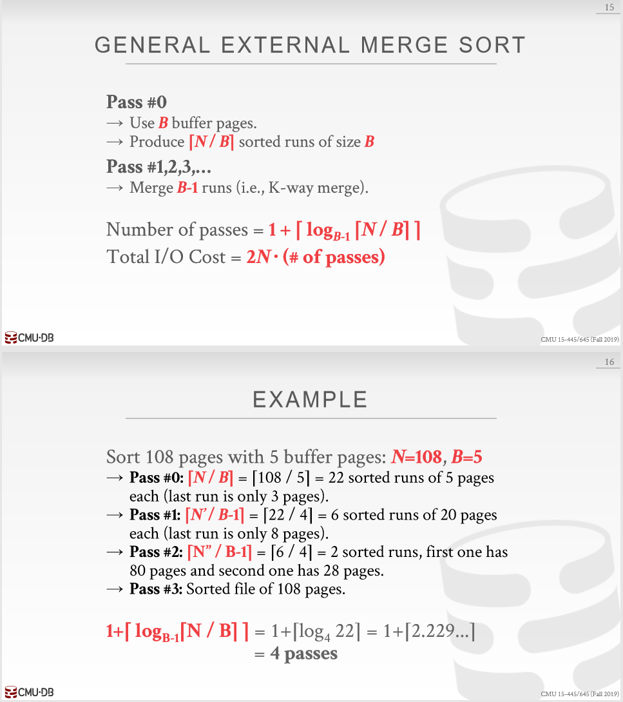

## cmu 1

查询语句：
- 程序性（关系代数）：指定数据库查询所需结果的（高级）策略
- 非程序性（关系演算）：查询指定的需要的数据，不指定如何查找

关系代数：

$$
\begin{alignedat}{0}
  \sigma \qquad \text{Select} \\
  \pi \qquad \text{Projection} \\
  \bigcup \qquad \text{Union} \\
  \bigcap \qquad \text{Intersection} \\
  - \qquad \text{Difference} \\
  \times \qquad \text{Product} \\
  \Join \qquad \text{Join} \\
\end{alignedat}
$$

- Rename (ρ) 
- Assignment (R ← S) 
- Duplicate Elimination (δ) 
- Aggregation (γ) 
- Sorting (τ) 
- Division (R ÷ S)

## cmu 2

常用函数：
- AVG(col)
- MIN(col)
- MAX(col)
- SUM(col)
- COUNT(col)

## cmu 3

> 为什么不像 OS 那样进行内存映射
对于只读进程来说很好，但当对于多写者时，会出冲突

上述问题的解决方法
- madvise: Tell the OS how you expect to read certain pages. 
- mlock: Tell the OS that memory ranges cannot be paged out. 
- msync: Tell the OS to flush memory ranges out to disk.

DBMS（几乎）总是希望自己控制事物，并且可以做得更好。
- 以正确的顺序将脏页刷新到磁盘。
- 专门的预取。 
- 缓冲区更换策略。
- 线程/进程调度。

常见的页：
- 硬件页（通常为 4KB）
- OS 页（通常为 4KB）
- 数据页（512B ~ 16KB）
> By hardware page, we mean at what level the device can guarantee a "failsafe write".
> google translation: 在硬件页面上，我们指的是设备可以保证“故障安全写入”的级别。

页储存架构
不同的DBMS以不同的方式管理磁盘上文件中的页面。 
- 堆文件组织
  - 堆文件是页面的无序集合，其中元组以随机顺序存储。
    - 对页的操作：create / get / write / delete
    - 对所有页面的迭代
  - 需要元数据来跟踪存在哪些页面以及哪些页面具有可用空间。
  - 表示堆文件的两种方法：
    - 链表
      - 一个页头，链接**空闲页表**和**数据列表**
      - 每个页面都会跟踪其自身中的可用插槽数。
    - 页目录
      - DBMS维护特殊页，这些页跟踪数据库文件中**数据页的位置**。
      - 该目录还记录每页的可用插槽数。
      - DBMS必须确保目录页面与数据页面同步。
- 顺序/排序文件组织
- 哈希文件组织

## cmu 4

工作负载特征：
- OLTP（在线事务处理）：简单查询，用于读取/更新与数据库中单个实体相关的少量数据。
- OLAP（在线分析处理）：复杂查询，读取跨多个实体的数据库的大部分
- HTAP 混合（事务+分析）处理

数据储存模型：
- n 元储存模型（行存储 NSM）：DBMS在页面中连续存储单个元组的所有属性
  - 对于查询倾向于仅在**单个实体**上运行并插入繁重工作负载的OLTP工作负载而言，它是理想的选择。
  - 优点：
    - 快速插入，更新和删除
    - 常适合需要整个元组的查询
  - 缺点：
    - 不利于扫描表的大部分和/或属性的子集
- 分解存储模型（列存储 DSM）：DBMS在页面中连续存储所有元组的单个属性的值
  - 是OLAP工作负载的理想选择，其中只读查询会对表属性的子集执行大型扫描
  - 优点
    - 因为DBMS只读取它需要的数据，减少了浪费的I / O数量
    - 更好的查询处理和数据压缩
  - 缺点
    - 由于元组拆分/拼接，点查询，插入，更新和删除的速度很慢

元组标识：
- 方法1：固定长度偏移量：每个值的属性长度相同
- 方法2：嵌入式元组ID：每个值及其元组ID存储在列中

## cmu 5

数据库储存需要考虑的东西：
- 空间控制
  - 在磁盘何处写入页
  - 怎样使经常一起使用的页面在磁盘上在物理上尽可能紧密地保持在一起
- 时间控制
  - 何时将页面读取到内存中以及何时将它们写入磁盘
  - 怎样最大程度地减少必须从磁盘读取数据的停顿数

页面表跟踪当前内存中的页面。 
每页还维护其他元数据：
- 脏标志
- 引脚/参考计数器

同步：
- 锁：
  - 保护数据库的逻辑内容免受其他事务的影响。
  - 保持交易持续时间。
  - 需要能够回滚更改。
- 锁存器：
  - 保护 DBMS 内部数据结构的关键部分免受其他线程的攻击。
  - 保持操作时间。
  - 不需要能够回滚更改。

页表和页目录
- 页表
  - 页面目录是数据库文件中页面ID到页面位置的映射。
  - 所有更改都必须记录在磁盘上，以便DBMS在重新启动时能够找到。
- 页目录
  - 页表是缓冲池帧中从页 ID 到页副本的映射。
  - 这是一个内存中数据结构，不需要存储在磁盘上。

缓冲池优化：
- 多缓冲池
- 预读取（根据扫描预读取）
  - 顺序扫描
  - 索引扫描
- 扫描共享
  - 查询可以重用从存储或运算符计算中检索到的数据。这与结果缓存不同
  - 允许多个查询附加到扫描表的单个游标。
    - 查询不必相同。 
    - 也可以共享中间结果。
- 缓冲池旁路：顺序扫描运算符不会将提取的页面存储在缓冲池中，以避免开销
  - 内存对于正在运行的查询是本地的。
  - 如果要读取磁盘上连续的大量页面，则效果很好。
  - 也可以用于临时数据（排序，联接）

## lec 3 Storing Data

访问（读/写）磁盘块的时间：
- 搜寻时间（移动臂以将磁盘头定位在轨道上）
- 旋转延迟（等待块在头部下方旋转）
- 传输时间（实际上是将数据移至磁盘表面或从磁盘表面移出数据）

FILE：页面的集合，每个页面包含一个记录的集合。 必须支持：
- 插入/删除/修改记录
- 获取特定记录（使用记录ID指定）
- 扫描所有记录（可能对要检索的记录有某些条件）

LRU

## lec 5 Tree Indexes

Leaf pages contain data entries.

### ISAM

Index entries: <search key value, page id>

文件创建：
- 顺序分配的叶子（数据）页面，按搜索键排序
- 然后索引页面
- 然后溢出页面。

> 搜索：从根开始； 使用关键比较进行分析。
成本= $log _F N$
- F = 每页条目数（即扇出）
- N = 叶子页面
  - 不需要“下一页”指针。 （为什么？）
> 插入：找到数据条目所属的叶子，并将其放在此处。 必要时溢出页面。
> 删除：寻求并摧毁！ 如果删除元组会清空溢出页面，请对其进行内存释放，然后从链接列表中删除。

静态树结构：插入/删除只作用在叶子页上

### B+ 树

ROOT节点包含1到2d之间的索引条目。
- 参数 d 称为树的顺序。
- 索引条目是一对<key ，page id>
- 根是叶子或至少有两个孩子。

每个内部节点包含 m（d ≤ m ≤ 2d）个索引条目。
- 每个内部节点有 m + 1 个子节点

每个叶节点包含m（d≤m≤2d）个数据条目
- 数据条目是 <key, record> 或 <key, RID> 或 <key, list of RIDs> 之一

每条从根到叶子的路径长度（路径的节点数量）一样

有效支持平等和范围搜索

#### 插入

- 找到正确的叶子 L
- 将数据放入 L 中：
  - 如果 L 空间足够，那么放入，完成
  - 否则必须分裂 L ，变成 L 和新节点 L2
    - 均匀地重新分配条目，并且复制中间键
    - 将指向 L2 的索引条目插入到 L 的父级
- 递归操作
  - 如果要拆分索引节点，需要平均分配条目，并且向上推中间键（和分裂对比）
- 分裂并成长：根分裂增加高度
  - 树的成长：更宽并且顶层级别更高

#### 删除

- 从根节点开始，找到条目所属的叶子节点 L
- 移除条目
  - 如果 L 至少半满，完成
  - 如果 L 只有 d - 1 个条目
    - 尝试重新分配，从同级（并且父节点相同）的邻居节点借用
    - 如果重新分配失败，那么将 L 和同级合并
- 如果发生合并，则需要从 L 的父节点删除指向 L 或者同级条目
- 合并可能从传递到根，从而导致树高度降低

### 总结

树型索引非常适合范围搜索，也适合于相等搜索。

ISAM是静态结构。
- 仅修改了叶子页； 需要溢出页面。
- 除非数据集的大小和数据分布保持恒定，否则溢出链会降低性能。
B +树是动态结构。
- 插入/删除使树保持高度平衡； 成本为 $log _F N$。
- 高扇出度（F）表示深度很少超过3或4。
- 通常情况下，平均入住率67％。
- 通常比ISAM更可取； 优雅地适应增长。
- 如果数据条目是数据记录，则拆分会改变记录！

## lec 7 Hash-Based Index

基于哈希的索引最适合相等选择。无法支持范围搜索

### 静态哈希

- 主要页面数是固定的。
- 主页面是按顺序分配的，永远不会取消分配；
  - 如果需要，可以溢出页面。
- $h（k）mod N$ = 带有密钥k的数据条目所属的存储桶。 （N = 桶数）
- 桶储存数据条目
- 哈希功能在记录r的搜索关键字字段上起作用。 必须在0 ... N-1范围内分配值
  - $h(key) = (a * key+ b)$ 一般效果好
  - a b 是常数，h 的调整有很多技巧
- 长的溢出链会发展并且降低性能（可拓展/线性哈希可以解决这个问题）

### 可拓展哈希

- 由于读写开销大，因此不通过将桶的数量翻倍来进行文件的重组
- 哈希的思路：
  - 使用指向存储桶的指针目录，通过将目录加倍来使存储桶数量增加一倍，
  - 仅拆分溢出的存储桶
- 指针目录必须非常小于文件，从而使得桶的翻倍开销更小
- 只会分割一页数据条目，不选择溢出页

深度：
- 目录的全局深度：判断条目所属的存储桶所需的最大位数。
- 桶的本地深度：用于确定条目是否属于此桶的位数。

需要目录翻倍的情况：
- 插入前，本地深度 = 全局深度
- 插入后，本地深度 > 全局深度

#### 分裂

- 如果移除数据条目会导致桶变空，那么该桶可以被合并进它的拆分镜像
- 如果每个目录元素都指向与其拆分镜像相同的存储桶，则可以将目录减半

### 线性哈希

- 线性哈希通过使用长的溢出链而不使用目录，并且以此来处理重复项

思路
- 使用哈希函数家族，其中每高一级哈希函数的结果范围是次一级的两倍（类似于目录翻倍）
- 通过使用溢出页面并选择存储桶以拆分循环，可以避免在线性哈希中使用目录。
  - 每回合都拆分进程
  - 当所有在 $N_R$ 初始化的（对于第 R 轮）桶均被拆分时，回合结束。
  - 桶0至Next-1已被拆分； 第 Next 未被拆分。
  - 当前的轮的数量是等级。

#### 搜索

- To find bucket for data entry r, find $h_{Level}(r)$:
  - If $h_{Level}(r)$ in range **Next to NR**, *r* belongs here.
  - Else, r could belong to bucket $h_{Level}(r)$ or bucket $h_{Level}(r)$ + **NR**; must apply $h_{Level + 1}(r)$ to find out.

#### 插入

- 通过哈希函数 $h_{Level}$ 或者 $h_{Level + 1}$ 找到对应的桶
  - 如果桶满了：
    - 添加一个溢出页并将数据插入其中
    - （可能操作）分裂第 Next 桶，并将其增量
  - 否则简单插入数据条目到桶中

##### 桶的分裂

- 分裂的触发条件：
  - 添加新的溢出页
  - 其他条件如空间利用
- 当分裂触发时：
  - Next 桶通将会被分裂
  - 高一级哈希函数将会在该桶（假设为 b）和它的分裂镜像之间重新分配桶
  - 这个分裂进行会储存为 $b + N_{Level}$
  - $Next = Next + 1$ （如果该轮结束，则变为0，下次可移动范围 * 2）

### 总结

- 基于哈希的索引：最适合等式搜索，不支持范围搜索。
- 静态哈希会导致较长的溢出链。
- 可扩展哈希通过在添加新数据条目时拆分整个存储桶来避免页面溢出。
- 线性散列通过将存储桶循环拆分并使用溢出页面来避免目录。

## cmu 10

排序：
- 归并排序 
- 使用 B+ 树进行排序

将多个元组折叠为一个标量值，两种实现选择：
- 排序
- 散列

## cmu 11

联结，实现方式：（假设外循环为 M 页 m 元组，内循环为 N 页 n 元组，缓冲为 B）
- 嵌套循环联结
  - 开销巨大，是因为对于外表，需要用顺序扫描来检测是否和内表匹配
  - 技巧：
    - 选择小的表作为外表
    - 尽可能给外表更多的缓冲
    - 循环访问内部表或使用索引
  - 类型
    - 傻瓜式
      - 开销：$M + (m \cdot N)$
    - 块
      - 开销：M + (M · N)
      - 优化：使用 B-2 个缓冲区用于扫描外表，一个用于内表，一个用于储存输出
        - 优化后开销：M + ([M / (B - 2)] · N)，当 M 接近于 B - 2 时，最终开销会演变为 M + N
    - 索引
      - 开销：$M + (m \cdot C)$
- 归并排序联结
  - 关键步骤：
    - 排序：对联接键上的表进行排序
    - 合并
      - 使用光标逐步浏览两个排序的表，并发出匹配的元组
      - 可能需要回退，具体取决于联接类型
    - 开销：
      - 外表：$2M \cdot (1 + \lceil \log_{B - 1} \lceil M / B \rceil \rceil)$
      - 内表：$2N \cdot (1 + \lceil \log_{B - 1} \lceil N / B \rceil \rceil)$
      - 合并：$M + N$
    - 应用场合：
      - 一个表或两个表已按连接键排序
      - 输出必须按连接键排序
      - 输入关系可以由显式排序运算符进行排序，也可以通过使用联接键上的索引扫描关系来进行排序。
- 哈希联结
  - 关键步骤：
    - 构建：扫描外关系并通过哈希函数放入哈希表
    - 探测：扫描内部关系，并在每个元组上使用哈希函数跳转到哈希表中的某个位置，并找到匹配的元组
  - 表值储存方法：
    1. 完整元组
       - 避免在比赛中检索外部关系的元组内容。
       - 占用更多的内存空间。
    2. 元组标识符
       - 非常适合列存储，因为DBMS不会从不需要的磁盘中获取数据。
       - 如果连接选择性低，也更好。
  - 探测哈希优化：当哈希表中可能不存在该键时，在构建阶段创建一个布隆过滤器(Bloom Filter)
    - 线程在探测哈希表之前会检查过滤器。 这将更快，因为过滤器将适合CPU缓存
    - 有时称为横向信息传递
  - grace 哈希联结
    - 如果桶不适合内存，那么可以使用递归分区将表分到合适的块中，然后在该级别针对另一个表的存储桶的每个元组进行探测
    - 开销：$3(M + N)$
      - 分区：$2(M + N)$
      - 探测：$M + N$

## cmu 12

模型：
- 迭代模型（火山模型 / 管道模型）：每个查询计划运算符都实现一个Next函数。
  - 每次调用时，操作员将返回一个元组或如果没有更多的元组则返回一个空标记。
  - 运算符实现一个循环，该循环接着调用其子级以检索其元组，然后对其进行处理。
  - Some operators have toblock until their children emit all of their tuples. →
    - Joins, 
    - Subqueries, 
    - Order By
- 材料化模型
  - 输出：可以是全部的元组（采用 NSM 储存）或者列的子集（采用 DSM 储存）
- 矢量化模型：每个查询计划运算符都实现一个Next函数。
  - 每个运算符都发出一个批处理元组，而不是单个元组。
  - 运算符的内部循环一次处理多个元组。
  - 批的大小可能会因硬件或查询属性而异。

处理方向：
- 自顶向下
- 自底向上

访问方法：
- 顺序扫描：维护一个内部游标，该游标跟踪它检查的最后一页/插槽
  - 优化方式：
    - 预读取
    - 缓冲池旁路
    - 并行
    - 区域图
    - 延迟实现
    - 堆聚类
- 索引扫描
- 多索引/位图扫描