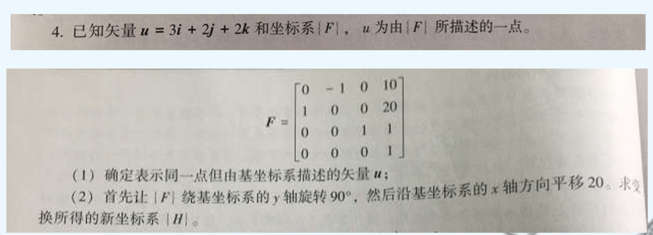
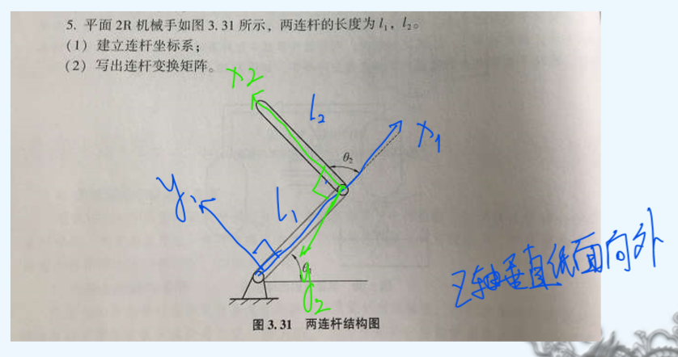
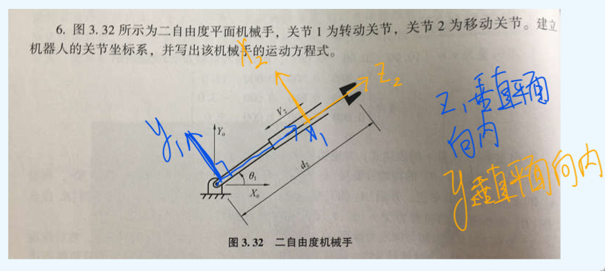
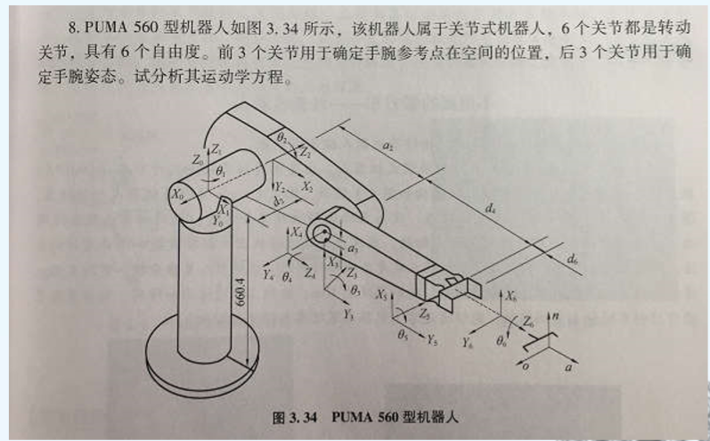

# 机器人导论第一次作业

- 米家龙
- 18342075

## 4. 

(1) 进行变换之后，可以得到

$$
\bold{u} = \begin{bmatrix}
  0 & -1 & 0 & 10 \\
  1 & 0 & 0 & 20 \\
  0 & 0 & 1 & 1 \\
  0 & 0 & 0 & 1
\end{bmatrix} \times
\begin{bmatrix}
  3 \\
  2 \\
  2 \\
  1
\end{bmatrix} =
\begin{bmatrix}
  8 \\
  23 \\
  3 \\
  1
\end{bmatrix}
$$

(2) 进行变换之后，可以得到

$$
H = \begin{bmatrix}
  0 & 0 & 1 & 21 \\
  1 & 0 & 0 & 20 \\
  0 & 1 & 0 & -10 \\
  0 & 0 & 0 & 1
\end{bmatrix}
$$

## 5.

(1) 坐标系建立如图所示

(2) 变换矩阵为

$$
\begin{aligned}
A_1 & = Rot_{z, \theta_1} \ Trans_{0,0,0} \ Trans_{0,0,0} \ Rot_{x,0} \\
    & = \begin{bmatrix}
    C_{\theta_1} & -S_{\theta_1} & 0 & 0 \\
    S_{\theta_1} & C_{\theta_1} & 0 & 0 \\
    0 & 0 & 1 & 0 \\
    0 & 0 & 0 & 1
  \end{bmatrix}
\\
A_2 & = Rot_{z, \theta_2} \ Trans_{z, l_1} \\
    & = \begin{bmatrix}
    C_{\theta_2} & S_{\theta_2} & 0 & 0 \\
    S_{\theta_2} & C_{\theta_2} & 0 & 0 \\
    0 & 0 & 1 & l_1 \\
    0 & 0 & 0 & 1
  \end{bmatrix}
\end{aligned}
$$

## 6.

建立关节坐标系如图

$$
\begin{aligned}
  A_1 & = Rot_{z, \theta_1} \ Trans_{0,0,0} \ Trans_{0,0,0} \ Rot_{x,0} \\
      & = \begin{bmatrix}
        C_{\theta_1} & -S_{\theta_1} & 0 & 0 \\
        S_{\theta_1} & C_{\theta_1} & 0 & 0 \\
        0 & 0 & 1 & 0 \\
        0 & 0 & 0 & 1
      \end{bmatrix}
\\
  A_2 & = Rot_{z, 0} \ Trans_{0,0,0} \ Trans_{d_2,0,0} \ Rot_{x_1,0} \\
      & = \begin{bmatrix}
        1 & 0 & 0 & d_2 \\
        0 & 1 & 0 & 0 \\
        0 & 0 & 1 & 0 \\
        0 & 0 & 0 & 1
      \end{bmatrix}
\\
T & = A_1 \times A_2 \\
  & = \begin{bmatrix}
    C_{\theta_1} & -S_{\theta_1} & 0 & d_2 \cdot C_{\theta_1} \\
    S_{\theta_1} & C_{\theta_1} & 0 & d_2 \cdot S_{\theta_1} \\
    0 & 0 & 1 & 0 \\
    0 & 0 & 0 & 1
  \end{bmatrix}
\end{aligned}
$$

## 8.

根据图片建立的坐标系，可以得到

$$
\begin{aligned}
  A_1 & = \begin{bmatrix}
    C_{\theta_1} & -S_{\theta_1} & 0 & 0 \\
    S_{\theta_1} & C_{\theta_1} & 0 & 0 \\
    0 & 0 & 1 & 0 \\
    0 & 0 & 0 & 1
  \end{bmatrix}
  \\
  A_2 & = Rot_{x, -\frac{\pi}{2}} \ Rot_{z, \theta_2} \\
      & = \begin{bmatrix}
        C_{\theta_2} & -S_{\theta_2} & 0 & 0 \\
        0 & 0 & 1 & 0 \\
        -S_{\theta_1} & -C_{\theta_1} & 0 & 0 \\
        0 & 0 & 0 & 1
      \end{bmatrix}
  \\
  A_3 & = Trans_{a_2, 0, d_2} \ Rot_{z, \theta_3} \\
      & = \begin{bmatrix}
        C_{\theta_3} & -S_{\theta_3} & 0 & a_2 \\
        S_{\theta_3} & C_{\theta_3} & 0 & 0 \\
        0 & 0 & 1 & d_2 \\
        0 & 0 & 0 & 1
      \end{bmatrix}
  \\
  A_4 & = Rot_{x, -\frac{\pi}{2}} \ Trans_{a_3, 0, 0} \ Rot_{z, \theta_4} \\
      & = \begin{bmatrix}
        C_{\theta_4} & -S_{\theta_4} & 0 & a_3 \\
        0 & 0 & 1 & 0 \\
        -S_{\theta_4} & -C_{\theta_4} & 0 & 0 \\
        0 & 0 & 0 & 1        
      \end{bmatrix}
  \\
  A_5 & = Rot_{x, \frac{\pi}{2}} \ Trans_{0, 0, d_4} \ Rot_{z, \theta_5} \\
      & = \begin{bmatrix}
        C_{\theta_5} & -S_{\theta_5} & 0 & 0 \\
        0 & 0 & 1 & -d_4 \\
        S_{\theta_5} & C_{\theta_5} & 0 & 0 \\
        0 & 0 & 0 & 1                
      \end{bmatrix}
  \\
  A_6 & = Rot_{x, \frac{\pi}{2}} \ Rot_{z, \theta_6} \\
      & = \begin{bmatrix}
        C_{\theta_6} & -S_{\theta_4} & 0 & 0 \\
        0 & 0 & 1 & 0 \\
        -S_{\theta_6} & -C_{\theta_4} & 0 & 0 \\
        0 & 0 & 0 & 1        
      \end{bmatrix}
  \\
  T & = A_1 \ A_2 \ A_3 \ A_4 \ A_5 \ A_6
\end{aligned}
$$