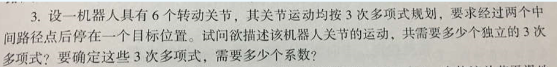
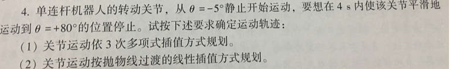

# 机器人导论第三次作业

- 米家龙
- 18342075

# 1

根据三次插值多项式为：
$$
\begin{cases}
  & \theta(t) = a_0 + a_1t + a_2t^2 + a_3t^3 \\
  & \dot{\theta}(t) = a_1 + 2a_2t + 3a_3t^2 \\
  & \ddot{\theta}(t) = 2a_2 + 6a_3t
\end{cases}
$$

因此，对于两个中间路径点和最终位置，可以得出三段移动，每个关节需要3个三次多项式，所以总共需要**3个**三次多项式

每个三次多项式有4个系数，因此总共需要3 * 4 * 6 = **72个**系数

# 2

(1)

根据三次插值多项式可以得到
$$
\begin{aligned}
  & \begin{cases}
    & \theta(0) = -5° = a_0 \\
    & \dot{\theta}(0) = 0 = a_1 \\
    & \ddot{\theta}(0) = 2a_2
  \end{cases} \\
  & \begin{cases}
    & \theta(4) = 80° = a_0 + 4a_1 + 16a_2 + 64a_3 \\
    & \dot{\theta}(4) = 0 = a_1 + 8a_2 + 48a_3 \\
    & \ddot{\theta}(4) = 2a_2 + 48a_3
  \end{cases}
\end{aligned}
$$

可以得到
$$
\begin{cases}
  & a_0 = -5 \\
  & a_1 = 0 \\
  & a_2 = \frac{3}{16} \times 85 = 15.9375 \\
  & a_3 = -\frac{2}{64} \times 85 = -2.65625
\end{cases}
$$

带入三次插值多项式可以得到：
$$
\begin{cases}
  & \theta(t) = -5 + 15.9375t^2 - 2.65625t^3 \\
  & \dot{\theta}(t) = 31.875t - 7.96875t^2 \\
  & \ddot{\theta}(t) = 31.875 - 15.9375t
\end{cases}
$$

(2)

根据题意，得到加速度的取值范围：

$$
\ddot{\theta} \geq \frac{t_f \cdot (a_2 - a_1)}{16} = 21.25°/s^2
$$

假设 $\ddot{\theta} = 42 °/s^2$，可以得到 $t_{a1} = 0.594 s$，从而可以得到

$$
\begin{aligned}
  & \theta_{a1} = a_1 + \frac{\ddot{\theta} \  t_{a1}^2}{2} = 2.4 ° \\
  & \dot{\theta_1} = \ddot{\theta_1}t_{a1} = 24.95 °/s
\end{aligned}
$$