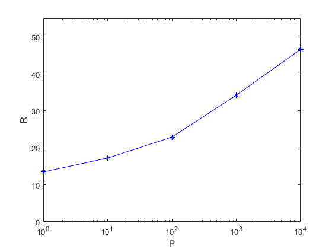

# 《现代通信技术概论》期末考核

- [《现代通信技术概论》期末考核](#现代通信技术概论期末考核)
  - [1. （60 分）选择一种面向未来的通信技术，结合课程内容，详细回答：](#1-60-分选择一种面向未来的通信技术结合课程内容详细回答)
    - [1. 技术产生的背景](#1-技术产生的背景)
    - [2. 技术的基本原理](#2-技术的基本原理)
    - [3. 技术的可能应用场景](#3-技术的可能应用场景)
  - [2. （40 分）MIMO 技术](#2-40-分mimo-技术)
    - [1. 求信息速率](#1-求信息速率)
    - [2. 求信息速率最大时的表达式](#2-求信息速率最大时的表达式)
    - [3. 代码模拟](#3-代码模拟)

## 1. （60 分）选择一种面向未来的通信技术，结合课程内容，详细回答：

新一代卫星互联网

### 1. 技术产生的背景

背景：
起始于 20 世纪 80 年代末，至今已经进行了三次迭代：

1. 第一代使用 C、L、S 频段，以话音和物联网服务为主，定位是全面替代地面通信系统
2. 第二代使用 C、L、S、Ka 频段，以升级带宽和拓展综合服务为主，定位是与地面通信系统并存
3. 第三代，即新一代使用 Ku、Ka、V 频段，以提供高速低延时的互联网服务为主，定位是与地面通信系统互补

2015 年后，新一代卫星互联网技术趋向小型化、大容量演进。以 SpaceX 的星链计划、一网公司的 OneWeb 计划和加拿大电信卫星公司的 Telstar 计划为首，使用大量低轨宽带/高通量卫星实现大规模组网，从而为全球提供高速低延时的互联网服务。

### 2. 技术的基本原理

基本原理：
一条完整的通信链路包括地面系统、上行下行链路和通信卫星；分为空间段、地面段和用户段。

空间段：

- 若干通信卫星组成的星座。
- 通信卫星主要作用是转发无线电信信号。
- 卫星中的有效载荷基于特定的频段，其中的天线分系统接受上行信号后，经过转发器分系统对信号进行放大 → 变频 → 放大，转换为下行信号，再通过天线分系统传送至地面；
- 一颗卫星可以携带多个转发器，每个转发器可以同时接收/转发多个地面信号；在功率和带宽固定时，转发器数量和卫星容量正比。

地面段：

- 用于连接卫星网络和地面网络。
- 用于实现卫星与地面、终端与终端之间的互联，以及管控卫星网络。
- 包括关口站、地面卫星控制中心、遥测和指令站等，以及主站和陆地链路匹配的接口。
  用户段：
- 各类用户终端设备。

### 3. 技术的可能应用场景

应用场景：

1. 物联网。卫星互联网覆盖广，受天气和地理影响小，因此可以用于：
   1. 农业上可通过其收集大面积农场的相关数据；
   2. 工程上可通过其进行偏远地区的土木工程作业监控；
   3. 海洋运输方面则可通过其对运输过程全程监控，提高运输效率和安全。
2. 生态环境监测和应急通信。低轨卫星互联网可以提高数据和预警的传送速度，从而实现实时监控，提高防护监测工作的效率；在灾害发生时，其收地理影响小的特性能帮助救灾人员和相关情况的通信与传输。
3. 机载/船载 Wi-Fi。由于地面基站等设施的局限，飞机飞行过程中的乘客无法自由使用互联网，而新一代卫星互联网的商业化可以解决用户在飞机飞行过程中/轮船行驶过程中无法使用互联网的问题，还能提供高速率的带宽。

## 2. （40 分）MIMO 技术

> MIMO 技术是 4G 和 5G 移动通信系统的核心关键技术之一。现有一对收发机，各配有 4 根天线，它们之间的信道为 $H$，发射机的发射协方差矩阵为 $Q$，则信息速率可表示为 $R=\log_{2}[\det(I+HQHT)]$。回答：

### 1. 求信息速率

> 假设 $H$ 确知且它的奇异值分解为 $H = UAV^T$，其中 $A = {\rm{diag}}(a_1,a_2,a_3,a_4)$；矩阵 $Q$ 未知且它的特征分解为 $Q=SBS^T$，其中 $S$ 为酉矩阵，$B = {\rm{diag}} (b_1,b_2,b_3,b_4)$ 且 $b_i>=0 (i=1,2,3,4)$。运用线性代数的知识，确定 $S$ 的取值，使得 MIMO 信道可以分解为 4 条平行的子信道，并写出此时的信息速率表达式（用 $a_i$ 和 $b_i$ 来表示）

已知 MIMO 系统可以表示为：

$$
y = H x + n
$$

由于题目要求为四条平行的子信道，那么 $H$ 为：

$$
\begin{aligned}
  H & = U \times \begin{bmatrix}
    a_1 & 0 & 0 & 0 \\
    0 & a_2 & 0 & 0 \\
    0 & 0 & a_3 & 0 \\
    0 & 0 & 0 & a_4 \\
  \end{bmatrix} \times V^T \\
\end{aligned}
$$

对上述式子左右分别乘上 $U^T$ 并根据相关性质得到：

$$
\begin{aligned}
  y' & = U^T y \\
     & = (U^T U) A V^T x + U^T n \\
     & = A V^T x + U^T n \\
\end{aligned}
$$

令 $V^T x = x'$ 和 $U^T n = n'$ 得到：$y' = A x' + n'$，同时可以得到：

$$
\begin{aligned}
  V x' = V V^T x = x
\end{aligned}
$$

由于原始信号的信道之间互相独立，则不同信道之间的协方差应为 0

并且对于协方差矩阵 $Q = SBS^T$ ，$S$ 是酉矩阵，结合上面的式子可以得到公式为：

$$
\begin{aligned}
  Q & = E \begin{bmatrix}
    (X - E[X])(X - E[X]^T)
  \end{bmatrix} \\
    & = V E \begin{bmatrix}
    (X' - E[X'])(X' - E[X']^T)
  \end{bmatrix} V^T \\
    & = V Cov(X') V^T
\end{aligned}
$$

通过上式可以对应得到 $S = V$ 和 $B = Cov(X')$

此时可以计算信息速率为：

$$
\begin{aligned}
  R & = \log_2 \det(I + HQH^T) \\
    & = \log_2 \det(I + UAV^T \ SBS^T \ VAU^T) \\
    & = \log_2 \det(I + UAV^T \ VBV^T \ VA^TU^T) \\
    & = \log_2 \det(I + U A B A^T U^T) \\
    & = \log_2 \det(I + ABA) \\
    & = \log_2 \det \left(I + \begin{bmatrix}
      a_1^2 b_1 & 0 & 0 & 0 \\
      0 & a_2^2 b_2 & 0 & 0 \\
      0 & 0 & a_3^2 b_3 & 0 \\
      0 & 0 & 0 & a_4^2 b_4 \\
    \end{bmatrix}\right) \\
    & = \sum_{i = 1}^4 \log_2 (1 + a_i^2 b_i)
\end{aligned}
$$

### 2. 求信息速率最大时的表达式

> 假设 $b_1 + b_2 + b_3 + b_4 = P$，且 P 为一个已知的非负常数。运用最优化理论（如拉格朗日乘子法）的知识，确定 $b_i$的表达式，使得信息速率 $R$ 最大

使用拉格朗日乘子法，在此题中的表述应为：

$$
L(R, B) = R - \lambda (\sum_{i = 1}^4 b_i - P)
$$

对 $b_i$ 分别进行求导可以得到：

$$
\begin{aligned}
  \frac{\partial L}{\partial b_i} = \frac{a_i^2}{1 + a_i^2 b_i} - \lambda
\end{aligned}
$$

当上式结果为 0 时，可以得到期望的结果，此时：

$$
\begin{aligned}
  b_i & = \frac{1}{\lambda} - \frac{1}{a_i^2}
\end{aligned}
$$

又根据题目的 $b_i \ge 0$ 可以得到：

$$
\begin{aligned}
  b_i = \max \left\{\frac{1}{\lambda} - \frac{1}{a_i^2}, 0 \right\}, \ \text{并且} \sum_{i = 1}^4 b_i = P
\end{aligned}
$$

假设 $0 \le a_1 \le a_2 \le a_3 \le a_4$，可以得到如下判断：

$$
\begin{cases}
  \lambda \ge a_4 & , P = 0, \ b_i = 0 \\
  a_3 \le \lambda \le a_4 & , P = \frac{1}{\lambda} - \frac{1}{a_4^2}, \ \frac{1}{\lambda} = P + \frac{1}{a_4^2} \\
  a_2 \le \lambda \le a_3 & , P = \frac{2}{\lambda} - \frac{1}{a_3^2} - \frac{1}{a_4^2}, \ \frac{1}{\lambda} = \frac{1}{2} (P + \sum_{i = 3}^4 \frac{1}{a_i^2}) \\
  a_1 \le \lambda \le a_2 & , P = \frac{3}{\lambda} -\frac{1}{a_2^2} - \frac{1}{a_3^2} - \frac{1}{a_4^2}, \ \frac{1}{\lambda} = \frac{1}{3}(P + \sum_{i = 2}^4 \frac{1}{a_i^2}) \\
  \lambda \le a_1 & , P = \frac{4}{\lambda} - \frac{1}{a_1^2} - \frac{1}{a_2^2} - \frac{1}{a_3^2} - \frac{1}{a_4^2}, \ \frac{1}{\lambda} = \frac{1}{4} (P + \sum_{i = 1}^4 \frac{1}{a_i^2}) \\
\end{cases}
$$

### 3. 代码模拟

> 若 H 的每一个元素都独立服从 $(0,1)$ 高斯分布。请编写程序（C++ 或者 MATLAB，并附上可运行代码且代码要有详细注释）随机产生 100 个相互独立的 $H$，画出 $P=1, 10, 10^2, 10^3, 10^4$ 时，信息速率 $R$ 的平均值（横坐标为 $P$ ，纵坐标为 $R$ 的平均值）

截图



对应的输出为

```matlab
>> main

avarageRate =

   13.4775   17.2342   22.8919   34.2229   46.6311
```

代码如下

```matlab
% 主函数
function main()
    Ps = [1, 10, 1e2, 1e3, 1e4]; % 横坐标
    avarageRate = [0, 0, 0, 0, 0]; % 纵坐标，平均速率
    H_nums = 100; % 100个独立的矩阵

    for P_index = 1:5
        P = Ps(P_index);

        for H_index = 1:H_nums
            [~, ~, A, ~] = generateMatrix(); % 生成矩阵
            A_ = sum(A); % 得到对角线的元素
            A__ = sort(A_); % 进行排序

            maxR = 0; % 最大速率

            % 分情况讨论并计算 B
            for index = 1:4
                [lambda, B_] = getLambda(A_, P, index);

                % 如果 lambda 值有效，那么计算速率并更新最大值
                if (lambda ~= -1)
                    R = caculateRate(A__, B_);
                    maxR = max(R, maxR); % 更新最大值
                end

            end

            avarageRate(P_index) = avarageRate(P_index) + maxR; % 累加求平均值
        end

    end

    avarageRate = avarageRate / 100;

    avarageRate

    % 画图

    semilogx(Ps, avarageRate, '-*b');
    axis([0, 1e4, 0, 55]);
    set(gca, 'XTick', Ps);
    set(gca, 'YTick', [0:10:55]);
    xlabel('P')
    ylabel('R')

end

% 生成矩阵
function [H, U, A, V] = generateMatrix()
    H = randn(4, 4); % 以标准正态分布生成 4*4 的矩阵
    [U, A, V] = svd(H); % 进行 SVD 分解
end

% 获取不同情况下的 lambda 和对应的 B
function [lambda, B_] = getLambda(A_, P, index)
    % 分情况进行讨论，index 与 lambda <= a_index 对应

    A__ = sort(A_); % 进行排序，方便讨论情况

    switch index
        case 4 % a3 < lambda <= a4
            lambda = 1 / (P + 1 / (A__(4)^2));

            if ~(A_(3) < lambda && lambda <= A_(4))
                lambda = -1;
            end

        case 3 % a2 < lambda <= a3
            lambda = 2 / (P + 1 / (A__(4)^2) + 1 / (A__(3)^2));

            if ~(A_(2) < lambda && lambda <= A_(3))
                lambda = -1;
            end

        case 2 % a1 < lambda <= a2
            lambda = 3 / (P + 1 / (A__(4)^2) + 1 / (A__(3)^2) + 1 / (A__(2)^2));

            if ~(A_(1) < lambda && lambda <= A_(2))
                lambda = -1;
            end

        case 1 % lambda <= a1
            lambda = 4 / (P + 1 / (A__(4)^2) + 1 / (A__(3)^2) + 1 / (A__(2)^2) + 1 / (A__(1)^2));

            if ~(lambda <= A_(1))
                lambda = -1;
            end

        otherwise % 其他情况
            lambda = -1;
    end

    B_ = [0 0 0 0]; % 基础的 B

    % 如果 lambda 有效，那么计算对应的 b_i
    if ~(lambda == -1)

        for index = 1:4
            B_(index) = max(1 / lambda - 1 / (A__(index)^2), 0);
        end

    end

end

% 计算信息速率
function R = caculateRate(A_, B_)
    AB_ = (A_.^2) .* B_ + 1;
    R = sum(log2(AB_));
end
```
