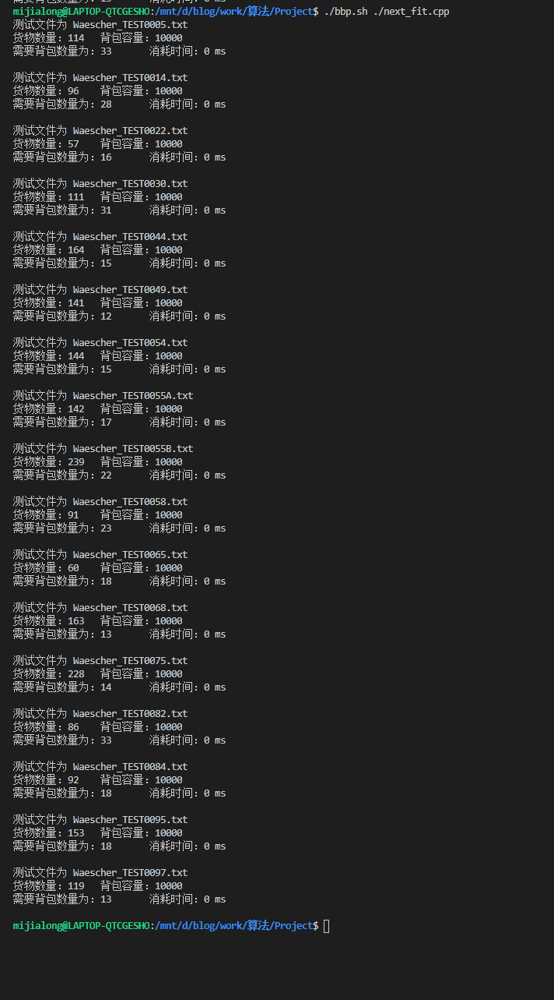
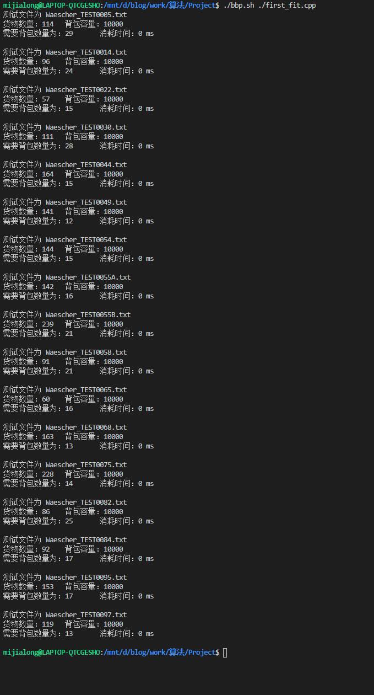
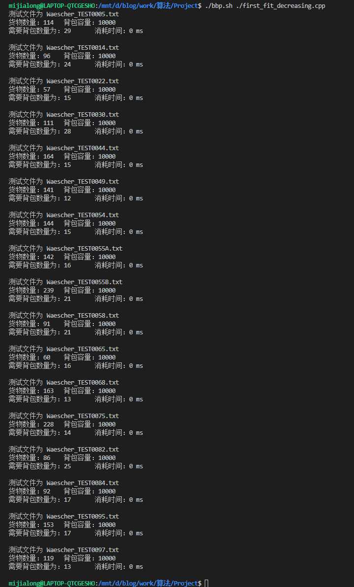
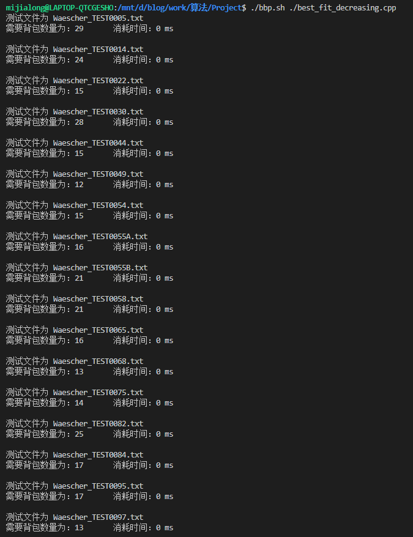
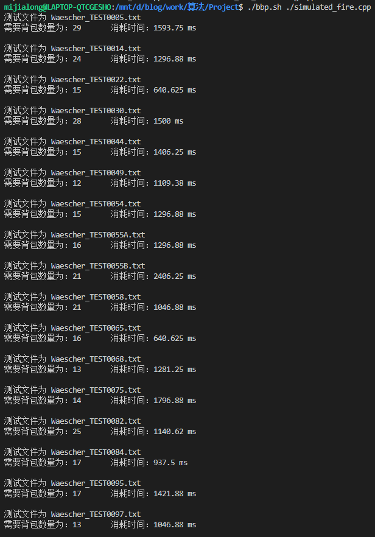
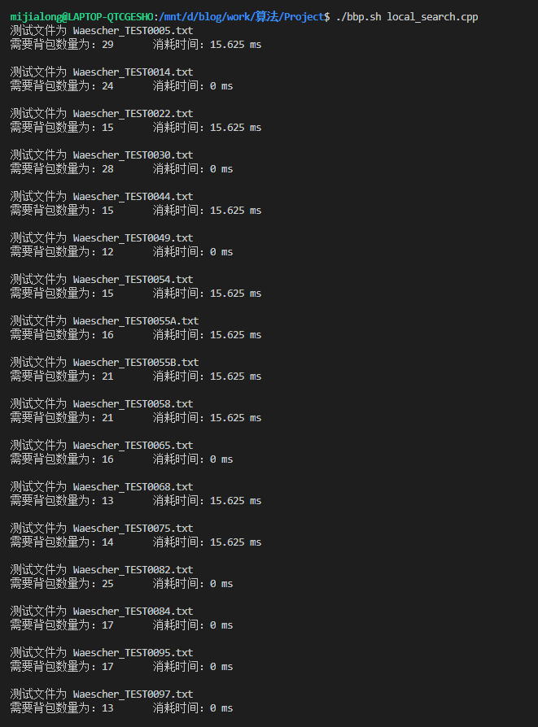
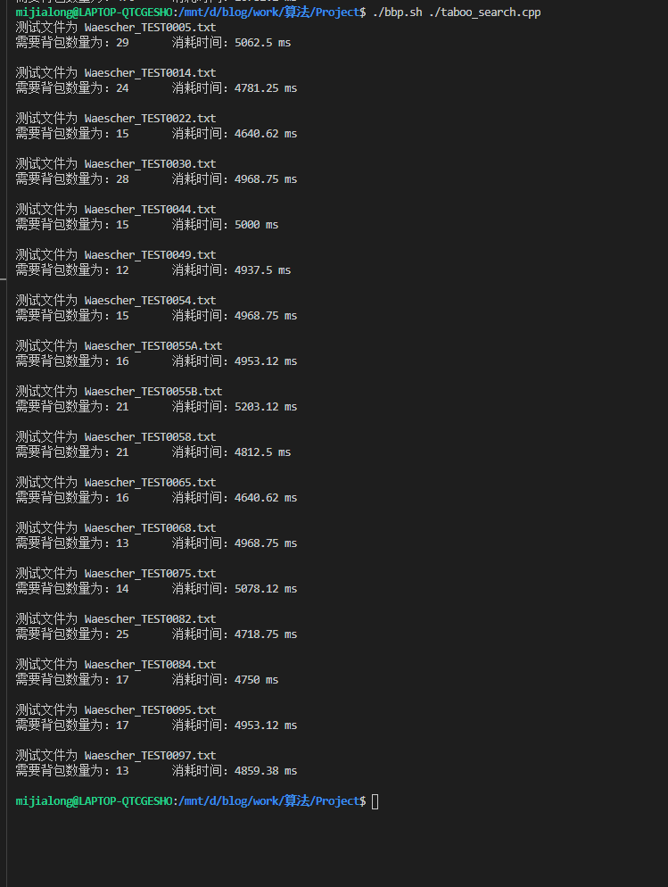

# 算法报告

## 个人信息

- 数据科学与计算机学院
- 2018级 软工3班
- 18342075
- 米家龙

## 目录

[TOC]

## 算法

### Next Fit

思路：
- 始终只维持一个打开的箱子
- 对于每一个要装入的物品，检查该物品是否可以装入
  - 如果可以装入，则装入
  - 如果无法装入，则新开一个箱子，装入该物品

缺陷：每个物品只有放入当前箱子和空箱子的选择，因此面对*背包容量为10* 数据为 `2 9 3 8 4 7 10 1` 这样的数据时，当最优解存在时，会出现最优解和结果近似相差一倍的箱子的情况，$NF(L) \le 2 \cdot OPT(L) - 1$

时间复杂度为 $O(|L|)$

代码实现如下，采用了**在线**的处理方式：
```cpp
#include <iostream>
#include <time.h>
#include <vector>

using namespace std;

#define MAX_NUM 1000

time_t startTime, endTime; // 开始和结束时间

int goodsNum;      // 货物数量
int capacity;      // 箱子容量
vector<int> bins;  // 箱子
vector<int> goods; // 货物队列
int bin;           // 当前箱子

/**
 * 下项适应
*/
void nextFit(int goodsNum);

int main()
{

  cin >> goodsNum;
  cin >> capacity;

  bins.clear();
  goods.clear();
  bin = 0;

  cout << "货物数量：" << goodsNum << '\t' << "背包容量：" << capacity << endl;

  startTime = clock();

  nextFit(goodsNum);

  endTime = clock();

  cout << "需要背包数量为：" << bins.size() << "\t 消耗时间："
       << (double)(endTime - startTime) / CLOCKS_PER_SEC * 1000 << " ms" << endl;

  return 0;
}

void nextFit(int goodsNum)
{
  for (int i = 0; i < goodsNum; i++)
  {
    int good = 0;
    cin >> good;
    if (good + bin <= capacity) // 如果能装下
    {
      bin += good;
    }
    else
    {
      bins.push_back(bin);
      bin = good;
    }
    goods.push_back(good);
    // cout << i << '\t' << good << endl;
  }
  bins.push_back(bin);
}
```

### First Fit

思路：
- 维持所有的箱子打开
- 对于每一个要装入的物品，检查该物品是否可以装入打开的箱子
  - 如果可以装入，则装入
  - 如果无法装入，则新开一个箱子，装入该物品

缺陷：由于物品没有实现排序，则可能由于先装入小的物品，使大的物品在后来放入时无法装入，只得开启新的箱子，造成了空间的浪费

界限：$FF(L) \le \lfloor 1.7OPT(L) \rfloor$
平均时间复杂度：$O(|L|log(|L|))$

代码实现如下，采用了**在线**的处理方式：
```cpp
#include <iostream>
#include <time.h>
#include <vector>

using namespace std;

#define MAX_NUM 1000

time_t startTime, endTime; // 开始和结束时间

int goodsNum;      // 货物数量
int capacity;      // 箱子容量
vector<int> bins;  // 箱子
vector<int> goods; // 货物队列
int bin;           // 当前箱子

/**
 * 首次适应
*/
void firstFit(int goodsNum);

int main()
{
  cin >> goodsNum;
  cin >> capacity;

  bins.clear();
  goods.clear();
  bin = 0;

  cout << "货物数量：" << goodsNum << '\t' << "背包容量：" << capacity << endl;

  startTime = clock();

  firstFit(goodsNum);

  endTime = clock();

  cout << "需要背包数量为：" << bins.size() << "\t 消耗时间："
       << (double)(endTime - startTime) / CLOCKS_PER_SEC * 1000 << " ms" << endl;

  return 0;
}

void firstFit(int goodsNum)
{
  for (int i = 0; i < goodsNum; i++) // 在线输入
  {
    int good = 0;
    bool findBin = false;
    cin >> good;
    for (int i = 0; i < bins.size(); i++)
    {
      if (bins[i] + good <= capacity) // 能够找到对应的箱子
      {
        bins[i] += good;
        findBin = true;
        break;
      }
    }
    if (!findBin) // 如果没有找到
    {
      bins.push_back(good);
    }
  }
}
```

### First Fit Decreasing

降序首次适应算法，和 FF 算法相比，需要对物品先进行降序排序，再按照 FF 算法进行装箱

界限：$FFD(I) \le \frac{11}{9}OPT(I) + \frac{2}{3}$
时空复杂度：随排序算法变动而变化

代码实现：
```cpp
#include <iostream>
#include <time.h>
#include <vector>
#include <algorithm>

using namespace std;

#define MAX_NUM 1000

time_t startTime, endTime; // 开始和结束时间

int goodsNum;      // 货物数量
int capacity;      // 箱子容量
vector<int> bins;  // 箱子
vector<int> goods; // 货物队列
int bin;           // 当前箱子

/**
 * 首次适应
*/
void firstFit(int goodsNum);

int main()
{
  cin >> goodsNum;
  cin >> capacity;

  bins.clear();
  goods.clear();
  bin = 0;

  cout << "货物数量：" << goodsNum << '\t' << "背包容量：" << capacity << endl;

  startTime = clock();

  firstFit(goodsNum);

  endTime = clock();

  cout << "需要背包数量为：" << bins.size() << "\t 消耗时间："
       << (double)(endTime - startTime) / CLOCKS_PER_SEC * 1000 << " ms" << endl;

  return 0;
}

void firstFit(int goodsNum)
{
  int good = 0;
  for (int i = 0; i < goodsNum; i++) // 输入
  {
    cin >> good;
    goods.push_back(good);
  }

  std::sort(goods.begin(), goods.end(), [](int a, int b) { return a > b; }); // 倒序排序

  for (int i = 0; i < goodsNum; i++)
  {
    bool findBin = false;
    for (int j = 0; j < bins.size(); j++)
    {
      if (bins[j] + goods[i] <= capacity)
      {
        bins[j] += goods[i];
        findBin = true;
        break;
      }
    }
    if (!findBin)
    {
      bins.push_back(goods[i]);
    }
  }
}
```

### Best Fit

思路：
- 维持所有的箱子打开
- 对于每一个要装入的物品，检查该物品是否可以装入打开的箱子
  - 如果可以装入，则需要判断该箱子是否是可装入箱子中剩余容量最小的
    - 如果是，则装入
    - 否，则跳过
  - 如果无法装入，则新开一个箱子，装入该物品

界限：$BF(L) \le \lfloor 1.7OPT(L) \rfloor$
平均时间复杂度：$O(|L|log(|L|))$

代码实现如下：
```cpp
#include <iostream>
#include <time.h>
#include <vector>

using namespace std;

#define MAX_NUM 1000

time_t startTime, endTime; // 开始和结束时间

int goodsNum;      // 货物数量
int capacity;      // 箱子容量
vector<int> bins;  // 箱子
vector<int> goods; // 货物队列
int bin;           // 当前箱子

/**
 * 最佳适应
*/
void bestFit(int goodsNum);

int main()
{
  cin >> goodsNum;
  cin >> capacity;

  bins.clear();
  goods.clear();
  bin = 0;

  // cout << "货物数量：" << goodsNum << '\t' << "背包容量：" << capacity << endl;

  startTime = clock();

  bestFit(goodsNum);

  endTime = clock();

  cout << "需要背包数量为：" << bins.size() << "\t 消耗时间："
       << (double)(endTime - startTime) / CLOCKS_PER_SEC * 1000 << " ms" << endl;

  return 0;
}

void bestFit(int goodsNum)
{
  for (int i = 0; i < goodsNum; i++) // 在线输入
  {
    int good = 0;
    int bestFitBin[] = {-1, 0}; // {序号, 已有重量}，代表最适合的箱子
    cin >> good;
    for (int i = 0; i < bins.size(); i++)
    {
      if (bins[i] + good <= capacity) // 能够找到能放下的箱子
      {
        if (bestFitBin[1] < bins[i]) // 比较剩余大小，看是否是最适合的
        {
          bestFitBin[0] = i;
          bestFitBin[1] = bins[i];
        }
      }
    }
    if (bestFitBin[0] == -1) // 如果没有找到
    {
      bins.push_back(good);
    }
    else
    {
      bins[bestFitBin[0]] += good;
    }
  }
}
```

### Best Fit Decreasing

降序最佳适应算法，和 BF 算法相比，需要对物品先进行降序排序，再按照 BF 算法进行装箱

界限：$BFD(I) \le \frac{11}{9}OPT(I) + \frac{2}{3}$
时空复杂度：随排序算法变动而变化

代码实现：
```cpp
#include <iostream>
#include <time.h>
#include <vector>
#include <algorithm>

using namespace std;

#define MAX_NUM 1000

time_t startTime, endTime; // 开始和结束时间

int goodsNum;      // 货物数量
int capacity;      // 箱子容量
vector<int> bins;  // 箱子
vector<int> goods; // 货物队列
int bin;           // 当前箱子

/**
 * 最佳适应
*/
void bestFit(int goodsNum);

int main()
{
  cin >> goodsNum;
  cin >> capacity;

  bins.clear();
  goods.clear();
  bin = 0;

  startTime = clock();

  bestFit(goodsNum);

  endTime = clock();

  cout << "需要背包数量为：" << bins.size() << "\t 消耗时间："
       << (double)(endTime - startTime) / CLOCKS_PER_SEC * 1000 << " ms" << endl;

  return 0;
}

void bestFit(int goodsNum)
{
  int good = 0;
  for (int i = 0; i < goodsNum; i++) // 输入
  {
    cin >> good;
    goods.push_back(good);
  }

  std::sort(goods.begin(), goods.end(), [](int a, int b) { return a > b; }); // 倒序排序

  for (int j = 0; j < goods.size(); j++)
  {
    int bestFitBin[] = {-1, 0}; // {序号, 已有重量}，代表最适合的箱子
    for (int i = 0; i < bins.size(); i++)
    {
      if (bins[i] + goods[j] <= capacity) // 能够找到能放下的箱子
      {
        if (bestFitBin[1] < bins[i]) // 比较剩余大小，看是否是最适合的
        {
          bestFitBin[0] = i;
          bestFitBin[1] = bins[i];
        }
      }
    }
    if (bestFitBin[0] == -1) // 如果没有找到
    {
      bins.push_back(goods[j]);
    }
    else
    {
      bins[bestFitBin[0]] += goods[j];
    }
  }
}
```

### 模拟退火 搭配 FF(D) 和 BF(D)

- 先使用 FFD 和 BFD 获取第一次的结果
- 进行降温迭代
- 每随机生成一个新的序列，便通过 FF 和 BF 分别计算当前情况下的解
  - 如果当前解更优，则替换当前序列和解
  - 否则仍然有几率获取到较差的解

代码实现如下：
```cpp
#include <iostream>
#include <math.h>
#include <vector>
#include <algorithm>

using namespace std;

int goodsNum;
int capacity;

#define MAX_LOOP_TIME 200
#define RAND_TIME 100

double k = 0.1;
double r = 0.97;    //用于控制降温的快慢
double T = 300;     //系统的温度，系统初始应该要处于一个高温的状态
double T_min = 0.1; //温度的下限，若温度T达到T_min，则停止搜索
                    //返回指定范围内的随机浮点数

double dEFF, dEBF, current;

vector<int> goods;
vector<int> bins;
vector<int> newGoods; // 用于储存新生成的序列

int bestResult; // 最好的结果

/**
 * 获取货物列表
*/
void getGoods();

/**
 * 产生（dbLow, dbUpper）之间的随机数
 * @param dbLow double 下限
 * @param dbUpper double 上限
*/
double rnd(double dbLow, double dbUpper);

/**
 * 模拟退火
*/
int simulatedFire();

/**
 * 获取新的货物顺序
*/
void getOneNewGoodsList();

/**
 * 首次适应算法（不能排序）
*/
int firstFit();

/**
 * 最佳适应算法（不能排序）
*/
int bestFit();

/**
 * 用新的序列覆盖原来的序列
*/
void copyGoods();

int main()
{
  time_t startTime, endTime; // 开始与结束时间

  cin >> goodsNum >> capacity;

  goods.clear();
  bins.clear();
  newGoods.clear();

  startTime = clock();
  srand((unsigned)(time(NULL))); // 初始化随机种子，避免生成同样的随机结果

  getGoods();
  simulatedFire();

  endTime = clock();

  cout << "需要背包数量为：" << bestResult << "\t 消耗时间："
       << (double)(endTime - startTime) / CLOCKS_PER_SEC * 1000 << " ms" << endl;

  return 0;
}

void getGoods()
{
  int good = 0;
  for (int i = 0; i < goodsNum; i++)
  {
    cin >> good;
    goods.push_back(good);
    newGoods.push_back(good);
  }

  sort(goods.begin(), goods.end(), [](int a, int b) { return a > b; });
  sort(newGoods.begin(), newGoods.end(), [](int a, int b) { return a > b; });
}

double rnd(double dbLow, double dbUpper)
{
  double dbTemp = rand() / ((double)RAND_MAX + 1.0);
  return dbLow + dbTemp * (dbUpper - dbLow);
}

int simulatedFire()
{
  int a = firstFit();
  int b = bestFit();
  bestResult = a > b ? b : a;
  while (T > T_min)
  {
    for (int i = 0; i < MAX_LOOP_TIME; i++)
    {
      getOneNewGoodsList(); // 随机生成新的序列
      int ffBins = firstFit();
      int bfBins = bestFit();

      dEFF = ffBins - bestResult;
      dEBF = bfBins - bestResult;

      if (dEFF < 0 || dEBF < 0) // 如果有更优解
      {
        bestResult = ffBins < bfBins ? ffBins : bfBins;
        copyGoods();
      }
      else // 一定概率接受较差解
      {
        if (exp(-dEFF / (T * k)) > rnd(0, 1))
        {
          copyGoods();
        }
        else if (exp(-dEBF / (T * k)) > rnd(0, 1))
        {
          copyGoods();
        }
      }

      // cout << ffBins << '\t' << bfBins << '\t' << bestResult << endl;
    }
    T = r * T; // 降温退火
  }
}

void getOneNewGoodsList()
{
  newGoods.clear();
  for (auto i = goods.begin(); i != goods.end(); i++)
  {
    newGoods.push_back(*i);
  }

  // 生成随机序列
  for (int i = 0; i < RAND_TIME; i++)
  {
    int tmp;

    // 生成交换的位置
    int a = rand() % goodsNum;
    int b = rand() % goodsNum;

    tmp = newGoods[a];
    newGoods[a] = newGoods[b];
    newGoods[b] = tmp;
  }
}

void copyGoods()
{
  goods.clear();
  for (int i = 0; i < newGoods.size(); i++)
  {
    goods.push_back(newGoods[i]);
  }
}

int firstFit()
{
  bins.clear();
  for (int i = 0; i < newGoods.size(); i++)
  {
    bool findBin = false;
    for (int j = 0; j < bins.size(); j++)
    {
      if (bins[j] + newGoods[i] <= capacity) // 找到了能放下的就放进去
      {
        bins[j] += newGoods[i];
        findBin = true;
        break;
      }
    }
    if (!findBin) // 否则开一个新的箱子
    {
      bins.push_back(newGoods[i]);
    }
  }

  return bins.size();
}

int bestFit()
{
  bins.clear();
  for (int i = 0; i < newGoods.size(); i++)
  {
    int findBestBin[] = {-1, 0};
    for (int j = 0; j < bins.size(); j++)
    {
      // 如果找到了能放下的，并且剩余容量更小
      if (bins[j] + newGoods[i] <= capacity && findBestBin[1] < bins[j])
      {
        findBestBin[0] = j;
        findBestBin[1] = bins[j];
      }
    }
    if (findBestBin[0] == -1)
    {
      bins.push_back(newGoods[i]);
    }
    else
    {
      bins[findBestBin[0]] += newGoods[i];
    }
  }

  return bins.size();
}
```

### Local Search 搭配 FF(D) 和 BF(D)

每随机生成一个新序列，使用 FF 和 BF 判断是否是更优解，当没有出现更优解次数达到阈值时，退出迭代

该算法缺陷是容易陷入局部最优解，具体代码实现：
```cpp
#include <iostream>
#include <math.h>
#include <vector>
#include <algorithm>

using namespace std;

int goodsNum;
int capacity;

#define MAX_LOOP_TIME 300
#define RAND_TIME 100

vector<int> goods;
vector<int> bins;
vector<int> newGoods; // 用于储存新生成的序列

int bestResult;             // 最好的结果
int noBetterResultTime = 0; // 连续没有出现更优解的次数

/**
 * 获取货物列表
*/
void getGoods();

/**
 * LS 算法
*/
int localSearch();
/**
 * 获取新的货物顺序
*/
void getOneNewGoodsList();

/**
 * 首次适应算法（不能排序）
*/
int firstFit();

/**
 * 最佳适应算法（不能排序）
*/
int bestFit();

/**
 * 用新的序列覆盖原来的序列
*/
void copyGoods();

int main()
{
  time_t startTime, endTime; // 开始与结束时间

  cin >> goodsNum >> capacity;

  goods.clear();
  bins.clear();
  newGoods.clear();

  startTime = clock();
  srand((unsigned)(time(NULL))); // 初始化随机种子，避免生成同样的随机结果

  getGoods();
  localSearch();

  endTime = clock();

  cout << "需要背包数量为：" << bestResult << "\t 消耗时间："
       << (double)(endTime - startTime) / CLOCKS_PER_SEC * 1000 << " ms" << endl;

  return 0;
}

void getGoods()
{
  int good = 0;
  for (int i = 0; i < goodsNum; i++)
  {
    cin >> good;
    goods.push_back(good);
    newGoods.push_back(good);
  }

  sort(goods.begin(), goods.end(), [](int a, int b) { return a > b; });
  sort(newGoods.begin(), newGoods.end(), [](int a, int b) { return a > b; });
}

int localSearch()
{
  int a = firstFit();
  int b = bestFit();
  bestResult = a > b ? b : a;
  while (noBetterResultTime < MAX_LOOP_TIME)
  {
    getOneNewGoodsList(); // 随机生成新的序列
    int ffBins = firstFit();
    int bfBins = bestFit();

    if (bestResult > ffBins || bestResult > bfBins) // 如果有更优解
    {
      bestResult = ffBins < bfBins ? ffBins : bfBins;
      copyGoods();
      noBetterResultTime = 0;
    }
    else
    {
      noBetterResultTime++;
    }
  }
}

void getOneNewGoodsList()
{
  newGoods.clear();
  for (auto i = goods.begin(); i != goods.end(); i++)
  {
    newGoods.push_back(*i);
  }

  // 生成随机序列
  for (int i = 0; i < RAND_TIME; i++)
  {
    int tmp;

    // 生成交换的位置
    int a = rand() % goodsNum;
    int b = rand() % goodsNum;

    tmp = newGoods[a];
    newGoods[a] = newGoods[b];
    newGoods[b] = tmp;
  }
}

void copyGoods()
{
  goods.clear();
  for (int i = 0; i < newGoods.size(); i++)
  {
    goods.push_back(newGoods[i]);
  }
}

int firstFit()
{
  bins.clear();
  for (int i = 0; i < newGoods.size(); i++)
  {
    bool findBin = false;
    for (int j = 0; j < bins.size(); j++)
    {
      if (bins[j] + newGoods[i] <= capacity) // 找到了能放下的就放进去
      {
        bins[j] += newGoods[i];
        findBin = true;
        break;
      }
    }
    if (!findBin) // 否则开一个新的箱子
    {
      bins.push_back(newGoods[i]);
    }
  }

  return bins.size();
}

int bestFit()
{
  bins.clear();
  for (int i = 0; i < newGoods.size(); i++)
  {
    int findBestBin[] = {-1, 0};
    for (int j = 0; j < bins.size(); j++)
    {
      // 如果找到了能放下的，并且剩余容量更小
      if (bins[j] + newGoods[i] <= capacity && findBestBin[1] < bins[j])
      {
        findBestBin[0] = j;
        findBestBin[1] = bins[j];
      }
    }
    if (findBestBin[0] == -1)
    {
      bins.push_back(newGoods[i]);
    }
    else
    {
      bins[findBestBin[0]] += newGoods[i];
    }
  }

  return bins.size();
}
```

### Taboo Search 搭配 FF(D) 和 BF(D)

局部搜索的局限在于达到局部的时候便会结束，而禁忌搜索则抛弃掉这个局限，只是用迭代次数作为硬性要求，并且通过禁忌表来储存已经出现的结果，从而有更多的可能获得最优解

具体思路：
1. 在迭代次数未结束时，做以下循环操作：
   1. 以元数据的降序排列为基准，使用 BF 和 FF 得到最初的结果
   2. 随机进行数据交换，生成一组新的序列，判断这个序列是否在禁忌表中
      - 如果在，则是的该禁忌对象长度 + 1
      - 如果不在，则将生产一个禁忌对象，并将其加入到禁忌列表中，基础长度为 $\sqrt{货物序列长度}$
   3. 计算出对应的 FF 和 BF 结果，比较储存的局部最优解
      - 如果有则替换掉储存的局部最优解
      - 否则跳过
   4. 迭代次数 - 1
2. 返回结果

具体实现：
```cpp
#include <iostream>
#include <vector>
#include <time.h>
#include <math.h>
#include <algorithm>

using namespace std;

#define MAX_ITERATION_TIME 1000 // 最大迭代次数
#define RAND_TIME 100           // 随机次数

vector<int> goods;
vector<int> newGoods;
vector<int> bins;

int goodsNum;   // 货物数量
int capacity;   // 容量
int bestResult; // 最佳结果

// 禁忌对象
struct TabooObject
{
  int length;            // 禁忌长度（生命周期）
  int bins;              // 需要箱子数量（其实好像用不到）
  vector<int> goodsList; // 储存货物顺序的向量
};

int bestInTabooList = 0; // 这个没用上

vector<struct TabooObject> tabooList; // 禁忌列表

/**
 * 获取输入
*/
void getGoods();

/**
 * 复制 vector<int>
 * @param from - vector<int> 被复制的向量
 * @param &to - vector<int> 目的向量
*/
void copyGoods(vector<int> from, vector<int> &to);

/**
 * 首次适应算法
 * @return 返回需要的箱子
*/
int firstFit();

/**
 * 最佳适应算法
 * @return 返回需要的箱子
*/
int bestFit();

/**
 * 主要迭代步骤
*/
void iterate();

/**
 * 所有禁忌对象长度 - 1
 * 如果有变为0的，就删除掉
*/
void deleteTabooList();

/**
 * 在禁忌列表中寻找是否有对应的向量
*/
int findInTabooList(vector<int> list);

int main()
{
  time_t startTime, endTime;
  cin >> goodsNum >> capacity;
  srand((unsigned)(time(NULL)));

  startTime = clock();
  getGoods();
  copyGoods(goods, newGoods);
  int ffBins = firstFit();
  int bfBins = bestFit();
  bestResult = ffBins > bfBins ? bfBins : ffBins;
  iterate();

  for (int i = 0; i < MAX_ITERATION_TIME; i++)
  {
    iterate();
  }

  endTime = clock();

  cout << "需要背包数量为：" << bestResult
       << "\t 消耗时间："
       << (double)(endTime - startTime) / CLOCKS_PER_SEC * 1000 << " ms" << endl;
}

void getGoods()
{
  int good;
  for (int i = 0; i < goodsNum; i++)
  {
    cin >> good;
    goods.push_back(good);
  }

  sort(goods.begin(), goods.end(), [](int a, int b) { return a > b; });
}

void copyGoods(vector<int> from, vector<int> &to)
{
  to.clear();
  for (auto i = from.begin(); i != from.end(); i++)
  {
    to.push_back(*i);
  }
}

void getNewGoodsList()
{
  copyGoods(goods, newGoods);
  for (int i = 0; i < RAND_TIME; i++)
  {
    int a = rand() % goodsNum;
    int b = rand() % goodsNum;

    int tmp = newGoods[a];
    newGoods[a] = newGoods[b];
    newGoods[b] = tmp;
  }
}

void iterate()
{
  getNewGoodsList();
  int ffBins = firstFit();
  int bfBins = bestFit();

  // 如果没找到，就需要加入到禁忌表中
  if (findInTabooList(newGoods) == -1)
  {
    struct TabooObject tmp;
    tmp.bins = ffBins < bfBins ? ffBins : bfBins;
    // tmp.bins = sqrt(MAX_ITERATION_TIME);
    tmp.bins = sqrt(goodsNum);
    copyGoods(newGoods, tmp.goodsList);
    tabooList.push_back(tmp);
  }

  // 如果是更优解，就更新
  if (bestResult > ffBins || bestResult > bfBins)
  {
    bestResult = ffBins < bfBins ? ffBins : bfBins;
    copyGoods(newGoods, goods);
  }

  // 更新禁忌表
  deleteTabooList();
}

int findInTabooList(vector<int> list)
{
  for (int i = 0; i < tabooList.size(); i++) // 遍历禁忌表
  {
    bool isSame = true;
    // 遍历当前禁忌对象，判断是否和传入向量等价
    for (int j = 0; j < tabooList[i].goodsList.size(); j++)
    {
      if (tabooList[i].goodsList[j] != list[j])
      {
        isSame = false;
        break;
      }
    }
    if (isSame) // 如果等价，则禁忌长度加1，返回该对象的索引
    {
      tabooList[i].length++;
      return i;
    }
  }
  // 否则返回 -1
  return -1;
}

int firstFit()
{
  bins.clear();
  for (int i = 0; i < newGoods.size(); i++)
  {
    bool findBin = false;
    for (int j = 0; j < bins.size(); j++)
    {
      if (bins[j] + newGoods[i] <= capacity) // 找到了能放下的就放进去
      {
        bins[j] += newGoods[i];
        findBin = true;
        break;
      }
    }
    if (!findBin) // 否则开一个新的箱子
    {
      bins.push_back(newGoods[i]);
    }
  }

  return bins.size();
}

int bestFit()
{
  bins.clear();
  for (int i = 0; i < newGoods.size(); i++)
  {
    int findBestBin[] = {-1, 0};
    for (int j = 0; j < bins.size(); j++)
    {
      // 如果找到了能放下的，并且剩余容量更小
      if (bins[j] + newGoods[i] <= capacity && findBestBin[1] < bins[j])
      {
        findBestBin[0] = j;
        findBestBin[1] = bins[j];
      }
    }
    if (findBestBin[0] == -1)
    {
      bins.push_back(newGoods[i]);
    }
    else
    {
      bins[findBestBin[0]] += newGoods[i];
    }
  }

  return bins.size();
}

void deleteTabooList()
{
  for (auto i = tabooList.begin(); i != tabooList.end(); i++)
  {
    i->length--;
  }

  sort(tabooList.begin(), tabooList.end(), [](struct TabooObject a, struct TabooObject b) { return a.length > b.length; }); // 排序，好删掉是0的

  for (int i = tabooList.size() - 1; i >= 0; i--)
  {
    if (tabooList[i].length == 0)
    {
      tabooList.pop_back();
    }
    else // 不为0直接中断
    {
      break;
    }
  }
}
```

## 测试结果

### 测试环境

代码运行环境为 WSL：
```bash
Linux LAPTOP-QTCGESHO 4.4.0-19041-Microsoft #1-Microsoft Fri Dec 06 14:06:00 PST 2019 x86_64 x86_64 x86_64 GNU/Linux
```

使用脚本进行批处理输入输出：
```bash
#!/bin/bash
# ScriptName: bbp.sh
cppFile=$@;           # 获取参数
DataPath="./Data";    # 测试文件路径
compiler="g++";       # 编译器
txt=$(ls $DataPath);  # 获取测试文件列表

# 如果输入为空，就提示
if [ ! -n "$cppFile" ]; then
  echo "请输入代码文件";
  exit 0;
fi

# echo $cppFile;
$($compiler $cppFile);

for file in $txt
do
  echo "测试文件为 $file";
  "./a.out" < $DataPath/$file;
  echo ;
done

rm "./a.out";
```

### 测试结果表格

| 测试文件\\(时间 ms \| 背包数量) | Next Fit | First Fit | Best Fit |
| :------------------------------ | :------: | :-------: | :------: |
| Waescher_TEST0005.txt           | 0 \| 33  |  0 \| 29  | 0 \| 29  |
| Waescher_TEST0014.txt           | 0 \| 28  |  0 \| 24  | 0 \| 24  |
| Waescher_TEST0022.txt           | 0 \| 16  |  0 \| 15  | 0 \| 15  |
| Waescher_TEST0030.txt           | 0 \| 31  |  0 \| 28  | 0 \| 28  |
| Waescher_TEST0044.txt           | 0 \| 15  |  0 \| 15  | 0 \| 15  |
| Waescher_TEST0049.txt           | 0 \| 12  |  0 \| 12  | 0 \| 12  |
| Waescher_TEST0054.txt           | 0 \| 15  |  0 \| 15  | 0 \| 15  |
| Waescher_TEST0055A.txt          | 0 \| 17  |  0 \| 16  | 0 \| 16  |
| Waescher_TEST0055B.txt          | 0 \| 22  |  0 \| 21  | 0 \| 21  |
| Waescher_TEST0058.txt           | 0 \| 23  |  0 \| 21  | 0 \| 21  |
| Waescher_TEST0065.txt           | 0 \| 18  |  0 \| 16  | 0 \| 16  |
| Waescher_TEST0068.txt           | 0 \| 13  |  0 \| 13  | 0 \| 13  |
| Waescher_TEST0075.txt           | 0 \| 14  |  0 \| 14  | 0 \| 14  |
| Waescher_TEST0082.txt           | 0 \| 33  |  0 \| 25  | 0 \| 25  |
| Waescher_TEST0084.txt           | 0 \| 18  |  0 \| 17  | 0 \| 17  |
| Waescher_TEST0095.txt           | 0 \| 18  |  0 \| 17  | 0 \| 17  |
| Waescher_TEST0097.txt           | 0 \| 13  |  0 \| 13  | 0 \| 13  |

> 由于测试数据已经经过排序，因此在测试结果上 FFD 和 BFD 与 FF 和 BF 没有区别

| 测试文件\\(时间 ms \| 背包数量) | First Fit Decreasing | Best Fit Decreasing |
| :------------------------------ | :------------------: | :-----------------: |
| Waescher_TEST0005.txt           |       0 \| 29        |       0 \| 29       |
| Waescher_TEST0014.txt           |       0 \| 24        |       0 \| 24       |
| Waescher_TEST0022.txt           |       0 \| 15        |       0 \| 15       |
| Waescher_TEST0030.txt           |       0 \| 28        |       0 \| 28       |
| Waescher_TEST0044.txt           |       0 \| 15        |       0 \| 15       |
| Waescher_TEST0049.txt           |       0 \| 12        |       0 \| 12       |
| Waescher_TEST0054.txt           |       0 \| 15        |       0 \| 15       |
| Waescher_TEST0055A.txt          |       0 \| 16        |       0 \| 16       |
| Waescher_TEST0055B.txt          |       0 \| 21        |       0 \| 21       |
| Waescher_TEST0058.txt           |       0 \| 21        |       0 \| 21       |
| Waescher_TEST0065.txt           |       0 \| 16        |       0 \| 16       |
| Waescher_TEST0068.txt           |       0 \| 13        |       0 \| 13       |
| Waescher_TEST0075.txt           |       0 \| 14        |       0 \| 14       |
| Waescher_TEST0082.txt           |       0 \| 25        |       0 \| 25       |
| Waescher_TEST0084.txt           |       0 \| 17        |       0 \| 17       |
| Waescher_TEST0095.txt           |       0 \| 17        |       0 \| 17       |
| Waescher_TEST0097.txt           |       0 \| 13        |       0 \| 13       |

| 测试文件\\(时间 ms \| 背包数量) |   Simulated Fire    | Local Search |    Taboo Search    |
| :------------------------------ | :-----------------: | :----------: | :----------------: |
| Waescher_TEST0005.txt           |    1593.75 \| 29    | 15.625 \| 29 |   5,056.5 \| 29    |
| Waescher_TEST0014.txt           |   1,296.88 \| 24    |   0 \| 24    |   4,781.25 \| 24   |
| Waescher_TEST0022.txt           |    640.625 \| 15    | 15.625 \| 15 |   4,640.62 \| 15   |
| Waescher_TEST0030.txt           |     1,500 \| 28     |   0 \| 28    |   4,968.75 \| 28   |
| Waescher_TEST0044.txt           |   1,406.25 \| 15    | 15.625 \| 15 |    5,000 \| 15     |
| Waescher_TEST0049.txt           | 1,109.38 \| 11 ~ 12 |   0 \| 12    | 4,937.5 \| 11 ~ 12 |
| Waescher_TEST0054.txt           |   1,296.88 \| 15    | 15.625 \| 15 |   4,968.75 \| 15   |
| Waescher_TEST0055A.txt          |   1,296.88 \| 16    | 15.625 \| 16 |   4,953.12 \| 16   |
| Waescher_TEST0055B.txt          |   2,406.25 \| 21    | 15.625 \| 21 |   5,203.12 \| 21   |
| Waescher_TEST0058.txt           |   1,046.88 \| 21    | 15.625 \| 21 |   4,812.5 \| 21    |
| Waescher_TEST0065.txt           |    640.625 \| 16    |   0 \| 16    |   4,640.62 \| 16   |
| Waescher_TEST0068.txt           |   1,281.25 \| 13    |   0 \| 13    |   4,968.75 \| 13   |
| Waescher_TEST0075.txt           |   1,796.88 \| 14    |   0 \| 14    |   5,078.12 \| 14   |
| Waescher_TEST0082.txt           |   1,140.62 \| 25    |   0 \| 25    |   4,718.25 \| 25   |
| Waescher_TEST0084.txt           |     937.5 \| 17     |   0 \| 17    |    4,750 \| 17     |
| Waescher_TEST0095.txt           |   1,421.88 \| 17    |   0 \| 17    |   4,953.12 \| 17   |
| Waescher_TEST0097.txt           |   1,046.88 \| 13    |   0 \| 13    |   4,859.38 \| 13   |

> 在测试模拟退火后，发现其运行速度变慢，但是最终结果没有特别优化，因此怀疑是数据问题，因此自己生成了一个长度为1000的测试数据进行额外的测试，测试结果如下

| 算法 |     时间(ms)      | 结果  |
| :--- | :---------------: | :---: |
| NF   |         0         |  624  |
| FF   |         0         |  486  |
| BF   |         0         |  482  |
| FFD  |         0         |  470  |
| BFD  |         0         |  470  |
| SF   | 100,000 ~ 132,156 |  470  |
| LS   |    900 ~ 1,000    |  470  |
| TS   |     11,109.4      |  470  |


### 测试截图

> 结果有多次，只选择了一次截图

#### Next Fit



#### First Fit



#### FFD



#### Best Fit


#### BFD



#### 模拟退火



#### Local Search



#### Taboo Search

