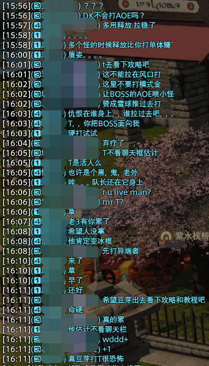

# 导随记录

1. 4.X 打的，忘了
2. 4.X 打的，忘了
3. 4.X 打的，忘了
4. 4.X 打的，忘了
5. 4.X 打的，忘了
6. 波克曼
7. 假火，双豆芽，一个初见，两个👍
8. 20修炼所，一开始俩豆芽，一个 T 一个武僧，T 中途掉了一次，回来的时候莫得豆芽了；T 的 id 不错，小慈小悲，估计是小号。
9. 中途进去，动画城，双奶都没有，但是已经到魔导机甲之后的进度了
10. 59图书馆，都不太会踩塔，2人塔出了一只怪，3人塔出了俩小怪，踩塔的时候有个死了，才发现有人球放井盖上了。。。。。
11. 还是59图书馆，T 在老三的时候掉了一下，然后2人塔出了两只怪，不过没灭，还好
12. 77本，用的夜占，感觉有点难奶，因为白占的 dot 能跳满而夜占只能补盾，舞娘在连续十字的时候死了一次；出本三个赞👍
13. 63霸道，老三的时候把 T 奶死了两次，还拿了一个赞，有点过意不去
14. 18墓园，T 是初见，小怪喜欢脸开，用 AOE 拉仇恨，但是后面发现会挑衅和飞盾开怪，奇妙，可能是玩过其他 MMO 的，也可能是
15. 38溶洞，T 是个锤导，但是是初见
16. 波克曼
17. 波克曼
18. 贤王，竟然是极贤王。。。一个初见豆芽学者，另一个豆芽 T 会打，灭了三把过的；我一开始还以为是真贤王，都没注意场中央的是贤王本体。。。
19. 极风神，又遇到了昨晚贤王的时候的豆芽 T 了，但是这次是另一个豆芽诗人排的。。。。。灭了一次，还算比较容易的过了
20. 60颠倒塔
21. 32野营地
22. 50幻龙塔，武士豆芽， 看着像是不会打，老三死了两次，小怪途中还发了一会儿呆，出本之前看了眼装备，115混110/90，但是其中还有个震惊的34。。。。。。
23. 44泽梅尔要塞，老一竟然直接在第一个水晶就打死了，dps 有点高；老一之后的那一波小怪，好像有一口没奶到 T ，导致了倒 T，也可能是我光速福星太慢了；T 在老三之前把那波小怪也拉进去了，奶的我好痛苦（
24. 假火
25. 动画城，但是进去就是打完尼禄的进度了
26. 草，怎么又是动画城，还是铁巨人不到的进度，我就不该在这个时候排，不知道能不能赶得上上课；草，还遇到熟人了
27. 波克曼
28. 71本，虽然 T 是个豆芽 DK ，但是很稳
29. O3，开场变呱呱迟到了，贼丢人，连占卜都没按出来，另一个白魔还是初见 😅
30. 17铜山，一个 DPS 在第一波怪之后就掉了，老一打完还没回来，于是选择踢掉，补了个导随人进来；T 各种脸开，仇恨都不拉一下，我一个 dot 上上去直接 OT ，看着像是脚本，但是看了眼个人信息，还有那么多满级的，奇怪，当然，也有可能是还在适应手柄
31. 动画城
32. 波克曼
33. 79本，战士 T ，奶都不需要奶（其实还是用了点技能的），需要考虑怎样分配技能资源，才不会和勇猛的吸血冲突，不然过量就太尴尬了
34. 60忆罪宫，开始尝试切夜占上盾，切白占奶人，结果因为不小心入战结果夜占奶不上来灭了一次；老一的小怪打死后没人推走，T/D 都没去推。。。
35. 79本，T 是枪刃，和战士比起来真的差距有点大，第一波（合计三批？）的时候我开了中间都有点奶不上来， T 甚至开了无敌，不过在老二后面的那一波的时候开中间奶上来了，可能还需要学习一下什么时候开中间，中间怎么用；武士不知道是不是初见，看上去没看过攻略，各种吃机制，我先天有80%都是给的他，每个 boss 都能看到两三层的易伤
36. 50古堡
37. 79本，第一波拉太多，我自己又没反应过来，先天给晚了，灭了，丢人，出本还没没赞，可惜
38. 79本，还是那三个人，这把我没问题了，该奶的都奶上来了，然后 T 没给我赞，心态崩了；出本一看，两个紫水，一个海猫，估计都是朋友组排练级吧，拉黑了
39. 57教皇厅，T 是初见，还有一个龙骑豆芽，估计也是初见，老二的时候龙骑死了一次，主要是两次被打进洞里面；发现黑占给盾白占奶有点麻烦，但是对于长距离的拉一波还有有比较大的稳定血线的作用，不过就是容易一不小心切不回来，想无脑白占，不过天星交错可以拿来代替黑占的单盾
40. 血亏堡。。。。
41. 60颠倒塔，有个初见；草，不是初见，但是把开场动画看完了，搞的我还以为我没显示初见提醒；龙骑在老一之前也别喜欢抢开，也不知道是不是要续龙血，提醒了一句之后没抢开了
42. 波克曼
43. 额啊，血亏堡
44. 动画城，有初见
45. 膜科学研究所，T 竟然是昨天教皇厅的初见，感觉基本功好好啊，第一波小怪直接开无敌，后面每一波小怪都能看到减伤，奶的也舒服，都没怎么交 GCD 
46. 一看已过时间9分钟，我以为又是主随，都想点辞退了，进去一看，好家伙，67多玛，进度都到了老二门口了，不知道为啥奶没了；打的还蛮快的，老二第二次踩塔都没出，老二之后的一波甚至 T 血量都没怎么上上下下（就上下了一次）就打完了，一看 act ，赤魔7K1，草，也太猛了
47. 50幻龙
48. 奥丁，血线压力有点大啊，夜占也得疯狂刷血，中间T还分别倒了两次
49. 71本，T 是骑士，在此之前我，我从来没见过这么脆的 T（，真的好脆啊，老一门前那一波，灭了两次，老二之后第二波，灭了一次；不过 T 态度很端正，是第一次玩骑士，装备都差不多是400，挺正常的装等，但是还能见到20%血直接消失人没了的情况，不太会开减伤，然后拉小怪的时候不疾跑，跑路用（，老二还是老三的时候，一个死刑，半血没了，总之各种惊吓，我甚至习惯了光速->福星->合图->福星的不卡GCD操作；其他两个 DPS ，一个武僧一个黑魔，都不喜欢吃地星。。。。。额啊
50. 血亏堡
51. 50大冰壁，我要笑死+血压炸了；我是中途进去的，在路上的时候看到龙骑和DK两个血再掉，快到的时候龙骑只剩下一丝血，然后先天飞尸了，龙骑打出“？”，表示“DK你不打AOE么”，小怪脸开，不用伤残，释放只打一个，也不知道打没打到，光速OT；甚至出现过打着打着发现仇恨全在自己身上，发现T盾姿关了的情况；老二前面的小怪，喜欢拉在风口打，搞得我还得光速群抬，绝了；老三芬尼尔不去柱子后面，我已经有预期了，但是营救早了，还是冻伤了，结果芬尼尔一口没啃死，留了个半血还好抬上来了，两个D在它第二次放月下咆哮之前杀了；一直到最后，都不知道这个T看了聊天窗口没有，因为它根本没回过消息。。。期间第一个龙骑剑导气的直接退本了；全程对话如下： 
52. 55邪龙本，进去的时候发现灭了，在老一之后的那一波，听说是打完老一之后就无了，T没注意，拉了一波，结果没的；有个武士豆芽初见；老三的时候，邪龙点名关人，结果就我一个转火，R I P 黑魔；出本没有赞，怨念；你们黑魔就这么不喜欢动一动处理机制么，易伤很好吃么😠
53. 50伊修加德保卫战，T感觉不怎么喜欢拉小怪，dps不喜欢去开跑，不过不知道是不是现在装等太高了，打的挺快的
54. 50古堡1，T在老三之前拉的有点多，倒了一次，虽然没说灭（，不太懂为啥会有血条变灰术
55. 63紫水宫，期间有一次黑占给盾没来得及切白占，所幸奶上来了，吓死我了
56. 真邪龙，有初见，是奶妈，为什么你要傻愣着吃红烧龙的俯冲啊（
57. 动画城，遇到个神必黑魔，头上顶着个锤导，前面没看，后面都在划水，神兵第一阶段，伤害30左右，最高伤害，爆炎572，似乎挂了个 dot 在神兵身上，然后和奶妈一起被点名杀了；神兵第二阶段，复活后姗姗来迟，最高伤害，崩溃330？？？？？？；拉哈，我看到它读条：烈炎 -> 爆炎 -> 冰结，冰结没读完，拉哈被杀了，出本拉黑😠
58. 67多玛，进去叫 T 在铁巨人的时候别拉一波，然后 T 自顾自往前冲，冲到了小飞机那里。。。。我直接双手离开键盘等灭；第二次老实了，虽然还是拉了铁巨人和后面三个小怪，我正常奶，然后他30%多血突然暴毙，我寻思铁巨人虽然一下打我半血，但也不至于这么融化吧？看了眼装备，主手270，其他260。。。还混了一件273，很奇妙，也不知道怎么打过的霸道；老二后面就没有拉一波了，谢谢你战士；老三第一个死刑，竟然还能硬吃的，我也就第一次拿 T 打这个本的时候不知道，然后发现可以走开不吃，绝了；无论是群怪还是单体，这 T 竟然都打得比我低。。。。是因为周五放假了，什么神仙妖魔鬼怪都出来打本了
59. 70阿拉米格，召唤是初见，第一波小怪和之后感觉召唤输出不太够，以为是手法不行，打完老三一看，除了武器是380，其他都是270和290混搭，草
60. 极云神，额啊，怎么还有人初见裸排极神的啊，找了7个导随人，虽然云神就是个蛮神之耻，但是还是有个剑导赤魔被风吹下去了（
61. 63紫水宫，有武士初见，战士 T 挺稳的，一波的时候血都不怎么掉，随便刷刷 hot 就没有电梯血，就是有一次我发呆了，忘了看他血，结果都快到个位百分数了，但是他开了死斗，好稳啊。。。
62. 53灵峰
63. 63紫水宫，T 是初见骑士，感觉不太会开减伤，和上上把的战士一对比，简直天壤之别，我甚至还用了光速合图你奶；老三三连顺发死刑，一下能蒸发30~40%的血，不知道什么情况，也没去看装备，不过能进就能打（
64. 波克曼，有个豆芽，但不是初见
65. 70暗区，骑士 T ，感觉有点没怎么打过，有些能一波的没有一波；我老二打完日常走错了，赶到 T 身边的时候他快死了，还好奶起来了，差点丢人，我的我的
66. 假火
67. 波克曼
68. 影之国，好诶；好个鸡儿，老一C队灭队，老四C也灭队，我们队也差点，不过好在另一个奶LB拉起来了，老四转阶段之后不知道为啥死了一大片人，估计是场外的球吃多了，而且BOSS平A贼疼，我甚至还抽空去奶了一下MT
69. 血亏堡
70. 水塔1，有初见；打完贝爷之后另一个奶退本了，估计是以为打完了哈哈哈哈哈
71. 63真豪神，我以为这是个简单的本，直到双T P1 各吃死刑死了一次之后，我突然发现剧情没那么简单；什么骑士顺劈50%血条直接变灰，什么一巴掌40%到13%，请问你们T都不喜欢开减伤覆盖平A么，请问你个白膜是在留着奶给你🐴喝么，我只是个卑微的夜占，看来我还在肩负起给死刑T单盾的指责
72. 80孪晶塔，不知道为什么，感觉枪刃好硬啊，前面几波小怪的时候，血都不怎么需要抬，不过不知道是不是后面减伤用完了，有时候小怪掉血挺快（
73. 77大井，T 掉了两次，第二次还是在老一战斗途中掉的，还回不来的那种，最后选择踢掉；补进来一个剑导DK，老三门前突然给我来了句 “你玩占星好歹要叛断哪个队友伤害高啊” ，一开始还以为说我没给对职业，结果是在说要按照 dps 给，这我确实第一次听到，但是我也脑子抽了，抖了波机灵 “我还要你在说XXX（” ，我打完就感觉有点阴阳怪气。。。虽然我确实不是那个意思；他不说我还不会去看一眼 ACT ，虽然黑魔确实打的比武士低个1K~2K，但也不至于差距大到要跨职业给吧？很奇怪
74. 血亏堡，一进去满屏豆芽（5个）；怎么总有人喜欢打完炮之后站在炮旁边啊，我还在打之前说过一次了
75. 血亏堡
76. 53灵峰
77. 69白山堡，T是枪刃，似乎不太会开减伤，看着有点电梯血；老二的踩塔，机工竟然没去踩塔，炸了两次，然后我没来得及奶 T ，导致倒 T ，幸好有瞬发拉人起来了，不过这个机工就没那么幸运了，似乎是第二次炸塔炸死的，属性转换的时候，T 属性转换错了，我还得抬血，光速也还在 CD ，救不了；打完给他们解释机制，机工看上去不了解这个机制，很奇妙，也不是初见啊
78. 61妖歌海，排本的时候看到已经经过了20分钟了，我一开始以为是主随，没想到一进去，是61本；问了句什么情况，初见豆芽说是TN吵架了，也不太懂，应该是奶人和拉怪之间的矛盾吧（，倒是我们自己打的还挺快，不过补进来的T有点奇怪，两条狗和后面的鬼魂看着想拉一波，但是走一步停一步，要拉不拉的，我也不怎么方便奶。。。。老三在没有外层环的时候拉到了场边，感觉其实挺方便处理机制的，这个思路不错，但是希望其他人能理解
79. 50放浪神古神殿2，老一因为不熟机制，不知道要打投枪，导致灭了一波；后面好像挺正常的，老三之前我提醒了一句记得打旗子，但是忘了说是哪个旗子，出了第一个旗子就开始打，我赶紧说是有连线的那个，等出了有连线的标了个1，除此之外就死亡宣告有点吓到好，不过判定时间还挺久的，读单奶都奶的回来
80. 行会令，布索，竟然不是波克曼
81. 动画城
82. 70终末焦土
83. 73真妖灵王，卧槽卧槽卧槽，这么过分我一定要水一水；进去一看是个白魔，我就切了个夜占，接下来5分钟我都在为我这个决定后悔；AOE不刷奶，不给 MT hot ，甚至能让队友吃 AOE 吃死的白魔你见过么？哦，它自己也吃 AOE 吃死了啊，那没事了；P1 MT 是个枪刃，血条各种电梯，吓得我都不知道这玩意儿开过减伤没有，一个死刑半血没有了，有的时候甚至还会调到10%多的血量，然后我愣是没看到白魔的天赐，让我来奶？我最多给个先天；打完 P1 进小怪阶段，看了一眼白魔，1K多的 HPS ？你在干什么？？？你见过 AOE 之后半血的 DPS 半天没人抬血然后被下一个 AOE 砸死么？我刷盾硬抬都不一定抬得上来，因为我还要拉人，这傻逼奶妈起来自己都不给自己奶一口的，您是没做职业任务连天赐都没有么？然后这奶妈还能吃根只符文的止步+流血吃死，我吉星相位都来不及给；已经忘记了这奶妈死了多少次了，后面我甚至懒得拉它，一个人硬奶完 P3 后半段了；这把妖灵王我奶的胸都快瘪了，蓝条一度下降到连口阳星都放不出来，然后白魔你是在在用奶给你🐴的坟浇水？打完本一看这白魔，身上都是490混其他蓝色装备，就这？
84. 38樵鸣洞；我，我，我。。。。今天明明才周二，为什么神仙都来了；T 没有初见提示，跑错两次路就算了，不会拉一波，拉着怪走走停停，等怪A，我白占奶也不是，不奶也不是；老一之前那里，DPS 喜欢吃流沙，然后在老三前面，这个 T 竟然还拉着怪到地火上？？奇美拉打的惊心动魄，各种吃咆哮，还好没死人
85. 真美神；小插曲，进去一看是朱雀，结果直接有人退本，我还纳闷为啥朱雀要退，一看，朱雀诗魂站，这可太顶了，溜了溜了；进本骑士说自己是新手，我以为是那种机制不熟，不清楚什么时候什么技能的新手，没想到啊，是连吃球用元气都不会的新手，额啊，转阶段死一次，黑化必死；额啊；所幸这本没啥难度，少一个人都能打，出本之前看了眼名字，前面是个花。。。。